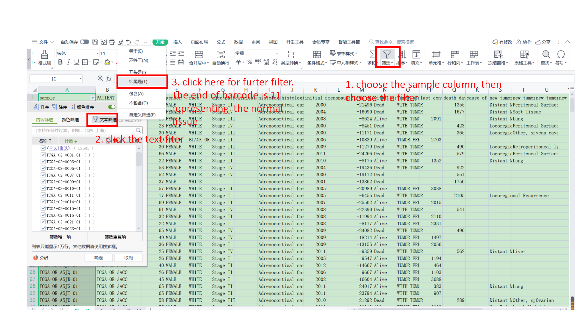

```{r, echo=F}
knitr::opts_chunk$set( echo = TRUE, message=FALSE, warning=FALSE, fig.width=8 )
```

# Check if BiocManager package installed?

```{r}

if (!requireNamespace("BiocManager", quietly = TRUE))
  install.packages("BiocManager")
```


#  Somatic alteration landscape of cuproptosis regulators

## Input file preparation

'mc3.v0.2.8.PUBLICtxt.txt' and 'CopyNumber.txt': These files are the SNV and CNV data of pan cancer from TCGA. They can be downlaod from XENA. A screenshot is listed below to show the step 

```{r}

```

### extract SNV and CNV data of cuproptosis genes

```{r}
mc3_XENA=read.table("SNV_CNV/mc3.v0.2.8.PUBLICtxt.txt",header = T,sep = '\t',check.names = F)
mc3_cu=mc3_XENA[grep(pattern="FDX1|LIAS|LIPT1|DLD|DLAT|PDHA1|PDHB|MTF1|GLS|CDKN2A",mc3_XENA[,7]),]    
write.table(mc3_cu,"mc3_cu.txt",quote = F,sep = "\t",row.names = F)

CNV_XENA=read.table("SNV_CNV/CopyNumber.txt",header = T,sep = '\t',check.names = F)
CNV_XENA=CNV_XENA[grep(pattern="FDX1|LIAS|LIPT1|DLD|DLAT|PDHA1|PDHB|MTF1|GLS|CDKN2A",CNV_XENA[,1]),]
write.table(CNV_XENA,"CNV_cu.txt",quote = F,sep = "\t",row.names = F)


```

`SNV.xlsx`: This file is the SNV data of cuproptosis regulators. Sheet1 is the whole data. Sheet2-10 are the data of every gene.
This data is manually generated based on "mc_cu.txt" from the above step.Screenshots are listed below to show other steps in excel.


```{r}
knitr::include_graphics(c("SNV_CNV/images/SNV_1.png", "SNV_CNV/images/SNV_2.png"))
```

`CNV.xlsx`: This file is the SNV data of cuproptosis regulators. Sheet1 is the whole data. Sheet2 is the data with tumor type.This data is manually generated based on "CNV_cu.txt" from the above step.Screenshots are listed below to show other steps in excel.

```{r}
knitr::include_graphics(c("SNV_CNV/images/CNV_1.png", "SNV_CNV/images/CNV_2.png"))
```


`tumortype.xlsx`: This is the clinical data of pan cancer from TCGA. It can be got from XENA. A screenshot is listed below to show the step 

```{r}

```


`amplification.txt`/`deletion.txt`/`mutation.txt`: This is the amplification/deletion/mutation percentage of cuproptosis regulators. It is generated manually in excel. Three screenshots are listed below to show the steps 

```{r}
knitr::include_graphics(c("SNV_CNV/images/percentage_1.png", "SNV_CNV/images/percentage_2.png","SNV_CNV/images/percentage_3.png"))
```

## Figure 2 and related plots

### Install required packages

```{r}
a = rownames(installed.packages())

install_bioc <- c("openxlsx", "dplyr", "ComplexHeatmap", "circlize")

for (i in install_bioc) {
  if (!i %in% a)
    BiocManager::install(i, update = F, site_repository = site)
  a = rownames(installed.packages())
}
```

#### Mutation profile (not shown in manuscript)

```{r}
library(openxlsx)
FDX1 <- read.xlsx("SNV_CNV/SNV.xlsx", sheet = "Sheet2")
LIAS <- read.xlsx("SNV_CNV/SNV.xlsx", sheet = "Sheet3")
LIPT1 <- read.xlsx("SNV_CNV/SNV.xlsx", sheet = "Sheet4")
DLD <- read.xlsx("SNV_CNV/SNV.xlsx", sheet = "Sheet5")
DLAT <- read.xlsx("SNV_CNV/SNV.xlsx", sheet = "Sheet6")
PDHA1 <- read.xlsx("SNV_CNV/SNV.xlsx", sheet = "Sheet7")
PDHB <- read.xlsx("SNV_CNV/SNV.xlsx", sheet = "Sheet8")
MTF1 <- read.xlsx("SNV_CNV/SNV.xlsx", sheet = "Sheet9")
GLS <- read.xlsx("SNV_CNV/SNV.xlsx", sheet = "Sheet10")
CDKN2A <- read.xlsx("SNV_CNV/SNV.xlsx", sheet = "Sheet11")

tumortype <- read.xlsx("SNV_CNV/tumortype.xlsx", sheet = "Sheet1")


library(dplyr)
SNV = dplyr::left_join(tumortype, FDX1, by = "sample")
SNV = dplyr::left_join(SNV, LIAS, by = "sample")
SNV = dplyr::left_join(SNV, LIPT1, by = "sample")
SNV = dplyr::left_join(SNV, DLD, by = "sample")
SNV = dplyr::left_join(SNV, DLAT, by = "sample")
SNV = dplyr::left_join(SNV, PDHA1, by = "sample")
SNV = dplyr::left_join(SNV, PDHB, by = "sample")
SNV = dplyr::left_join(SNV, MTF1, by = "sample")
SNV = dplyr::left_join(SNV, GLS, by = "sample")
SNV = dplyr::left_join(SNV, CDKN2A, by = "sample")
write.table(
  SNV,
  "SNV_CNV/SNV2.txt",
  sep = "\t",
  quote = FALSE,
  col.names = TRUE,
  row.names = F
)


library(ComplexHeatmap)
library(circlize)
#SNV
mut <- SNV[, -2]
cli <- SNV

rownames(mut) <- mut$sample
mat <- mut[, -1]
mat[is.na(mat)] <- ""
mat[1:6, 1:6]
mat = t(mat)
mat[1:6, 1:6]

######
col <-
c(
  "Missense_Mutation" = "#27AE60",
  "Nonsense_Mutation" = "blue",
  "Nonstop_Mutation" = "#B452CD",
  "Splice_Site" = "red",
  "In_Frame_Del" = "#EEC900",
  "Frame_Shift_Del" = "#FF6A6A",
  "Frame_Shift_Ins" = "#9400D3",
  "Mutiple" = "black"
)

alter_fun <- list(
  background = function(x, y, w, h) {
  grid.rect(x, y, w - unit(0.5, "mm"), h * 0.7,
  gp = gpar(fill = "#e8e7e3", col = NA))
},

Missense_Mutation = function(x, y, w, h) {
  grid.rect(x, y, w - unit(0.5, "mm"), h * 0.7,
  gp = gpar(fill = col["Missense_Mutation"], col = NA))
},

Nonsense_Mutation = function(x, y, w, h) {
  grid.rect(x, y, w - unit(0.5, "mm"), h * 0.7,
  gp = gpar(fill = col["Nonsense_Mutation"], col = NA))
},
Nonstop_Mutation = function(x, y, w, h) {
  grid.rect(x, y, w - unit(0.5, "mm"), h * 0.7,
  gp = gpar(fill = col["Nonstop_Mutation"], col = NA))
},

Splice_Site = function(x, y, w, h) {
  grid.rect(x, y, w - unit(0.5, "mm"), h * 0.7,
  gp = gpar(fill = col["Splice_Site"], col = NA))
},
In_Frame_Del = function(x, y, w, h) {
  grid.rect(x, y, w - unit(0.5, "mm"), h * 0.7,
  gp = gpar(fill = col["In_Frame_Del"], col = NA))
},
Frame_Shift_Del = function(x, y, w, h) {
  grid.rect(x, y, w - unit(0.5, "mm"), h * 0.7,
  gp = gpar(fill = col["Frame_Shift_Del"], col = NA))
},
Frame_Shift_Ins = function(x, y, w, h) {
  grid.rect(x, y, w - unit(0.5, "mm"), h * 0.7,
  gp = gpar(fill = col["Frame_Shift_Ins"], col = NA))
},
Mutiple = function(x, y, w, h) {
  grid.rect(x, y, w - unit(0.5, "mm"), h * 0.3,
  gp = gpar(fill = col["Mutiple"], col = NA))
}
)
heatmap_legend <- list(
  title = "SNV",
  at = c(
    "Missense_Mutation",
    "Nonsense_Mutation",
    "Nonstop_Mutation",
    "Splice_Site",
    "In_Frame_Del",
    "Frame_Shift_Del",
    "Frame_Shift_Ins",
    "Mutiple"
  ),
  labels = c(
    "Missense_Mutation",
    "Nonsense_Mutation",
    "Nonstop_Mutation",
    "Splice_Site",
    "In_Frame_Del",
    "Frame_Shift_Del",
    "Frame_Shift_Ins",
    "Mutiple"
  )
)

oncoPrint(
  mat ,

  alter_fun = alter_fun,
  col = col,
  #column_title = column_title,
  remove_empty_columns = T,
  remove_empty_rows = T,
  row_names_side = "left",

  pct_side = "right",
  alter_fun_is_vectorized = FALSE,
  heatmap_legend_param = heatmap_legend,

)
```

Add cancer type to mutation profile.

```{r}
pdata <- cli
head(pdata)
ha <- HeatmapAnnotation(
  Cancer_type = pdata$Cancer.type,
  show_annotation_name = TRUE,
  annotation_name_gp = gpar(fontsize = 7)
)


oncoPrint(
  mat ,
  alter_fun = alter_fun,
  col = col,
  remove_empty_columns = T,
  remove_empty_rows = T,
  row_names_side = "left",
  pct_side = "right",
  alter_fun_is_vectorized = FALSE,
  heatmap_legend_param = heatmap_legend,
  bottom_annotation = ha
)
#自定义样本顺序
s <- pdata[order(pdata$Cancer.type, pdata$CDKN2A, pdata$DLD, pdata$MTF1), ]
sample_order <- as.character(s$sample)

#自定义颜色

ha <- HeatmapAnnotation(
Cancer_type = pdata$Cancer.type,
col = list(
  Cancer_type = c(
    "ACC" =  "#FFB6C1",
    "BLCA" =  "#4E72B8",
    "BRCA" =  "#FAEBD7",
    "CESC" =  "#00FFFF",
    "CHOL" =  "#7FFFAA",
    "COAD" =  "#FFE4C4",
    "DLBC" =  "#0000FF",
    "ESCA" =  "#8A2BE2",
    "GBM" =  "#A52A2A",
    "HNSC" =  "#7FFF00",
    "KICH" =  "#5F9EA0",
    "KIRC" =  "#DEB887",
    "KIRP" =  "#FF7F50",
    "LAML" =  "#6495ED",
    "LGG" =  "#FFF8DC",
    "LIHC" =  "#00008B",
    "LUAD" =  "#CD5C5C",
    "LUSC" =  "#A9A9A9",
    "MESO" =  "#8B008B",
    "OV" =  "#FF8C00",
    "PAAD" =  "#E9967A",
    "PCPG" =  "#FF1493",
    "PRAD" =  "#00BFFF",
    "READ" =  "#FFFAF0",
    "SARC" =  "#FFD700",
    "SKCM" =  "#FF6347",
    "STAD" =  "#FF69B4",
    "TGCT" =  "#66CDAA",
    "THCA" =  "#BA55D3",
    "THYM" =  "#FF4500",
    "UCEC" =  "#DDA0DD",
    "UCS" =  "#008B8B",
    "UVM" =  "#FFFF00"
  )
  ),
  show_annotation_name = TRUE,
  annotation_name_gp = gpar(fontsize = 7)
)
```


```{r}
oncoPrint(
  mat ,
  alter_fun = alter_fun,
  col = col,
  remove_empty_columns = T,
  remove_empty_rows = T,
  column_order = sample_order,
  row_names_side = "left",
  pct_side = "right",
  alter_fun_is_vectorized = FALSE,
  heatmap_legend_param = heatmap_legend,
  bottom_annotation = ha
)
##8.5*4.5
```

#### CNV profile (Figure 2A) 

```{r}
#CNV
mut <- read.xlsx("SNV_CNV/CNV.xlsx", sheet = "Sheet1")
cli <- read.xlsx("SNV_CNV/CNV.xlsx", sheet = "Sheet2")

rownames(mut) <- mut$sample
mat <- mut[, -1]
mat[is.na(mat)] <- ""
mat[1:6, 1:6]
mat = t(mat)
mat[1:6, 1:6]

######画图
col <- c("Deep deletion" = "blue",
"Amplification" = "red")

alter_fun <- list(
background = function(x, y, w, h) {
grid.rect(x, y, w - unit(0.5, "mm"), h * 0.7,
gp = gpar(fill = "#e8e7e3", col = NA))
},

Amplification = function(x, y, w, h) {
grid.rect(x, y, w - unit(0.5, "mm"), h * 0.7,
gp = gpar(fill = col["Amplification"], col = NA))
},

"Deep deletion" = function(x, y, w, h) {
grid.rect(x, y, w - unit(0.5, "mm"), h * 0.7,
gp = gpar(fill = col["Deep deletion"], col = NA))
}

)
heatmap_legend <- list(
title = "CNV",
at = c("Amplification", "Deep deletion"),
labels = c("Amplification", "Deep deletion")
)
oncoPrint(
mat ,

alter_fun = alter_fun,
col = col,
#column_title = column_title,
remove_empty_columns = T,
remove_empty_rows = T,
row_names_side = "left",

pct_side = "right",
alter_fun_is_vectorized = FALSE,
heatmap_legend_param = heatmap_legend,

)
pdata <- cli
head(pdata)
ha <- HeatmapAnnotation(
Cancer_type = pdata$Cancer.type,
show_annotation_name = TRUE,
annotation_name_gp = gpar(fontsize = 7)
)


oncoPrint(
mat ,
alter_fun = alter_fun,
col = col,
remove_empty_columns = T,
remove_empty_rows = T,
row_names_side = "left",
pct_side = "right",
alter_fun_is_vectorized = FALSE,
heatmap_legend_param = heatmap_legend,
bottom_annotation = ha
)

s <-
pdata[order(pdata$Cancer.type, pdata$CDKN2A, pdata$DLD, pdata$MTF1), ]
sample_order <- as.character(s$sample)


ha <- HeatmapAnnotation(
Cancer_type = pdata$Cancer.type,
col = list(
Cancer_type = c(
"ACC" =  "#FFB6C1",
"BLCA" =  "#4E72B8",
"BRCA" =  "#FAEBD7"
,
"CESC" =  "#00FFFF",
"CHOL" =  "#7FFFAA",
"COAD" =  "#FFE4C4"
,
"DLBC" =  "#0000FF",
"ESCA" =  "#8A2BE2",
"GBM" =  "#A52A2A"
,
"HNSC" =  "#7FFF00",
"KICH" =  "#5F9EA0",
"KIRC" =  "#DEB887"
,
"KIRP" =  "#FF7F50",
"LAML" =  "#6495ED",
"LGG" =  "#FFF8DC"
,
"LIHC" =  "#00008B",
"LUAD" =  "#CD5C5C",
"LUSC" =  "#A9A9A9"
,
"MESO" =  "#8B008B",
"OV" =  "#FF8C00",
"PAAD" =  "#E9967A"
,
"PCPG" =  "#FF1493",
"PRAD" =  "#00BFFF",
"READ" =  "#FFFAF0"
,
"SARC" =  "#FFD700",
"SKCM" =  "#FF6347",
"STAD" =  "#FF69B4"
,
"TGCT" =  "#66CDAA",
"THCA" =  "#BA55D3",
"THYM" =  "#FF4500"
,
"UCEC" =  "#DDA0DD",
"UCS" =  "#008B8B",
"UVM" =  "#FFFF00"
)
),
show_annotation_name = TRUE,
annotation_name_gp = gpar(fontsize = 7)
)


oncoPrint(
  mat ,
  alter_fun = alter_fun,
  col = col,
  remove_empty_columns = T,
  remove_empty_rows = T,
  column_order = sample_order,
  row_names_side = "left",
  pct_side = "right",
  alter_fun_is_vectorized = FALSE,
  heatmap_legend_param = heatmap_legend,
  bottom_annotation = ha
)
##9*4.5

```
#### Mutation percentage (Figure 2B)

```{r}
mutation=read.table(file = "SNV_CNV/mutation.txt",sep = "\t",header = T,check.names = F,row.names = 1)
col_fun = colorRamp2(c(0, 10), c("white", "#3CB371"))
mutation[is.na(mutation)] =0
Heatmap(mutation,cluster_rows = F, cluster_columns = F,top_annotation = NULL,
        show_column_dend=F,column_title="Mutation",column_title_side="top",
        show_column_names=T,border = T,col = col_fun,column_names_rot = 45,
        na_col = "white",
        cell_fun = function(j, i, x, y, width, height, fill) {
          if(mutation[i, j] >0)
            grid.text(sprintf("%.1f", mutation[i, j]), x, y, gp = gpar(fontsize = 13))})

```


#### amplification percentage (Figure 2C)
```{r}

amplification=read.table(file = "SNV_CNV/amplification.txt",sep = "\t",header = T,check.names = F,row.names = 1)
col_fun = colorRamp2(c(0, 8), c("white", "red"))
amplification[is.na(amplification)] =0
Heatmap(amplification,cluster_rows = F, cluster_columns = F,top_annotation = NULL,
           show_column_dend=F,column_title="Amplification",column_title_side="top",
           show_column_names=T,border = T,col = col_fun,column_names_rot = 45,
        na_col = "white",
        cell_fun = function(j, i, x, y, width, height, fill) {
        if(amplification[i, j] >0)
            grid.text(sprintf("%.1f", amplification[i, j]), x, y, gp = gpar(fontsize = 10))})

```


#### deletion percentage (Figure 2D)

```{r}
deletion=read.table(file = "SNV_CNV/deletion.txt",sep = "\t",header = T,check.names = F,row.names = 1)
col_fun = colorRamp2(c(0, 60), c("white", "#4169E1"))
deletion[is.na(deletion)] =0
Heatmap(deletion,cluster_rows = F, cluster_columns = F,top_annotation = NULL,
        show_column_dend=F,column_title="Deep deletion",column_title_side="top",
        show_column_names=T,border = T,col = col_fun,column_names_rot = 45,
        na_col = "white",
        cell_fun = function(j, i, x, y, width, height, fill) {
          if(deletion[i, j] >0)
            grid.text(sprintf("%.1f", deletion[i, j]), x, y, gp = gpar(fontsize = 13))})

```

# mRNA expression analysis and cuproptosis scores

## Input file preparation

'RNASeqV2': This file is the mRNA data of pan cancer from TCGA. It can be downlaod from XENA. A screenshot is listed below to show the step. It can also be downloaded in : https://pan.baidu.com/s/1yH7bxmmQTYTb-s5EnCWrKg 
keyword：p3it 

```{r}

```

'CNV_cu.txt':This file is the CNV data of cuproptosis regulators. It is from the above CNV analysis.

'RNA_cu.txt': This file is the mRNA expression of cuproptosis regulators. It is extracted from RNASeq data of pancancer.

'RNA_cu_clinical.txt': This file is the mRNA expression of cuproptosis regulators with clinical information. Just need to merge mRNA expression and clinical data.

'T_N.txt': This file is patients with tumor and nomral samples. It can be filtered from clinical data file.A screenshot is listed below to show the step. Then choose the patients with tumor and paired nomral samples.

```{r}

```
'XENA_clinical.txt': Clinical data. Obtained from XENA
```{r}

```

'T_N_cu.txt': The cuproptosis regulators expression in tumor and paried normal sapmles. It is generated by mergeing cuproptosis regulators expression in all samples and tumor-normal sample list.

'cuproptosis_genesets.txt':It is the geneset of cuproptosis, which if from the study of Tsvetkov et al.(DOI: 10.1126/science.abf0529)

'hallmark_cu_genesets.txt': It is the geneset of hallmark. It is from MSigDB, https://www.gsea-msigdb.org/gsea/msigdb/. The steps are here.
```{r}
knitr::include_graphics(c("GSVA/images/hallmark_1.png", "GSVA/images/hallmark_2.png"))

```
'RNASeq2_gsva_cu': The cuproptosis score of all samples. It is generated by GSVA.

'RNASeq2_gsva_hallmark': The hallmark score of all samples. It is generated by GSVA.

'RNC_cu_pancan.txt': The cuproptosis regulators expresssion in pan cancer. It is extracted from RNA seq data.

'k2.txt': The cluster of all samples. It is generated by cluster analysis.

'RNA_cu_clinical_cuscore.txt': The file is clinical data, cuproptosis score, hallmark score and cuproptosis regulators expression. Just need to merge them all to generate this file.

'cluster_distribution.txt': The tumor distribution data of clusters. It is genrated by calculating the percentage of tumor samples.
```{r}
knitr::include_graphics(c("Cluster/images/Cluster_1.png", "Cluster/images/Cluster_2.png"))
```


## Figure 3 and related plots

### Install required packages
```{r}
a = rownames(installed.packages())

install_bioc <- c("data.table", "Hmisc", "corrplot","Biobase","genefilter","RColorBrewer","GSVA","pheatmap","ConsensusClusterPlus","DOSE","org.Hs.eg.db","topGO","clusterProfiler","pathview")

for (i in install_bioc) {
  if (!i %in% a)
    BiocManager::install(i, update = F, site_repository = site)
  a = rownames(installed.packages())
}
```

### relationship between CNV and mRNA expression (not shown in manuscript)

```{r}
###prepare data
library(data.table)
RNASeq=fread("mRNA/RNASeqV2.txt", data.table=FALSE)
RNASeq=RNASeq[!duplicated(RNASeq$sample),]
rownames(RNASeq)=RNASeq$sample
cu_RNASeq=RNASeq[c("FDX1","LIAS","LIPT1","DLD","DLAT","PDHA1","PDHB","MTF1","GLS","CDKN2A"),]
write.table(cu_RNASeq,"cu_RNASeq.txt",quote = F,sep = "\t",col.names = T,row.names = F)

na.omit(RNASeq)[1:4,1:4]
RNASeq2=na.omit(RNASeq)

write.table(RNASeq2,"RNASeq2.txt",quote = F,sep = "\t",col.names = T,row.names = F)

RNA_cu=t(cu_RNASeq[,-1])
RNA_cu=as.data.frame(RNA_cu)

RNA_cu$sample=rownames(RNA_cu)                              

T_N=read.table(file = "mRNA/T_N.txt",sep = "\t",header = T,check.names = F)
T_N_cu1=merge(T_N,RNA_cu,by="sample")

#####combine CNV and mRNA expression
RNA_cu <- read.table(file = "mRNA/RNA_cu.txt",sep = "\t",header = T,check.names = F)
CNV_cu=read.table(file = "mRNA/CNV_cu.txt",sep = "\t",header = T,check.names = F)
XENA_clinical=read.table(file = "mRNA/XENA_clinical.txt",sep = "\t",header = T,check.names = F)

colnames(CNV_cu)[1]="sample"

RNA_CNV=merge(RNA_cu,CNV_cu,by="sample")
RNA_CNV_clinical=merge(RNA_CNV,XENA_clinical,by="sample")
write.table(RNA_CNV_clinical,"RNA_CNV_clinical.txt",quote = F,sep = "\t",col.names = T,row.names = F)

#####Using "RNA_CNV_clinical" to plot box plots of CNV/mRNA in sangerbox. Please cite:Shen, et al. 2022. Sangerbox: A comprehensive, interaction-friendly clinical bioinformatics analysis platform. iMeta 1(3): e36. https://doi.org/10.1002/imt2.36

```

###Differential expression analysis of paired normal and tumor tissues (Figure 3A)

```{r}
##mRNA expression fold change
T_N<- read.table(file = "mRNA/T_N_cu.txt",sep = "\t",header = T,check.names = F)
indata=t(T_N[,c(1,5,6,7,8,9,10,11,12,13,14)])
indata=as.data.frame(indata)
colnames(indata)=indata[1,]
indata=indata[-1,]

##BLCA
sampleIdsCase<-which(T_N$TN=="tumor"&T_N$cancer=="BLCA");
sampleIdsControl<-which(T_N$TN=="normal"&T_N$cancer=="BLCA");
probeFC<-rep(0,nrow(indata))
for(i in 1:nrow(indata))
{
  probeFC[i]<-mean(as.numeric(as.vector(indata[i,sampleIdsCase])))/mean(as.numeric(as.vector(indata[i,sampleIdsControl])));
}
probeFC<-log(probeFC,base=2);
result<-probeFC;

BLCA=cbind(rownames(indata),result)
colnames(BLCA)[1]="SYMBOL"
colnames(BLCA)[2]="BLCA"

##BRCA
sampleIdsCase<-which(T_N$TN=="tumor"&T_N$cancer=="BRCA");
sampleIdsControl<-which(T_N$TN=="normal"&T_N$cancer=="BRCA");
probeFC<-rep(0,nrow(indata))
for(i in 1:nrow(indata))
{
  probeFC[i]<-mean(as.numeric(as.vector(indata[i,sampleIdsCase])))/mean(as.numeric(as.vector(indata[i,sampleIdsControl])));
}
probeFC<-log(probeFC,base=2);
result<-probeFC;

BRCA=cbind(rownames(indata),result)
colnames(BRCA)[1]="SYMBOL"
colnames(BRCA)[2]="BRCA"

##CHOL
sampleIdsCase<-which(T_N$TN=="tumor"&T_N$cancer=="CHOL");
sampleIdsControl<-which(T_N$TN=="normal"&T_N$cancer=="CHOL");
probeFC<-rep(0,nrow(indata))
for(i in 1:nrow(indata))
{
  probeFC[i]<-mean(as.numeric(as.vector(indata[i,sampleIdsCase])))/mean(as.numeric(as.vector(indata[i,sampleIdsControl])));
}
probeFC<-log(probeFC,base=2);
result<-probeFC;

CHOL=cbind(rownames(indata),result)
colnames(CHOL)[1]="SYMBOL"
colnames(CHOL)[2]="CHOL"

##COAD
sampleIdsCase<-which(T_N$TN=="tumor"&T_N$cancer=="COAD");
sampleIdsControl<-which(T_N$TN=="normal"&T_N$cancer=="COAD");
probeFC<-rep(0,nrow(indata))
for(i in 1:nrow(indata))
{
  probeFC[i]<-mean(as.numeric(as.vector(indata[i,sampleIdsCase])))/mean(as.numeric(as.vector(indata[i,sampleIdsControl])));
}
probeFC<-log(probeFC,base=2);
result<-probeFC;

COAD=cbind(rownames(indata),result)
colnames(COAD)[1]="SYMBOL"
colnames(COAD)[2]="COAD"

##ESCA
sampleIdsCase<-which(T_N$TN=="tumor"&T_N$cancer=="ESCA");
sampleIdsControl<-which(T_N$TN=="normal"&T_N$cancer=="ESCA");
probeFC<-rep(0,nrow(indata))
for(i in 1:nrow(indata))
{
  probeFC[i]<-mean(as.numeric(as.vector(indata[i,sampleIdsCase])))/mean(as.numeric(as.vector(indata[i,sampleIdsControl])));
}
probeFC<-log(probeFC,base=2);
result<-probeFC;

ESCA=cbind(rownames(indata),result)
colnames(ESCA)[1]="SYMBOL"
colnames(ESCA)[2]="ESCA"

##HNSC
sampleIdsCase<-which(T_N$TN=="tumor"&T_N$cancer=="HNSC");
sampleIdsControl<-which(T_N$TN=="normal"&T_N$cancer=="HNSC");
probeFC<-rep(0,nrow(indata))
for(i in 1:nrow(indata))
{
  probeFC[i]<-mean(as.numeric(as.vector(indata[i,sampleIdsCase])))/mean(as.numeric(as.vector(indata[i,sampleIdsControl])));
}
probeFC<-log(probeFC,base=2);
result<-probeFC;

HNSC=cbind(rownames(indata),result)
colnames(HNSC)[1]="SYMBOL"
colnames(HNSC)[2]="HNSC"

##KICH
sampleIdsCase<-which(T_N$TN=="tumor"&T_N$cancer=="KICH");
sampleIdsControl<-which(T_N$TN=="normal"&T_N$cancer=="KICH");
probeFC<-rep(0,nrow(indata))
for(i in 1:nrow(indata))
{
  probeFC[i]<-mean(as.numeric(as.vector(indata[i,sampleIdsCase])))/mean(as.numeric(as.vector(indata[i,sampleIdsControl])));
}
probeFC<-log(probeFC,base=2);
result<-probeFC;

KICH=cbind(rownames(indata),result)
colnames(KICH)[1]="SYMBOL"
colnames(KICH)[2]="KICH"

##KIRC
sampleIdsCase<-which(T_N$TN=="tumor"&T_N$cancer=="KIRC");
sampleIdsControl<-which(T_N$TN=="normal"&T_N$cancer=="KIRC");
probeFC<-rep(0,nrow(indata))
for(i in 1:nrow(indata))
{
  probeFC[i]<-mean(as.numeric(as.vector(indata[i,sampleIdsCase])))/mean(as.numeric(as.vector(indata[i,sampleIdsControl])));
}
probeFC<-log(probeFC,base=2);
result<-probeFC;

KIRC=cbind(rownames(indata),result)
colnames(KIRC)[1]="SYMBOL"
colnames(KIRC)[2]="KIRC"

##KIRP
sampleIdsCase<-which(T_N$TN=="tumor"&T_N$cancer=="KIRP");
sampleIdsControl<-which(T_N$TN=="normal"&T_N$cancer=="KIRP");
probeFC<-rep(0,nrow(indata))
for(i in 1:nrow(indata))
{
  probeFC[i]<-mean(as.numeric(as.vector(indata[i,sampleIdsCase])))/mean(as.numeric(as.vector(indata[i,sampleIdsControl])));
}
probeFC<-log(probeFC,base=2);
result<-probeFC;

KIRP=cbind(rownames(indata),result)
colnames(KIRP)[1]="SYMBOL"
colnames(KIRP)[2]="KIRP"

##LIHC
sampleIdsCase<-which(T_N$TN=="tumor"&T_N$cancer=="LIHC");
sampleIdsControl<-which(T_N$TN=="normal"&T_N$cancer=="LIHC");
probeFC<-rep(0,nrow(indata))
for(i in 1:nrow(indata))
{
  probeFC[i]<-mean(as.numeric(as.vector(indata[i,sampleIdsCase])))/mean(as.numeric(as.vector(indata[i,sampleIdsControl])));
}
probeFC<-log(probeFC,base=2);
result<-probeFC;

LIHC=cbind(rownames(indata),result)
colnames(LIHC)[1]="SYMBOL"
colnames(LIHC)[2]="LIHC"

##LUAD
sampleIdsCase<-which(T_N$TN=="tumor"&T_N$cancer=="LUAD");
sampleIdsControl<-which(T_N$TN=="normal"&T_N$cancer=="LUAD");
probeFC<-rep(0,nrow(indata))
for(i in 1:nrow(indata))
{
  probeFC[i]<-mean(as.numeric(as.vector(indata[i,sampleIdsCase])))/mean(as.numeric(as.vector(indata[i,sampleIdsControl])));
}
probeFC<-log(probeFC,base=2);
result<-probeFC;

LUAD=cbind(rownames(indata),result)
colnames(LUAD)[1]="SYMBOL"
colnames(LUAD)[2]="LUAD"

##LUSC
sampleIdsCase<-which(T_N$TN=="tumor"&T_N$cancer=="LUSC");
sampleIdsControl<-which(T_N$TN=="normal"&T_N$cancer=="LUSC");
probeFC<-rep(0,nrow(indata))
for(i in 1:nrow(indata))
{
  probeFC[i]<-mean(as.numeric(as.vector(indata[i,sampleIdsCase])))/mean(as.numeric(as.vector(indata[i,sampleIdsControl])));
}
probeFC<-log(probeFC,base=2);
result<-probeFC;

LUSC=cbind(rownames(indata),result)
colnames(LUSC)[1]="SYMBOL"
colnames(LUSC)[2]="LUSC"

##PRAD
sampleIdsCase<-which(T_N$TN=="tumor"&T_N$cancer=="PRAD");
sampleIdsControl<-which(T_N$TN=="normal"&T_N$cancer=="PRAD");
probeFC<-rep(0,nrow(indata))
for(i in 1:nrow(indata))
{
  probeFC[i]<-mean(as.numeric(as.vector(indata[i,sampleIdsCase])))/mean(as.numeric(as.vector(indata[i,sampleIdsControl])));
}
probeFC<-log(probeFC,base=2);
result<-probeFC;

PRAD=cbind(rownames(indata),result)
colnames(PRAD)[1]="SYMBOL"
colnames(PRAD)[2]="PRAD"

##READ
sampleIdsCase<-which(T_N$TN=="tumor"&T_N$cancer=="READ");
sampleIdsControl<-which(T_N$TN=="normal"&T_N$cancer=="READ");
probeFC<-rep(0,nrow(indata))
for(i in 1:nrow(indata))
{
  probeFC[i]<-mean(as.numeric(as.vector(indata[i,sampleIdsCase])))/mean(as.numeric(as.vector(indata[i,sampleIdsControl])));
}
probeFC<-log(probeFC,base=2);
result<-probeFC;

READ=cbind(rownames(indata),result)
colnames(READ)[1]="SYMBOL"
colnames(READ)[2]="READ"

##STAD
sampleIdsCase<-which(T_N$TN=="tumor"&T_N$cancer=="STAD");
sampleIdsControl<-which(T_N$TN=="normal"&T_N$cancer=="STAD");
probeFC<-rep(0,nrow(indata))
for(i in 1:nrow(indata))
{
  probeFC[i]<-mean(as.numeric(as.vector(indata[i,sampleIdsCase])))/mean(as.numeric(as.vector(indata[i,sampleIdsControl])));
}
probeFC<-log(probeFC,base=2);
result<-probeFC;

STAD=cbind(rownames(indata),result)
colnames(STAD)[1]="SYMBOL"
colnames(STAD)[2]="STAD"

##THCA
sampleIdsCase<-which(T_N$TN=="tumor"&T_N$cancer=="THCA");
sampleIdsControl<-which(T_N$TN=="normal"&T_N$cancer=="THCA");
probeFC<-rep(0,nrow(indata))
for(i in 1:nrow(indata))
{
  probeFC[i]<-mean(as.numeric(as.vector(indata[i,sampleIdsCase])))/mean(as.numeric(as.vector(indata[i,sampleIdsControl])));
}
probeFC<-log(probeFC,base=2);
result<-probeFC;

THCA=cbind(rownames(indata),result)
colnames(THCA)[1]="SYMBOL"
colnames(THCA)[2]="THCA"

##UCEC
sampleIdsCase<-which(T_N$TN=="tumor"&T_N$cancer=="UCEC");
sampleIdsControl<-which(T_N$TN=="normal"&T_N$cancer=="UCEC");
probeFC<-rep(0,nrow(indata))
for(i in 1:nrow(indata))
{
  probeFC[i]<-mean(as.numeric(as.vector(indata[i,sampleIdsCase])))/mean(as.numeric(as.vector(indata[i,sampleIdsControl])));
}
probeFC<-log(probeFC,base=2);
result<-probeFC;

UCEC=cbind(rownames(indata),result)
colnames(UCEC)[1]="SYMBOL"
colnames(UCEC)[2]="UCEC"

TN_CU=cbind(BLCA,BRCA,CHOL,COAD,ESCA,HNSC,KICH,KIRC,KIRP,LIHC,LUAD,LUSC,PRAD,READ,STAD,THCA,UCEC)

write.table(TN_CU, file = "TN_CU_FC.txt", sep = "\t", row.names = F,col.names = T, quote = F)

###TN_CU_FC is the Fold change results
####Using sangerbox to caculate significance and visualize, the stpes are below
knitr::include_graphics(c("mRNA/images/significance1.png", "mRNA/images/significance2.png","mRNA/images/FC1.png","mRNA/images/FC2.png"))

```

### GSVA for cuproptosis scores and hallmark score (not shown in manuscript)

```{r}
library(data.table)
RNASeq2=fread("RNASeq2.txt", data.table=FALSE)
rownames(RNASeq2)=RNASeq2$sample

RNASeq2=RNASeq2[,-1]


#######GSVA
library(Biobase)
library(genefilter)
library(RColorBrewer)
library(GSVA)    
library(pheatmap)

##########input data ,construct gmt for hallmark
##
hallmark_cu_genesets<- read.table(file = "GSVA/hallmark_cu_genesets.txt",sep = "\t",header = T,check.names = F)


sel_gmt=hallmark_cu_genesets
head(sel_gmt)
dim(sel_gmt)
sets=as.list(sel_gmt)
sets=lapply(sets, function(x) x[!is.na(x)])
#sets[1]

#########calculation GSVA score

exprMatrix=RNASeq2

head(exprMatrix)
dim(exprMatrix)
gsva_matrix<- gsva(as.matrix(exprMatrix), sets,method='gsva',kcdf='Gaussian',abs.ranking=F)
gsva_matrix1<- t(scale(t(gsva_matrix)))
#head(gsva_matrix1)
normalization<-function(x){
  return((x-min(x))/(max(x)-min(x)))}
nor_gsva_matrix1 <- normalization(gsva_matrix1) 
dim(nor_gsva_matrix1)

score.gsva.hallmark=as.data.frame(t(nor_gsva_matrix1))
head(score.gsva.hallmark)

##########input data ,construct gmt for cuproptosis score
##
cuproptosis_genesets<- read.table(file = "GSVA/cuproptosis_genesets.txt",sep = "\t",header = T,check.names = F)


sel_gmt=cuproptosis_genesets
head(sel_gmt)
dim(sel_gmt)
sets=as.list(sel_gmt)
sets=lapply(sets, function(x) x[!is.na(x)])
#sets[1]

#########calculation GSVA score

exprMatrix=RNASeq2

head(exprMatrix)
dim(exprMatrix)
gsva_matrix<- gsva(as.matrix(exprMatrix), sets,method='gsva',kcdf='Gaussian',abs.ranking=F)
gsva_matrix1<- t(scale(t(gsva_matrix)))
#head(gsva_matrix1)
normalization<-function(x){
  return((x-min(x))/(max(x)-min(x)))}
nor_gsva_matrix1 <- normalization(gsva_matrix1) 
dim(nor_gsva_matrix1)

score.gsva.cu=as.data.frame(t(nor_gsva_matrix1))
head(score.gsva.cu)
```

###correlation among cuproptosis scores and regulators(not shown in manuscript)

```{r}
#####combine cuprotosis score, hallmark score and clinical information
RNA_cu_clinical<- read.table(file = "mRNA/RNA_cu_clinical.txt",sep = "\t",header = T,check.names = F)

RNASeq2_gsva_cu<- read.table(file = "mRNA/RNASeq2_gsva_cu.txt",sep = "\t",header = T,check.names = F)


RNASeq2_gsva_hallmark<- read.table(file = "mRNA/RNASeq2_gsva_hallmark.txt",sep = "\t",header = T,check.names = F)


RNA_cu_clinical=merge(RNA_cu_clinical,RNASeq2_gsva_cu,by="sample")
RNA_cu_clinical=merge(RNA_cu_clinical,RNASeq2_gsva_hallmark,by="sample")

write.table(RNA_cu_clinical,"RNA_cu_clinical_cuscore.txt",quote = F,sep = "\t",col.names = T,row.names = F)

###
cu_cuscore=RNA_cu_clinical[,c(2,3,4,5,6,7,8,9,10,11,43,44,45)]
library("Hmisc")
res2 <- rcorr(as.matrix(cu_cuscore))
res2
flattenCorrMatrix <- function(cormat, pmat) {
  ut <- upper.tri(cormat)
  data.frame(
    row = rownames(cormat)[row(cormat)[ut]],
    column = rownames(cormat)[col(cormat)[ut]],
    cor  =(cormat)[ut],
    p = pmat[ut]
  )
}
res2<-rcorr(as.matrix(cu_cuscore))
flattenCorrMatrix(res2$r, res2$P)

library(corrplot)

try(corrplot(res2$r, type="lower", tl.col="black", tl.srt = 90, tl.pos = "lt", p.mat = res2$P, sig.level = 0.05, insig = "blank",tl.cex = 0.92,cl.cex = 1.1, cl.align.text = "l"), silent=TRUE)
corrplot(res2$r, add = TRUE, type = "upper", method = "number",  tl.col="black" , tl.pos = "n",diag = FALSE,p.mat = res2$P, sig.level = 0.05, insig = "blank",tl.cex = 1.0,cl.pos = "n",number.cex=0.8)

```


### cuproptosis-related clusters (Figure 3B)
```{r}
RNC_cu_pancan=read.table(file = "Cluster/RNC_cu_pancan.txt",sep = "\t",header = T,check.names = F)

RNC_cu_pancan=as.data.frame(t(RNC_cu_pancan))
colnames(RNC_cu_pancan)=RNC_cu_pancan[1,]
RNC_cu_pancan=RNC_cu_pancan[-1,] 

#####cluster, it will need long time

library("ConsensusClusterPlus")

data=as.matrix(t(RNC_cu_pancan))

write.table(data,"data.txt",quote = F,sep = "\t",col.names = T,row.names = T)

data=read.table(file = "data.txt",sep = "\t",header = T,check.names = F, row.names = 1)

data=as.matrix(data)

results = ConsensusClusterPlus(data,maxK=10,reps=1000,pItem=0.8,pFeature=1,
                               clusterAlg="pam",distance="pearson",corUse="everything",seed=1262118388.71279,plot="pdf",writeTable = T)


icl <- calcICL(results, 
               plot = "pdf")

#########
RNC_cu_pancan=tibble::rownames_to_column(RNC_cu_pancan)
colnames(RNC_cu_pancan)[1]="sample"

k2=read.table(file = "Cluster/k2.txt",sep = "\t",header = T,check.names = F)

library(pheatmap)
cu_cluster=merge(k2,RNC_cu_pancan,by="sample")
cu_cluster=cu_cluster[order(cu_cluster[,2]),]

gsva_matrix1=cu_cluster[,-2]
rownames(gsva_matrix1)=gsva_matrix1[,1]
gsva_matrix1=gsva_matrix1[,-1]
write.table(gsva_matrix1,"gsva_matrix1.txt", sep="\t", quote=FALSE, row.names = TRUE)

gsva_matrix1=read.table(file = "gsva_matrix1.txt",sep = "\t",header = T,check.names = F,row.names = 1)

gsva_matrix1<- t(scale(gsva_matrix1))

gsva_matrix1[gsva_matrix1< -2] <- -2
gsva_matrix1[gsva_matrix1>2] <- 2

annotation_col = data.frame(Group=cu_cluster$Cluster)
rownames(annotation_col)<-cu_cluster$sample

pheatmap(gsva_matrix1,
         show_colnames = F,
         cluster_row = T,cluster_cols = F,colorRampPalette(colors = c("blue","white","red"))(100),
         annotation_col = annotation_col,
         cellwidth=0.015,cellheight=15,
         fontsize=8,treeheight_row=20,gaps_col=c(7125),
         width =7)
write.table(cu_cluster,"cu_cluster.txt", sep="\t", quote=FALSE, row.names = F, col.names = T)


```

### tumor distribution of cluster (Figure 3C)

```{r}
#####combine cluster, cuscore and clinical information.
RNA_cu_clinical_cuscore=read.table(file = "Cluster/RNA_cu_clinical_cuscore.txt",sep = "\t",header = T,check.names = F)

cu_cluster_score=merge(cu_cluster,RNA_cu_clinical_cuscore,by="sample")
write.table(cu_cluster_score,"cu_cluster_score.txt", sep="\t", quote=FALSE, row.names = F, col.names = T)


####
library(ComplexHeatmap)
library(circlize)
cluter_distribution=read.table(file = "Cluster/cluster_distribution.txt",sep = "\t",header = T,check.names = F,row.names = 1)

col_fun = colorRamp2(c(0, 100), c("white", "red"))
cluter_distribution[is.na(cluter_distribution)] =0
Heatmap(cluter_distribution,cluster_rows = F, cluster_columns = F,top_annotation = NULL,
        show_column_dend=F,column_title="",column_title_side="top",
        show_column_names=T,border = T,col = col_fun,column_names_rot = 45,
        na_col = "white",
        cell_fun = function(j, i, x, y, width, height, fill) {
          if(cluter_distribution[i, j] >0)
            grid.text(sprintf("%.1f", cluter_distribution[i, j]), x, y, gp = gpar(fontsize = 13))})

###you can also use excel to vasualize the cluster distribution
knitr::include_graphics(c("Cluster/images/Cluster_1.png", "Cluster/images/Cluster_2.png"))

```
### cuproptosis genes expression/scores difference between clusters (Figure 3D,E)

```{r}
#Using sangerbox to generate the boxplots
knitr::include_graphics(c("Cluster/images/box_1.png", "Cluster/images/box_2.png","Cluster/images/box_3.png"))

```

### survival difference between clusters (Figure 3F)

```{r}
#Using sangerbox to generate the boxplots
knitr::include_graphics(c("Cluster/images/KM_1.png", "Cluster/images/KM_2.png"))

```

### cuproptosisi-related genes (not shown in manuscript)

```{r}

# "RNASeq2" is generated in previous steps,you can also download it in: https://pan.baidu.com/s/1yH7bxmmQTYTb-s5EnCWrKg #keyword：p3it
library(data.table)
RNASeq=fread("cuproptosis_related_genes/RNASeq2.txt", data.table=FALSE)
RNASeq=RNASeq[!duplicated(RNASeq$sample),]

RNASeq2_gsva_cu<- read.table(file = "cuproptosis_related_genes/RNASeq2_gsva_cu.txt",sep = "\t",header = T,check.names = F)
cu=RNASeq2_gsva_cu[,c(1,4)]
cu=read.table(file = "cuproptosis_related_genes/cu.txt",sep = "\t",header = T,check.names = F)

RNASeq=as.data.frame(t(RNASeq))
RNASeq=tibble::rownames_to_column(RNASeq)
colnames(RNASeq)=RNASeq[1,]
RNASeq=RNASeq[-1,]

RNASeq_cu=merge(cu,RNASeq,by="sample")


######
exprSet=RNASeq_cu[,-1]

colnames <- colnames(exprSet)

y <- as.numeric(exprSet[,"Cuproptosis_activity_score"])
cor_data_df <- data.frame(colnames)

for (i in 1:length(colnames)){
  test <- cor.test(as.numeric(exprSet[,i]),y,type="spearman")
  cor_data_df[i,2] <- test$estimate
  cor_data_df[i,3] <- test$p.value
}
names(cor_data_df) <- c("symbol","correlation","pvalue")
write.table(cor_data_df, "cor_data_df.txt",quote = F,sep = "\t",col.names = T,row.names = F)
#####
#####kegg go

library(DOSE)
library(org.Hs.eg.db)
library(topGO)
library(GO.db)
library(clusterProfiler)
library(pathview)

# 导入数据
data <- read.table("cuproptosis_related_genes/gene.txt",header=TRUE)
data$GeneName <- as.character(data$GeneName)

# 转换基因名
transID = bitr(data$GeneName,
               fromType="SYMBOL",
               toType=c("ENSEMBL", "ENTREZID"),
               OrgDb="org.Hs.eg.db"
)

dir.create("GO")
dir.create("KEGG")

# GO_CC 注释
CC <- enrichGO(transID$ENTREZID,
               "org.Hs.eg.db",
               keyType="ENTREZID",
               ont="CC",
               pvalueCutoff=0.05,
               pAdjustMethod="BH",
               qvalueCutoff=0.1
)
CC <- setReadable(CC, OrgDb=org.Hs.eg.db)

pdf(file="./GO/GO_CC.pdf", bg="transparent")
barplot(CC, showCategory=10, title="GO_CC", font.size=12)

dev.off()

write.table(as.data.frame(CC@result), file="./GO/GO_CC.xls", sep="\t", row.names=F)

# GO_MF注释
MF <- enrichGO(transID$ENTREZID, "org.Hs.eg.db", keyType="ENTREZID", ont="MF", pvalueCutoff=0.05, pAdjustMethod="BH", qvalueCutoff=0.1)
MF <- setReadable(MF, OrgDb=org.Hs.eg.db)

pdf(file="./GO/GO_MF.pdf", bg="transparent")
barplot(MF, showCategory=10, title="GO_MF", font.size=12)

dev.off()

write.table(as.data.frame(MF@result), file="./GO/GO_MF.xls", sep="\t", row.names=F)

# GO_BP注释
BP <- enrichGO(transID$ENTREZID, "org.Hs.eg.db", keyType="ENTREZID", ont="BP", pvalueCutoff=0.05, pAdjustMethod="BH", qvalueCutoff=0.1)
BP <- setReadable(BP, OrgDb=org.Hs.eg.db)

pdf(file="./GO/GO_BP.pdf", bg="transparent")
barplot(BP, showCategory=10, title="GO_BP", font.size=12)

dev.off()

write.table(as.data.frame(BP@result), file="./GO/GO_BP.xls", sep="\t", row.names=F)

# KEGG 注释
kegg <- enrichKEGG(transID$ENTREZID, organism="hsa", pvalueCutoff=0.05, pAdjustMethod="BH", qvalueCutoff=0.1)

pdf(file="./KEGG/KEGG.pdf", bg="transparent",width = 6,height=11)
dotplot(kegg, showCategory=30, font.size=12, title="KEGG") # + theme(axis.text.y = element_text(angle = 45))
barplot(kegg, showCategory=30, title="KEGG", font.size=12)
dev.off()

write.table(as.data.frame(kegg@result), file="./KEGG/kegg.xls", sep="\t", row.names=F)


```


# Methylation analysis of cuproptosis regulators

## Input file preparation
'RNA_cu.txt': This file is the mRNA expression of cuproptosis regulators. It is extracted from RNASeq data of pan cancer.

'T_N.txt': This file is patients with tumor and normal samples. It can be filtered from clinical data file.A screenshot is listed below to show the step. Then choose the patients with tumor and paired normal samples.

```{r}

```

'XENA_clinical.txt': Clinical data. Obtained from XENA

```{r}

```

'Methy_cu.txt':This file is the promoter methylation value of cuproptosis regulators in each sample. It is generated by extracting promoter methylation data from all methylation data. 8 screenshots are here to show the steps.

```{r}
knitr::include_graphics(c("Methylation/images/methy_1.png", "Methylation/images/methy_2.png","Methylation/images/methy_3.png","Methylation/images/methy_4.png","Methylation/images/methy_5.png","Methylation/images/methy_6.png","Methylation/images/methy_7.png","Methylation/images/methy_8.png"))
```
'Methy_cu_TN.txt':It is methylation data of tumor and paired normal tissue.It can be easliy generated by mergeing methylation data and clinical data.

## Figure 4 and related plots

### methylation differences in the regulators between paired normal and tumor tissues (Figure 4A)

```{r}
T_N<- read.table (file = "Methylation/T_N.txt",sep = "\t",header = T,check.names = F)

Methy_cu<-  read.table(file = "Methylation/Methy_cu.txt",sep = "\t",header = T,check.names = F)
Methy_cu_TN=merge(T_N,Methy_cu,by="sample")
write.table(Methy_cu_TN,"Methy_cu_TN1.txt",quote = F,sep = "\t",col.names = T,row.names = F)
Methy_cu_TN<-read.table(file = "Methylation/Methy_cu_TN.txt",sep = "\t",header = T,check.names = F)
##### caculate tumor vs normal methylation fold change
indata=t(Methy_cu_TN[,c(1,5,6,7,8,9,10,11,12,13,14)])
indata=as.data.frame(indata)
colnames(indata)=indata[1,]
indata=indata[-1,]

####BLCA
sampleIdsCase<-which(Methy_cu_TN$TN=="tumor"&Methy_cu_TN$cancer=="BLCA");
sampleIdsControl<-which(Methy_cu_TN$TN=="normal"&Methy_cu_TN$cancer=="BLCA");
probeFC<-rep(0,nrow(indata))
for(i in 1:nrow(indata))
{
  probeFC[i]<-mean(as.numeric(as.vector(indata[i,sampleIdsCase])))/mean(as.numeric(as.vector(indata[i,sampleIdsControl])));
}
probeFC<-log(probeFC,base=2);
result<-probeFC;

BLCA=cbind(rownames(indata),result)
colnames(BLCA)[1]="SYMBOL"
colnames(BLCA)[2]="BLCA" 

####BRCA
sampleIdsCase<-which(Methy_cu_TN$TN=="tumor"&Methy_cu_TN$cancer=="BRCA");
sampleIdsControl<-which(Methy_cu_TN$TN=="normal"&Methy_cu_TN$cancer=="BRCA");
probeFC<-rep(0,nrow(indata))
for(i in 1:nrow(indata))
{
  probeFC[i]<-mean(as.numeric(as.vector(indata[i,sampleIdsCase])))/mean(as.numeric(as.vector(indata[i,sampleIdsControl])));
}
probeFC<-log(probeFC,base=2);
result<-probeFC;

BRCA=cbind(rownames(indata),result)
colnames(BRCA)[1]="SYMBOL"
colnames(BRCA)[2]="BRCA" 

####CHOL
sampleIdsCase<-which(Methy_cu_TN$TN=="tumor"&Methy_cu_TN$cancer=="CHOL");
sampleIdsControl<-which(Methy_cu_TN$TN=="normal"&Methy_cu_TN$cancer=="CHOL");
probeFC<-rep(0,nrow(indata))
for(i in 1:nrow(indata))
{
  probeFC[i]<-mean(as.numeric(as.vector(indata[i,sampleIdsCase])))/mean(as.numeric(as.vector(indata[i,sampleIdsControl])));
}
probeFC<-log(probeFC,base=2);
result<-probeFC;

CHOL=cbind(rownames(indata),result)
colnames(CHOL)[1]="SYMBOL"
colnames(CHOL)[2]="CHOL" 

####COAD
sampleIdsCase<-which(Methy_cu_TN$TN=="tumor"&Methy_cu_TN$cancer=="COAD");
sampleIdsControl<-which(Methy_cu_TN$TN=="normal"&Methy_cu_TN$cancer=="COAD");
probeFC<-rep(0,nrow(indata))
for(i in 1:nrow(indata))
{
  probeFC[i]<-mean(as.numeric(as.vector(indata[i,sampleIdsCase])))/mean(as.numeric(as.vector(indata[i,sampleIdsControl])));
}
probeFC<-log(probeFC,base=2);
result<-probeFC;

COAD=cbind(rownames(indata),result)
colnames(COAD)[1]="SYMBOL"
colnames(COAD)[2]="COAD" 

####ESCA
sampleIdsCase<-which(Methy_cu_TN$TN=="tumor"&Methy_cu_TN$cancer=="ESCA");
sampleIdsControl<-which(Methy_cu_TN$TN=="normal"&Methy_cu_TN$cancer=="ESCA");
probeFC<-rep(0,nrow(indata))
for(i in 1:nrow(indata))
{
  probeFC[i]<-mean(as.numeric(as.vector(indata[i,sampleIdsCase])))/mean(as.numeric(as.vector(indata[i,sampleIdsControl])));
}
probeFC<-log(probeFC,base=2);
result<-probeFC;

ESCA=cbind(rownames(indata),result)
colnames(ESCA)[1]="SYMBOL"
colnames(ESCA)[2]="ESCA" 

####HNSC
sampleIdsCase<-which(Methy_cu_TN$TN=="tumor"&Methy_cu_TN$cancer=="HNSC");
sampleIdsControl<-which(Methy_cu_TN$TN=="normal"&Methy_cu_TN$cancer=="HNSC");
probeFC<-rep(0,nrow(indata))
for(i in 1:nrow(indata))
{
  probeFC[i]<-mean(as.numeric(as.vector(indata[i,sampleIdsCase])))/mean(as.numeric(as.vector(indata[i,sampleIdsControl])));
}
probeFC<-log(probeFC,base=2);
result<-probeFC;

HNSC=cbind(rownames(indata),result)
colnames(HNSC)[1]="SYMBOL"
colnames(HNSC)[2]="HNSC" 

####KIRC
sampleIdsCase<-which(Methy_cu_TN$TN=="tumor"&Methy_cu_TN$cancer=="KIRC");
sampleIdsControl<-which(Methy_cu_TN$TN=="normal"&Methy_cu_TN$cancer=="KIRC");
probeFC<-rep(0,nrow(indata))
for(i in 1:nrow(indata))
{
  probeFC[i]<-mean(as.numeric(as.vector(indata[i,sampleIdsCase])))/mean(as.numeric(as.vector(indata[i,sampleIdsControl])));
}
probeFC<-log(probeFC,base=2);
result<-probeFC;

KIRC=cbind(rownames(indata),result)
colnames(KIRC)[1]="SYMBOL"
colnames(KIRC)[2]="KIRC" 

####KIRP
sampleIdsCase<-which(Methy_cu_TN$TN=="tumor"&Methy_cu_TN$cancer=="KIRP");
sampleIdsControl<-which(Methy_cu_TN$TN=="normal"&Methy_cu_TN$cancer=="KIRP");
probeFC<-rep(0,nrow(indata))
for(i in 1:nrow(indata))
{
  probeFC[i]<-mean(as.numeric(as.vector(indata[i,sampleIdsCase])))/mean(as.numeric(as.vector(indata[i,sampleIdsControl])));
}
probeFC<-log(probeFC,base=2);
result<-probeFC;

KIRP=cbind(rownames(indata),result)
colnames(KIRP)[1]="SYMBOL"
colnames(KIRP)[2]="KIRP" 

####LIHC
sampleIdsCase<-which(Methy_cu_TN$TN=="tumor"&Methy_cu_TN$cancer=="LIHC");
sampleIdsControl<-which(Methy_cu_TN$TN=="normal"&Methy_cu_TN$cancer=="LIHC");
probeFC<-rep(0,nrow(indata))
for(i in 1:nrow(indata))
{
  probeFC[i]<-mean(as.numeric(as.vector(indata[i,sampleIdsCase])))/mean(as.numeric(as.vector(indata[i,sampleIdsControl])));
}
probeFC<-log(probeFC,base=2);
result<-probeFC;

LIHC=cbind(rownames(indata),result)
colnames(LIHC)[1]="SYMBOL"
colnames(LIHC)[2]="LIHC" 

####LUAD
sampleIdsCase<-which(Methy_cu_TN$TN=="tumor"&Methy_cu_TN$cancer=="LUAD");
sampleIdsControl<-which(Methy_cu_TN$TN=="normal"&Methy_cu_TN$cancer=="LUAD");
probeFC<-rep(0,nrow(indata))
for(i in 1:nrow(indata))
{
  probeFC[i]<-mean(as.numeric(as.vector(indata[i,sampleIdsCase])))/mean(as.numeric(as.vector(indata[i,sampleIdsControl])));
}
probeFC<-log(probeFC,base=2);
result<-probeFC;

LUAD=cbind(rownames(indata),result)
colnames(LUAD)[1]="SYMBOL"
colnames(LUAD)[2]="LUAD" 

####LUSC
sampleIdsCase<-which(Methy_cu_TN$TN=="tumor"&Methy_cu_TN$cancer=="LUSC");
sampleIdsControl<-which(Methy_cu_TN$TN=="normal"&Methy_cu_TN$cancer=="LUSC");
probeFC<-rep(0,nrow(indata))
for(i in 1:nrow(indata))
{
  probeFC[i]<-mean(as.numeric(as.vector(indata[i,sampleIdsCase])))/mean(as.numeric(as.vector(indata[i,sampleIdsControl])));
}
probeFC<-log(probeFC,base=2);
result<-probeFC;

LUSC=cbind(rownames(indata),result)
colnames(LUSC)[1]="SYMBOL"
colnames(LUSC)[2]="LUSC" 

####PAAD
sampleIdsCase<-which(Methy_cu_TN$TN=="tumor"&Methy_cu_TN$cancer=="PAAD");
sampleIdsControl<-which(Methy_cu_TN$TN=="normal"&Methy_cu_TN$cancer=="PAAD");
probeFC<-rep(0,nrow(indata))
for(i in 1:nrow(indata))
{
  probeFC[i]<-mean(as.numeric(as.vector(indata[i,sampleIdsCase])))/mean(as.numeric(as.vector(indata[i,sampleIdsControl])));
}
probeFC<-log(probeFC,base=2);
result<-probeFC;

PAAD=cbind(rownames(indata),result)
colnames(PAAD)[1]="SYMBOL"
colnames(PAAD)[2]="PAAD" 

####PRAD
sampleIdsCase<-which(Methy_cu_TN$TN=="tumor"&Methy_cu_TN$cancer=="PRAD");
sampleIdsControl<-which(Methy_cu_TN$TN=="normal"&Methy_cu_TN$cancer=="PRAD");
probeFC<-rep(0,nrow(indata))
for(i in 1:nrow(indata))
{
  probeFC[i]<-mean(as.numeric(as.vector(indata[i,sampleIdsCase])))/mean(as.numeric(as.vector(indata[i,sampleIdsControl])));
}
probeFC<-log(probeFC,base=2);
result<-probeFC;

PRAD=cbind(rownames(indata),result)
colnames(PRAD)[1]="SYMBOL"
colnames(PRAD)[2]="PRAD" 

####READ
sampleIdsCase<-which(Methy_cu_TN$TN=="tumor"&Methy_cu_TN$cancer=="READ");
sampleIdsControl<-which(Methy_cu_TN$TN=="normal"&Methy_cu_TN$cancer=="READ");
probeFC<-rep(0,nrow(indata))
for(i in 1:nrow(indata))
{
  probeFC[i]<-mean(as.numeric(as.vector(indata[i,sampleIdsCase])))/mean(as.numeric(as.vector(indata[i,sampleIdsControl])));
}
probeFC<-log(probeFC,base=2);
result<-probeFC;

READ=cbind(rownames(indata),result)
colnames(READ)[1]="SYMBOL"
colnames(READ)[2]="READ" 

####THCA
sampleIdsCase<-which(Methy_cu_TN$TN=="tumor"&Methy_cu_TN$cancer=="THCA");
sampleIdsControl<-which(Methy_cu_TN$TN=="normal"&Methy_cu_TN$cancer=="THCA");
probeFC<-rep(0,nrow(indata))
for(i in 1:nrow(indata))
{
  probeFC[i]<-mean(as.numeric(as.vector(indata[i,sampleIdsCase])))/mean(as.numeric(as.vector(indata[i,sampleIdsControl])));
}
probeFC<-log(probeFC,base=2);
result<-probeFC;

THCA=cbind(rownames(indata),result)
colnames(THCA)[1]="SYMBOL"
colnames(THCA)[2]="THCA" 


####UCEC
sampleIdsCase<-which(Methy_cu_TN$TN=="tumor"&Methy_cu_TN$cancer=="UCEC");
sampleIdsControl<-which(Methy_cu_TN$TN=="normal"&Methy_cu_TN$cancer=="UCEC");
probeFC<-rep(0,nrow(indata))
for(i in 1:nrow(indata))
{
  probeFC[i]<-mean(as.numeric(as.vector(indata[i,sampleIdsCase])))/mean(as.numeric(as.vector(indata[i,sampleIdsControl])));
}
probeFC<-log(probeFC,base=2);
result<-probeFC;

UCEC=cbind(rownames(indata),result)
colnames(UCEC)[1]="SYMBOL"
colnames(UCEC)[2]="UCEC"  

Methy_TN_CU=cbind(BLCA,BRCA,CHOL,COAD,ESCA,HNSC,KIRC,KIRP,LIHC,LUAD,LUSC,PAAD,PRAD,READ,THCA,UCEC)

write.table(Methy_TN_CU, file = "Methylation/Methy_TN_CU_FC.txt", sep = "\t", row.names = F,col.names = T, quote = F)

###Methy_TN_CU_FC is the Fold change results
####Using sangerbox to calculate significance and visualize, the steps are below
knitr::include_graphics(c("Methylation/images/significance1.png", "Methylation/images/significance2.png","Methylation/images/FC1.png","Methylation/images/FC2.png"))

```

###  the correlation between regulatory methylation levels and mRNA expression (Figure 4B)

```{r}
#########combine methylation and mRNA expression

RNA_cu=read.table(file = "Methylation/RNA_cu.txt", header = T, check.names = F,row.names = 1)
XENA_clinical<- read.table (file = "Methylation/XENA_clinical.txt",sep = "\t",header = T,check.names = F)

RNA_cu=tibble::rownames_to_column(RNA_cu)
colnames(RNA_cu)[1]="sample"
RNA_cu=RNA_cu[,-12]
cu_RNASeq_methy=merge(RNA_cu,Methy_cu,by="sample")
cu_RNASeq_methy=merge(cu_RNASeq_methy,XENA_clinical,by="sample")

write.table(cu_RNASeq_methy, file = "Methylation/cu_RNASeq_methy.txt", sep = "\t", row.names = F,col.names = T, quote = F)
####calculating and visualizing the correlation of methylation and mRNA expression in tumor by Sangerbox. the steps are below
knitr::include_graphics(c("Methylation/images/correlation_1.png", "Methylation/images/correlation_2.png","Methylation/images/correlation_3.png","Methylation/images/correlation_4.png","Methylation/images/correlation_5.png"))

```

###  Survival analysis of the methylation levels of cuproptosis regulators (Figure 4C-E)

```{r}
#####combine methylation and clinical information. 
methy_cu_clinical=merge(Methy_cu,XENA_clinical,by="sample")

write.table(methy_cu_clinical, file = "methy_cu_clinical.txt", sep = "\t", row.names = F,col.names = T, quote = F)

###Using Sangerbox to caculate the survival value.The steps are below:
#Figure 4C
knitr::include_graphics(c("Methylation/images/survival_1.png", "Methylation/images/survival_2.png","Methylation/images/survival_3.png","Methylation/images/survival_4.png","Methylation/images/survival_5.png"))

#Figure 4D,E
knitr::include_graphics(c("Methylation/images/KM_1.png", "Methylation/images/KM_2.png"))

```
# miRNAs, lncRNAs, and TFs regulate the expression levels of cuproptosis regulators

## Input file preparation

'miRNA_EXP.txt':This file is the miRNA expression data of TCGA, it can be downloaded in XENA. A screenshot is here to show the stpes.
```{r}
knitr::include_graphics(c("miRNA/images/miRNA_download.png"))
```

'RNA_cu_clinical.txt': This file is the mRNA expression of cuproptosis regulators with clinical information. Just need to merge mRNA expression and clinical data.

'miRNA_mRNA.txt':This file is the potential miRNA-mRNA pairs. It is from miRTarBase v9.0 (https://mirtarbase.cuhk.edu.cn/), TarBase v8.0 (https://dianalab.e-ce.uth.gr/html/diana/web/index.php?r=tarbasev8/index) and Targetscan v8.0 (https://www.targetscan.org/vert_80/). Screenshots are here to show the stpes.

```{r}
knitr::include_graphics(c("miRNA/images/miRNA_1.png", "miRNA/images/miRNA_2.png","miRNA/images/miRNA_3.png","miRNA/images/miRNA_4.png","miRNA/images/miRNA_5.png","miRNA/images/miRNA_6.png","miRNA/images/miRNA_7.png"))
```

'BLCA.txt' et al in lncRNA folder: These files are potential lncRNA-mRNA pairs in each tumor. It can be download from the supplementary materials of a previous paper (doi: 10.1016/j.celrep.2018.03.064) or https://pan.baidu.com/s/1yH7bxmmQTYTb-s5EnCWrKg 
keyword：p3it

'BLCA.txt' et al in TF folder: These files are potential lncRNA-mRNA pairs in each tumor. It can be download from the supplementary materials of a previous paper (doi: 10.1016/j.celrep.2018.03.064) 

'CU.txt': cuproptosis gene list.

'LNC_CU.txt': This file is the integated lncRNA-mRNA pairs. It is from 'BLCA.txt' et al in lncRNA folder.

'TF_CU.txt': This file is the integated TF-mRNA pairs. It is from 'BLCA.txt' et al in TF folder.

'RNASeqV2': This file is the mRNA data of pan cancer from TCGA. It can be downlaod from XENA. It can also be downloaded in : https://pan.baidu.com/s/1yH7bxmmQTYTb-s5EnCWrKg 
keyword：p3it 

## Figure 5 and related plots

### Install required packages

```{r}
a = rownames(installed.packages())

install_bioc <- c("data.table")

for (i in install_bioc) {
  if (!i %in% a)
    BiocManager::install(i, update = F, site_repository = site)
  a = rownames(installed.packages())
}
```

### miRNAs regulated cuproptosis regulators (Figure 5A)

```{r}
#caculate the correlation of miRNA-mRNA pairs in each tumor
library(data.table)
miRNA_expr=fread("miRNA/miRNA_EXP.txt", data.table=FALSE)

miRNA_mRNA <-read.table (file = "miRNA/miRNA_mRNA.txt",sep = "\t",header = T,check.names = F)
RNA_cu_clinical<- read.table (file = "miRNA/RNA_cu_clinical.txt",sep = "\t",header = T,check.names = F)
options(warn=-1)
FDX1=as.data.frame(miRNA_mRNA[,1])
colnames(FDX1)[1]="sample"
FDX1=merge(FDX1,miRNA_expr,by="sample")
FDX1=as.data.frame(t(FDX1))
FDX1=tibble::rownames_to_column(FDX1)
colnames(FDX1)=FDX1[1,]
FDX1=FDX1[-1,]
FDX1=merge(FDX1,RNA_cu_clinical,by="sample")
write.table(FDX1,file="FDX1.txt",col.names = T,row.names = F,sep = "\t", quote = F)

LIAS=as.data.frame(miRNA_mRNA[,2])
colnames(LIAS)[1]="sample"
LIAS=merge(LIAS,miRNA_expr,by="sample")
LIAS=as.data.frame(t(LIAS))
LIAS=tibble::rownames_to_column(LIAS)
colnames(LIAS)=LIAS[1,]
LIAS=LIAS[-1,]
LIAS=merge(LIAS,RNA_cu_clinical,by="sample")
write.table(LIAS,file="LIAS.txt",col.names = T,row.names = F,sep = "\t", quote = F)

LIPT1=as.data.frame(miRNA_mRNA[,3])
colnames(LIPT1)[1]="sample"
LIPT1=merge(LIPT1,miRNA_expr,by="sample")
LIPT1=as.data.frame(t(LIPT1))
LIPT1=tibble::rownames_to_column(LIPT1)
colnames(LIPT1)=LIPT1[1,]
LIPT1=LIPT1[-1,]
LIPT1=merge(LIPT1,RNA_cu_clinical,by="sample")
write.table(LIPT1,file="LIPT1.txt",col.names = T,row.names = F,sep = "\t", quote = F)

DLD=as.data.frame(miRNA_mRNA[,4])
colnames(DLD)[1]="sample"
DLD=merge(DLD,miRNA_expr,by="sample")
DLD=as.data.frame(t(DLD))
DLD=tibble::rownames_to_column(DLD)
colnames(DLD)=DLD[1,]
DLD=DLD[-1,]
DLD=merge(DLD,RNA_cu_clinical,by="sample")
write.table(DLD,file="DLD.txt",col.names = T,row.names = F,sep = "\t", quote = F)

DLAT=as.data.frame(miRNA_mRNA[,5])
colnames(DLAT)[1]="sample"
DLAT=merge(DLAT,miRNA_expr,by="sample")
DLAT=as.data.frame(t(DLAT))
DLAT=tibble::rownames_to_column(DLAT)
colnames(DLAT)=DLAT[1,]
DLAT=DLAT[-1,]
DLAT=merge(DLAT,RNA_cu_clinical,by="sample")
write.table(DLAT,file="DLAT.txt",col.names = T,row.names = F,sep = "\t", quote = F)

PDHA1=as.data.frame(miRNA_mRNA[,6])
colnames(PDHA1)[1]="sample"
PDHA1=merge(PDHA1,miRNA_expr,by="sample")
PDHA1=as.data.frame(t(PDHA1))
PDHA1=tibble::rownames_to_column(PDHA1)
colnames(PDHA1)=PDHA1[1,]
PDHA1=PDHA1[-1,]
PDHA1=merge(PDHA1,RNA_cu_clinical,by="sample")
write.table(PDHA1,file="PDHA1.txt",col.names = T,row.names = F,sep = "\t", quote = F)

PDHB=as.data.frame(miRNA_mRNA[,7])
colnames(PDHB)[1]="sample"
PDHB=merge(PDHB,miRNA_expr,by="sample")
PDHB=as.data.frame(t(PDHB))
PDHB=tibble::rownames_to_column(PDHB)
colnames(PDHB)=PDHB[1,]
PDHB=PDHB[-1,]
PDHB=merge(PDHB,RNA_cu_clinical,by="sample")
write.table(PDHB,file="PDHB.txt",col.names = T,row.names = F,sep = "\t", quote = F)

MTF1=as.data.frame(miRNA_mRNA[,8])
colnames(MTF1)[1]="sample"
MTF1=merge(MTF1,miRNA_expr,by="sample")
MTF1=as.data.frame(t(MTF1))
MTF1=tibble::rownames_to_column(MTF1)
colnames(MTF1)=MTF1[1,]
MTF1=MTF1[-1,]
MTF1=merge(MTF1,RNA_cu_clinical,by="sample")
write.table(MTF1,file="MTF1.txt",col.names = T,row.names = F,sep = "\t", quote = F)

GLS=as.data.frame(miRNA_mRNA[,9])
colnames(GLS)[1]="sample"
GLS=merge(GLS,miRNA_expr,by="sample")
GLS=as.data.frame(t(GLS))
GLS=tibble::rownames_to_column(GLS)
colnames(GLS)=GLS[1,]
GLS=GLS[-1,]
GLS=merge(GLS,RNA_cu_clinical,by="sample")
write.table(GLS,file="GLS.txt",col.names = T,row.names = F,sep = "\t", quote = F)

CDKN2A=as.data.frame(miRNA_mRNA[,10])
colnames(CDKN2A)[1]="sample"
CDKN2A=merge(CDKN2A,miRNA_expr,by="sample")
CDKN2A=as.data.frame(t(CDKN2A))
CDKN2A=tibble::rownames_to_column(CDKN2A)
colnames(CDKN2A)=CDKN2A[1,]
CDKN2A=CDKN2A[-1,]
CDKN2A=merge(CDKN2A,RNA_cu_clinical,by="sample")
write.table(CDKN2A,file="CDKN2A.txt",col.names = T,row.names = F,sep = "\t", quote = F)

LIAS_original=LIAS
########FDX1

LIAS=FDX1
##ACC
C_LIAS=LIAS[grep(pattern="ACC",LIAS[,278]),] 
exprSet=C_LIAS
exprSet=exprSet[,-1]
exprSet=exprSet[,-c(277:310)]

y <- as.numeric(exprSet[,"FDX1"])
colnames <- colnames(exprSet)
cor_data_df <- data.frame(colnames)

for (i in 1:length(colnames)){
  test <- cor.test(as.numeric(exprSet[,i]),y,type="spearman")
  cor_data_df[i,2] <- test$estimate
  cor_data_df[i,3] <- test$p.value
}
names(cor_data_df) <- c("symbol","correlation","pvalue")

ACC_LIAS=cor_data_df
ACC_LIAS$type="ACC"


##BLCA
C_LIAS=LIAS[grep(pattern="BLCA",LIAS[,278]),] 
exprSet=C_LIAS
exprSet=exprSet[,-1]
exprSet=exprSet[,-c(277:310)]

y <- as.numeric(exprSet[,"FDX1"])
colnames <- colnames(exprSet)
cor_data_df <- data.frame(colnames)

for (i in 1:length(colnames)){
  test <- cor.test(as.numeric(exprSet[,i]),y,type="spearman")
  cor_data_df[i,2] <- test$estimate
  cor_data_df[i,3] <- test$p.value
}
names(cor_data_df) <- c("symbol","correlation","pvalue")

BLCA_LIAS=cor_data_df
BLCA_LIAS$type="BLCA"

##BRCA
C_LIAS=LIAS[grep(pattern="BRCA",LIAS[,278]),] 
exprSet=C_LIAS
exprSet=exprSet[,-1]
exprSet=exprSet[,-c(277:310)]

y <- as.numeric(exprSet[,"FDX1"])
colnames <- colnames(exprSet)
cor_data_df <- data.frame(colnames)

for (i in 1:length(colnames)){
  test <- cor.test(as.numeric(exprSet[,i]),y,type="spearman")
  cor_data_df[i,2] <- test$estimate
  cor_data_df[i,3] <- test$p.value
}
names(cor_data_df) <- c("symbol","correlation","pvalue")

BRCA_LIAS=cor_data_df
BRCA_LIAS$type="BRCA"

##CESC
C_LIAS=LIAS[grep(pattern="CESC",LIAS[,278]),] 
exprSet=C_LIAS
exprSet=exprSet[,-1]
exprSet=exprSet[,-c(277:310)]

y <- as.numeric(exprSet[,"FDX1"])
colnames <- colnames(exprSet)
cor_data_df <- data.frame(colnames)

for (i in 1:length(colnames)){
  test <- cor.test(as.numeric(exprSet[,i]),y,type="spearman")
  cor_data_df[i,2] <- test$estimate
  cor_data_df[i,3] <- test$p.value
}
names(cor_data_df) <- c("symbol","correlation","pvalue")

CESC_LIAS=cor_data_df
CESC_LIAS$type="CESC"

##CHOL
C_LIAS=LIAS[grep(pattern="CHOL",LIAS[,278]),] 
exprSet=C_LIAS
exprSet=exprSet[,-1]
exprSet=exprSet[,-c(277:310)]

y <- as.numeric(exprSet[,"FDX1"])

colnames <- colnames(exprSet)
cor_data_df <- data.frame(colnames)

for (i in 1:length(colnames)){
  test <- cor.test(as.numeric(exprSet[,i]),y,type="spearman")
  cor_data_df[i,2] <- test$estimate
  cor_data_df[i,3] <- test$p.value
}
names(cor_data_df) <- c("symbol","correlation","pvalue")

CHOL_LIAS=cor_data_df
CHOL_LIAS$type="CHOL"

##COAD
C_LIAS=LIAS[grep(pattern="COAD",LIAS[,278]),] 
exprSet=C_LIAS
exprSet=exprSet[,-1]
exprSet=exprSet[,-c(277:310)]

y <- as.numeric(exprSet[,"FDX1"])
colnames <- colnames(exprSet)
cor_data_df <- data.frame(colnames)

for (i in 1:length(colnames)){
  test <- cor.test(as.numeric(exprSet[,i]),y,type="spearman")
  cor_data_df[i,2] <- test$estimate
  cor_data_df[i,3] <- test$p.value
}
names(cor_data_df) <- c("symbol","correlation","pvalue")

COAD_LIAS=cor_data_df
COAD_LIAS$type="COAD"

##DLBC
C_LIAS=LIAS[grep(pattern="DLBC",LIAS[,278]),] 
exprSet=C_LIAS
exprSet=exprSet[,-1]
exprSet=exprSet[,-c(277:310)]

y <- as.numeric(exprSet[,"FDX1"])
colnames <- colnames(exprSet)
cor_data_df <- data.frame(colnames)

for (i in 1:length(colnames)){
  test <- cor.test(as.numeric(exprSet[,i]),y,type="spearman")
  cor_data_df[i,2] <- test$estimate
  cor_data_df[i,3] <- test$p.value
}
names(cor_data_df) <- c("symbol","correlation","pvalue")

DLBC_LIAS=cor_data_df
DLBC_LIAS$type="DLBC"

##ESCA
C_LIAS=LIAS[grep(pattern="ESCA",LIAS[,278]),] 
exprSet=C_LIAS
exprSet=exprSet[,-1]
exprSet=exprSet[,-c(277:310)]

y <- as.numeric(exprSet[,"FDX1"])
colnames <- colnames(exprSet)
cor_data_df <- data.frame(colnames)

for (i in 1:length(colnames)){
  test <- cor.test(as.numeric(exprSet[,i]),y,type="spearman")
  cor_data_df[i,2] <- test$estimate
  cor_data_df[i,3] <- test$p.value
}
names(cor_data_df) <- c("symbol","correlation","pvalue")

ESCA_LIAS=cor_data_df
ESCA_LIAS$type="ESCA"

##HNSC
C_LIAS=LIAS[grep(pattern="HNSC",LIAS[,278]),] 
exprSet=C_LIAS
exprSet=exprSet[,-1]
exprSet=exprSet[,-c(277:310)]

y <- as.numeric(exprSet[,"FDX1"])
colnames <- colnames(exprSet)
cor_data_df <- data.frame(colnames)

for (i in 1:length(colnames)){
  test <- cor.test(as.numeric(exprSet[,i]),y,type="spearman")
  cor_data_df[i,2] <- test$estimate
  cor_data_df[i,3] <- test$p.value
}
names(cor_data_df) <- c("symbol","correlation","pvalue")

HNSC_LIAS=cor_data_df
HNSC_LIAS$type="HNSC"

##KICH
C_LIAS=LIAS[grep(pattern="KICH",LIAS[,278]),] 
exprSet=C_LIAS
exprSet=exprSet[,-1]
exprSet=exprSet[,-c(277:310)]

y <- as.numeric(exprSet[,"FDX1"])
colnames <- colnames(exprSet)
cor_data_df <- data.frame(colnames)

for (i in 1:length(colnames)){
  test <- cor.test(as.numeric(exprSet[,i]),y,type="spearman")
  cor_data_df[i,2] <- test$estimate
  cor_data_df[i,3] <- test$p.value
}
names(cor_data_df) <- c("symbol","correlation","pvalue")

KICH_LIAS=cor_data_df
KICH_LIAS$type="KICH"

##KIRC
C_LIAS=LIAS[grep(pattern="KIRC",LIAS[,278]),] 
exprSet=C_LIAS
exprSet=exprSet[,-1]
exprSet=exprSet[,-c(277:310)]

y <- as.numeric(exprSet[,"FDX1"])
colnames <- colnames(exprSet)
cor_data_df <- data.frame(colnames)

for (i in 1:length(colnames)){
  test <- cor.test(as.numeric(exprSet[,i]),y,type="spearman")
  cor_data_df[i,2] <- test$estimate
  cor_data_df[i,3] <- test$p.value
}
names(cor_data_df) <- c("symbol","correlation","pvalue")

KIRC_LIAS=cor_data_df
KIRC_LIAS$type="KIRC"

##KIRP
C_LIAS=LIAS[grep(pattern="KIRP",LIAS[,278]),] 
exprSet=C_LIAS
exprSet=exprSet[,-1]
exprSet=exprSet[,-c(277:310)]

y <- as.numeric(exprSet[,"FDX1"])
colnames <- colnames(exprSet)
cor_data_df <- data.frame(colnames)

for (i in 1:length(colnames)){
  test <- cor.test(as.numeric(exprSet[,i]),y,type="spearman")
  cor_data_df[i,2] <- test$estimate
  cor_data_df[i,3] <- test$p.value
}
names(cor_data_df) <- c("symbol","correlation","pvalue")

KIRP_LIAS=cor_data_df
KIRP_LIAS$type="KIRP"

##LAML
C_LIAS=LIAS[grep(pattern="LAML",LIAS[,278]),] 
exprSet=C_LIAS
exprSet=exprSet[,-1]
exprSet=exprSet[,-c(277:310)]

y <- as.numeric(exprSet[,"FDX1"])
colnames <- colnames(exprSet)
cor_data_df <- data.frame(colnames)

for (i in 1:length(colnames)){
  test <- cor.test(as.numeric(exprSet[,i]),y,type="spearman")
  cor_data_df[i,2] <- test$estimate
  cor_data_df[i,3] <- test$p.value
}
names(cor_data_df) <- c("symbol","correlation","pvalue")

LAML_LIAS=cor_data_df
LAML_LIAS$type="LAML"

##LGG
C_LIAS=LIAS[grep(pattern="LGG",LIAS[,278]),] 
exprSet=C_LIAS
exprSet=exprSet[,-1]
exprSet=exprSet[,-c(277:310)]

y <- as.numeric(exprSet[,"FDX1"])
colnames <- colnames(exprSet)
cor_data_df <- data.frame(colnames)

for (i in 1:length(colnames)){
  test <- cor.test(as.numeric(exprSet[,i]),y,type="spearman")
  cor_data_df[i,2] <- test$estimate
  cor_data_df[i,3] <- test$p.value
}
names(cor_data_df) <- c("symbol","correlation","pvalue")

LGG_LIAS=cor_data_df
LGG_LIAS$type="LGG"

##LIHC
C_LIAS=LIAS[grep(pattern="LIHC",LIAS[,278]),] 
exprSet=C_LIAS
exprSet=exprSet[,-1]
exprSet=exprSet[,-c(277:310)]

y <- as.numeric(exprSet[,"FDX1"])
colnames <- colnames(exprSet)
cor_data_df <- data.frame(colnames)

for (i in 1:length(colnames)){
  test <- cor.test(as.numeric(exprSet[,i]),y,type="spearman")
  cor_data_df[i,2] <- test$estimate
  cor_data_df[i,3] <- test$p.value
}
names(cor_data_df) <- c("symbol","correlation","pvalue")

LIHC_LIAS=cor_data_df
LIHC_LIAS$type="LIHC"

##LUAD
C_LIAS=LIAS[grep(pattern="LUAD",LIAS[,278]),] 
exprSet=C_LIAS
exprSet=exprSet[,-1]
exprSet=exprSet[,-c(277:310)]

y <- as.numeric(exprSet[,"FDX1"])
colnames <- colnames(exprSet)
cor_data_df <- data.frame(colnames)

for (i in 1:length(colnames)){
  test <- cor.test(as.numeric(exprSet[,i]),y,type="spearman")
  cor_data_df[i,2] <- test$estimate
  cor_data_df[i,3] <- test$p.value
}
names(cor_data_df) <- c("symbol","correlation","pvalue")

LUAD_LIAS=cor_data_df
LUAD_LIAS$type="LUAD"

##LUSC
C_LIAS=LIAS[grep(pattern="LUSC",LIAS[,278]),] 
exprSet=C_LIAS
exprSet=exprSet[,-1]
exprSet=exprSet[,-c(277:310)]

y <- as.numeric(exprSet[,"FDX1"])
colnames <- colnames(exprSet)
cor_data_df <- data.frame(colnames)

for (i in 1:length(colnames)){
  test <- cor.test(as.numeric(exprSet[,i]),y,type="spearman")
  cor_data_df[i,2] <- test$estimate
  cor_data_df[i,3] <- test$p.value
}
names(cor_data_df) <- c("symbol","correlation","pvalue")

LUSC_LIAS=cor_data_df
LUSC_LIAS$type="LUSC"

##
C_LIAS=LIAS[grep(pattern="MESO",LIAS[,278]),] 
exprSet=C_LIAS
exprSet=exprSet[,-1]
exprSet=exprSet[,-c(277:310)]

y <- as.numeric(exprSet[,"FDX1"])
colnames <- colnames(exprSet)
cor_data_df <- data.frame(colnames)

for (i in 1:length(colnames)){
  test <- cor.test(as.numeric(exprSet[,i]),y,type="spearman")
  cor_data_df[i,2] <- test$estimate
  cor_data_df[i,3] <- test$p.value
}
names(cor_data_df) <- c("symbol","correlation","pvalue")

MESO_LIAS=cor_data_df
MESO_LIAS$type="MESO"

##OV
C_LIAS=LIAS[grep(pattern="OV",LIAS[,278]),] 
exprSet=C_LIAS
exprSet=exprSet[,-1]
exprSet=exprSet[,-c(277:310)]

y <- as.numeric(exprSet[,"FDX1"])
colnames <- colnames(exprSet)
cor_data_df <- data.frame(colnames)

for (i in 1:length(colnames)){
  test <- cor.test(as.numeric(exprSet[,i]),y,type="spearman")
  cor_data_df[i,2] <- test$estimate
  cor_data_df[i,3] <- test$p.value
}
names(cor_data_df) <- c("symbol","correlation","pvalue")

OV_LIAS=cor_data_df
OV_LIAS$type="OV"

##PAAD
C_LIAS=LIAS[grep(pattern="PAAD",LIAS[,278]),] 
exprSet=C_LIAS
exprSet=exprSet[,-1]
exprSet=exprSet[,-c(277:310)]

y <- as.numeric(exprSet[,"FDX1"])
colnames <- colnames(exprSet)
cor_data_df <- data.frame(colnames)

for (i in 1:length(colnames)){
  test <- cor.test(as.numeric(exprSet[,i]),y,type="spearman")
  cor_data_df[i,2] <- test$estimate
  cor_data_df[i,3] <- test$p.value
}
names(cor_data_df) <- c("symbol","correlation","pvalue")

PAAD_LIAS=cor_data_df
PAAD_LIAS$type="PAAD"

##PCPG
C_LIAS=LIAS[grep(pattern="PCPG",LIAS[,278]),] 
exprSet=C_LIAS
exprSet=exprSet[,-1]
exprSet=exprSet[,-c(277:310)]

y <- as.numeric(exprSet[,"FDX1"])
colnames <- colnames(exprSet)
cor_data_df <- data.frame(colnames)

for (i in 1:length(colnames)){
  test <- cor.test(as.numeric(exprSet[,i]),y,type="spearman")
  cor_data_df[i,2] <- test$estimate
  cor_data_df[i,3] <- test$p.value
}
names(cor_data_df) <- c("symbol","correlation","pvalue")

PCPG_LIAS=cor_data_df
PCPG_LIAS$type="PCPG"

##PRAD
C_LIAS=LIAS[grep(pattern="PRAD",LIAS[,278]),] 
exprSet=C_LIAS
exprSet=exprSet[,-1]
exprSet=exprSet[,-c(277:310)]

y <- as.numeric(exprSet[,"FDX1"])
colnames <- colnames(exprSet)
cor_data_df <- data.frame(colnames)

for (i in 1:length(colnames)){
  test <- cor.test(as.numeric(exprSet[,i]),y,type="spearman")
  cor_data_df[i,2] <- test$estimate
  cor_data_df[i,3] <- test$p.value
}
names(cor_data_df) <- c("symbol","correlation","pvalue")

PRAD_LIAS=cor_data_df
PRAD_LIAS$type="PRAD"

##READ
C_LIAS=LIAS[grep(pattern="READ",LIAS[,278]),] 
exprSet=C_LIAS
exprSet=exprSet[,-1]
exprSet=exprSet[,-c(277:310)]

y <- as.numeric(exprSet[,"FDX1"])
colnames <- colnames(exprSet)
cor_data_df <- data.frame(colnames)

for (i in 1:length(colnames)){
  test <- cor.test(as.numeric(exprSet[,i]),y,type="spearman")
  cor_data_df[i,2] <- test$estimate
  cor_data_df[i,3] <- test$p.value
}
names(cor_data_df) <- c("symbol","correlation","pvalue")

READ_LIAS=cor_data_df
READ_LIAS$type="READ"

##SARC
C_LIAS=LIAS[grep(pattern="SARC",LIAS[,278]),] 
exprSet=C_LIAS
exprSet=exprSet[,-1]
exprSet=exprSet[,-c(277:310)]

y <- as.numeric(exprSet[,"FDX1"])
colnames <- colnames(exprSet)
cor_data_df <- data.frame(colnames)

for (i in 1:length(colnames)){
  test <- cor.test(as.numeric(exprSet[,i]),y,type="spearman")
  cor_data_df[i,2] <- test$estimate
  cor_data_df[i,3] <- test$p.value
}
names(cor_data_df) <- c("symbol","correlation","pvalue")

SARC_LIAS=cor_data_df
SARC_LIAS$type="SARC"

##SKCM
C_LIAS=LIAS[grep(pattern="SKCM",LIAS[,278]),] 
exprSet=C_LIAS
exprSet=exprSet[,-1]
exprSet=exprSet[,-c(277:310)]

y <- as.numeric(exprSet[,"FDX1"])
colnames <- colnames(exprSet)
cor_data_df <- data.frame(colnames)

for (i in 1:length(colnames)){
  test <- cor.test(as.numeric(exprSet[,i]),y,type="spearman")
  cor_data_df[i,2] <- test$estimate
  cor_data_df[i,3] <- test$p.value
}
names(cor_data_df) <- c("symbol","correlation","pvalue")

SKCM_LIAS=cor_data_df
SKCM_LIAS$type="SKCM"
write.table(SKCM_LIAS,file = "LIPT1_SKCM.txt", sep = "\t", quote = F, col.names = T, row.names = F)


##STAD
C_LIAS=LIAS[grep(pattern="STAD",LIAS[,278]),] 
exprSet=C_LIAS
exprSet=exprSet[,-1]
exprSet=exprSet[,-c(277:310)]

y <- as.numeric(exprSet[,"FDX1"])
colnames <- colnames(exprSet)
cor_data_df <- data.frame(colnames)

for (i in 1:length(colnames)){
  test <- cor.test(as.numeric(exprSet[,i]),y,type="spearman")
  cor_data_df[i,2] <- test$estimate
  cor_data_df[i,3] <- test$p.value
}
names(cor_data_df) <- c("symbol","correlation","pvalue")

STAD_LIAS=cor_data_df
STAD_LIAS$type="STAD"

##TGCT
C_LIAS=LIAS[grep(pattern="TGCT",LIAS[,278]),] 
exprSet=C_LIAS
exprSet=exprSet[,-1]
exprSet=exprSet[,-c(277:310)]

y <- as.numeric(exprSet[,"FDX1"])
colnames <- colnames(exprSet)
cor_data_df <- data.frame(colnames)

for (i in 1:length(colnames)){
  test <- cor.test(as.numeric(exprSet[,i]),y,type="spearman")
  cor_data_df[i,2] <- test$estimate
  cor_data_df[i,3] <- test$p.value
}
names(cor_data_df) <- c("symbol","correlation","pvalue")

TGCT_LIAS=cor_data_df
TGCT_LIAS$type="TGCT"

##THCA
C_LIAS=LIAS[grep(pattern="THCA",LIAS[,278]),] 
exprSet=C_LIAS
exprSet=exprSet[,-1]
exprSet=exprSet[,-c(277:310)]

y <- as.numeric(exprSet[,"FDX1"])
colnames <- colnames(exprSet)
cor_data_df <- data.frame(colnames)

for (i in 1:length(colnames)){
  test <- cor.test(as.numeric(exprSet[,i]),y,type="spearman")
  cor_data_df[i,2] <- test$estimate
  cor_data_df[i,3] <- test$p.value
}
names(cor_data_df) <- c("symbol","correlation","pvalue")

THCA_LIAS=cor_data_df
THCA_LIAS$type="THCA"

##THYM
C_LIAS=LIAS[grep(pattern="THYM",LIAS[,278]),] 
exprSet=C_LIAS
exprSet=exprSet[,-1]
exprSet=exprSet[,-c(277:310)]

y <- as.numeric(exprSet[,"FDX1"])
colnames <- colnames(exprSet)
cor_data_df <- data.frame(colnames)

for (i in 1:length(colnames)){
  test <- cor.test(as.numeric(exprSet[,i]),y,type="spearman")
  cor_data_df[i,2] <- test$estimate
  cor_data_df[i,3] <- test$p.value
}
names(cor_data_df) <- c("symbol","correlation","pvalue")

THYM_LIAS=cor_data_df
THYM_LIAS$type="THYM"

##UCEC
C_LIAS=LIAS[grep(pattern="UCEC",LIAS[,278]),] 
exprSet=C_LIAS
exprSet=exprSet[,-1]
exprSet=exprSet[,-c(277:310)]

y <- as.numeric(exprSet[,"FDX1"])
colnames <- colnames(exprSet)
cor_data_df <- data.frame(colnames)

for (i in 1:length(colnames)){
  test <- cor.test(as.numeric(exprSet[,i]),y,type="spearman")
  cor_data_df[i,2] <- test$estimate
  cor_data_df[i,3] <- test$p.value
}
names(cor_data_df) <- c("symbol","correlation","pvalue")

UCEC_LIAS=cor_data_df
UCEC_LIAS$type="UCEC"

##UCS
C_LIAS=LIAS[grep(pattern="UCS",LIAS[,278]),] 
exprSet=C_LIAS
exprSet=exprSet[,-1]
exprSet=exprSet[,-c(277:310)]

y <- as.numeric(exprSet[,"FDX1"])
colnames <- colnames(exprSet)
cor_data_df <- data.frame(colnames)

for (i in 1:length(colnames)){
  test <- cor.test(as.numeric(exprSet[,i]),y,type="spearman")
  cor_data_df[i,2] <- test$estimate
  cor_data_df[i,3] <- test$p.value
}
names(cor_data_df) <- c("symbol","correlation","pvalue")

UCS_LIAS=cor_data_df
UCS_LIAS$type="UCS"

##UVM
C_LIAS=LIAS[grep(pattern="UVM",LIAS[,278]),] 
exprSet=C_LIAS
exprSet=exprSet[,-1]
exprSet=exprSet[,-c(277:310)]

y <- as.numeric(exprSet[,"FDX1"])
colnames <- colnames(exprSet)
cor_data_df <- data.frame(colnames)

for (i in 1:length(colnames)){
  test <- cor.test(as.numeric(exprSet[,i]),y,type="spearman")
  cor_data_df[i,2] <- test$estimate
  cor_data_df[i,3] <- test$p.value
}
names(cor_data_df) <- c("symbol","correlation","pvalue")

UVM_LIAS=cor_data_df
UVM_LIAS$type="UVM"

##
LIAS_caner=rbind(ACC_LIAS,BLCA_LIAS)
LIAS_caner=rbind(LIAS_caner,BRCA_LIAS)
LIAS_caner=rbind(LIAS_caner,CESC_LIAS)
LIAS_caner=rbind(LIAS_caner,CHOL_LIAS)
LIAS_caner=rbind(LIAS_caner,COAD_LIAS)
LIAS_caner=rbind(LIAS_caner,DLBC_LIAS)
LIAS_caner=rbind(LIAS_caner,ESCA_LIAS)
LIAS_caner=rbind(LIAS_caner,HNSC_LIAS)
LIAS_caner=rbind(LIAS_caner,KICH_LIAS)
LIAS_caner=rbind(LIAS_caner,KIRC_LIAS)
LIAS_caner=rbind(LIAS_caner,KIRP_LIAS)
LIAS_caner=rbind(LIAS_caner,LAML_LIAS)
LIAS_caner=rbind(LIAS_caner,LGG_LIAS)
LIAS_caner=rbind(LIAS_caner,LIHC_LIAS)
LIAS_caner=rbind(LIAS_caner,LUAD_LIAS)
LIAS_caner=rbind(LIAS_caner,LUSC_LIAS)
LIAS_caner=rbind(LIAS_caner,MESO_LIAS)
LIAS_caner=rbind(LIAS_caner,OV_LIAS)
LIAS_caner=rbind(LIAS_caner,PAAD_LIAS)
LIAS_caner=rbind(LIAS_caner,PCPG_LIAS)
LIAS_caner=rbind(LIAS_caner,PRAD_LIAS)
LIAS_caner=rbind(LIAS_caner,READ_LIAS)
LIAS_caner=rbind(LIAS_caner,SARC_LIAS)
LIAS_caner=rbind(LIAS_caner,SKCM_LIAS)
LIAS_caner=rbind(LIAS_caner,STAD_LIAS)
LIAS_caner=rbind(LIAS_caner,TGCT_LIAS)
LIAS_caner=rbind(LIAS_caner,THCA_LIAS)
LIAS_caner=rbind(LIAS_caner,THYM_LIAS)
LIAS_caner=rbind(LIAS_caner,UCEC_LIAS)
LIAS_caner=rbind(LIAS_caner,UCS_LIAS)
LIAS_caner=rbind(LIAS_caner,UVM_LIAS)

FDX1_caner=LIAS_caner

write.table(FDX1_caner,file = "FDX1_cancer.txt", sep = "\t", quote = F, col.names = T, row.names = F)
###
#######
###LIAS 
##ACC
LIAS=LIAS_original
C_LIAS=LIAS[grep(pattern="ACC",LIAS[,79]),] 
exprSet=C_LIAS
exprSet=exprSet[,-1]
exprSet=exprSet[,-c(78:111)]

y <- as.numeric(exprSet[,"LIAS"])
colnames <- colnames(exprSet)
cor_data_df <- data.frame(colnames)

for (i in 1:length(colnames)){
  test <- cor.test(as.numeric(exprSet[,i]),y,type="spearman")
  cor_data_df[i,2] <- test$estimate
  cor_data_df[i,3] <- test$p.value
}
names(cor_data_df) <- c("symbol","correlation","pvalue")

ACC_LIAS=cor_data_df
ACC_LIAS$type="ACC"


##BLCA
C_LIAS=LIAS[grep(pattern="BLCA",LIAS[,79]),] 
exprSet=C_LIAS
exprSet=exprSet[,-1]
exprSet=exprSet[,-c(78:111)]

y <- as.numeric(exprSet[,"LIAS"])
colnames <- colnames(exprSet)
cor_data_df <- data.frame(colnames)

for (i in 1:length(colnames)){
  test <- cor.test(as.numeric(exprSet[,i]),y,type="spearman")
  cor_data_df[i,2] <- test$estimate
  cor_data_df[i,3] <- test$p.value
}
names(cor_data_df) <- c("symbol","correlation","pvalue")

BLCA_LIAS=cor_data_df
BLCA_LIAS$type="BLCA"

##BRCA
C_LIAS=LIAS[grep(pattern="BRCA",LIAS[,79]),] 
exprSet=C_LIAS
exprSet=exprSet[,-1]
exprSet=exprSet[,-c(78:111)]

y <- as.numeric(exprSet[,"LIAS"])
colnames <- colnames(exprSet)
cor_data_df <- data.frame(colnames)

for (i in 1:length(colnames)){
  test <- cor.test(as.numeric(exprSet[,i]),y,type="spearman")
  cor_data_df[i,2] <- test$estimate
  cor_data_df[i,3] <- test$p.value
}
names(cor_data_df) <- c("symbol","correlation","pvalue")

BRCA_LIAS=cor_data_df
BRCA_LIAS$type="BRCA"

##
C_LIAS=LIAS[grep(pattern="CESC",LIAS[,79]),] 
exprSet=C_LIAS
exprSet=exprSet[,-1]
exprSet=exprSet[,-c(78:111)]

y <- as.numeric(exprSet[,"LIAS"])
colnames <- colnames(exprSet)
cor_data_df <- data.frame(colnames)

for (i in 1:length(colnames)){
  test <- cor.test(as.numeric(exprSet[,i]),y,type="spearman")
  cor_data_df[i,2] <- test$estimate
  cor_data_df[i,3] <- test$p.value
}
names(cor_data_df) <- c("symbol","correlation","pvalue")

CESC_LIAS=cor_data_df
CESC_LIAS$type="CESC"

##CHOL
C_LIAS=LIAS[grep(pattern="CHOL",LIAS[,79]),] 
exprSet=C_LIAS
exprSet=exprSet[,-1]
exprSet=exprSet[,-c(78:111)]

y <- as.numeric(exprSet[,"LIAS"])
colnames <- colnames(exprSet)
cor_data_df <- data.frame(colnames)

for (i in 1:length(colnames)){
  test <- cor.test(as.numeric(exprSet[,i]),y,type="spearman")
  cor_data_df[i,2] <- test$estimate
  cor_data_df[i,3] <- test$p.value
}
names(cor_data_df) <- c("symbol","correlation","pvalue")

CHOL_LIAS=cor_data_df
CHOL_LIAS$type="CHOL"

##COAD
C_LIAS=LIAS[grep(pattern="COAD",LIAS[,79]),] 
exprSet=C_LIAS
exprSet=exprSet[,-1]
exprSet=exprSet[,-c(78:111)]

y <- as.numeric(exprSet[,"LIAS"])
colnames <- colnames(exprSet)
cor_data_df <- data.frame(colnames)

for (i in 1:length(colnames)){
  test <- cor.test(as.numeric(exprSet[,i]),y,type="spearman")
  cor_data_df[i,2] <- test$estimate
  cor_data_df[i,3] <- test$p.value
}
names(cor_data_df) <- c("symbol","correlation","pvalue")

COAD_LIAS=cor_data_df
COAD_LIAS$type="COAD"

##DLBC
C_LIAS=LIAS[grep(pattern="DLBC",LIAS[,79]),] 
exprSet=C_LIAS
exprSet=exprSet[,-1]
exprSet=exprSet[,-c(78:111)]

y <- as.numeric(exprSet[,"LIAS"])
colnames <- colnames(exprSet)
cor_data_df <- data.frame(colnames)

for (i in 1:length(colnames)){
  test <- cor.test(as.numeric(exprSet[,i]),y,type="spearman")
  cor_data_df[i,2] <- test$estimate
  cor_data_df[i,3] <- test$p.value
}
names(cor_data_df) <- c("symbol","correlation","pvalue")

DLBC_LIAS=cor_data_df
DLBC_LIAS$type="DLBC"

##ESCA
C_LIAS=LIAS[grep(pattern="ESCA",LIAS[,79]),] 
exprSet=C_LIAS
exprSet=exprSet[,-1]
exprSet=exprSet[,-c(78:111)]

y <- as.numeric(exprSet[,"LIAS"])
colnames <- colnames(exprSet)
cor_data_df <- data.frame(colnames)

for (i in 1:length(colnames)){
  test <- cor.test(as.numeric(exprSet[,i]),y,type="spearman")
  cor_data_df[i,2] <- test$estimate
  cor_data_df[i,3] <- test$p.value
}
names(cor_data_df) <- c("symbol","correlation","pvalue")

ESCA_LIAS=cor_data_df
ESCA_LIAS$type="ESCA"

##HNSC
C_LIAS=LIAS[grep(pattern="HNSC",LIAS[,79]),] 
exprSet=C_LIAS
exprSet=exprSet[,-1]
exprSet=exprSet[,-c(78:111)]

y <- as.numeric(exprSet[,"LIAS"])
colnames <- colnames(exprSet)
cor_data_df <- data.frame(colnames)

for (i in 1:length(colnames)){
  test <- cor.test(as.numeric(exprSet[,i]),y,type="spearman")
  cor_data_df[i,2] <- test$estimate
  cor_data_df[i,3] <- test$p.value
}
names(cor_data_df) <- c("symbol","correlation","pvalue")

HNSC_LIAS=cor_data_df
HNSC_LIAS$type="HNSC"

##KICH
C_LIAS=LIAS[grep(pattern="KICH",LIAS[,79]),] 
exprSet=C_LIAS
exprSet=exprSet[,-1]
exprSet=exprSet[,-c(78:111)]

y <- as.numeric(exprSet[,"LIAS"])
colnames <- colnames(exprSet)
cor_data_df <- data.frame(colnames)

for (i in 1:length(colnames)){
  test <- cor.test(as.numeric(exprSet[,i]),y,type="spearman")
  cor_data_df[i,2] <- test$estimate
  cor_data_df[i,3] <- test$p.value
}
names(cor_data_df) <- c("symbol","correlation","pvalue")

KICH_LIAS=cor_data_df
KICH_LIAS$type="KICH"

##KIRC
C_LIAS=LIAS[grep(pattern="KIRC",LIAS[,79]),] 
exprSet=C_LIAS
exprSet=exprSet[,-1]
exprSet=exprSet[,-c(78:111)]

y <- as.numeric(exprSet[,"LIAS"])
colnames <- colnames(exprSet)
cor_data_df <- data.frame(colnames)

for (i in 1:length(colnames)){
  test <- cor.test(as.numeric(exprSet[,i]),y,type="spearman")
  cor_data_df[i,2] <- test$estimate
  cor_data_df[i,3] <- test$p.value
}
names(cor_data_df) <- c("symbol","correlation","pvalue")

KIRC_LIAS=cor_data_df
KIRC_LIAS$type="KIRC"

##KIRP
C_LIAS=LIAS[grep(pattern="KIRP",LIAS[,79]),] 
exprSet=C_LIAS
exprSet=exprSet[,-1]
exprSet=exprSet[,-c(78:111)]

y <- as.numeric(exprSet[,"LIAS"])
colnames <- colnames(exprSet)
cor_data_df <- data.frame(colnames)

for (i in 1:length(colnames)){
  test <- cor.test(as.numeric(exprSet[,i]),y,type="spearman")
  cor_data_df[i,2] <- test$estimate
  cor_data_df[i,3] <- test$p.value
}
names(cor_data_df) <- c("symbol","correlation","pvalue")

KIRP_LIAS=cor_data_df
KIRP_LIAS$type="KIRP"

##LAML
C_LIAS=LIAS[grep(pattern="LAML",LIAS[,79]),] 
exprSet=C_LIAS
exprSet=exprSet[,-1]
exprSet=exprSet[,-c(78:111)]

y <- as.numeric(exprSet[,"LIAS"])
colnames <- colnames(exprSet)
cor_data_df <- data.frame(colnames)

for (i in 1:length(colnames)){
  test <- cor.test(as.numeric(exprSet[,i]),y,type="spearman")
  cor_data_df[i,2] <- test$estimate
  cor_data_df[i,3] <- test$p.value
}
names(cor_data_df) <- c("symbol","correlation","pvalue")

LAML_LIAS=cor_data_df
LAML_LIAS$type="LAML"

##LGG
C_LIAS=LIAS[grep(pattern="LGG",LIAS[,79]),] 
exprSet=C_LIAS
exprSet=exprSet[,-1]
exprSet=exprSet[,-c(78:111)]

y <- as.numeric(exprSet[,"LIAS"])
colnames <- colnames(exprSet)
cor_data_df <- data.frame(colnames)

for (i in 1:length(colnames)){
  test <- cor.test(as.numeric(exprSet[,i]),y,type="spearman")
  cor_data_df[i,2] <- test$estimate
  cor_data_df[i,3] <- test$p.value
}
names(cor_data_df) <- c("symbol","correlation","pvalue")

LGG_LIAS=cor_data_df
LGG_LIAS$type="LGG"

##LIHC
C_LIAS=LIAS[grep(pattern="LIHC",LIAS[,79]),] 
exprSet=C_LIAS
exprSet=exprSet[,-1]
exprSet=exprSet[,-c(78:111)]

y <- as.numeric(exprSet[,"LIAS"])
colnames <- colnames(exprSet)
cor_data_df <- data.frame(colnames)

for (i in 1:length(colnames)){
  test <- cor.test(as.numeric(exprSet[,i]),y,type="spearman")
  cor_data_df[i,2] <- test$estimate
  cor_data_df[i,3] <- test$p.value
}
names(cor_data_df) <- c("symbol","correlation","pvalue")

LIHC_LIAS=cor_data_df
LIHC_LIAS$type="LIHC"

##LUAD
C_LIAS=LIAS[grep(pattern="LUAD",LIAS[,79]),] 
exprSet=C_LIAS
exprSet=exprSet[,-1]
exprSet=exprSet[,-c(78:111)]

y <- as.numeric(exprSet[,"LIAS"])
colnames <- colnames(exprSet)
cor_data_df <- data.frame(colnames)

for (i in 1:length(colnames)){
  test <- cor.test(as.numeric(exprSet[,i]),y,type="spearman")
  cor_data_df[i,2] <- test$estimate
  cor_data_df[i,3] <- test$p.value
}
names(cor_data_df) <- c("symbol","correlation","pvalue")

LUAD_LIAS=cor_data_df
LUAD_LIAS$type="LUAD"

##LUSC
C_LIAS=LIAS[grep(pattern="LUSC",LIAS[,79]),] 
exprSet=C_LIAS
exprSet=exprSet[,-1]
exprSet=exprSet[,-c(78:111)]

y <- as.numeric(exprSet[,"LIAS"])
colnames <- colnames(exprSet)
cor_data_df <- data.frame(colnames)

for (i in 1:length(colnames)){
  test <- cor.test(as.numeric(exprSet[,i]),y,type="spearman")
  cor_data_df[i,2] <- test$estimate
  cor_data_df[i,3] <- test$p.value
}
names(cor_data_df) <- c("symbol","correlation","pvalue")

LUSC_LIAS=cor_data_df
LUSC_LIAS$type="LUSC"

##
C_LIAS=LIAS[grep(pattern="MESO",LIAS[,79]),] 
exprSet=C_LIAS
exprSet=exprSet[,-1]
exprSet=exprSet[,-c(78:111)]

y <- as.numeric(exprSet[,"LIAS"])
colnames <- colnames(exprSet)
cor_data_df <- data.frame(colnames)

for (i in 1:length(colnames)){
  test <- cor.test(as.numeric(exprSet[,i]),y,type="spearman")
  cor_data_df[i,2] <- test$estimate
  cor_data_df[i,3] <- test$p.value
}
names(cor_data_df) <- c("symbol","correlation","pvalue")

MESO_LIAS=cor_data_df
MESO_LIAS$type="MESO"

##OV
C_LIAS=LIAS[grep(pattern="OV",LIAS[,79]),] 
exprSet=C_LIAS
exprSet=exprSet[,-1]
exprSet=exprSet[,-c(78:111)]

y <- as.numeric(exprSet[,"LIAS"])
colnames <- colnames(exprSet)
cor_data_df <- data.frame(colnames)

for (i in 1:length(colnames)){
  test <- cor.test(as.numeric(exprSet[,i]),y,type="spearman")
  cor_data_df[i,2] <- test$estimate
  cor_data_df[i,3] <- test$p.value
}
names(cor_data_df) <- c("symbol","correlation","pvalue")

OV_LIAS=cor_data_df
OV_LIAS$type="OV"

##PAAD
C_LIAS=LIAS[grep(pattern="PAAD",LIAS[,79]),] 
exprSet=C_LIAS
exprSet=exprSet[,-1]
exprSet=exprSet[,-c(78:111)]

y <- as.numeric(exprSet[,"LIAS"])
colnames <- colnames(exprSet)
cor_data_df <- data.frame(colnames)

for (i in 1:length(colnames)){
  test <- cor.test(as.numeric(exprSet[,i]),y,type="spearman")
  cor_data_df[i,2] <- test$estimate
  cor_data_df[i,3] <- test$p.value
}
names(cor_data_df) <- c("symbol","correlation","pvalue")

PAAD_LIAS=cor_data_df
PAAD_LIAS$type="PAAD"

##PCPG
C_LIAS=LIAS[grep(pattern="PCPG",LIAS[,79]),] 
exprSet=C_LIAS
exprSet=exprSet[,-1]
exprSet=exprSet[,-c(78:111)]

y <- as.numeric(exprSet[,"LIAS"])
colnames <- colnames(exprSet)
cor_data_df <- data.frame(colnames)

for (i in 1:length(colnames)){
  test <- cor.test(as.numeric(exprSet[,i]),y,type="spearman")
  cor_data_df[i,2] <- test$estimate
  cor_data_df[i,3] <- test$p.value
}
names(cor_data_df) <- c("symbol","correlation","pvalue")

PCPG_LIAS=cor_data_df
PCPG_LIAS$type="PCPG"

##PRAD
C_LIAS=LIAS[grep(pattern="PRAD",LIAS[,79]),] 
exprSet=C_LIAS
exprSet=exprSet[,-1]
exprSet=exprSet[,-c(78:111)]

y <- as.numeric(exprSet[,"LIAS"])
colnames <- colnames(exprSet)
cor_data_df <- data.frame(colnames)

for (i in 1:length(colnames)){
  test <- cor.test(as.numeric(exprSet[,i]),y,type="spearman")
  cor_data_df[i,2] <- test$estimate
  cor_data_df[i,3] <- test$p.value
}
names(cor_data_df) <- c("symbol","correlation","pvalue")

PRAD_LIAS=cor_data_df
PRAD_LIAS$type="PRAD"

##READ
C_LIAS=LIAS[grep(pattern="READ",LIAS[,79]),] 
exprSet=C_LIAS
exprSet=exprSet[,-1]
exprSet=exprSet[,-c(78:111)]

y <- as.numeric(exprSet[,"LIAS"])
colnames <- colnames(exprSet)
cor_data_df <- data.frame(colnames)

for (i in 1:length(colnames)){
  test <- cor.test(as.numeric(exprSet[,i]),y,type="spearman")
  cor_data_df[i,2] <- test$estimate
  cor_data_df[i,3] <- test$p.value
}
names(cor_data_df) <- c("symbol","correlation","pvalue")

READ_LIAS=cor_data_df
READ_LIAS$type="READ"

##SARC
C_LIAS=LIAS[grep(pattern="SARC",LIAS[,79]),] 
exprSet=C_LIAS
exprSet=exprSet[,-1]
exprSet=exprSet[,-c(78:111)]

y <- as.numeric(exprSet[,"LIAS"])
colnames <- colnames(exprSet)
cor_data_df <- data.frame(colnames)

for (i in 1:length(colnames)){
  test <- cor.test(as.numeric(exprSet[,i]),y,type="spearman")
  cor_data_df[i,2] <- test$estimate
  cor_data_df[i,3] <- test$p.value
}
names(cor_data_df) <- c("symbol","correlation","pvalue")

SARC_LIAS=cor_data_df
SARC_LIAS$type="SARC"

##SKCM
C_LIAS=LIAS[grep(pattern="SKCM",LIAS[,79]),] 
exprSet=C_LIAS
exprSet=exprSet[,-1]
exprSet=exprSet[,-c(78:111)]

y <- as.numeric(exprSet[,"LIAS"])
colnames <- colnames(exprSet)
cor_data_df <- data.frame(colnames)

for (i in 1:length(colnames)){
  test <- cor.test(as.numeric(exprSet[,i]),y,type="spearman")
  cor_data_df[i,2] <- test$estimate
  cor_data_df[i,3] <- test$p.value
}
names(cor_data_df) <- c("symbol","correlation","pvalue")

SKCM_LIAS=cor_data_df
SKCM_LIAS$type="SKCM"
write.table(SKCM_LIAS,file = "LIAS_SKCM.txt", sep = "\t", quote = F, col.names = T, row.names = F)

##STAD
C_LIAS=LIAS[grep(pattern="STAD",LIAS[,79]),] 
exprSet=C_LIAS
exprSet=exprSet[,-1]
exprSet=exprSet[,-c(78:111)]

y <- as.numeric(exprSet[,"LIAS"])
colnames <- colnames(exprSet)
cor_data_df <- data.frame(colnames)

for (i in 1:length(colnames)){
  test <- cor.test(as.numeric(exprSet[,i]),y,type="spearman")
  cor_data_df[i,2] <- test$estimate
  cor_data_df[i,3] <- test$p.value
}
names(cor_data_df) <- c("symbol","correlation","pvalue")

STAD_LIAS=cor_data_df
STAD_LIAS$type="STAD"

##TGCT
C_LIAS=LIAS[grep(pattern="TGCT",LIAS[,79]),] 
exprSet=C_LIAS
exprSet=exprSet[,-1]
exprSet=exprSet[,-c(78:111)]

y <- as.numeric(exprSet[,"LIAS"])
colnames <- colnames(exprSet)
cor_data_df <- data.frame(colnames)

for (i in 1:length(colnames)){
  test <- cor.test(as.numeric(exprSet[,i]),y,type="spearman")
  cor_data_df[i,2] <- test$estimate
  cor_data_df[i,3] <- test$p.value
}
names(cor_data_df) <- c("symbol","correlation","pvalue")

TGCT_LIAS=cor_data_df
TGCT_LIAS$type="TGCT"

##THCA
C_LIAS=LIAS[grep(pattern="THCA",LIAS[,79]),] 
exprSet=C_LIAS
exprSet=exprSet[,-1]
exprSet=exprSet[,-c(78:111)]

y <- as.numeric(exprSet[,"LIAS"])
colnames <- colnames(exprSet)
cor_data_df <- data.frame(colnames)

for (i in 1:length(colnames)){
  test <- cor.test(as.numeric(exprSet[,i]),y,type="spearman")
  cor_data_df[i,2] <- test$estimate
  cor_data_df[i,3] <- test$p.value
}
names(cor_data_df) <- c("symbol","correlation","pvalue")

THCA_LIAS=cor_data_df
THCA_LIAS$type="THCA"

##THYM
C_LIAS=LIAS[grep(pattern="THYM",LIAS[,79]),] 
exprSet=C_LIAS
exprSet=exprSet[,-1]
exprSet=exprSet[,-c(78:111)]

y <- as.numeric(exprSet[,"LIAS"])
colnames <- colnames(exprSet)
cor_data_df <- data.frame(colnames)

for (i in 1:length(colnames)){
  test <- cor.test(as.numeric(exprSet[,i]),y,type="spearman")
  cor_data_df[i,2] <- test$estimate
  cor_data_df[i,3] <- test$p.value
}
names(cor_data_df) <- c("symbol","correlation","pvalue")

THYM_LIAS=cor_data_df
THYM_LIAS$type="THYM"

##UCEC
C_LIAS=LIAS[grep(pattern="UCEC",LIAS[,79]),] 
exprSet=C_LIAS
exprSet=exprSet[,-1]
exprSet=exprSet[,-c(78:111)]

y <- as.numeric(exprSet[,"LIAS"])
colnames <- colnames(exprSet)
cor_data_df <- data.frame(colnames)

for (i in 1:length(colnames)){
  test <- cor.test(as.numeric(exprSet[,i]),y,type="spearman")
  cor_data_df[i,2] <- test$estimate
  cor_data_df[i,3] <- test$p.value
}
names(cor_data_df) <- c("symbol","correlation","pvalue")

UCEC_LIAS=cor_data_df
UCEC_LIAS$type="UCEC"

##UCS
C_LIAS=LIAS[grep(pattern="UCS",LIAS[,79]),] 
exprSet=C_LIAS
exprSet=exprSet[,-1]
exprSet=exprSet[,-c(78:111)]

y <- as.numeric(exprSet[,"LIAS"])
colnames <- colnames(exprSet)
cor_data_df <- data.frame(colnames)

for (i in 1:length(colnames)){
  test <- cor.test(as.numeric(exprSet[,i]),y,type="spearman")
  cor_data_df[i,2] <- test$estimate
  cor_data_df[i,3] <- test$p.value
}
names(cor_data_df) <- c("symbol","correlation","pvalue")

UCS_LIAS=cor_data_df
UCS_LIAS$type="UCS"

##UVM
C_LIAS=LIAS[grep(pattern="UVM",LIAS[,79]),] 
exprSet=C_LIAS
exprSet=exprSet[,-1]
exprSet=exprSet[,-c(78:111)]

y <- as.numeric(exprSet[,"LIAS"])
colnames <- colnames(exprSet)
cor_data_df <- data.frame(colnames)

for (i in 1:length(colnames)){
  test <- cor.test(as.numeric(exprSet[,i]),y,type="spearman")
  cor_data_df[i,2] <- test$estimate
  cor_data_df[i,3] <- test$p.value
}
names(cor_data_df) <- c("symbol","correlation","pvalue")

UVM_LIAS=cor_data_df
UVM_LIAS$type="UVM"

##
LIAS_caner=rbind(ACC_LIAS,BLCA_LIAS)
LIAS_caner=rbind(LIAS_caner,BRCA_LIAS)
LIAS_caner=rbind(LIAS_caner,CESC_LIAS)
LIAS_caner=rbind(LIAS_caner,CHOL_LIAS)
LIAS_caner=rbind(LIAS_caner,COAD_LIAS)
LIAS_caner=rbind(LIAS_caner,DLBC_LIAS)
LIAS_caner=rbind(LIAS_caner,ESCA_LIAS)
LIAS_caner=rbind(LIAS_caner,HNSC_LIAS)
LIAS_caner=rbind(LIAS_caner,KICH_LIAS)
LIAS_caner=rbind(LIAS_caner,KIRC_LIAS)
LIAS_caner=rbind(LIAS_caner,KIRP_LIAS)
LIAS_caner=rbind(LIAS_caner,LAML_LIAS)
LIAS_caner=rbind(LIAS_caner,LGG_LIAS)
LIAS_caner=rbind(LIAS_caner,LIHC_LIAS)
LIAS_caner=rbind(LIAS_caner,LUAD_LIAS)
LIAS_caner=rbind(LIAS_caner,LUSC_LIAS)
LIAS_caner=rbind(LIAS_caner,MESO_LIAS)
LIAS_caner=rbind(LIAS_caner,OV_LIAS)
LIAS_caner=rbind(LIAS_caner,PAAD_LIAS)
LIAS_caner=rbind(LIAS_caner,PCPG_LIAS)
LIAS_caner=rbind(LIAS_caner,PRAD_LIAS)
LIAS_caner=rbind(LIAS_caner,READ_LIAS)
LIAS_caner=rbind(LIAS_caner,SARC_LIAS)
LIAS_caner=rbind(LIAS_caner,SKCM_LIAS)
LIAS_caner=rbind(LIAS_caner,STAD_LIAS)
LIAS_caner=rbind(LIAS_caner,TGCT_LIAS)
LIAS_caner=rbind(LIAS_caner,THCA_LIAS)
LIAS_caner=rbind(LIAS_caner,THYM_LIAS)
LIAS_caner=rbind(LIAS_caner,UCEC_LIAS)
LIAS_caner=rbind(LIAS_caner,UCS_LIAS)
LIAS_caner=rbind(LIAS_caner,UVM_LIAS)

write.table(LIAS_caner,file = "LIAS_cancer.txt", sep = "\t", quote = F, col.names = T, row.names = F)
LIAS_caner_original=LIAS_caner

#######
###LIPT1 
LIAS_original=LIAS
LIAS=LIPT1
##ACC
C_LIAS=LIAS[grep(pattern="ACC",LIAS[,47]),] 
exprSet=C_LIAS
exprSet=exprSet[,-1]
exprSet=exprSet[,-c(46:79)]

y <- as.numeric(exprSet[,"LIPT1"])
colnames <- colnames(exprSet)
cor_data_df <- data.frame(colnames)

for (i in 1:length(colnames)){
  test <- cor.test(as.numeric(exprSet[,i]),y,type="spearman")
  cor_data_df[i,2] <- test$estimate
  cor_data_df[i,3] <- test$p.value
}
names(cor_data_df) <- c("symbol","correlation","pvalue")

ACC_LIAS=cor_data_df
ACC_LIAS$type="ACC"


##BLCA
C_LIAS=LIAS[grep(pattern="BLCA",LIAS[,47]),] 
exprSet=C_LIAS
exprSet=exprSet[,-1]
exprSet=exprSet[,-c(46:79)]

y <- as.numeric(exprSet[,"LIPT1"])
colnames <- colnames(exprSet)
cor_data_df <- data.frame(colnames)

for (i in 1:length(colnames)){
  test <- cor.test(as.numeric(exprSet[,i]),y,type="spearman")
  cor_data_df[i,2] <- test$estimate
  cor_data_df[i,3] <- test$p.value
}
names(cor_data_df) <- c("symbol","correlation","pvalue")

BLCA_LIAS=cor_data_df
BLCA_LIAS$type="BLCA"

##BRCA
C_LIAS=LIAS[grep(pattern="BRCA",LIAS[,47]),] 
exprSet=C_LIAS
exprSet=exprSet[,-1]
exprSet=exprSet[,-c(46:79)]

y <- as.numeric(exprSet[,"LIPT1"])
colnames <- colnames(exprSet)
cor_data_df <- data.frame(colnames)

for (i in 1:length(colnames)){
  test <- cor.test(as.numeric(exprSet[,i]),y,type="spearman")
  cor_data_df[i,2] <- test$estimate
  cor_data_df[i,3] <- test$p.value
}
names(cor_data_df) <- c("symbol","correlation","pvalue")

BRCA_LIAS=cor_data_df
BRCA_LIAS$type="BRCA"

##CESC
C_LIAS=LIAS[grep(pattern="CESC",LIAS[,47]),] 
exprSet=C_LIAS
exprSet=exprSet[,-1]
exprSet=exprSet[,-c(46:79)]

y <- as.numeric(exprSet[,"LIPT1"])
colnames <- colnames(exprSet)
cor_data_df <- data.frame(colnames)

for (i in 1:length(colnames)){
  test <- cor.test(as.numeric(exprSet[,i]),y,type="spearman")
  cor_data_df[i,2] <- test$estimate
  cor_data_df[i,3] <- test$p.value
}
names(cor_data_df) <- c("symbol","correlation","pvalue")

CESC_LIAS=cor_data_df
CESC_LIAS$type="CESC"

##CHOL
C_LIAS=LIAS[grep(pattern="CHOL",LIAS[,47]),] 
exprSet=C_LIAS
exprSet=exprSet[,-1]
exprSet=exprSet[,-c(46:79)]

y <- as.numeric(exprSet[,"LIPT1"])
colnames <- colnames(exprSet)
cor_data_df <- data.frame(colnames)

for (i in 1:length(colnames)){
  test <- cor.test(as.numeric(exprSet[,i]),y,type="spearman")
  cor_data_df[i,2] <- test$estimate
  cor_data_df[i,3] <- test$p.value
}
names(cor_data_df) <- c("symbol","correlation","pvalue")

CHOL_LIAS=cor_data_df
CHOL_LIAS$type="CHOL"

##COAD
C_LIAS=LIAS[grep(pattern="COAD",LIAS[,47]),] 
exprSet=C_LIAS
exprSet=exprSet[,-1]
exprSet=exprSet[,-c(46:79)]

y <- as.numeric(exprSet[,"LIPT1"])
colnames <- colnames(exprSet)
cor_data_df <- data.frame(colnames)

for (i in 1:length(colnames)){
  test <- cor.test(as.numeric(exprSet[,i]),y,type="spearman")
  cor_data_df[i,2] <- test$estimate
  cor_data_df[i,3] <- test$p.value
}
names(cor_data_df) <- c("symbol","correlation","pvalue")

COAD_LIAS=cor_data_df
COAD_LIAS$type="COAD"

##DLBC
C_LIAS=LIAS[grep(pattern="DLBC",LIAS[,47]),] 
exprSet=C_LIAS
exprSet=exprSet[,-1]
exprSet=exprSet[,-c(46:79)]

y <- as.numeric(exprSet[,"LIPT1"])
colnames <- colnames(exprSet)
cor_data_df <- data.frame(colnames)

for (i in 1:length(colnames)){
  test <- cor.test(as.numeric(exprSet[,i]),y,type="spearman")
  cor_data_df[i,2] <- test$estimate
  cor_data_df[i,3] <- test$p.value
}
names(cor_data_df) <- c("symbol","correlation","pvalue")

DLBC_LIAS=cor_data_df
DLBC_LIAS$type="DLBC"

##ESCA
C_LIAS=LIAS[grep(pattern="ESCA",LIAS[,47]),] 
exprSet=C_LIAS
exprSet=exprSet[,-1]
exprSet=exprSet[,-c(46:79)]

y <- as.numeric(exprSet[,"LIPT1"])
colnames <- colnames(exprSet)
cor_data_df <- data.frame(colnames)

for (i in 1:length(colnames)){
  test <- cor.test(as.numeric(exprSet[,i]),y,type="spearman")
  cor_data_df[i,2] <- test$estimate
  cor_data_df[i,3] <- test$p.value
}
names(cor_data_df) <- c("symbol","correlation","pvalue")

ESCA_LIAS=cor_data_df
ESCA_LIAS$type="ESCA"

##HNSC
C_LIAS=LIAS[grep(pattern="HNSC",LIAS[,47]),] 
exprSet=C_LIAS
exprSet=exprSet[,-1]
exprSet=exprSet[,-c(46:79)]

y <- as.numeric(exprSet[,"LIPT1"])
colnames <- colnames(exprSet)
cor_data_df <- data.frame(colnames)

for (i in 1:length(colnames)){
  test <- cor.test(as.numeric(exprSet[,i]),y,type="spearman")
  cor_data_df[i,2] <- test$estimate
  cor_data_df[i,3] <- test$p.value
}
names(cor_data_df) <- c("symbol","correlation","pvalue")

HNSC_LIAS=cor_data_df
HNSC_LIAS$type="HNSC"

##KICH
C_LIAS=LIAS[grep(pattern="KICH",LIAS[,47]),] 
exprSet=C_LIAS
exprSet=exprSet[,-1]
exprSet=exprSet[,-c(46:79)]

y <- as.numeric(exprSet[,"LIPT1"])
colnames <- colnames(exprSet)
cor_data_df <- data.frame(colnames)

for (i in 1:length(colnames)){
  test <- cor.test(as.numeric(exprSet[,i]),y,type="spearman")
  cor_data_df[i,2] <- test$estimate
  cor_data_df[i,3] <- test$p.value
}
names(cor_data_df) <- c("symbol","correlation","pvalue")

KICH_LIAS=cor_data_df
KICH_LIAS$type="KICH"

##KIRC
C_LIAS=LIAS[grep(pattern="KIRC",LIAS[,47]),] 
exprSet=C_LIAS
exprSet=exprSet[,-1]
exprSet=exprSet[,-c(46:79)]

y <- as.numeric(exprSet[,"LIPT1"])
colnames <- colnames(exprSet)
cor_data_df <- data.frame(colnames)

for (i in 1:length(colnames)){
  test <- cor.test(as.numeric(exprSet[,i]),y,type="spearman")
  cor_data_df[i,2] <- test$estimate
  cor_data_df[i,3] <- test$p.value
}
names(cor_data_df) <- c("symbol","correlation","pvalue")

KIRC_LIAS=cor_data_df
KIRC_LIAS$type="KIRC"

##KIRP
C_LIAS=LIAS[grep(pattern="KIRP",LIAS[,47]),] 
exprSet=C_LIAS
exprSet=exprSet[,-1]
exprSet=exprSet[,-c(46:79)]

y <- as.numeric(exprSet[,"LIPT1"])
colnames <- colnames(exprSet)
cor_data_df <- data.frame(colnames)

for (i in 1:length(colnames)){
  test <- cor.test(as.numeric(exprSet[,i]),y,type="spearman")
  cor_data_df[i,2] <- test$estimate
  cor_data_df[i,3] <- test$p.value
}
names(cor_data_df) <- c("symbol","correlation","pvalue")

KIRP_LIAS=cor_data_df
KIRP_LIAS$type="KIRP"

##LAML
C_LIAS=LIAS[grep(pattern="LAML",LIAS[,47]),] 
exprSet=C_LIAS
exprSet=exprSet[,-1]
exprSet=exprSet[,-c(46:79)]

y <- as.numeric(exprSet[,"LIPT1"])
colnames <- colnames(exprSet)
cor_data_df <- data.frame(colnames)

for (i in 1:length(colnames)){
  test <- cor.test(as.numeric(exprSet[,i]),y,type="spearman")
  cor_data_df[i,2] <- test$estimate
  cor_data_df[i,3] <- test$p.value
}
names(cor_data_df) <- c("symbol","correlation","pvalue")

LAML_LIAS=cor_data_df
LAML_LIAS$type="LAML"

##LGG
C_LIAS=LIAS[grep(pattern="LGG",LIAS[,47]),] 
exprSet=C_LIAS
exprSet=exprSet[,-1]
exprSet=exprSet[,-c(46:79)]

y <- as.numeric(exprSet[,"LIPT1"])
colnames <- colnames(exprSet)
cor_data_df <- data.frame(colnames)

for (i in 1:length(colnames)){
  test <- cor.test(as.numeric(exprSet[,i]),y,type="spearman")
  cor_data_df[i,2] <- test$estimate
  cor_data_df[i,3] <- test$p.value
}
names(cor_data_df) <- c("symbol","correlation","pvalue")

LGG_LIAS=cor_data_df
LGG_LIAS$type="LGG"

##LIHC
C_LIAS=LIAS[grep(pattern="LIHC",LIAS[,47]),] 
exprSet=C_LIAS
exprSet=exprSet[,-1]
exprSet=exprSet[,-c(46:79)]

y <- as.numeric(exprSet[,"LIPT1"])
colnames <- colnames(exprSet)
cor_data_df <- data.frame(colnames)

for (i in 1:length(colnames)){
  test <- cor.test(as.numeric(exprSet[,i]),y,type="spearman")
  cor_data_df[i,2] <- test$estimate
  cor_data_df[i,3] <- test$p.value
}
names(cor_data_df) <- c("symbol","correlation","pvalue")

LIHC_LIAS=cor_data_df
LIHC_LIAS$type="LIHC"

##LUAD
C_LIAS=LIAS[grep(pattern="LUAD",LIAS[,47]),] 
exprSet=C_LIAS
exprSet=exprSet[,-1]
exprSet=exprSet[,-c(46:79)]

y <- as.numeric(exprSet[,"LIPT1"])
colnames <- colnames(exprSet)
cor_data_df <- data.frame(colnames)

for (i in 1:length(colnames)){
  test <- cor.test(as.numeric(exprSet[,i]),y,type="spearman")
  cor_data_df[i,2] <- test$estimate
  cor_data_df[i,3] <- test$p.value
}
names(cor_data_df) <- c("symbol","correlation","pvalue")

LUAD_LIAS=cor_data_df
LUAD_LIAS$type="LUAD"

##LUSC
C_LIAS=LIAS[grep(pattern="LUSC",LIAS[,47]),] 
exprSet=C_LIAS
exprSet=exprSet[,-1]
exprSet=exprSet[,-c(46:79)]

y <- as.numeric(exprSet[,"LIPT1"])
colnames <- colnames(exprSet)
cor_data_df <- data.frame(colnames)

for (i in 1:length(colnames)){
  test <- cor.test(as.numeric(exprSet[,i]),y,type="spearman")
  cor_data_df[i,2] <- test$estimate
  cor_data_df[i,3] <- test$p.value
}
names(cor_data_df) <- c("symbol","correlation","pvalue")

LUSC_LIAS=cor_data_df
LUSC_LIAS$type="LUSC"

##
C_LIAS=LIAS[grep(pattern="MESO",LIAS[,47]),] 
exprSet=C_LIAS
exprSet=exprSet[,-1]
exprSet=exprSet[,-c(46:79)]

y <- as.numeric(exprSet[,"LIPT1"])
colnames <- colnames(exprSet)
cor_data_df <- data.frame(colnames)

for (i in 1:length(colnames)){
  test <- cor.test(as.numeric(exprSet[,i]),y,type="spearman")
  cor_data_df[i,2] <- test$estimate
  cor_data_df[i,3] <- test$p.value
}
names(cor_data_df) <- c("symbol","correlation","pvalue")

MESO_LIAS=cor_data_df
MESO_LIAS$type="MESO"

##OV
C_LIAS=LIAS[grep(pattern="OV",LIAS[,47]),] 
exprSet=C_LIAS
exprSet=exprSet[,-1]
exprSet=exprSet[,-c(46:79)]

y <- as.numeric(exprSet[,"LIPT1"])
colnames <- colnames(exprSet)
cor_data_df <- data.frame(colnames)

for (i in 1:length(colnames)){
  test <- cor.test(as.numeric(exprSet[,i]),y,type="spearman")
  cor_data_df[i,2] <- test$estimate
  cor_data_df[i,3] <- test$p.value
}
names(cor_data_df) <- c("symbol","correlation","pvalue")

OV_LIAS=cor_data_df
OV_LIAS$type="OV"

##PAAD
C_LIAS=LIAS[grep(pattern="PAAD",LIAS[,47]),] 
exprSet=C_LIAS
exprSet=exprSet[,-1]
exprSet=exprSet[,-c(46:79)]

y <- as.numeric(exprSet[,"LIPT1"])
colnames <- colnames(exprSet)
cor_data_df <- data.frame(colnames)

for (i in 1:length(colnames)){
  test <- cor.test(as.numeric(exprSet[,i]),y,type="spearman")
  cor_data_df[i,2] <- test$estimate
  cor_data_df[i,3] <- test$p.value
}
names(cor_data_df) <- c("symbol","correlation","pvalue")

PAAD_LIAS=cor_data_df
PAAD_LIAS$type="PAAD"

##PCPG
C_LIAS=LIAS[grep(pattern="PCPG",LIAS[,47]),] 
exprSet=C_LIAS
exprSet=exprSet[,-1]
exprSet=exprSet[,-c(46:79)]

y <- as.numeric(exprSet[,"LIPT1"])
colnames <- colnames(exprSet)
cor_data_df <- data.frame(colnames)

for (i in 1:length(colnames)){
  test <- cor.test(as.numeric(exprSet[,i]),y,type="spearman")
  cor_data_df[i,2] <- test$estimate
  cor_data_df[i,3] <- test$p.value
}
names(cor_data_df) <- c("symbol","correlation","pvalue")

PCPG_LIAS=cor_data_df
PCPG_LIAS$type="PCPG"

##PRAD
C_LIAS=LIAS[grep(pattern="PRAD",LIAS[,47]),] 
exprSet=C_LIAS
exprSet=exprSet[,-1]
exprSet=exprSet[,-c(46:79)]

y <- as.numeric(exprSet[,"LIPT1"])
colnames <- colnames(exprSet)
cor_data_df <- data.frame(colnames)

for (i in 1:length(colnames)){
  test <- cor.test(as.numeric(exprSet[,i]),y,type="spearman")
  cor_data_df[i,2] <- test$estimate
  cor_data_df[i,3] <- test$p.value
}
names(cor_data_df) <- c("symbol","correlation","pvalue")

PRAD_LIAS=cor_data_df
PRAD_LIAS$type="PRAD"

##READ
C_LIAS=LIAS[grep(pattern="READ",LIAS[,47]),] 
exprSet=C_LIAS
exprSet=exprSet[,-1]
exprSet=exprSet[,-c(46:79)]

y <- as.numeric(exprSet[,"LIPT1"])
colnames <- colnames(exprSet)
cor_data_df <- data.frame(colnames)

for (i in 1:length(colnames)){
  test <- cor.test(as.numeric(exprSet[,i]),y,type="spearman")
  cor_data_df[i,2] <- test$estimate
  cor_data_df[i,3] <- test$p.value
}
names(cor_data_df) <- c("symbol","correlation","pvalue")

READ_LIAS=cor_data_df
READ_LIAS$type="READ"

##SARC
C_LIAS=LIAS[grep(pattern="SARC",LIAS[,47]),] 
exprSet=C_LIAS
exprSet=exprSet[,-1]
exprSet=exprSet[,-c(46:79)]

y <- as.numeric(exprSet[,"LIPT1"])
colnames <- colnames(exprSet)
cor_data_df <- data.frame(colnames)

for (i in 1:length(colnames)){
  test <- cor.test(as.numeric(exprSet[,i]),y,type="spearman")
  cor_data_df[i,2] <- test$estimate
  cor_data_df[i,3] <- test$p.value
}
names(cor_data_df) <- c("symbol","correlation","pvalue")

SARC_LIAS=cor_data_df
SARC_LIAS$type="SARC"

##SKCM
C_LIAS=LIAS[grep(pattern="SKCM",LIAS[,47]),] 
exprSet=C_LIAS
exprSet=exprSet[,-1]
exprSet=exprSet[,-c(46:79)]

y <- as.numeric(exprSet[,"LIPT1"])
colnames <- colnames(exprSet)
cor_data_df <- data.frame(colnames)

for (i in 1:length(colnames)){
  test <- cor.test(as.numeric(exprSet[,i]),y,type="spearman")
  cor_data_df[i,2] <- test$estimate
  cor_data_df[i,3] <- test$p.value
}
names(cor_data_df) <- c("symbol","correlation","pvalue")

SKCM_LIAS=cor_data_df
SKCM_LIAS$type="SKCM"
write.table(SKCM_LIAS,file = "LIPT1_SKCM.txt", sep = "\t", quote = F, col.names = T, row.names = F)


##STAD
C_LIAS=LIAS[grep(pattern="STAD",LIAS[,47]),] 
exprSet=C_LIAS
exprSet=exprSet[,-1]
exprSet=exprSet[,-c(46:79)]

y <- as.numeric(exprSet[,"LIPT1"])
colnames <- colnames(exprSet)
cor_data_df <- data.frame(colnames)

for (i in 1:length(colnames)){
  test <- cor.test(as.numeric(exprSet[,i]),y,type="spearman")
  cor_data_df[i,2] <- test$estimate
  cor_data_df[i,3] <- test$p.value
}
names(cor_data_df) <- c("symbol","correlation","pvalue")

STAD_LIAS=cor_data_df
STAD_LIAS$type="STAD"

##TGCT
C_LIAS=LIAS[grep(pattern="TGCT",LIAS[,47]),] 
exprSet=C_LIAS
exprSet=exprSet[,-1]
exprSet=exprSet[,-c(46:79)]

y <- as.numeric(exprSet[,"LIPT1"])
colnames <- colnames(exprSet)
cor_data_df <- data.frame(colnames)

for (i in 1:length(colnames)){
  test <- cor.test(as.numeric(exprSet[,i]),y,type="spearman")
  cor_data_df[i,2] <- test$estimate
  cor_data_df[i,3] <- test$p.value
}
names(cor_data_df) <- c("symbol","correlation","pvalue")

TGCT_LIAS=cor_data_df
TGCT_LIAS$type="TGCT"

##THCA
C_LIAS=LIAS[grep(pattern="THCA",LIAS[,47]),] 
exprSet=C_LIAS
exprSet=exprSet[,-1]
exprSet=exprSet[,-c(46:79)]

y <- as.numeric(exprSet[,"LIPT1"])
colnames <- colnames(exprSet)
cor_data_df <- data.frame(colnames)

for (i in 1:length(colnames)){
  test <- cor.test(as.numeric(exprSet[,i]),y,type="spearman")
  cor_data_df[i,2] <- test$estimate
  cor_data_df[i,3] <- test$p.value
}
names(cor_data_df) <- c("symbol","correlation","pvalue")

THCA_LIAS=cor_data_df
THCA_LIAS$type="THCA"

##THYM
C_LIAS=LIAS[grep(pattern="THYM",LIAS[,47]),] 
exprSet=C_LIAS
exprSet=exprSet[,-1]
exprSet=exprSet[,-c(46:79)]

y <- as.numeric(exprSet[,"LIPT1"])
colnames <- colnames(exprSet)
cor_data_df <- data.frame(colnames)

for (i in 1:length(colnames)){
  test <- cor.test(as.numeric(exprSet[,i]),y,type="spearman")
  cor_data_df[i,2] <- test$estimate
  cor_data_df[i,3] <- test$p.value
}
names(cor_data_df) <- c("symbol","correlation","pvalue")

THYM_LIAS=cor_data_df
THYM_LIAS$type="THYM"

##UCEC
C_LIAS=LIAS[grep(pattern="UCEC",LIAS[,47]),] 
exprSet=C_LIAS
exprSet=exprSet[,-1]
exprSet=exprSet[,-c(46:79)]

y <- as.numeric(exprSet[,"LIPT1"])
colnames <- colnames(exprSet)
cor_data_df <- data.frame(colnames)

for (i in 1:length(colnames)){
  test <- cor.test(as.numeric(exprSet[,i]),y,type="spearman")
  cor_data_df[i,2] <- test$estimate
  cor_data_df[i,3] <- test$p.value
}
names(cor_data_df) <- c("symbol","correlation","pvalue")

UCEC_LIAS=cor_data_df
UCEC_LIAS$type="UCEC"

##UCS
C_LIAS=LIAS[grep(pattern="UCS",LIAS[,47]),] 
exprSet=C_LIAS
exprSet=exprSet[,-1]
exprSet=exprSet[,-c(46:79)]

y <- as.numeric(exprSet[,"LIPT1"])
colnames <- colnames(exprSet)
cor_data_df <- data.frame(colnames)

for (i in 1:length(colnames)){
  test <- cor.test(as.numeric(exprSet[,i]),y,type="spearman")
  cor_data_df[i,2] <- test$estimate
  cor_data_df[i,3] <- test$p.value
}
names(cor_data_df) <- c("symbol","correlation","pvalue")

UCS_LIAS=cor_data_df
UCS_LIAS$type="UCS"

##UVM
C_LIAS=LIAS[grep(pattern="UVM",LIAS[,47]),] 
exprSet=C_LIAS
exprSet=exprSet[,-1]
exprSet=exprSet[,-c(46:79)]

y <- as.numeric(exprSet[,"LIPT1"])
colnames <- colnames(exprSet)
cor_data_df <- data.frame(colnames)

for (i in 1:length(colnames)){
  test <- cor.test(as.numeric(exprSet[,i]),y,type="spearman")
  cor_data_df[i,2] <- test$estimate
  cor_data_df[i,3] <- test$p.value
}
names(cor_data_df) <- c("symbol","correlation","pvalue")

UVM_LIAS=cor_data_df
UVM_LIAS$type="UVM"

##
LIAS_caner=rbind(ACC_LIAS,BLCA_LIAS)
LIAS_caner=rbind(LIAS_caner,BRCA_LIAS)
LIAS_caner=rbind(LIAS_caner,CESC_LIAS)
LIAS_caner=rbind(LIAS_caner,CHOL_LIAS)
LIAS_caner=rbind(LIAS_caner,COAD_LIAS)
LIAS_caner=rbind(LIAS_caner,DLBC_LIAS)
LIAS_caner=rbind(LIAS_caner,ESCA_LIAS)
LIAS_caner=rbind(LIAS_caner,HNSC_LIAS)
LIAS_caner=rbind(LIAS_caner,KICH_LIAS)
LIAS_caner=rbind(LIAS_caner,KIRC_LIAS)
LIAS_caner=rbind(LIAS_caner,KIRP_LIAS)
LIAS_caner=rbind(LIAS_caner,LAML_LIAS)
LIAS_caner=rbind(LIAS_caner,LGG_LIAS)
LIAS_caner=rbind(LIAS_caner,LIHC_LIAS)
LIAS_caner=rbind(LIAS_caner,LUAD_LIAS)
LIAS_caner=rbind(LIAS_caner,LUSC_LIAS)
LIAS_caner=rbind(LIAS_caner,MESO_LIAS)
LIAS_caner=rbind(LIAS_caner,OV_LIAS)
LIAS_caner=rbind(LIAS_caner,PAAD_LIAS)
LIAS_caner=rbind(LIAS_caner,PCPG_LIAS)
LIAS_caner=rbind(LIAS_caner,PRAD_LIAS)
LIAS_caner=rbind(LIAS_caner,READ_LIAS)
LIAS_caner=rbind(LIAS_caner,SARC_LIAS)
LIAS_caner=rbind(LIAS_caner,SKCM_LIAS)
LIAS_caner=rbind(LIAS_caner,STAD_LIAS)
LIAS_caner=rbind(LIAS_caner,TGCT_LIAS)
LIAS_caner=rbind(LIAS_caner,THCA_LIAS)
LIAS_caner=rbind(LIAS_caner,THYM_LIAS)
LIAS_caner=rbind(LIAS_caner,UCEC_LIAS)
LIAS_caner=rbind(LIAS_caner,UCS_LIAS)
LIAS_caner=rbind(LIAS_caner,UVM_LIAS)

LIPT1_caner=LIAS_caner

write.table(LIPT1_caner,file = "LIPT1_cancer.txt", sep = "\t", quote = F, col.names = T, row.names = F)


#######
###DLD 

LIAS=DLD
##ACC
C_LIAS=LIAS[grep(pattern="ACC",LIAS[,334]),] 
exprSet=C_LIAS
exprSet=exprSet[,-1]
exprSet=exprSet[,-c(333:366)]

y <- as.numeric(exprSet[,"DLD"])
colnames <- colnames(exprSet)
cor_data_df <- data.frame(colnames)

for (i in 1:length(colnames)){
  test <- cor.test(as.numeric(exprSet[,i]),y,type="spearman")
  cor_data_df[i,2] <- test$estimate
  cor_data_df[i,3] <- test$p.value
}
names(cor_data_df) <- c("symbol","correlation","pvalue")

ACC_LIAS=cor_data_df
ACC_LIAS$type="ACC"


##BLCA
C_LIAS=LIAS[grep(pattern="BLCA",LIAS[,334]),] 
exprSet=C_LIAS
exprSet=exprSet[,-1]
exprSet=exprSet[,-c(333:366)]

y <- as.numeric(exprSet[,"DLD"])
colnames <- colnames(exprSet)
cor_data_df <- data.frame(colnames)

for (i in 1:length(colnames)){
  test <- cor.test(as.numeric(exprSet[,i]),y,type="spearman")
  cor_data_df[i,2] <- test$estimate
  cor_data_df[i,3] <- test$p.value
}
names(cor_data_df) <- c("symbol","correlation","pvalue")

BLCA_LIAS=cor_data_df
BLCA_LIAS$type="BLCA"

##BRCA
C_LIAS=LIAS[grep(pattern="BRCA",LIAS[,334]),] 
exprSet=C_LIAS
exprSet=exprSet[,-1]
exprSet=exprSet[,-c(333:366)]

y <- as.numeric(exprSet[,"DLD"])
colnames <- colnames(exprSet)
cor_data_df <- data.frame(colnames)

for (i in 1:length(colnames)){
  test <- cor.test(as.numeric(exprSet[,i]),y,type="spearman")
  cor_data_df[i,2] <- test$estimate
  cor_data_df[i,3] <- test$p.value
}
names(cor_data_df) <- c("symbol","correlation","pvalue")

BRCA_LIAS=cor_data_df
BRCA_LIAS$type="BRCA"

##CESC
C_LIAS=LIAS[grep(pattern="CESC",LIAS[,334]),] 
exprSet=C_LIAS
exprSet=exprSet[,-1]
exprSet=exprSet[,-c(333:366)]

y <- as.numeric(exprSet[,"DLD"])
colnames <- colnames(exprSet)
cor_data_df <- data.frame(colnames)

for (i in 1:length(colnames)){
  test <- cor.test(as.numeric(exprSet[,i]),y,type="spearman")
  cor_data_df[i,2] <- test$estimate
  cor_data_df[i,3] <- test$p.value
}
names(cor_data_df) <- c("symbol","correlation","pvalue")

CESC_LIAS=cor_data_df
CESC_LIAS$type="CESC"

##CHOL
C_LIAS=LIAS[grep(pattern="CHOL",LIAS[,334]),] 
exprSet=C_LIAS
exprSet=exprSet[,-1]
exprSet=exprSet[,-c(333:366)]

y <- as.numeric(exprSet[,"DLD"])
colnames <- colnames(exprSet)
cor_data_df <- data.frame(colnames)

for (i in 1:length(colnames)){
  test <- cor.test(as.numeric(exprSet[,i]),y,type="spearman")
  cor_data_df[i,2] <- test$estimate
  cor_data_df[i,3] <- test$p.value
}
names(cor_data_df) <- c("symbol","correlation","pvalue")

CHOL_LIAS=cor_data_df
CHOL_LIAS$type="CHOL"

##COAD
C_LIAS=LIAS[grep(pattern="COAD",LIAS[,334]),] 
exprSet=C_LIAS
exprSet=exprSet[,-1]
exprSet=exprSet[,-c(333:366)]

y <- as.numeric(exprSet[,"DLD"])
colnames <- colnames(exprSet)
cor_data_df <- data.frame(colnames)

for (i in 1:length(colnames)){
  test <- cor.test(as.numeric(exprSet[,i]),y,type="spearman")
  cor_data_df[i,2] <- test$estimate
  cor_data_df[i,3] <- test$p.value
}
names(cor_data_df) <- c("symbol","correlation","pvalue")

COAD_LIAS=cor_data_df
COAD_LIAS$type="COAD"

##DLBC
C_LIAS=LIAS[grep(pattern="DLBC",LIAS[,334]),] 
exprSet=C_LIAS
exprSet=exprSet[,-1]
exprSet=exprSet[,-c(333:366)]

y <- as.numeric(exprSet[,"DLD"])
colnames <- colnames(exprSet)
cor_data_df <- data.frame(colnames)

for (i in 1:length(colnames)){
  test <- cor.test(as.numeric(exprSet[,i]),y,type="spearman")
  cor_data_df[i,2] <- test$estimate
  cor_data_df[i,3] <- test$p.value
}
names(cor_data_df) <- c("symbol","correlation","pvalue")

DLBC_LIAS=cor_data_df
DLBC_LIAS$type="DLBC"

##ESCA
C_LIAS=LIAS[grep(pattern="ESCA",LIAS[,334]),] 
exprSet=C_LIAS
exprSet=exprSet[,-1]
exprSet=exprSet[,-c(333:366)]

y <- as.numeric(exprSet[,"DLD"])
colnames <- colnames(exprSet)
cor_data_df <- data.frame(colnames)

for (i in 1:length(colnames)){
  test <- cor.test(as.numeric(exprSet[,i]),y,type="spearman")
  cor_data_df[i,2] <- test$estimate
  cor_data_df[i,3] <- test$p.value
}
names(cor_data_df) <- c("symbol","correlation","pvalue")

ESCA_LIAS=cor_data_df
ESCA_LIAS$type="ESCA"

##HNSC
C_LIAS=LIAS[grep(pattern="HNSC",LIAS[,334]),] 
exprSet=C_LIAS
exprSet=exprSet[,-1]
exprSet=exprSet[,-c(333:366)]

y <- as.numeric(exprSet[,"DLD"])
colnames <- colnames(exprSet)
cor_data_df <- data.frame(colnames)

for (i in 1:length(colnames)){
  test <- cor.test(as.numeric(exprSet[,i]),y,type="spearman")
  cor_data_df[i,2] <- test$estimate
  cor_data_df[i,3] <- test$p.value
}
names(cor_data_df) <- c("symbol","correlation","pvalue")

HNSC_LIAS=cor_data_df
HNSC_LIAS$type="HNSC"

##KICH
C_LIAS=LIAS[grep(pattern="KICH",LIAS[,334]),] 
exprSet=C_LIAS
exprSet=exprSet[,-1]
exprSet=exprSet[,-c(333:366)]

y <- as.numeric(exprSet[,"DLD"])
colnames <- colnames(exprSet)
cor_data_df <- data.frame(colnames)

for (i in 1:length(colnames)){
  test <- cor.test(as.numeric(exprSet[,i]),y,type="spearman")
  cor_data_df[i,2] <- test$estimate
  cor_data_df[i,3] <- test$p.value
}
names(cor_data_df) <- c("symbol","correlation","pvalue")

KICH_LIAS=cor_data_df
KICH_LIAS$type="KICH"

##KIRC
C_LIAS=LIAS[grep(pattern="KIRC",LIAS[,334]),] 
exprSet=C_LIAS
exprSet=exprSet[,-1]
exprSet=exprSet[,-c(333:366)]

y <- as.numeric(exprSet[,"DLD"])
colnames <- colnames(exprSet)
cor_data_df <- data.frame(colnames)

for (i in 1:length(colnames)){
  test <- cor.test(as.numeric(exprSet[,i]),y,type="spearman")
  cor_data_df[i,2] <- test$estimate
  cor_data_df[i,3] <- test$p.value
}
names(cor_data_df) <- c("symbol","correlation","pvalue")

KIRC_LIAS=cor_data_df
KIRC_LIAS$type="KIRC"

##KIRP
C_LIAS=LIAS[grep(pattern="KIRP",LIAS[,334]),] 
exprSet=C_LIAS
exprSet=exprSet[,-1]
exprSet=exprSet[,-c(333:366)]

y <- as.numeric(exprSet[,"DLD"])
colnames <- colnames(exprSet)
cor_data_df <- data.frame(colnames)

for (i in 1:length(colnames)){
  test <- cor.test(as.numeric(exprSet[,i]),y,type="spearman")
  cor_data_df[i,2] <- test$estimate
  cor_data_df[i,3] <- test$p.value
}
names(cor_data_df) <- c("symbol","correlation","pvalue")

KIRP_LIAS=cor_data_df
KIRP_LIAS$type="KIRP"

##LAML
C_LIAS=LIAS[grep(pattern="LAML",LIAS[,334]),] 
exprSet=C_LIAS
exprSet=exprSet[,-1]
exprSet=exprSet[,-c(333:366)]

y <- as.numeric(exprSet[,"DLD"])
colnames <- colnames(exprSet)
cor_data_df <- data.frame(colnames)

for (i in 1:length(colnames)){
  test <- cor.test(as.numeric(exprSet[,i]),y,type="spearman")
  cor_data_df[i,2] <- test$estimate
  cor_data_df[i,3] <- test$p.value
}
names(cor_data_df) <- c("symbol","correlation","pvalue")

LAML_LIAS=cor_data_df
LAML_LIAS$type="LAML"

##LGG
C_LIAS=LIAS[grep(pattern="LGG",LIAS[,334]),] 
exprSet=C_LIAS
exprSet=exprSet[,-1]
exprSet=exprSet[,-c(333:366)]

y <- as.numeric(exprSet[,"DLD"])
colnames <- colnames(exprSet)
cor_data_df <- data.frame(colnames)

for (i in 1:length(colnames)){
  test <- cor.test(as.numeric(exprSet[,i]),y,type="spearman")
  cor_data_df[i,2] <- test$estimate
  cor_data_df[i,3] <- test$p.value
}
names(cor_data_df) <- c("symbol","correlation","pvalue")

LGG_LIAS=cor_data_df
LGG_LIAS$type="LGG"

##LIHC
C_LIAS=LIAS[grep(pattern="LIHC",LIAS[,334]),] 
exprSet=C_LIAS
exprSet=exprSet[,-1]
exprSet=exprSet[,-c(333:366)]

y <- as.numeric(exprSet[,"DLD"])
colnames <- colnames(exprSet)
cor_data_df <- data.frame(colnames)

for (i in 1:length(colnames)){
  test <- cor.test(as.numeric(exprSet[,i]),y,type="spearman")
  cor_data_df[i,2] <- test$estimate
  cor_data_df[i,3] <- test$p.value
}
names(cor_data_df) <- c("symbol","correlation","pvalue")

LIHC_LIAS=cor_data_df
LIHC_LIAS$type="LIHC"

##LUAD
C_LIAS=LIAS[grep(pattern="LUAD",LIAS[,334]),] 
exprSet=C_LIAS
exprSet=exprSet[,-1]
exprSet=exprSet[,-c(333:366)]

y <- as.numeric(exprSet[,"DLD"])
colnames <- colnames(exprSet)
cor_data_df <- data.frame(colnames)

for (i in 1:length(colnames)){
  test <- cor.test(as.numeric(exprSet[,i]),y,type="spearman")
  cor_data_df[i,2] <- test$estimate
  cor_data_df[i,3] <- test$p.value
}
names(cor_data_df) <- c("symbol","correlation","pvalue")

LUAD_LIAS=cor_data_df
LUAD_LIAS$type="LUAD"

##LUSC
C_LIAS=LIAS[grep(pattern="LUSC",LIAS[,334]),] 
exprSet=C_LIAS
exprSet=exprSet[,-1]
exprSet=exprSet[,-c(333:366)]

y <- as.numeric(exprSet[,"DLD"])
colnames <- colnames(exprSet)
cor_data_df <- data.frame(colnames)

for (i in 1:length(colnames)){
  test <- cor.test(as.numeric(exprSet[,i]),y,type="spearman")
  cor_data_df[i,2] <- test$estimate
  cor_data_df[i,3] <- test$p.value
}
names(cor_data_df) <- c("symbol","correlation","pvalue")

LUSC_LIAS=cor_data_df
LUSC_LIAS$type="LUSC"

##
C_LIAS=LIAS[grep(pattern="MESO",LIAS[,334]),] 
exprSet=C_LIAS
exprSet=exprSet[,-1]
exprSet=exprSet[,-c(333:366)]

y <- as.numeric(exprSet[,"DLD"])
colnames <- colnames(exprSet)
cor_data_df <- data.frame(colnames)

for (i in 1:length(colnames)){
  test <- cor.test(as.numeric(exprSet[,i]),y,type="spearman")
  cor_data_df[i,2] <- test$estimate
  cor_data_df[i,3] <- test$p.value
}
names(cor_data_df) <- c("symbol","correlation","pvalue")

MESO_LIAS=cor_data_df
MESO_LIAS$type="MESO"

##OV
C_LIAS=LIAS[grep(pattern="OV",LIAS[,334]),] 
exprSet=C_LIAS
exprSet=exprSet[,-1]
exprSet=exprSet[,-c(333:366)]

y <- as.numeric(exprSet[,"DLD"])
colnames <- colnames(exprSet)
cor_data_df <- data.frame(colnames)

for (i in 1:length(colnames)){
  test <- cor.test(as.numeric(exprSet[,i]),y,type="spearman")
  cor_data_df[i,2] <- test$estimate
  cor_data_df[i,3] <- test$p.value
}
names(cor_data_df) <- c("symbol","correlation","pvalue")

OV_LIAS=cor_data_df
OV_LIAS$type="OV"

##PAAD
C_LIAS=LIAS[grep(pattern="PAAD",LIAS[,334]),] 
exprSet=C_LIAS
exprSet=exprSet[,-1]
exprSet=exprSet[,-c(333:366)]

y <- as.numeric(exprSet[,"DLD"])
colnames <- colnames(exprSet)
cor_data_df <- data.frame(colnames)

for (i in 1:length(colnames)){
  test <- cor.test(as.numeric(exprSet[,i]),y,type="spearman")
  cor_data_df[i,2] <- test$estimate
  cor_data_df[i,3] <- test$p.value
}
names(cor_data_df) <- c("symbol","correlation","pvalue")

PAAD_LIAS=cor_data_df
PAAD_LIAS$type="PAAD"

##PCPG
C_LIAS=LIAS[grep(pattern="PCPG",LIAS[,334]),] 
exprSet=C_LIAS
exprSet=exprSet[,-1]
exprSet=exprSet[,-c(333:366)]

y <- as.numeric(exprSet[,"DLD"])
colnames <- colnames(exprSet)
cor_data_df <- data.frame(colnames)

for (i in 1:length(colnames)){
  test <- cor.test(as.numeric(exprSet[,i]),y,type="spearman")
  cor_data_df[i,2] <- test$estimate
  cor_data_df[i,3] <- test$p.value
}
names(cor_data_df) <- c("symbol","correlation","pvalue")

PCPG_LIAS=cor_data_df
PCPG_LIAS$type="PCPG"

##PRAD
C_LIAS=LIAS[grep(pattern="PRAD",LIAS[,334]),] 
exprSet=C_LIAS
exprSet=exprSet[,-1]
exprSet=exprSet[,-c(333:366)]

y <- as.numeric(exprSet[,"DLD"])
colnames <- colnames(exprSet)
cor_data_df <- data.frame(colnames)

for (i in 1:length(colnames)){
  test <- cor.test(as.numeric(exprSet[,i]),y,type="spearman")
  cor_data_df[i,2] <- test$estimate
  cor_data_df[i,3] <- test$p.value
}
names(cor_data_df) <- c("symbol","correlation","pvalue")

PRAD_LIAS=cor_data_df
PRAD_LIAS$type="PRAD"

##READ
C_LIAS=LIAS[grep(pattern="READ",LIAS[,334]),] 
exprSet=C_LIAS
exprSet=exprSet[,-1]
exprSet=exprSet[,-c(333:366)]

y <- as.numeric(exprSet[,"DLD"])
colnames <- colnames(exprSet)
cor_data_df <- data.frame(colnames)

for (i in 1:length(colnames)){
  test <- cor.test(as.numeric(exprSet[,i]),y,type="spearman")
  cor_data_df[i,2] <- test$estimate
  cor_data_df[i,3] <- test$p.value
}
names(cor_data_df) <- c("symbol","correlation","pvalue")

READ_LIAS=cor_data_df
READ_LIAS$type="READ"

##SARC
C_LIAS=LIAS[grep(pattern="SARC",LIAS[,334]),] 
exprSet=C_LIAS
exprSet=exprSet[,-1]
exprSet=exprSet[,-c(333:366)]

y <- as.numeric(exprSet[,"DLD"])
colnames <- colnames(exprSet)
cor_data_df <- data.frame(colnames)

for (i in 1:length(colnames)){
  test <- cor.test(as.numeric(exprSet[,i]),y,type="spearman")
  cor_data_df[i,2] <- test$estimate
  cor_data_df[i,3] <- test$p.value
}
names(cor_data_df) <- c("symbol","correlation","pvalue")

SARC_LIAS=cor_data_df
SARC_LIAS$type="SARC"

##SKCM
C_LIAS=LIAS[grep(pattern="SKCM",LIAS[,334]),] 
exprSet=C_LIAS
exprSet=exprSet[,-1]
exprSet=exprSet[,-c(333:366)]

y <- as.numeric(exprSet[,"DLD"])
colnames <- colnames(exprSet)
cor_data_df <- data.frame(colnames)

for (i in 1:length(colnames)){
  test <- cor.test(as.numeric(exprSet[,i]),y,type="spearman")
  cor_data_df[i,2] <- test$estimate
  cor_data_df[i,3] <- test$p.value
}
names(cor_data_df) <- c("symbol","correlation","pvalue")

SKCM_LIAS=cor_data_df
SKCM_LIAS$type="SKCM"
write.table(SKCM_LIAS,file = "DLD_SKCM.txt", sep = "\t", quote = F, col.names = T, row.names = F)

##STAD
C_LIAS=LIAS[grep(pattern="STAD",LIAS[,334]),] 
exprSet=C_LIAS
exprSet=exprSet[,-1]
exprSet=exprSet[,-c(333:366)]

y <- as.numeric(exprSet[,"DLD"])
colnames <- colnames(exprSet)
cor_data_df <- data.frame(colnames)

for (i in 1:length(colnames)){
  test <- cor.test(as.numeric(exprSet[,i]),y,type="spearman")
  cor_data_df[i,2] <- test$estimate
  cor_data_df[i,3] <- test$p.value
}
names(cor_data_df) <- c("symbol","correlation","pvalue")

STAD_LIAS=cor_data_df
STAD_LIAS$type="STAD"

##TGCT
C_LIAS=LIAS[grep(pattern="TGCT",LIAS[,334]),] 
exprSet=C_LIAS
exprSet=exprSet[,-1]
exprSet=exprSet[,-c(333:366)]

y <- as.numeric(exprSet[,"DLD"])
colnames <- colnames(exprSet)
cor_data_df <- data.frame(colnames)

for (i in 1:length(colnames)){
  test <- cor.test(as.numeric(exprSet[,i]),y,type="spearman")
  cor_data_df[i,2] <- test$estimate
  cor_data_df[i,3] <- test$p.value
}
names(cor_data_df) <- c("symbol","correlation","pvalue")

TGCT_LIAS=cor_data_df
TGCT_LIAS$type="TGCT"

##THCA
C_LIAS=LIAS[grep(pattern="THCA",LIAS[,334]),] 
exprSet=C_LIAS
exprSet=exprSet[,-1]
exprSet=exprSet[,-c(333:366)]

y <- as.numeric(exprSet[,"DLD"])
colnames <- colnames(exprSet)
cor_data_df <- data.frame(colnames)

for (i in 1:length(colnames)){
  test <- cor.test(as.numeric(exprSet[,i]),y,type="spearman")
  cor_data_df[i,2] <- test$estimate
  cor_data_df[i,3] <- test$p.value
}
names(cor_data_df) <- c("symbol","correlation","pvalue")

THCA_LIAS=cor_data_df
THCA_LIAS$type="THCA"

##THYM
C_LIAS=LIAS[grep(pattern="THYM",LIAS[,334]),] 
exprSet=C_LIAS
exprSet=exprSet[,-1]
exprSet=exprSet[,-c(333:366)]

y <- as.numeric(exprSet[,"DLD"])
colnames <- colnames(exprSet)
cor_data_df <- data.frame(colnames)

for (i in 1:length(colnames)){
  test <- cor.test(as.numeric(exprSet[,i]),y,type="spearman")
  cor_data_df[i,2] <- test$estimate
  cor_data_df[i,3] <- test$p.value
}
names(cor_data_df) <- c("symbol","correlation","pvalue")

THYM_LIAS=cor_data_df
THYM_LIAS$type="THYM"

##UCEC
C_LIAS=LIAS[grep(pattern="UCEC",LIAS[,334]),] 
exprSet=C_LIAS
exprSet=exprSet[,-1]
exprSet=exprSet[,-c(333:366)]

y <- as.numeric(exprSet[,"DLD"])
colnames <- colnames(exprSet)
cor_data_df <- data.frame(colnames)

for (i in 1:length(colnames)){
  test <- cor.test(as.numeric(exprSet[,i]),y,type="spearman")
  cor_data_df[i,2] <- test$estimate
  cor_data_df[i,3] <- test$p.value
}
names(cor_data_df) <- c("symbol","correlation","pvalue")

UCEC_LIAS=cor_data_df
UCEC_LIAS$type="UCEC"

##UCS
C_LIAS=LIAS[grep(pattern="UCS",LIAS[,334]),] 
exprSet=C_LIAS
exprSet=exprSet[,-1]
exprSet=exprSet[,-c(333:366)]

y <- as.numeric(exprSet[,"DLD"])
colnames <- colnames(exprSet)
cor_data_df <- data.frame(colnames)

for (i in 1:length(colnames)){
  test <- cor.test(as.numeric(exprSet[,i]),y,type="spearman")
  cor_data_df[i,2] <- test$estimate
  cor_data_df[i,3] <- test$p.value
}
names(cor_data_df) <- c("symbol","correlation","pvalue")

UCS_LIAS=cor_data_df
UCS_LIAS$type="UCS"

##UVM
C_LIAS=LIAS[grep(pattern="UVM",LIAS[,334]),] 
exprSet=C_LIAS
exprSet=exprSet[,-1]
exprSet=exprSet[,-c(333:366)]

y <- as.numeric(exprSet[,"DLD"])
colnames <- colnames(exprSet)
cor_data_df <- data.frame(colnames)

for (i in 1:length(colnames)){
  test <- cor.test(as.numeric(exprSet[,i]),y,type="spearman")
  cor_data_df[i,2] <- test$estimate
  cor_data_df[i,3] <- test$p.value
}
names(cor_data_df) <- c("symbol","correlation","pvalue")

UVM_LIAS=cor_data_df
UVM_LIAS$type="UVM"

##
LIAS_caner=rbind(ACC_LIAS,BLCA_LIAS)
LIAS_caner=rbind(LIAS_caner,BRCA_LIAS)
LIAS_caner=rbind(LIAS_caner,CESC_LIAS)
LIAS_caner=rbind(LIAS_caner,CHOL_LIAS)
LIAS_caner=rbind(LIAS_caner,COAD_LIAS)
LIAS_caner=rbind(LIAS_caner,DLBC_LIAS)
LIAS_caner=rbind(LIAS_caner,ESCA_LIAS)
LIAS_caner=rbind(LIAS_caner,HNSC_LIAS)
LIAS_caner=rbind(LIAS_caner,KICH_LIAS)
LIAS_caner=rbind(LIAS_caner,KIRC_LIAS)
LIAS_caner=rbind(LIAS_caner,KIRP_LIAS)
LIAS_caner=rbind(LIAS_caner,LAML_LIAS)
LIAS_caner=rbind(LIAS_caner,LGG_LIAS)
LIAS_caner=rbind(LIAS_caner,LIHC_LIAS)
LIAS_caner=rbind(LIAS_caner,LUAD_LIAS)
LIAS_caner=rbind(LIAS_caner,LUSC_LIAS)
LIAS_caner=rbind(LIAS_caner,MESO_LIAS)
LIAS_caner=rbind(LIAS_caner,OV_LIAS)
LIAS_caner=rbind(LIAS_caner,PAAD_LIAS)
LIAS_caner=rbind(LIAS_caner,PCPG_LIAS)
LIAS_caner=rbind(LIAS_caner,PRAD_LIAS)
LIAS_caner=rbind(LIAS_caner,READ_LIAS)
LIAS_caner=rbind(LIAS_caner,SARC_LIAS)
LIAS_caner=rbind(LIAS_caner,SKCM_LIAS)
LIAS_caner=rbind(LIAS_caner,STAD_LIAS)
LIAS_caner=rbind(LIAS_caner,TGCT_LIAS)
LIAS_caner=rbind(LIAS_caner,THCA_LIAS)
LIAS_caner=rbind(LIAS_caner,THYM_LIAS)
LIAS_caner=rbind(LIAS_caner,UCEC_LIAS)
LIAS_caner=rbind(LIAS_caner,UCS_LIAS)
LIAS_caner=rbind(LIAS_caner,UVM_LIAS)

DLD_caner=LIAS_caner

write.table(DLD_caner,file = "DLD_cancer.txt", sep = "\t", quote = F, col.names = T, row.names = F)


#######
###DLD 

LIAS=DLAT
##ACC
C_LIAS=LIAS[grep(pattern="ACC",LIAS[,158]),] 
exprSet=C_LIAS
exprSet=exprSet[,-1]
exprSet=exprSet[,-c(157:190)]

y <- as.numeric(exprSet[,"DLAT"])
colnames <- colnames(exprSet)
cor_data_df <- data.frame(colnames)

for (i in 1:length(colnames)){
  test <- cor.test(as.numeric(exprSet[,i]),y,type="spearman")
  cor_data_df[i,2] <- test$estimate
  cor_data_df[i,3] <- test$p.value
}
names(cor_data_df) <- c("symbol","correlation","pvalue")

ACC_LIAS=cor_data_df
ACC_LIAS$type="ACC"


##BLCA
C_LIAS=LIAS[grep(pattern="BLCA",LIAS[,158]),] 
exprSet=C_LIAS
exprSet=exprSet[,-1]
exprSet=exprSet[,-c(157:190)]

y <- as.numeric(exprSet[,"DLAT"])
colnames <- colnames(exprSet)
cor_data_df <- data.frame(colnames)

for (i in 1:length(colnames)){
  test <- cor.test(as.numeric(exprSet[,i]),y,type="spearman")
  cor_data_df[i,2] <- test$estimate
  cor_data_df[i,3] <- test$p.value
}
names(cor_data_df) <- c("symbol","correlation","pvalue")

BLCA_LIAS=cor_data_df
BLCA_LIAS$type="BLCA"

##BRCA
C_LIAS=LIAS[grep(pattern="BRCA",LIAS[,158]),] 
exprSet=C_LIAS
exprSet=exprSet[,-1]
exprSet=exprSet[,-c(157:190)]

y <- as.numeric(exprSet[,"DLAT"])
colnames <- colnames(exprSet)
cor_data_df <- data.frame(colnames)

for (i in 1:length(colnames)){
  test <- cor.test(as.numeric(exprSet[,i]),y,type="spearman")
  cor_data_df[i,2] <- test$estimate
  cor_data_df[i,3] <- test$p.value
}
names(cor_data_df) <- c("symbol","correlation","pvalue")

BRCA_LIAS=cor_data_df
BRCA_LIAS$type="BRCA"

##CESC
C_LIAS=LIAS[grep(pattern="CESC",LIAS[,158]),] 
exprSet=C_LIAS
exprSet=exprSet[,-1]
exprSet=exprSet[,-c(157:190)]

y <- as.numeric(exprSet[,"DLAT"])
colnames <- colnames(exprSet)
cor_data_df <- data.frame(colnames)

for (i in 1:length(colnames)){
  test <- cor.test(as.numeric(exprSet[,i]),y,type="spearman")
  cor_data_df[i,2] <- test$estimate
  cor_data_df[i,3] <- test$p.value
}
names(cor_data_df) <- c("symbol","correlation","pvalue")

CESC_LIAS=cor_data_df
CESC_LIAS$type="CESC"

##CHOL
C_LIAS=LIAS[grep(pattern="CHOL",LIAS[,158]),] 
exprSet=C_LIAS
exprSet=exprSet[,-1]
exprSet=exprSet[,-c(157:190)]

y <- as.numeric(exprSet[,"DLAT"])
colnames <- colnames(exprSet)
cor_data_df <- data.frame(colnames)

for (i in 1:length(colnames)){
  test <- cor.test(as.numeric(exprSet[,i]),y,type="spearman")
  cor_data_df[i,2] <- test$estimate
  cor_data_df[i,3] <- test$p.value
}
names(cor_data_df) <- c("symbol","correlation","pvalue")

CHOL_LIAS=cor_data_df
CHOL_LIAS$type="CHOL"

##COAD
C_LIAS=LIAS[grep(pattern="COAD",LIAS[,158]),] 
exprSet=C_LIAS
exprSet=exprSet[,-1]
exprSet=exprSet[,-c(157:190)]

y <- as.numeric(exprSet[,"DLAT"])
colnames <- colnames(exprSet)
cor_data_df <- data.frame(colnames)

for (i in 1:length(colnames)){
  test <- cor.test(as.numeric(exprSet[,i]),y,type="spearman")
  cor_data_df[i,2] <- test$estimate
  cor_data_df[i,3] <- test$p.value
}
names(cor_data_df) <- c("symbol","correlation","pvalue")

COAD_LIAS=cor_data_df
COAD_LIAS$type="COAD"

##DLBC
C_LIAS=LIAS[grep(pattern="DLBC",LIAS[,158]),] 
exprSet=C_LIAS
exprSet=exprSet[,-1]
exprSet=exprSet[,-c(157:190)]

y <- as.numeric(exprSet[,"DLAT"])
colnames <- colnames(exprSet)
cor_data_df <- data.frame(colnames)

for (i in 1:length(colnames)){
  test <- cor.test(as.numeric(exprSet[,i]),y,type="spearman")
  cor_data_df[i,2] <- test$estimate
  cor_data_df[i,3] <- test$p.value
}
names(cor_data_df) <- c("symbol","correlation","pvalue")

DLBC_LIAS=cor_data_df
DLBC_LIAS$type="DLBC"

##ESCA
C_LIAS=LIAS[grep(pattern="ESCA",LIAS[,158]),] 
exprSet=C_LIAS
exprSet=exprSet[,-1]
exprSet=exprSet[,-c(157:190)]

y <- as.numeric(exprSet[,"DLAT"])
colnames <- colnames(exprSet)
cor_data_df <- data.frame(colnames)

for (i in 1:length(colnames)){
  test <- cor.test(as.numeric(exprSet[,i]),y,type="spearman")
  cor_data_df[i,2] <- test$estimate
  cor_data_df[i,3] <- test$p.value
}
names(cor_data_df) <- c("symbol","correlation","pvalue")

ESCA_LIAS=cor_data_df
ESCA_LIAS$type="ESCA"

##HNSC
C_LIAS=LIAS[grep(pattern="HNSC",LIAS[,158]),] 
exprSet=C_LIAS
exprSet=exprSet[,-1]
exprSet=exprSet[,-c(157:190)]

y <- as.numeric(exprSet[,"DLAT"])
colnames <- colnames(exprSet)
cor_data_df <- data.frame(colnames)

for (i in 1:length(colnames)){
  test <- cor.test(as.numeric(exprSet[,i]),y,type="spearman")
  cor_data_df[i,2] <- test$estimate
  cor_data_df[i,3] <- test$p.value
}
names(cor_data_df) <- c("symbol","correlation","pvalue")

HNSC_LIAS=cor_data_df
HNSC_LIAS$type="HNSC"

##KICH
C_LIAS=LIAS[grep(pattern="KICH",LIAS[,158]),] 
exprSet=C_LIAS
exprSet=exprSet[,-1]
exprSet=exprSet[,-c(157:190)]

y <- as.numeric(exprSet[,"DLAT"])
colnames <- colnames(exprSet)
cor_data_df <- data.frame(colnames)

for (i in 1:length(colnames)){
  test <- cor.test(as.numeric(exprSet[,i]),y,type="spearman")
  cor_data_df[i,2] <- test$estimate
  cor_data_df[i,3] <- test$p.value
}
names(cor_data_df) <- c("symbol","correlation","pvalue")

KICH_LIAS=cor_data_df
KICH_LIAS$type="KICH"

##KIRC
C_LIAS=LIAS[grep(pattern="KIRC",LIAS[,158]),] 
exprSet=C_LIAS
exprSet=exprSet[,-1]
exprSet=exprSet[,-c(157:190)]

y <- as.numeric(exprSet[,"DLAT"])
colnames <- colnames(exprSet)
cor_data_df <- data.frame(colnames)

for (i in 1:length(colnames)){
  test <- cor.test(as.numeric(exprSet[,i]),y,type="spearman")
  cor_data_df[i,2] <- test$estimate
  cor_data_df[i,3] <- test$p.value
}
names(cor_data_df) <- c("symbol","correlation","pvalue")

KIRC_LIAS=cor_data_df
KIRC_LIAS$type="KIRC"

##KIRP
C_LIAS=LIAS[grep(pattern="KIRP",LIAS[,158]),] 
exprSet=C_LIAS
exprSet=exprSet[,-1]
exprSet=exprSet[,-c(157:190)]

y <- as.numeric(exprSet[,"DLAT"])
colnames <- colnames(exprSet)
cor_data_df <- data.frame(colnames)

for (i in 1:length(colnames)){
  test <- cor.test(as.numeric(exprSet[,i]),y,type="spearman")
  cor_data_df[i,2] <- test$estimate
  cor_data_df[i,3] <- test$p.value
}
names(cor_data_df) <- c("symbol","correlation","pvalue")

KIRP_LIAS=cor_data_df
KIRP_LIAS$type="KIRP"

##LAML
C_LIAS=LIAS[grep(pattern="LAML",LIAS[,158]),] 
exprSet=C_LIAS
exprSet=exprSet[,-1]
exprSet=exprSet[,-c(157:190)]

y <- as.numeric(exprSet[,"DLAT"])
colnames <- colnames(exprSet)
cor_data_df <- data.frame(colnames)

for (i in 1:length(colnames)){
  test <- cor.test(as.numeric(exprSet[,i]),y,type="spearman")
  cor_data_df[i,2] <- test$estimate
  cor_data_df[i,3] <- test$p.value
}
names(cor_data_df) <- c("symbol","correlation","pvalue")

LAML_LIAS=cor_data_df
LAML_LIAS$type="LAML"

##LGG
C_LIAS=LIAS[grep(pattern="LGG",LIAS[,158]),] 
exprSet=C_LIAS
exprSet=exprSet[,-1]
exprSet=exprSet[,-c(157:190)]

y <- as.numeric(exprSet[,"DLAT"])
colnames <- colnames(exprSet)
cor_data_df <- data.frame(colnames)

for (i in 1:length(colnames)){
  test <- cor.test(as.numeric(exprSet[,i]),y,type="spearman")
  cor_data_df[i,2] <- test$estimate
  cor_data_df[i,3] <- test$p.value
}
names(cor_data_df) <- c("symbol","correlation","pvalue")

LGG_LIAS=cor_data_df
LGG_LIAS$type="LGG"

##LIHC
C_LIAS=LIAS[grep(pattern="LIHC",LIAS[,158]),] 
exprSet=C_LIAS
exprSet=exprSet[,-1]
exprSet=exprSet[,-c(157:190)]

y <- as.numeric(exprSet[,"DLAT"])
colnames <- colnames(exprSet)
cor_data_df <- data.frame(colnames)

for (i in 1:length(colnames)){
  test <- cor.test(as.numeric(exprSet[,i]),y,type="spearman")
  cor_data_df[i,2] <- test$estimate
  cor_data_df[i,3] <- test$p.value
}
names(cor_data_df) <- c("symbol","correlation","pvalue")

LIHC_LIAS=cor_data_df
LIHC_LIAS$type="LIHC"

##LUAD
C_LIAS=LIAS[grep(pattern="LUAD",LIAS[,158]),] 
exprSet=C_LIAS
exprSet=exprSet[,-1]
exprSet=exprSet[,-c(157:190)]

y <- as.numeric(exprSet[,"DLAT"])
colnames <- colnames(exprSet)
cor_data_df <- data.frame(colnames)

for (i in 1:length(colnames)){
  test <- cor.test(as.numeric(exprSet[,i]),y,type="spearman")
  cor_data_df[i,2] <- test$estimate
  cor_data_df[i,3] <- test$p.value
}
names(cor_data_df) <- c("symbol","correlation","pvalue")

LUAD_LIAS=cor_data_df
LUAD_LIAS$type="LUAD"

##LUSC
C_LIAS=LIAS[grep(pattern="LUSC",LIAS[,158]),] 
exprSet=C_LIAS
exprSet=exprSet[,-1]
exprSet=exprSet[,-c(157:190)]

y <- as.numeric(exprSet[,"DLAT"])
colnames <- colnames(exprSet)
cor_data_df <- data.frame(colnames)

for (i in 1:length(colnames)){
  test <- cor.test(as.numeric(exprSet[,i]),y,type="spearman")
  cor_data_df[i,2] <- test$estimate
  cor_data_df[i,3] <- test$p.value
}
names(cor_data_df) <- c("symbol","correlation","pvalue")

LUSC_LIAS=cor_data_df
LUSC_LIAS$type="LUSC"

##
C_LIAS=LIAS[grep(pattern="MESO",LIAS[,158]),] 
exprSet=C_LIAS
exprSet=exprSet[,-1]
exprSet=exprSet[,-c(157:190)]

y <- as.numeric(exprSet[,"DLAT"])
colnames <- colnames(exprSet)
cor_data_df <- data.frame(colnames)

for (i in 1:length(colnames)){
  test <- cor.test(as.numeric(exprSet[,i]),y,type="spearman")
  cor_data_df[i,2] <- test$estimate
  cor_data_df[i,3] <- test$p.value
}
names(cor_data_df) <- c("symbol","correlation","pvalue")

MESO_LIAS=cor_data_df
MESO_LIAS$type="MESO"

##OV
C_LIAS=LIAS[grep(pattern="OV",LIAS[,158]),] 
exprSet=C_LIAS
exprSet=exprSet[,-1]
exprSet=exprSet[,-c(157:190)]

y <- as.numeric(exprSet[,"DLAT"])
colnames <- colnames(exprSet)
cor_data_df <- data.frame(colnames)

for (i in 1:length(colnames)){
  test <- cor.test(as.numeric(exprSet[,i]),y,type="spearman")
  cor_data_df[i,2] <- test$estimate
  cor_data_df[i,3] <- test$p.value
}
names(cor_data_df) <- c("symbol","correlation","pvalue")

OV_LIAS=cor_data_df
OV_LIAS$type="OV"

##PAAD
C_LIAS=LIAS[grep(pattern="PAAD",LIAS[,158]),] 
exprSet=C_LIAS
exprSet=exprSet[,-1]
exprSet=exprSet[,-c(157:190)]

y <- as.numeric(exprSet[,"DLAT"])
colnames <- colnames(exprSet)
cor_data_df <- data.frame(colnames)

for (i in 1:length(colnames)){
  test <- cor.test(as.numeric(exprSet[,i]),y,type="spearman")
  cor_data_df[i,2] <- test$estimate
  cor_data_df[i,3] <- test$p.value
}
names(cor_data_df) <- c("symbol","correlation","pvalue")

PAAD_LIAS=cor_data_df
PAAD_LIAS$type="PAAD"

##PCPG
C_LIAS=LIAS[grep(pattern="PCPG",LIAS[,158]),] 
exprSet=C_LIAS
exprSet=exprSet[,-1]
exprSet=exprSet[,-c(157:190)]

y <- as.numeric(exprSet[,"DLAT"])
colnames <- colnames(exprSet)
cor_data_df <- data.frame(colnames)

for (i in 1:length(colnames)){
  test <- cor.test(as.numeric(exprSet[,i]),y,type="spearman")
  cor_data_df[i,2] <- test$estimate
  cor_data_df[i,3] <- test$p.value
}
names(cor_data_df) <- c("symbol","correlation","pvalue")

PCPG_LIAS=cor_data_df
PCPG_LIAS$type="PCPG"

##PRAD
C_LIAS=LIAS[grep(pattern="PRAD",LIAS[,158]),] 
exprSet=C_LIAS
exprSet=exprSet[,-1]
exprSet=exprSet[,-c(157:190)]

y <- as.numeric(exprSet[,"DLAT"])
colnames <- colnames(exprSet)
cor_data_df <- data.frame(colnames)

for (i in 1:length(colnames)){
  test <- cor.test(as.numeric(exprSet[,i]),y,type="spearman")
  cor_data_df[i,2] <- test$estimate
  cor_data_df[i,3] <- test$p.value
}
names(cor_data_df) <- c("symbol","correlation","pvalue")

PRAD_LIAS=cor_data_df
PRAD_LIAS$type="PRAD"

##READ
C_LIAS=LIAS[grep(pattern="READ",LIAS[,158]),] 
exprSet=C_LIAS
exprSet=exprSet[,-1]
exprSet=exprSet[,-c(157:190)]

y <- as.numeric(exprSet[,"DLAT"])
colnames <- colnames(exprSet)
cor_data_df <- data.frame(colnames)

for (i in 1:length(colnames)){
  test <- cor.test(as.numeric(exprSet[,i]),y,type="spearman")
  cor_data_df[i,2] <- test$estimate
  cor_data_df[i,3] <- test$p.value
}
names(cor_data_df) <- c("symbol","correlation","pvalue")

READ_LIAS=cor_data_df
READ_LIAS$type="READ"

##SARC
C_LIAS=LIAS[grep(pattern="SARC",LIAS[,158]),] 
exprSet=C_LIAS
exprSet=exprSet[,-1]
exprSet=exprSet[,-c(157:190)]

y <- as.numeric(exprSet[,"DLAT"])
colnames <- colnames(exprSet)
cor_data_df <- data.frame(colnames)

for (i in 1:length(colnames)){
  test <- cor.test(as.numeric(exprSet[,i]),y,type="spearman")
  cor_data_df[i,2] <- test$estimate
  cor_data_df[i,3] <- test$p.value
}
names(cor_data_df) <- c("symbol","correlation","pvalue")

SARC_LIAS=cor_data_df
SARC_LIAS$type="SARC"

##SKCM
C_LIAS=LIAS[grep(pattern="SKCM",LIAS[,158]),] 
exprSet=C_LIAS
exprSet=exprSet[,-1]
exprSet=exprSet[,-c(157:190)]

y <- as.numeric(exprSet[,"DLAT"])
colnames <- colnames(exprSet)
cor_data_df <- data.frame(colnames)

for (i in 1:length(colnames)){
  test <- cor.test(as.numeric(exprSet[,i]),y,type="spearman")
  cor_data_df[i,2] <- test$estimate
  cor_data_df[i,3] <- test$p.value
}
names(cor_data_df) <- c("symbol","correlation","pvalue")

SKCM_LIAS=cor_data_df
SKCM_LIAS$type="SKCM"
write.table(SKCM_LIAS,file = "DLAT_SKCM.txt", sep = "\t", quote = F, col.names = T, row.names = F)

##STAD
C_LIAS=LIAS[grep(pattern="STAD",LIAS[,158]),] 
exprSet=C_LIAS
exprSet=exprSet[,-1]
exprSet=exprSet[,-c(157:190)]

y <- as.numeric(exprSet[,"DLAT"])
colnames <- colnames(exprSet)
cor_data_df <- data.frame(colnames)

for (i in 1:length(colnames)){
  test <- cor.test(as.numeric(exprSet[,i]),y,type="spearman")
  cor_data_df[i,2] <- test$estimate
  cor_data_df[i,3] <- test$p.value
}
names(cor_data_df) <- c("symbol","correlation","pvalue")

STAD_LIAS=cor_data_df
STAD_LIAS$type="STAD"

##TGCT
C_LIAS=LIAS[grep(pattern="TGCT",LIAS[,158]),] 
exprSet=C_LIAS
exprSet=exprSet[,-1]
exprSet=exprSet[,-c(157:190)]

y <- as.numeric(exprSet[,"DLAT"])
colnames <- colnames(exprSet)
cor_data_df <- data.frame(colnames)

for (i in 1:length(colnames)){
  test <- cor.test(as.numeric(exprSet[,i]),y,type="spearman")
  cor_data_df[i,2] <- test$estimate
  cor_data_df[i,3] <- test$p.value
}
names(cor_data_df) <- c("symbol","correlation","pvalue")

TGCT_LIAS=cor_data_df
TGCT_LIAS$type="TGCT"

##THCA
C_LIAS=LIAS[grep(pattern="THCA",LIAS[,158]),] 
exprSet=C_LIAS
exprSet=exprSet[,-1]
exprSet=exprSet[,-c(157:190)]

y <- as.numeric(exprSet[,"DLAT"])
colnames <- colnames(exprSet)
cor_data_df <- data.frame(colnames)

for (i in 1:length(colnames)){
  test <- cor.test(as.numeric(exprSet[,i]),y,type="spearman")
  cor_data_df[i,2] <- test$estimate
  cor_data_df[i,3] <- test$p.value
}
names(cor_data_df) <- c("symbol","correlation","pvalue")

THCA_LIAS=cor_data_df
THCA_LIAS$type="THCA"

##THYM
C_LIAS=LIAS[grep(pattern="THYM",LIAS[,158]),] 
exprSet=C_LIAS
exprSet=exprSet[,-1]
exprSet=exprSet[,-c(157:190)]

y <- as.numeric(exprSet[,"DLAT"])
colnames <- colnames(exprSet)
cor_data_df <- data.frame(colnames)

for (i in 1:length(colnames)){
  test <- cor.test(as.numeric(exprSet[,i]),y,type="spearman")
  cor_data_df[i,2] <- test$estimate
  cor_data_df[i,3] <- test$p.value
}
names(cor_data_df) <- c("symbol","correlation","pvalue")

THYM_LIAS=cor_data_df
THYM_LIAS$type="THYM"

##UCEC
C_LIAS=LIAS[grep(pattern="UCEC",LIAS[,158]),] 
exprSet=C_LIAS
exprSet=exprSet[,-1]
exprSet=exprSet[,-c(157:190)]

y <- as.numeric(exprSet[,"DLAT"])
colnames <- colnames(exprSet)
cor_data_df <- data.frame(colnames)

for (i in 1:length(colnames)){
  test <- cor.test(as.numeric(exprSet[,i]),y,type="spearman")
  cor_data_df[i,2] <- test$estimate
  cor_data_df[i,3] <- test$p.value
}
names(cor_data_df) <- c("symbol","correlation","pvalue")

UCEC_LIAS=cor_data_df
UCEC_LIAS$type="UCEC"

##UCS
C_LIAS=LIAS[grep(pattern="UCS",LIAS[,158]),] 
exprSet=C_LIAS
exprSet=exprSet[,-1]
exprSet=exprSet[,-c(157:190)]

y <- as.numeric(exprSet[,"DLAT"])
colnames <- colnames(exprSet)
cor_data_df <- data.frame(colnames)

for (i in 1:length(colnames)){
  test <- cor.test(as.numeric(exprSet[,i]),y,type="spearman")
  cor_data_df[i,2] <- test$estimate
  cor_data_df[i,3] <- test$p.value
}
names(cor_data_df) <- c("symbol","correlation","pvalue")

UCS_LIAS=cor_data_df
UCS_LIAS$type="UCS"

##UVM
C_LIAS=LIAS[grep(pattern="UVM",LIAS[,158]),] 
exprSet=C_LIAS
exprSet=exprSet[,-1]
exprSet=exprSet[,-c(157:190)]

y <- as.numeric(exprSet[,"DLAT"])
colnames <- colnames(exprSet)
cor_data_df <- data.frame(colnames)

for (i in 1:length(colnames)){
  test <- cor.test(as.numeric(exprSet[,i]),y,type="spearman")
  cor_data_df[i,2] <- test$estimate
  cor_data_df[i,3] <- test$p.value
}
names(cor_data_df) <- c("symbol","correlation","pvalue")

UVM_LIAS=cor_data_df
UVM_LIAS$type="UVM"

##
LIAS_caner=rbind(ACC_LIAS,BLCA_LIAS)
LIAS_caner=rbind(LIAS_caner,BRCA_LIAS)
LIAS_caner=rbind(LIAS_caner,CESC_LIAS)
LIAS_caner=rbind(LIAS_caner,CHOL_LIAS)
LIAS_caner=rbind(LIAS_caner,COAD_LIAS)
LIAS_caner=rbind(LIAS_caner,DLBC_LIAS)
LIAS_caner=rbind(LIAS_caner,ESCA_LIAS)
LIAS_caner=rbind(LIAS_caner,HNSC_LIAS)
LIAS_caner=rbind(LIAS_caner,KICH_LIAS)
LIAS_caner=rbind(LIAS_caner,KIRC_LIAS)
LIAS_caner=rbind(LIAS_caner,KIRP_LIAS)
LIAS_caner=rbind(LIAS_caner,LAML_LIAS)
LIAS_caner=rbind(LIAS_caner,LGG_LIAS)
LIAS_caner=rbind(LIAS_caner,LIHC_LIAS)
LIAS_caner=rbind(LIAS_caner,LUAD_LIAS)
LIAS_caner=rbind(LIAS_caner,LUSC_LIAS)
LIAS_caner=rbind(LIAS_caner,MESO_LIAS)
LIAS_caner=rbind(LIAS_caner,OV_LIAS)
LIAS_caner=rbind(LIAS_caner,PAAD_LIAS)
LIAS_caner=rbind(LIAS_caner,PCPG_LIAS)
LIAS_caner=rbind(LIAS_caner,PRAD_LIAS)
LIAS_caner=rbind(LIAS_caner,READ_LIAS)
LIAS_caner=rbind(LIAS_caner,SARC_LIAS)
LIAS_caner=rbind(LIAS_caner,SKCM_LIAS)
LIAS_caner=rbind(LIAS_caner,STAD_LIAS)
LIAS_caner=rbind(LIAS_caner,TGCT_LIAS)
LIAS_caner=rbind(LIAS_caner,THCA_LIAS)
LIAS_caner=rbind(LIAS_caner,THYM_LIAS)
LIAS_caner=rbind(LIAS_caner,UCEC_LIAS)
LIAS_caner=rbind(LIAS_caner,UCS_LIAS)
LIAS_caner=rbind(LIAS_caner,UVM_LIAS)

DLAT_caner=LIAS_caner

write.table(DLAT_caner,file = "DLAT_cancer.txt", sep = "\t", quote = F, col.names = T, row.names = F)


#######
###PDHA1 

LIAS=PDHA1
##ACC
C_LIAS=LIAS[grep(pattern="ACC",LIAS[,208]),] 
exprSet=C_LIAS
exprSet=exprSet[,-1]
exprSet=exprSet[,-c(207:240)]

y <- as.numeric(exprSet[,"PDHA1"])
colnames <- colnames(exprSet)
cor_data_df <- data.frame(colnames)

for (i in 1:length(colnames)){
  test <- cor.test(as.numeric(exprSet[,i]),y,type="spearman")
  cor_data_df[i,2] <- test$estimate
  cor_data_df[i,3] <- test$p.value
}
names(cor_data_df) <- c("symbol","correlation","pvalue")

ACC_LIAS=cor_data_df
ACC_LIAS$type="ACC"


##BLCA
C_LIAS=LIAS[grep(pattern="BLCA",LIAS[,208]),] 
exprSet=C_LIAS
exprSet=exprSet[,-1]
exprSet=exprSet[,-c(207:240)]

y <- as.numeric(exprSet[,"PDHA1"])
colnames <- colnames(exprSet)
cor_data_df <- data.frame(colnames)

for (i in 1:length(colnames)){
  test <- cor.test(as.numeric(exprSet[,i]),y,type="spearman")
  cor_data_df[i,2] <- test$estimate
  cor_data_df[i,3] <- test$p.value
}
names(cor_data_df) <- c("symbol","correlation","pvalue")

BLCA_LIAS=cor_data_df
BLCA_LIAS$type="BLCA"

##BRCA
C_LIAS=LIAS[grep(pattern="BRCA",LIAS[,208]),] 
exprSet=C_LIAS
exprSet=exprSet[,-1]
exprSet=exprSet[,-c(207:240)]

y <- as.numeric(exprSet[,"PDHA1"])
colnames <- colnames(exprSet)
cor_data_df <- data.frame(colnames)

for (i in 1:length(colnames)){
  test <- cor.test(as.numeric(exprSet[,i]),y,type="spearman")
  cor_data_df[i,2] <- test$estimate
  cor_data_df[i,3] <- test$p.value
}
names(cor_data_df) <- c("symbol","correlation","pvalue")

BRCA_LIAS=cor_data_df
BRCA_LIAS$type="BRCA"

##CESC
C_LIAS=LIAS[grep(pattern="CESC",LIAS[,208]),] 
exprSet=C_LIAS
exprSet=exprSet[,-1]
exprSet=exprSet[,-c(207:240)]

y <- as.numeric(exprSet[,"PDHA1"])
colnames <- colnames(exprSet)
cor_data_df <- data.frame(colnames)

for (i in 1:length(colnames)){
  test <- cor.test(as.numeric(exprSet[,i]),y,type="spearman")
  cor_data_df[i,2] <- test$estimate
  cor_data_df[i,3] <- test$p.value
}
names(cor_data_df) <- c("symbol","correlation","pvalue")

CESC_LIAS=cor_data_df
CESC_LIAS$type="CESC"

##CHOL
C_LIAS=LIAS[grep(pattern="CHOL",LIAS[,208]),] 
exprSet=C_LIAS
exprSet=exprSet[,-1]
exprSet=exprSet[,-c(207:240)]

y <- as.numeric(exprSet[,"PDHA1"])
colnames <- colnames(exprSet)
cor_data_df <- data.frame(colnames)

for (i in 1:length(colnames)){
  test <- cor.test(as.numeric(exprSet[,i]),y,type="spearman")
  cor_data_df[i,2] <- test$estimate
  cor_data_df[i,3] <- test$p.value
}
names(cor_data_df) <- c("symbol","correlation","pvalue")

CHOL_LIAS=cor_data_df
CHOL_LIAS$type="CHOL"

##COAD
C_LIAS=LIAS[grep(pattern="COAD",LIAS[,208]),] 
exprSet=C_LIAS
exprSet=exprSet[,-1]
exprSet=exprSet[,-c(207:240)]

y <- as.numeric(exprSet[,"PDHA1"])
colnames <- colnames(exprSet)
cor_data_df <- data.frame(colnames)

for (i in 1:length(colnames)){
  test <- cor.test(as.numeric(exprSet[,i]),y,type="spearman")
  cor_data_df[i,2] <- test$estimate
  cor_data_df[i,3] <- test$p.value
}
names(cor_data_df) <- c("symbol","correlation","pvalue")

COAD_LIAS=cor_data_df
COAD_LIAS$type="COAD"

##DLBC
C_LIAS=LIAS[grep(pattern="DLBC",LIAS[,208]),] 
exprSet=C_LIAS
exprSet=exprSet[,-1]
exprSet=exprSet[,-c(207:240)]

y <- as.numeric(exprSet[,"PDHA1"])
colnames <- colnames(exprSet)
cor_data_df <- data.frame(colnames)

for (i in 1:length(colnames)){
  test <- cor.test(as.numeric(exprSet[,i]),y,type="spearman")
  cor_data_df[i,2] <- test$estimate
  cor_data_df[i,3] <- test$p.value
}
names(cor_data_df) <- c("symbol","correlation","pvalue")

DLBC_LIAS=cor_data_df
DLBC_LIAS$type="DLBC"

##ESCA
C_LIAS=LIAS[grep(pattern="ESCA",LIAS[,208]),] 
exprSet=C_LIAS
exprSet=exprSet[,-1]
exprSet=exprSet[,-c(207:240)]

y <- as.numeric(exprSet[,"PDHA1"])
colnames <- colnames(exprSet)
cor_data_df <- data.frame(colnames)

for (i in 1:length(colnames)){
  test <- cor.test(as.numeric(exprSet[,i]),y,type="spearman")
  cor_data_df[i,2] <- test$estimate
  cor_data_df[i,3] <- test$p.value
}
names(cor_data_df) <- c("symbol","correlation","pvalue")

ESCA_LIAS=cor_data_df
ESCA_LIAS$type="ESCA"

##HNSC
C_LIAS=LIAS[grep(pattern="HNSC",LIAS[,208]),] 
exprSet=C_LIAS
exprSet=exprSet[,-1]
exprSet=exprSet[,-c(207:240)]

y <- as.numeric(exprSet[,"PDHA1"])
colnames <- colnames(exprSet)
cor_data_df <- data.frame(colnames)

for (i in 1:length(colnames)){
  test <- cor.test(as.numeric(exprSet[,i]),y,type="spearman")
  cor_data_df[i,2] <- test$estimate
  cor_data_df[i,3] <- test$p.value
}
names(cor_data_df) <- c("symbol","correlation","pvalue")

HNSC_LIAS=cor_data_df
HNSC_LIAS$type="HNSC"

##KICH
C_LIAS=LIAS[grep(pattern="KICH",LIAS[,208]),] 
exprSet=C_LIAS
exprSet=exprSet[,-1]
exprSet=exprSet[,-c(207:240)]

y <- as.numeric(exprSet[,"PDHA1"])
colnames <- colnames(exprSet)
cor_data_df <- data.frame(colnames)

for (i in 1:length(colnames)){
  test <- cor.test(as.numeric(exprSet[,i]),y,type="spearman")
  cor_data_df[i,2] <- test$estimate
  cor_data_df[i,3] <- test$p.value
}
names(cor_data_df) <- c("symbol","correlation","pvalue")

KICH_LIAS=cor_data_df
KICH_LIAS$type="KICH"

##KIRC
C_LIAS=LIAS[grep(pattern="KIRC",LIAS[,208]),] 
exprSet=C_LIAS
exprSet=exprSet[,-1]
exprSet=exprSet[,-c(207:240)]

y <- as.numeric(exprSet[,"PDHA1"])
colnames <- colnames(exprSet)
cor_data_df <- data.frame(colnames)

for (i in 1:length(colnames)){
  test <- cor.test(as.numeric(exprSet[,i]),y,type="spearman")
  cor_data_df[i,2] <- test$estimate
  cor_data_df[i,3] <- test$p.value
}
names(cor_data_df) <- c("symbol","correlation","pvalue")

KIRC_LIAS=cor_data_df
KIRC_LIAS$type="KIRC"

##KIRP
C_LIAS=LIAS[grep(pattern="KIRP",LIAS[,208]),] 
exprSet=C_LIAS
exprSet=exprSet[,-1]
exprSet=exprSet[,-c(207:240)]

y <- as.numeric(exprSet[,"PDHA1"])
colnames <- colnames(exprSet)
cor_data_df <- data.frame(colnames)

for (i in 1:length(colnames)){
  test <- cor.test(as.numeric(exprSet[,i]),y,type="spearman")
  cor_data_df[i,2] <- test$estimate
  cor_data_df[i,3] <- test$p.value
}
names(cor_data_df) <- c("symbol","correlation","pvalue")

KIRP_LIAS=cor_data_df
KIRP_LIAS$type="KIRP"

##LAML
C_LIAS=LIAS[grep(pattern="LAML",LIAS[,208]),] 
exprSet=C_LIAS
exprSet=exprSet[,-1]
exprSet=exprSet[,-c(207:240)]

y <- as.numeric(exprSet[,"PDHA1"])
colnames <- colnames(exprSet)
cor_data_df <- data.frame(colnames)

for (i in 1:length(colnames)){
  test <- cor.test(as.numeric(exprSet[,i]),y,type="spearman")
  cor_data_df[i,2] <- test$estimate
  cor_data_df[i,3] <- test$p.value
}
names(cor_data_df) <- c("symbol","correlation","pvalue")

LAML_LIAS=cor_data_df
LAML_LIAS$type="LAML"

##LGG
C_LIAS=LIAS[grep(pattern="LGG",LIAS[,208]),] 
exprSet=C_LIAS
exprSet=exprSet[,-1]
exprSet=exprSet[,-c(207:240)]

y <- as.numeric(exprSet[,"PDHA1"])
colnames <- colnames(exprSet)
cor_data_df <- data.frame(colnames)

for (i in 1:length(colnames)){
  test <- cor.test(as.numeric(exprSet[,i]),y,type="spearman")
  cor_data_df[i,2] <- test$estimate
  cor_data_df[i,3] <- test$p.value
}
names(cor_data_df) <- c("symbol","correlation","pvalue")

LGG_LIAS=cor_data_df
LGG_LIAS$type="LGG"

##LIHC
C_LIAS=LIAS[grep(pattern="LIHC",LIAS[,208]),] 
exprSet=C_LIAS
exprSet=exprSet[,-1]
exprSet=exprSet[,-c(207:240)]

y <- as.numeric(exprSet[,"PDHA1"])
colnames <- colnames(exprSet)
cor_data_df <- data.frame(colnames)

for (i in 1:length(colnames)){
  test <- cor.test(as.numeric(exprSet[,i]),y,type="spearman")
  cor_data_df[i,2] <- test$estimate
  cor_data_df[i,3] <- test$p.value
}
names(cor_data_df) <- c("symbol","correlation","pvalue")

LIHC_LIAS=cor_data_df
LIHC_LIAS$type="LIHC"

##LUAD
C_LIAS=LIAS[grep(pattern="LUAD",LIAS[,208]),] 
exprSet=C_LIAS
exprSet=exprSet[,-1]
exprSet=exprSet[,-c(207:240)]

y <- as.numeric(exprSet[,"PDHA1"])
colnames <- colnames(exprSet)
cor_data_df <- data.frame(colnames)

for (i in 1:length(colnames)){
  test <- cor.test(as.numeric(exprSet[,i]),y,type="spearman")
  cor_data_df[i,2] <- test$estimate
  cor_data_df[i,3] <- test$p.value
}
names(cor_data_df) <- c("symbol","correlation","pvalue")

LUAD_LIAS=cor_data_df
LUAD_LIAS$type="LUAD"

##LUSC
C_LIAS=LIAS[grep(pattern="LUSC",LIAS[,208]),] 
exprSet=C_LIAS
exprSet=exprSet[,-1]
exprSet=exprSet[,-c(207:240)]

y <- as.numeric(exprSet[,"PDHA1"])
colnames <- colnames(exprSet)
cor_data_df <- data.frame(colnames)

for (i in 1:length(colnames)){
  test <- cor.test(as.numeric(exprSet[,i]),y,type="spearman")
  cor_data_df[i,2] <- test$estimate
  cor_data_df[i,3] <- test$p.value
}
names(cor_data_df) <- c("symbol","correlation","pvalue")

LUSC_LIAS=cor_data_df
LUSC_LIAS$type="LUSC"

##
C_LIAS=LIAS[grep(pattern="MESO",LIAS[,208]),] 
exprSet=C_LIAS
exprSet=exprSet[,-1]
exprSet=exprSet[,-c(207:240)]

y <- as.numeric(exprSet[,"PDHA1"])
colnames <- colnames(exprSet)
cor_data_df <- data.frame(colnames)

for (i in 1:length(colnames)){
  test <- cor.test(as.numeric(exprSet[,i]),y,type="spearman")
  cor_data_df[i,2] <- test$estimate
  cor_data_df[i,3] <- test$p.value
}
names(cor_data_df) <- c("symbol","correlation","pvalue")

MESO_LIAS=cor_data_df
MESO_LIAS$type="MESO"

##OV
C_LIAS=LIAS[grep(pattern="OV",LIAS[,208]),] 
exprSet=C_LIAS
exprSet=exprSet[,-1]
exprSet=exprSet[,-c(207:240)]

y <- as.numeric(exprSet[,"PDHA1"])
colnames <- colnames(exprSet)
cor_data_df <- data.frame(colnames)

for (i in 1:length(colnames)){
  test <- cor.test(as.numeric(exprSet[,i]),y,type="spearman")
  cor_data_df[i,2] <- test$estimate
  cor_data_df[i,3] <- test$p.value
}
names(cor_data_df) <- c("symbol","correlation","pvalue")

OV_LIAS=cor_data_df
OV_LIAS$type="OV"

##PAAD
C_LIAS=LIAS[grep(pattern="PAAD",LIAS[,208]),] 
exprSet=C_LIAS
exprSet=exprSet[,-1]
exprSet=exprSet[,-c(207:240)]

y <- as.numeric(exprSet[,"PDHA1"])
colnames <- colnames(exprSet)
cor_data_df <- data.frame(colnames)

for (i in 1:length(colnames)){
  test <- cor.test(as.numeric(exprSet[,i]),y,type="spearman")
  cor_data_df[i,2] <- test$estimate
  cor_data_df[i,3] <- test$p.value
}
names(cor_data_df) <- c("symbol","correlation","pvalue")

PAAD_LIAS=cor_data_df
PAAD_LIAS$type="PAAD"

##PCPG
C_LIAS=LIAS[grep(pattern="PCPG",LIAS[,208]),] 
exprSet=C_LIAS
exprSet=exprSet[,-1]
exprSet=exprSet[,-c(207:240)]

y <- as.numeric(exprSet[,"PDHA1"])
colnames <- colnames(exprSet)
cor_data_df <- data.frame(colnames)

for (i in 1:length(colnames)){
  test <- cor.test(as.numeric(exprSet[,i]),y,type="spearman")
  cor_data_df[i,2] <- test$estimate
  cor_data_df[i,3] <- test$p.value
}
names(cor_data_df) <- c("symbol","correlation","pvalue")

PCPG_LIAS=cor_data_df
PCPG_LIAS$type="PCPG"

##PRAD
C_LIAS=LIAS[grep(pattern="PRAD",LIAS[,208]),] 
exprSet=C_LIAS
exprSet=exprSet[,-1]
exprSet=exprSet[,-c(207:240)]

y <- as.numeric(exprSet[,"PDHA1"])
colnames <- colnames(exprSet)
cor_data_df <- data.frame(colnames)

for (i in 1:length(colnames)){
  test <- cor.test(as.numeric(exprSet[,i]),y,type="spearman")
  cor_data_df[i,2] <- test$estimate
  cor_data_df[i,3] <- test$p.value
}
names(cor_data_df) <- c("symbol","correlation","pvalue")

PRAD_LIAS=cor_data_df
PRAD_LIAS$type="PRAD"

##READ
C_LIAS=LIAS[grep(pattern="READ",LIAS[,208]),] 
exprSet=C_LIAS
exprSet=exprSet[,-1]
exprSet=exprSet[,-c(207:240)]

y <- as.numeric(exprSet[,"PDHA1"])
colnames <- colnames(exprSet)
cor_data_df <- data.frame(colnames)

for (i in 1:length(colnames)){
  test <- cor.test(as.numeric(exprSet[,i]),y,type="spearman")
  cor_data_df[i,2] <- test$estimate
  cor_data_df[i,3] <- test$p.value
}
names(cor_data_df) <- c("symbol","correlation","pvalue")

READ_LIAS=cor_data_df
READ_LIAS$type="READ"

##SARC
C_LIAS=LIAS[grep(pattern="SARC",LIAS[,208]),] 
exprSet=C_LIAS
exprSet=exprSet[,-1]
exprSet=exprSet[,-c(207:240)]

y <- as.numeric(exprSet[,"PDHA1"])
colnames <- colnames(exprSet)
cor_data_df <- data.frame(colnames)

for (i in 1:length(colnames)){
  test <- cor.test(as.numeric(exprSet[,i]),y,type="spearman")
  cor_data_df[i,2] <- test$estimate
  cor_data_df[i,3] <- test$p.value
}
names(cor_data_df) <- c("symbol","correlation","pvalue")

SARC_LIAS=cor_data_df
SARC_LIAS$type="SARC"

##SKCM
C_LIAS=LIAS[grep(pattern="SKCM",LIAS[,208]),] 
exprSet=C_LIAS
exprSet=exprSet[,-1]
exprSet=exprSet[,-c(207:240)]

y <- as.numeric(exprSet[,"PDHA1"])
colnames <- colnames(exprSet)
cor_data_df <- data.frame(colnames)

for (i in 1:length(colnames)){
  test <- cor.test(as.numeric(exprSet[,i]),y,type="spearman")
  cor_data_df[i,2] <- test$estimate
  cor_data_df[i,3] <- test$p.value
}
names(cor_data_df) <- c("symbol","correlation","pvalue")

SKCM_LIAS=cor_data_df
SKCM_LIAS$type="SKCM"
write.table(SKCM_LIAS,file = "PDHA1_SKCM.txt", sep = "\t", quote = F, col.names = T, row.names = F)

##STAD
C_LIAS=LIAS[grep(pattern="STAD",LIAS[,208]),] 
exprSet=C_LIAS
exprSet=exprSet[,-1]
exprSet=exprSet[,-c(207:240)]

y <- as.numeric(exprSet[,"PDHA1"])
colnames <- colnames(exprSet)
cor_data_df <- data.frame(colnames)

for (i in 1:length(colnames)){
  test <- cor.test(as.numeric(exprSet[,i]),y,type="spearman")
  cor_data_df[i,2] <- test$estimate
  cor_data_df[i,3] <- test$p.value
}
names(cor_data_df) <- c("symbol","correlation","pvalue")

STAD_LIAS=cor_data_df
STAD_LIAS$type="STAD"

##TGCT
C_LIAS=LIAS[grep(pattern="TGCT",LIAS[,208]),] 
exprSet=C_LIAS
exprSet=exprSet[,-1]
exprSet=exprSet[,-c(207:240)]

y <- as.numeric(exprSet[,"PDHA1"])
colnames <- colnames(exprSet)
cor_data_df <- data.frame(colnames)

for (i in 1:length(colnames)){
  test <- cor.test(as.numeric(exprSet[,i]),y,type="spearman")
  cor_data_df[i,2] <- test$estimate
  cor_data_df[i,3] <- test$p.value
}
names(cor_data_df) <- c("symbol","correlation","pvalue")

TGCT_LIAS=cor_data_df
TGCT_LIAS$type="TGCT"

##THCA
C_LIAS=LIAS[grep(pattern="THCA",LIAS[,208]),] 
exprSet=C_LIAS
exprSet=exprSet[,-1]
exprSet=exprSet[,-c(207:240)]

y <- as.numeric(exprSet[,"PDHA1"])
colnames <- colnames(exprSet)
cor_data_df <- data.frame(colnames)

for (i in 1:length(colnames)){
  test <- cor.test(as.numeric(exprSet[,i]),y,type="spearman")
  cor_data_df[i,2] <- test$estimate
  cor_data_df[i,3] <- test$p.value
}
names(cor_data_df) <- c("symbol","correlation","pvalue")

THCA_LIAS=cor_data_df
THCA_LIAS$type="THCA"

##THYM
C_LIAS=LIAS[grep(pattern="THYM",LIAS[,208]),] 
exprSet=C_LIAS
exprSet=exprSet[,-1]
exprSet=exprSet[,-c(207:240)]

y <- as.numeric(exprSet[,"PDHA1"])
colnames <- colnames(exprSet)
cor_data_df <- data.frame(colnames)

for (i in 1:length(colnames)){
  test <- cor.test(as.numeric(exprSet[,i]),y,type="spearman")
  cor_data_df[i,2] <- test$estimate
  cor_data_df[i,3] <- test$p.value
}
names(cor_data_df) <- c("symbol","correlation","pvalue")

THYM_LIAS=cor_data_df
THYM_LIAS$type="THYM"

##UCEC
C_LIAS=LIAS[grep(pattern="UCEC",LIAS[,208]),] 
exprSet=C_LIAS
exprSet=exprSet[,-1]
exprSet=exprSet[,-c(207:240)]

y <- as.numeric(exprSet[,"PDHA1"])
colnames <- colnames(exprSet)
cor_data_df <- data.frame(colnames)

for (i in 1:length(colnames)){
  test <- cor.test(as.numeric(exprSet[,i]),y,type="spearman")
  cor_data_df[i,2] <- test$estimate
  cor_data_df[i,3] <- test$p.value
}
names(cor_data_df) <- c("symbol","correlation","pvalue")

UCEC_LIAS=cor_data_df
UCEC_LIAS$type="UCEC"

##UCS
C_LIAS=LIAS[grep(pattern="UCS",LIAS[,208]),] 
exprSet=C_LIAS
exprSet=exprSet[,-1]
exprSet=exprSet[,-c(207:240)]

y <- as.numeric(exprSet[,"PDHA1"])
colnames <- colnames(exprSet)
cor_data_df <- data.frame(colnames)

for (i in 1:length(colnames)){
  test <- cor.test(as.numeric(exprSet[,i]),y,type="spearman")
  cor_data_df[i,2] <- test$estimate
  cor_data_df[i,3] <- test$p.value
}
names(cor_data_df) <- c("symbol","correlation","pvalue")

UCS_LIAS=cor_data_df
UCS_LIAS$type="UCS"

##UVM
C_LIAS=LIAS[grep(pattern="UVM",LIAS[,208]),] 
exprSet=C_LIAS
exprSet=exprSet[,-1]
exprSet=exprSet[,-c(207:240)]

y <- as.numeric(exprSet[,"PDHA1"])
colnames <- colnames(exprSet)
cor_data_df <- data.frame(colnames)

for (i in 1:length(colnames)){
  test <- cor.test(as.numeric(exprSet[,i]),y,type="spearman")
  cor_data_df[i,2] <- test$estimate
  cor_data_df[i,3] <- test$p.value
}
names(cor_data_df) <- c("symbol","correlation","pvalue")

UVM_LIAS=cor_data_df
UVM_LIAS$type="UVM"

##
LIAS_caner=rbind(ACC_LIAS,BLCA_LIAS)
LIAS_caner=rbind(LIAS_caner,BRCA_LIAS)
LIAS_caner=rbind(LIAS_caner,CESC_LIAS)
LIAS_caner=rbind(LIAS_caner,CHOL_LIAS)
LIAS_caner=rbind(LIAS_caner,COAD_LIAS)
LIAS_caner=rbind(LIAS_caner,DLBC_LIAS)
LIAS_caner=rbind(LIAS_caner,ESCA_LIAS)
LIAS_caner=rbind(LIAS_caner,HNSC_LIAS)
LIAS_caner=rbind(LIAS_caner,KICH_LIAS)
LIAS_caner=rbind(LIAS_caner,KIRC_LIAS)
LIAS_caner=rbind(LIAS_caner,KIRP_LIAS)
LIAS_caner=rbind(LIAS_caner,LAML_LIAS)
LIAS_caner=rbind(LIAS_caner,LGG_LIAS)
LIAS_caner=rbind(LIAS_caner,LIHC_LIAS)
LIAS_caner=rbind(LIAS_caner,LUAD_LIAS)
LIAS_caner=rbind(LIAS_caner,LUSC_LIAS)
LIAS_caner=rbind(LIAS_caner,MESO_LIAS)
LIAS_caner=rbind(LIAS_caner,OV_LIAS)
LIAS_caner=rbind(LIAS_caner,PAAD_LIAS)
LIAS_caner=rbind(LIAS_caner,PCPG_LIAS)
LIAS_caner=rbind(LIAS_caner,PRAD_LIAS)
LIAS_caner=rbind(LIAS_caner,READ_LIAS)
LIAS_caner=rbind(LIAS_caner,SARC_LIAS)
LIAS_caner=rbind(LIAS_caner,SKCM_LIAS)
LIAS_caner=rbind(LIAS_caner,STAD_LIAS)
LIAS_caner=rbind(LIAS_caner,TGCT_LIAS)
LIAS_caner=rbind(LIAS_caner,THCA_LIAS)
LIAS_caner=rbind(LIAS_caner,THYM_LIAS)
LIAS_caner=rbind(LIAS_caner,UCEC_LIAS)
LIAS_caner=rbind(LIAS_caner,UCS_LIAS)
LIAS_caner=rbind(LIAS_caner,UVM_LIAS)

PDHA1_caner=LIAS_caner

write.table(PDHA1_caner,file = "PDHA1_cancer.txt", sep = "\t", quote = F, col.names = T, row.names = F)

#######
###MTF1

LIAS=MTF1
##ACC
C_LIAS=LIAS[grep(pattern="ACC",LIAS[,133]),] 
exprSet=C_LIAS
exprSet=exprSet[,-1]
exprSet=exprSet[,-c(132:165)]

y <- as.numeric(exprSet[,"MTF1"])
colnames <- colnames(exprSet)
cor_data_df <- data.frame(colnames)

for (i in 1:length(colnames)){
  test <- cor.test(as.numeric(exprSet[,i]),y,type="spearman")
  cor_data_df[i,2] <- test$estimate
  cor_data_df[i,3] <- test$p.value
}
names(cor_data_df) <- c("symbol","correlation","pvalue")

ACC_LIAS=cor_data_df
ACC_LIAS$type="ACC"


##BLCA
C_LIAS=LIAS[grep(pattern="BLCA",LIAS[,133]),] 
exprSet=C_LIAS
exprSet=exprSet[,-1]
exprSet=exprSet[,-c(132:165)]

y <- as.numeric(exprSet[,"MTF1"])
colnames <- colnames(exprSet)
cor_data_df <- data.frame(colnames)

for (i in 1:length(colnames)){
  test <- cor.test(as.numeric(exprSet[,i]),y,type="spearman")
  cor_data_df[i,2] <- test$estimate
  cor_data_df[i,3] <- test$p.value
}
names(cor_data_df) <- c("symbol","correlation","pvalue")

BLCA_LIAS=cor_data_df
BLCA_LIAS$type="BLCA"

##BRCA
C_LIAS=LIAS[grep(pattern="BRCA",LIAS[,133]),] 
exprSet=C_LIAS
exprSet=exprSet[,-1]
exprSet=exprSet[,-c(132:165)]

y <- as.numeric(exprSet[,"MTF1"])
colnames <- colnames(exprSet)
cor_data_df <- data.frame(colnames)

for (i in 1:length(colnames)){
  test <- cor.test(as.numeric(exprSet[,i]),y,type="spearman")
  cor_data_df[i,2] <- test$estimate
  cor_data_df[i,3] <- test$p.value
}
names(cor_data_df) <- c("symbol","correlation","pvalue")

BRCA_LIAS=cor_data_df
BRCA_LIAS$type="BRCA"

##CESC
C_LIAS=LIAS[grep(pattern="CESC",LIAS[,133]),] 
exprSet=C_LIAS
exprSet=exprSet[,-1]
exprSet=exprSet[,-c(132:165)]

y <- as.numeric(exprSet[,"MTF1"])
colnames <- colnames(exprSet)
cor_data_df <- data.frame(colnames)

for (i in 1:length(colnames)){
  test <- cor.test(as.numeric(exprSet[,i]),y,type="spearman")
  cor_data_df[i,2] <- test$estimate
  cor_data_df[i,3] <- test$p.value
}
names(cor_data_df) <- c("symbol","correlation","pvalue")

CESC_LIAS=cor_data_df
CESC_LIAS$type="CESC"

##CHOL
C_LIAS=LIAS[grep(pattern="CHOL",LIAS[,133]),] 
exprSet=C_LIAS
exprSet=exprSet[,-1]
exprSet=exprSet[,-c(132:165)]

y <- as.numeric(exprSet[,"MTF1"])
colnames <- colnames(exprSet)
cor_data_df <- data.frame(colnames)

for (i in 1:length(colnames)){
  test <- cor.test(as.numeric(exprSet[,i]),y,type="spearman")
  cor_data_df[i,2] <- test$estimate
  cor_data_df[i,3] <- test$p.value
}
names(cor_data_df) <- c("symbol","correlation","pvalue")

CHOL_LIAS=cor_data_df
CHOL_LIAS$type="CHOL"

##COAD
C_LIAS=LIAS[grep(pattern="COAD",LIAS[,133]),] 
exprSet=C_LIAS
exprSet=exprSet[,-1]
exprSet=exprSet[,-c(132:165)]

y <- as.numeric(exprSet[,"MTF1"])
colnames <- colnames(exprSet)
cor_data_df <- data.frame(colnames)

for (i in 1:length(colnames)){
  test <- cor.test(as.numeric(exprSet[,i]),y,type="spearman")
  cor_data_df[i,2] <- test$estimate
  cor_data_df[i,3] <- test$p.value
}
names(cor_data_df) <- c("symbol","correlation","pvalue")

COAD_LIAS=cor_data_df
COAD_LIAS$type="COAD"

##DLBC
C_LIAS=LIAS[grep(pattern="DLBC",LIAS[,133]),] 
exprSet=C_LIAS
exprSet=exprSet[,-1]
exprSet=exprSet[,-c(132:165)]

y <- as.numeric(exprSet[,"MTF1"])
colnames <- colnames(exprSet)
cor_data_df <- data.frame(colnames)

for (i in 1:length(colnames)){
  test <- cor.test(as.numeric(exprSet[,i]),y,type="spearman")
  cor_data_df[i,2] <- test$estimate
  cor_data_df[i,3] <- test$p.value
}
names(cor_data_df) <- c("symbol","correlation","pvalue")

DLBC_LIAS=cor_data_df
DLBC_LIAS$type="DLBC"

##ESCA
C_LIAS=LIAS[grep(pattern="ESCA",LIAS[,133]),] 
exprSet=C_LIAS
exprSet=exprSet[,-1]
exprSet=exprSet[,-c(132:165)]

y <- as.numeric(exprSet[,"MTF1"])
colnames <- colnames(exprSet)
cor_data_df <- data.frame(colnames)

for (i in 1:length(colnames)){
  test <- cor.test(as.numeric(exprSet[,i]),y,type="spearman")
  cor_data_df[i,2] <- test$estimate
  cor_data_df[i,3] <- test$p.value
}
names(cor_data_df) <- c("symbol","correlation","pvalue")

ESCA_LIAS=cor_data_df
ESCA_LIAS$type="ESCA"

##HNSC
C_LIAS=LIAS[grep(pattern="HNSC",LIAS[,133]),] 
exprSet=C_LIAS
exprSet=exprSet[,-1]
exprSet=exprSet[,-c(132:165)]

y <- as.numeric(exprSet[,"MTF1"])
colnames <- colnames(exprSet)
cor_data_df <- data.frame(colnames)

for (i in 1:length(colnames)){
  test <- cor.test(as.numeric(exprSet[,i]),y,type="spearman")
  cor_data_df[i,2] <- test$estimate
  cor_data_df[i,3] <- test$p.value
}
names(cor_data_df) <- c("symbol","correlation","pvalue")

HNSC_LIAS=cor_data_df
HNSC_LIAS$type="HNSC"

##KICH
C_LIAS=LIAS[grep(pattern="KICH",LIAS[,133]),] 
exprSet=C_LIAS
exprSet=exprSet[,-1]
exprSet=exprSet[,-c(132:165)]

y <- as.numeric(exprSet[,"MTF1"])
colnames <- colnames(exprSet)
cor_data_df <- data.frame(colnames)

for (i in 1:length(colnames)){
  test <- cor.test(as.numeric(exprSet[,i]),y,type="spearman")
  cor_data_df[i,2] <- test$estimate
  cor_data_df[i,3] <- test$p.value
}
names(cor_data_df) <- c("symbol","correlation","pvalue")

KICH_LIAS=cor_data_df
KICH_LIAS$type="KICH"

##KIRC
C_LIAS=LIAS[grep(pattern="KIRC",LIAS[,133]),] 
exprSet=C_LIAS
exprSet=exprSet[,-1]
exprSet=exprSet[,-c(132:165)]

y <- as.numeric(exprSet[,"MTF1"])
colnames <- colnames(exprSet)
cor_data_df <- data.frame(colnames)

for (i in 1:length(colnames)){
  test <- cor.test(as.numeric(exprSet[,i]),y,type="spearman")
  cor_data_df[i,2] <- test$estimate
  cor_data_df[i,3] <- test$p.value
}
names(cor_data_df) <- c("symbol","correlation","pvalue")

KIRC_LIAS=cor_data_df
KIRC_LIAS$type="KIRC"

##KIRP
C_LIAS=LIAS[grep(pattern="KIRP",LIAS[,133]),] 
exprSet=C_LIAS
exprSet=exprSet[,-1]
exprSet=exprSet[,-c(132:165)]

y <- as.numeric(exprSet[,"MTF1"])
colnames <- colnames(exprSet)
cor_data_df <- data.frame(colnames)

for (i in 1:length(colnames)){
  test <- cor.test(as.numeric(exprSet[,i]),y,type="spearman")
  cor_data_df[i,2] <- test$estimate
  cor_data_df[i,3] <- test$p.value
}
names(cor_data_df) <- c("symbol","correlation","pvalue")

KIRP_LIAS=cor_data_df
KIRP_LIAS$type="KIRP"

##LAML
C_LIAS=LIAS[grep(pattern="LAML",LIAS[,133]),] 
exprSet=C_LIAS
exprSet=exprSet[,-1]
exprSet=exprSet[,-c(132:165)]

y <- as.numeric(exprSet[,"MTF1"])
colnames <- colnames(exprSet)
cor_data_df <- data.frame(colnames)

for (i in 1:length(colnames)){
  test <- cor.test(as.numeric(exprSet[,i]),y,type="spearman")
  cor_data_df[i,2] <- test$estimate
  cor_data_df[i,3] <- test$p.value
}
names(cor_data_df) <- c("symbol","correlation","pvalue")

LAML_LIAS=cor_data_df
LAML_LIAS$type="LAML"

##LGG
C_LIAS=LIAS[grep(pattern="LGG",LIAS[,133]),] 
exprSet=C_LIAS
exprSet=exprSet[,-1]
exprSet=exprSet[,-c(132:165)]

y <- as.numeric(exprSet[,"MTF1"])
colnames <- colnames(exprSet)
cor_data_df <- data.frame(colnames)

for (i in 1:length(colnames)){
  test <- cor.test(as.numeric(exprSet[,i]),y,type="spearman")
  cor_data_df[i,2] <- test$estimate
  cor_data_df[i,3] <- test$p.value
}
names(cor_data_df) <- c("symbol","correlation","pvalue")

LGG_LIAS=cor_data_df
LGG_LIAS$type="LGG"

##LIHC
C_LIAS=LIAS[grep(pattern="LIHC",LIAS[,133]),] 
exprSet=C_LIAS
exprSet=exprSet[,-1]
exprSet=exprSet[,-c(132:165)]

y <- as.numeric(exprSet[,"MTF1"])
colnames <- colnames(exprSet)
cor_data_df <- data.frame(colnames)

for (i in 1:length(colnames)){
  test <- cor.test(as.numeric(exprSet[,i]),y,type="spearman")
  cor_data_df[i,2] <- test$estimate
  cor_data_df[i,3] <- test$p.value
}
names(cor_data_df) <- c("symbol","correlation","pvalue")

LIHC_LIAS=cor_data_df
LIHC_LIAS$type="LIHC"

##LUAD
C_LIAS=LIAS[grep(pattern="LUAD",LIAS[,133]),] 
exprSet=C_LIAS
exprSet=exprSet[,-1]
exprSet=exprSet[,-c(132:165)]

y <- as.numeric(exprSet[,"MTF1"])
colnames <- colnames(exprSet)
cor_data_df <- data.frame(colnames)

for (i in 1:length(colnames)){
  test <- cor.test(as.numeric(exprSet[,i]),y,type="spearman")
  cor_data_df[i,2] <- test$estimate
  cor_data_df[i,3] <- test$p.value
}
names(cor_data_df) <- c("symbol","correlation","pvalue")

LUAD_LIAS=cor_data_df
LUAD_LIAS$type="LUAD"

##LUSC
C_LIAS=LIAS[grep(pattern="LUSC",LIAS[,133]),] 
exprSet=C_LIAS
exprSet=exprSet[,-1]
exprSet=exprSet[,-c(132:165)]

y <- as.numeric(exprSet[,"MTF1"])
colnames <- colnames(exprSet)
cor_data_df <- data.frame(colnames)

for (i in 1:length(colnames)){
  test <- cor.test(as.numeric(exprSet[,i]),y,type="spearman")
  cor_data_df[i,2] <- test$estimate
  cor_data_df[i,3] <- test$p.value
}
names(cor_data_df) <- c("symbol","correlation","pvalue")

LUSC_LIAS=cor_data_df
LUSC_LIAS$type="LUSC"

##
C_LIAS=LIAS[grep(pattern="MESO",LIAS[,133]),] 
exprSet=C_LIAS
exprSet=exprSet[,-1]
exprSet=exprSet[,-c(132:165)]

y <- as.numeric(exprSet[,"MTF1"])
colnames <- colnames(exprSet)
cor_data_df <- data.frame(colnames)

for (i in 1:length(colnames)){
  test <- cor.test(as.numeric(exprSet[,i]),y,type="spearman")
  cor_data_df[i,2] <- test$estimate
  cor_data_df[i,3] <- test$p.value
}
names(cor_data_df) <- c("symbol","correlation","pvalue")

MESO_LIAS=cor_data_df
MESO_LIAS$type="MESO"

##OV
C_LIAS=LIAS[grep(pattern="OV",LIAS[,133]),] 
exprSet=C_LIAS
exprSet=exprSet[,-1]
exprSet=exprSet[,-c(132:165)]

y <- as.numeric(exprSet[,"MTF1"])
colnames <- colnames(exprSet)
cor_data_df <- data.frame(colnames)

for (i in 1:length(colnames)){
  test <- cor.test(as.numeric(exprSet[,i]),y,type="spearman")
  cor_data_df[i,2] <- test$estimate
  cor_data_df[i,3] <- test$p.value
}
names(cor_data_df) <- c("symbol","correlation","pvalue")

OV_LIAS=cor_data_df
OV_LIAS$type="OV"

##PAAD
C_LIAS=LIAS[grep(pattern="PAAD",LIAS[,133]),] 
exprSet=C_LIAS
exprSet=exprSet[,-1]
exprSet=exprSet[,-c(132:165)]

y <- as.numeric(exprSet[,"MTF1"])
colnames <- colnames(exprSet)
cor_data_df <- data.frame(colnames)

for (i in 1:length(colnames)){
  test <- cor.test(as.numeric(exprSet[,i]),y,type="spearman")
  cor_data_df[i,2] <- test$estimate
  cor_data_df[i,3] <- test$p.value
}
names(cor_data_df) <- c("symbol","correlation","pvalue")

PAAD_LIAS=cor_data_df
PAAD_LIAS$type="PAAD"

##PCPG
C_LIAS=LIAS[grep(pattern="PCPG",LIAS[,133]),] 
exprSet=C_LIAS
exprSet=exprSet[,-1]
exprSet=exprSet[,-c(132:165)]

y <- as.numeric(exprSet[,"MTF1"])
colnames <- colnames(exprSet)
cor_data_df <- data.frame(colnames)

for (i in 1:length(colnames)){
  test <- cor.test(as.numeric(exprSet[,i]),y,type="spearman")
  cor_data_df[i,2] <- test$estimate
  cor_data_df[i,3] <- test$p.value
}
names(cor_data_df) <- c("symbol","correlation","pvalue")

PCPG_LIAS=cor_data_df
PCPG_LIAS$type="PCPG"

##PRAD
C_LIAS=LIAS[grep(pattern="PRAD",LIAS[,133]),] 
exprSet=C_LIAS
exprSet=exprSet[,-1]
exprSet=exprSet[,-c(132:165)]

y <- as.numeric(exprSet[,"MTF1"])
colnames <- colnames(exprSet)
cor_data_df <- data.frame(colnames)

for (i in 1:length(colnames)){
  test <- cor.test(as.numeric(exprSet[,i]),y,type="spearman")
  cor_data_df[i,2] <- test$estimate
  cor_data_df[i,3] <- test$p.value
}
names(cor_data_df) <- c("symbol","correlation","pvalue")

PRAD_LIAS=cor_data_df
PRAD_LIAS$type="PRAD"

##READ
C_LIAS=LIAS[grep(pattern="READ",LIAS[,133]),] 
exprSet=C_LIAS
exprSet=exprSet[,-1]
exprSet=exprSet[,-c(132:165)]

y <- as.numeric(exprSet[,"MTF1"])
colnames <- colnames(exprSet)
cor_data_df <- data.frame(colnames)

for (i in 1:length(colnames)){
  test <- cor.test(as.numeric(exprSet[,i]),y,type="spearman")
  cor_data_df[i,2] <- test$estimate
  cor_data_df[i,3] <- test$p.value
}
names(cor_data_df) <- c("symbol","correlation","pvalue")

READ_LIAS=cor_data_df
READ_LIAS$type="READ"

##SARC
C_LIAS=LIAS[grep(pattern="SARC",LIAS[,133]),] 
exprSet=C_LIAS
exprSet=exprSet[,-1]
exprSet=exprSet[,-c(132:165)]

y <- as.numeric(exprSet[,"MTF1"])
colnames <- colnames(exprSet)
cor_data_df <- data.frame(colnames)

for (i in 1:length(colnames)){
  test <- cor.test(as.numeric(exprSet[,i]),y,type="spearman")
  cor_data_df[i,2] <- test$estimate
  cor_data_df[i,3] <- test$p.value
}
names(cor_data_df) <- c("symbol","correlation","pvalue")

SARC_LIAS=cor_data_df
SARC_LIAS$type="SARC"

##SKCM
C_LIAS=LIAS[grep(pattern="SKCM",LIAS[,133]),] 
exprSet=C_LIAS
exprSet=exprSet[,-1]
exprSet=exprSet[,-c(132:165)]

y <- as.numeric(exprSet[,"MTF1"])
colnames <- colnames(exprSet)
cor_data_df <- data.frame(colnames)

for (i in 1:length(colnames)){
  test <- cor.test(as.numeric(exprSet[,i]),y,type="spearman")
  cor_data_df[i,2] <- test$estimate
  cor_data_df[i,3] <- test$p.value
}
names(cor_data_df) <- c("symbol","correlation","pvalue")

SKCM_LIAS=cor_data_df
SKCM_LIAS$type="SKCM"
write.table(SKCM_LIAS,file = "MTF1_SKCM.txt", sep = "\t", quote = F, col.names = T, row.names = F)

##STAD
C_LIAS=LIAS[grep(pattern="STAD",LIAS[,133]),] 
exprSet=C_LIAS
exprSet=exprSet[,-1]
exprSet=exprSet[,-c(132:165)]

y <- as.numeric(exprSet[,"MTF1"])
colnames <- colnames(exprSet)
cor_data_df <- data.frame(colnames)

for (i in 1:length(colnames)){
  test <- cor.test(as.numeric(exprSet[,i]),y,type="spearman")
  cor_data_df[i,2] <- test$estimate
  cor_data_df[i,3] <- test$p.value
}
names(cor_data_df) <- c("symbol","correlation","pvalue")

STAD_LIAS=cor_data_df
STAD_LIAS$type="STAD"

##TGCT
C_LIAS=LIAS[grep(pattern="TGCT",LIAS[,133]),] 
exprSet=C_LIAS
exprSet=exprSet[,-1]
exprSet=exprSet[,-c(132:165)]

y <- as.numeric(exprSet[,"MTF1"])
colnames <- colnames(exprSet)
cor_data_df <- data.frame(colnames)

for (i in 1:length(colnames)){
  test <- cor.test(as.numeric(exprSet[,i]),y,type="spearman")
  cor_data_df[i,2] <- test$estimate
  cor_data_df[i,3] <- test$p.value
}
names(cor_data_df) <- c("symbol","correlation","pvalue")

TGCT_LIAS=cor_data_df
TGCT_LIAS$type="TGCT"

##THCA
C_LIAS=LIAS[grep(pattern="THCA",LIAS[,133]),] 
exprSet=C_LIAS
exprSet=exprSet[,-1]
exprSet=exprSet[,-c(132:165)]

y <- as.numeric(exprSet[,"MTF1"])
colnames <- colnames(exprSet)
cor_data_df <- data.frame(colnames)

for (i in 1:length(colnames)){
  test <- cor.test(as.numeric(exprSet[,i]),y,type="spearman")
  cor_data_df[i,2] <- test$estimate
  cor_data_df[i,3] <- test$p.value
}
names(cor_data_df) <- c("symbol","correlation","pvalue")

THCA_LIAS=cor_data_df
THCA_LIAS$type="THCA"

##THYM
C_LIAS=LIAS[grep(pattern="THYM",LIAS[,133]),] 
exprSet=C_LIAS
exprSet=exprSet[,-1]
exprSet=exprSet[,-c(132:165)]

y <- as.numeric(exprSet[,"MTF1"])
colnames <- colnames(exprSet)
cor_data_df <- data.frame(colnames)

for (i in 1:length(colnames)){
  test <- cor.test(as.numeric(exprSet[,i]),y,type="spearman")
  cor_data_df[i,2] <- test$estimate
  cor_data_df[i,3] <- test$p.value
}
names(cor_data_df) <- c("symbol","correlation","pvalue")

THYM_LIAS=cor_data_df
THYM_LIAS$type="THYM"

##UCEC
C_LIAS=LIAS[grep(pattern="UCEC",LIAS[,133]),] 
exprSet=C_LIAS
exprSet=exprSet[,-1]
exprSet=exprSet[,-c(132:165)]

y <- as.numeric(exprSet[,"MTF1"])
colnames <- colnames(exprSet)
cor_data_df <- data.frame(colnames)

for (i in 1:length(colnames)){
  test <- cor.test(as.numeric(exprSet[,i]),y,type="spearman")
  cor_data_df[i,2] <- test$estimate
  cor_data_df[i,3] <- test$p.value
}
names(cor_data_df) <- c("symbol","correlation","pvalue")

UCEC_LIAS=cor_data_df
UCEC_LIAS$type="UCEC"

##UCS
C_LIAS=LIAS[grep(pattern="UCS",LIAS[,133]),] 
exprSet=C_LIAS
exprSet=exprSet[,-1]
exprSet=exprSet[,-c(132:165)]

y <- as.numeric(exprSet[,"MTF1"])
colnames <- colnames(exprSet)
cor_data_df <- data.frame(colnames)

for (i in 1:length(colnames)){
  test <- cor.test(as.numeric(exprSet[,i]),y,type="spearman")
  cor_data_df[i,2] <- test$estimate
  cor_data_df[i,3] <- test$p.value
}
names(cor_data_df) <- c("symbol","correlation","pvalue")

UCS_LIAS=cor_data_df
UCS_LIAS$type="UCS"

##UVM
C_LIAS=LIAS[grep(pattern="UVM",LIAS[,133]),] 
exprSet=C_LIAS
exprSet=exprSet[,-1]
exprSet=exprSet[,-c(132:165)]

y <- as.numeric(exprSet[,"MTF1"])
colnames <- colnames(exprSet)
cor_data_df <- data.frame(colnames)

for (i in 1:length(colnames)){
  test <- cor.test(as.numeric(exprSet[,i]),y,type="spearman")
  cor_data_df[i,2] <- test$estimate
  cor_data_df[i,3] <- test$p.value
}
names(cor_data_df) <- c("symbol","correlation","pvalue")

UVM_LIAS=cor_data_df
UVM_LIAS$type="UVM"

##
LIAS_caner=rbind(ACC_LIAS,BLCA_LIAS)
LIAS_caner=rbind(LIAS_caner,BRCA_LIAS)
LIAS_caner=rbind(LIAS_caner,CESC_LIAS)
LIAS_caner=rbind(LIAS_caner,CHOL_LIAS)
LIAS_caner=rbind(LIAS_caner,COAD_LIAS)
LIAS_caner=rbind(LIAS_caner,DLBC_LIAS)
LIAS_caner=rbind(LIAS_caner,ESCA_LIAS)
LIAS_caner=rbind(LIAS_caner,HNSC_LIAS)
LIAS_caner=rbind(LIAS_caner,KICH_LIAS)
LIAS_caner=rbind(LIAS_caner,KIRC_LIAS)
LIAS_caner=rbind(LIAS_caner,KIRP_LIAS)
LIAS_caner=rbind(LIAS_caner,LAML_LIAS)
LIAS_caner=rbind(LIAS_caner,LGG_LIAS)
LIAS_caner=rbind(LIAS_caner,LIHC_LIAS)
LIAS_caner=rbind(LIAS_caner,LUAD_LIAS)
LIAS_caner=rbind(LIAS_caner,LUSC_LIAS)
LIAS_caner=rbind(LIAS_caner,MESO_LIAS)
LIAS_caner=rbind(LIAS_caner,OV_LIAS)
LIAS_caner=rbind(LIAS_caner,PAAD_LIAS)
LIAS_caner=rbind(LIAS_caner,PCPG_LIAS)
LIAS_caner=rbind(LIAS_caner,PRAD_LIAS)
LIAS_caner=rbind(LIAS_caner,READ_LIAS)
LIAS_caner=rbind(LIAS_caner,SARC_LIAS)
LIAS_caner=rbind(LIAS_caner,SKCM_LIAS)
LIAS_caner=rbind(LIAS_caner,STAD_LIAS)
LIAS_caner=rbind(LIAS_caner,TGCT_LIAS)
LIAS_caner=rbind(LIAS_caner,THCA_LIAS)
LIAS_caner=rbind(LIAS_caner,THYM_LIAS)
LIAS_caner=rbind(LIAS_caner,UCEC_LIAS)
LIAS_caner=rbind(LIAS_caner,UCS_LIAS)
LIAS_caner=rbind(LIAS_caner,UVM_LIAS)

MTF1_caner=LIAS_caner

write.table(MTF1_caner,file = "MTF1_cancer.txt", sep = "\t", quote = F, col.names = T, row.names = F)

#######
###PDHB

LIAS=PDHB
##ACC
C_LIAS=LIAS[grep(pattern="ACC",LIAS[,276]),] 
exprSet=C_LIAS
exprSet=exprSet[,-1]
exprSet=exprSet[,-c(275:308)]

y <- as.numeric(exprSet[,"PDHB"])
colnames <- colnames(exprSet)
cor_data_df <- data.frame(colnames)

for (i in 1:length(colnames)){
  test <- cor.test(as.numeric(exprSet[,i]),y,type="spearman")
  cor_data_df[i,2] <- test$estimate
  cor_data_df[i,3] <- test$p.value
}
names(cor_data_df) <- c("symbol","correlation","pvalue")

ACC_LIAS=cor_data_df
ACC_LIAS$type="ACC"


##BLCA
C_LIAS=LIAS[grep(pattern="BLCA",LIAS[,276]),] 
exprSet=C_LIAS
exprSet=exprSet[,-1]
exprSet=exprSet[,-c(275:308)]

y <- as.numeric(exprSet[,"PDHB"])
colnames <- colnames(exprSet)
cor_data_df <- data.frame(colnames)

for (i in 1:length(colnames)){
  test <- cor.test(as.numeric(exprSet[,i]),y,type="spearman")
  cor_data_df[i,2] <- test$estimate
  cor_data_df[i,3] <- test$p.value
}
names(cor_data_df) <- c("symbol","correlation","pvalue")

BLCA_LIAS=cor_data_df
BLCA_LIAS$type="BLCA"

##BRCA
C_LIAS=LIAS[grep(pattern="BRCA",LIAS[,276]),] 
exprSet=C_LIAS
exprSet=exprSet[,-1]
exprSet=exprSet[,-c(275:308)]

y <- as.numeric(exprSet[,"PDHB"])
colnames <- colnames(exprSet)
cor_data_df <- data.frame(colnames)

for (i in 1:length(colnames)){
  test <- cor.test(as.numeric(exprSet[,i]),y,type="spearman")
  cor_data_df[i,2] <- test$estimate
  cor_data_df[i,3] <- test$p.value
}
names(cor_data_df) <- c("symbol","correlation","pvalue")

BRCA_LIAS=cor_data_df
BRCA_LIAS$type="BRCA"

##CESC
C_LIAS=LIAS[grep(pattern="CESC",LIAS[,276]),] 
exprSet=C_LIAS
exprSet=exprSet[,-1]
exprSet=exprSet[,-c(275:308)]

y <- as.numeric(exprSet[,"PDHB"])
colnames <- colnames(exprSet)
cor_data_df <- data.frame(colnames)

for (i in 1:length(colnames)){
  test <- cor.test(as.numeric(exprSet[,i]),y,type="spearman")
  cor_data_df[i,2] <- test$estimate
  cor_data_df[i,3] <- test$p.value
}
names(cor_data_df) <- c("symbol","correlation","pvalue")

CESC_LIAS=cor_data_df
CESC_LIAS$type="CESC"

##CHOL
C_LIAS=LIAS[grep(pattern="CHOL",LIAS[,276]),] 
exprSet=C_LIAS
exprSet=exprSet[,-1]
exprSet=exprSet[,-c(275:308)]

y <- as.numeric(exprSet[,"PDHB"])
colnames <- colnames(exprSet)
cor_data_df <- data.frame(colnames)

for (i in 1:length(colnames)){
  test <- cor.test(as.numeric(exprSet[,i]),y,type="spearman")
  cor_data_df[i,2] <- test$estimate
  cor_data_df[i,3] <- test$p.value
}
names(cor_data_df) <- c("symbol","correlation","pvalue")

CHOL_LIAS=cor_data_df
CHOL_LIAS$type="CHOL"

##COAD
C_LIAS=LIAS[grep(pattern="COAD",LIAS[,276]),] 
exprSet=C_LIAS
exprSet=exprSet[,-1]
exprSet=exprSet[,-c(275:308)]

y <- as.numeric(exprSet[,"PDHB"])
colnames <- colnames(exprSet)
cor_data_df <- data.frame(colnames)

for (i in 1:length(colnames)){
  test <- cor.test(as.numeric(exprSet[,i]),y,type="spearman")
  cor_data_df[i,2] <- test$estimate
  cor_data_df[i,3] <- test$p.value
}
names(cor_data_df) <- c("symbol","correlation","pvalue")

COAD_LIAS=cor_data_df
COAD_LIAS$type="COAD"

##DLBC
C_LIAS=LIAS[grep(pattern="DLBC",LIAS[,276]),] 
exprSet=C_LIAS
exprSet=exprSet[,-1]
exprSet=exprSet[,-c(275:308)]

y <- as.numeric(exprSet[,"PDHB"])
colnames <- colnames(exprSet)
cor_data_df <- data.frame(colnames)

for (i in 1:length(colnames)){
  test <- cor.test(as.numeric(exprSet[,i]),y,type="spearman")
  cor_data_df[i,2] <- test$estimate
  cor_data_df[i,3] <- test$p.value
}
names(cor_data_df) <- c("symbol","correlation","pvalue")

DLBC_LIAS=cor_data_df
DLBC_LIAS$type="DLBC"

##ESCA
C_LIAS=LIAS[grep(pattern="ESCA",LIAS[,276]),] 
exprSet=C_LIAS
exprSet=exprSet[,-1]
exprSet=exprSet[,-c(275:308)]

y <- as.numeric(exprSet[,"PDHB"])
colnames <- colnames(exprSet)
cor_data_df <- data.frame(colnames)

for (i in 1:length(colnames)){
  test <- cor.test(as.numeric(exprSet[,i]),y,type="spearman")
  cor_data_df[i,2] <- test$estimate
  cor_data_df[i,3] <- test$p.value
}
names(cor_data_df) <- c("symbol","correlation","pvalue")

ESCA_LIAS=cor_data_df
ESCA_LIAS$type="ESCA"

##HNSC
C_LIAS=LIAS[grep(pattern="HNSC",LIAS[,276]),] 
exprSet=C_LIAS
exprSet=exprSet[,-1]
exprSet=exprSet[,-c(275:308)]

y <- as.numeric(exprSet[,"PDHB"])
colnames <- colnames(exprSet)
cor_data_df <- data.frame(colnames)

for (i in 1:length(colnames)){
  test <- cor.test(as.numeric(exprSet[,i]),y,type="spearman")
  cor_data_df[i,2] <- test$estimate
  cor_data_df[i,3] <- test$p.value
}
names(cor_data_df) <- c("symbol","correlation","pvalue")

HNSC_LIAS=cor_data_df
HNSC_LIAS$type="HNSC"

##KICH
C_LIAS=LIAS[grep(pattern="KICH",LIAS[,276]),] 
exprSet=C_LIAS
exprSet=exprSet[,-1]
exprSet=exprSet[,-c(275:308)]

y <- as.numeric(exprSet[,"PDHB"])
colnames <- colnames(exprSet)
cor_data_df <- data.frame(colnames)

for (i in 1:length(colnames)){
  test <- cor.test(as.numeric(exprSet[,i]),y,type="spearman")
  cor_data_df[i,2] <- test$estimate
  cor_data_df[i,3] <- test$p.value
}
names(cor_data_df) <- c("symbol","correlation","pvalue")

KICH_LIAS=cor_data_df
KICH_LIAS$type="KICH"

##KIRC
C_LIAS=LIAS[grep(pattern="KIRC",LIAS[,276]),] 
exprSet=C_LIAS
exprSet=exprSet[,-1]
exprSet=exprSet[,-c(275:308)]

y <- as.numeric(exprSet[,"PDHB"])
colnames <- colnames(exprSet)
cor_data_df <- data.frame(colnames)

for (i in 1:length(colnames)){
  test <- cor.test(as.numeric(exprSet[,i]),y,type="spearman")
  cor_data_df[i,2] <- test$estimate
  cor_data_df[i,3] <- test$p.value
}
names(cor_data_df) <- c("symbol","correlation","pvalue")

KIRC_LIAS=cor_data_df
KIRC_LIAS$type="KIRC"

##KIRP
C_LIAS=LIAS[grep(pattern="KIRP",LIAS[,276]),] 
exprSet=C_LIAS
exprSet=exprSet[,-1]
exprSet=exprSet[,-c(275:308)]

y <- as.numeric(exprSet[,"PDHB"])
colnames <- colnames(exprSet)
cor_data_df <- data.frame(colnames)

for (i in 1:length(colnames)){
  test <- cor.test(as.numeric(exprSet[,i]),y,type="spearman")
  cor_data_df[i,2] <- test$estimate
  cor_data_df[i,3] <- test$p.value
}
names(cor_data_df) <- c("symbol","correlation","pvalue")

KIRP_LIAS=cor_data_df
KIRP_LIAS$type="KIRP"

##LAML
C_LIAS=LIAS[grep(pattern="LAML",LIAS[,276]),] 
exprSet=C_LIAS
exprSet=exprSet[,-1]
exprSet=exprSet[,-c(275:308)]

y <- as.numeric(exprSet[,"PDHB"])
colnames <- colnames(exprSet)
cor_data_df <- data.frame(colnames)

for (i in 1:length(colnames)){
  test <- cor.test(as.numeric(exprSet[,i]),y,type="spearman")
  cor_data_df[i,2] <- test$estimate
  cor_data_df[i,3] <- test$p.value
}
names(cor_data_df) <- c("symbol","correlation","pvalue")

LAML_LIAS=cor_data_df
LAML_LIAS$type="LAML"

##LGG
C_LIAS=LIAS[grep(pattern="LGG",LIAS[,276]),] 
exprSet=C_LIAS
exprSet=exprSet[,-1]
exprSet=exprSet[,-c(275:308)]

y <- as.numeric(exprSet[,"PDHB"])
colnames <- colnames(exprSet)
cor_data_df <- data.frame(colnames)

for (i in 1:length(colnames)){
  test <- cor.test(as.numeric(exprSet[,i]),y,type="spearman")
  cor_data_df[i,2] <- test$estimate
  cor_data_df[i,3] <- test$p.value
}
names(cor_data_df) <- c("symbol","correlation","pvalue")

LGG_LIAS=cor_data_df
LGG_LIAS$type="LGG"

##LIHC
C_LIAS=LIAS[grep(pattern="LIHC",LIAS[,276]),] 
exprSet=C_LIAS
exprSet=exprSet[,-1]
exprSet=exprSet[,-c(275:308)]

y <- as.numeric(exprSet[,"PDHB"])
colnames <- colnames(exprSet)
cor_data_df <- data.frame(colnames)

for (i in 1:length(colnames)){
  test <- cor.test(as.numeric(exprSet[,i]),y,type="spearman")
  cor_data_df[i,2] <- test$estimate
  cor_data_df[i,3] <- test$p.value
}
names(cor_data_df) <- c("symbol","correlation","pvalue")

LIHC_LIAS=cor_data_df
LIHC_LIAS$type="LIHC"

##LUAD
C_LIAS=LIAS[grep(pattern="LUAD",LIAS[,276]),] 
exprSet=C_LIAS
exprSet=exprSet[,-1]
exprSet=exprSet[,-c(275:308)]

y <- as.numeric(exprSet[,"PDHB"])
colnames <- colnames(exprSet)
cor_data_df <- data.frame(colnames)

for (i in 1:length(colnames)){
  test <- cor.test(as.numeric(exprSet[,i]),y,type="spearman")
  cor_data_df[i,2] <- test$estimate
  cor_data_df[i,3] <- test$p.value
}
names(cor_data_df) <- c("symbol","correlation","pvalue")

LUAD_LIAS=cor_data_df
LUAD_LIAS$type="LUAD"

##LUSC
C_LIAS=LIAS[grep(pattern="LUSC",LIAS[,276]),] 
exprSet=C_LIAS
exprSet=exprSet[,-1]
exprSet=exprSet[,-c(275:308)]

y <- as.numeric(exprSet[,"PDHB"])
colnames <- colnames(exprSet)
cor_data_df <- data.frame(colnames)

for (i in 1:length(colnames)){
  test <- cor.test(as.numeric(exprSet[,i]),y,type="spearman")
  cor_data_df[i,2] <- test$estimate
  cor_data_df[i,3] <- test$p.value
}
names(cor_data_df) <- c("symbol","correlation","pvalue")

LUSC_LIAS=cor_data_df
LUSC_LIAS$type="LUSC"

##
C_LIAS=LIAS[grep(pattern="MESO",LIAS[,276]),] 
exprSet=C_LIAS
exprSet=exprSet[,-1]
exprSet=exprSet[,-c(275:308)]

y <- as.numeric(exprSet[,"PDHB"])
colnames <- colnames(exprSet)
cor_data_df <- data.frame(colnames)

for (i in 1:length(colnames)){
  test <- cor.test(as.numeric(exprSet[,i]),y,type="spearman")
  cor_data_df[i,2] <- test$estimate
  cor_data_df[i,3] <- test$p.value
}
names(cor_data_df) <- c("symbol","correlation","pvalue")

MESO_LIAS=cor_data_df
MESO_LIAS$type="MESO"

##OV
C_LIAS=LIAS[grep(pattern="OV",LIAS[,276]),] 
exprSet=C_LIAS
exprSet=exprSet[,-1]
exprSet=exprSet[,-c(275:308)]

y <- as.numeric(exprSet[,"PDHB"])
colnames <- colnames(exprSet)
cor_data_df <- data.frame(colnames)

for (i in 1:length(colnames)){
  test <- cor.test(as.numeric(exprSet[,i]),y,type="spearman")
  cor_data_df[i,2] <- test$estimate
  cor_data_df[i,3] <- test$p.value
}
names(cor_data_df) <- c("symbol","correlation","pvalue")

OV_LIAS=cor_data_df
OV_LIAS$type="OV"

##PAAD
C_LIAS=LIAS[grep(pattern="PAAD",LIAS[,276]),] 
exprSet=C_LIAS
exprSet=exprSet[,-1]
exprSet=exprSet[,-c(275:308)]

y <- as.numeric(exprSet[,"PDHB"])
colnames <- colnames(exprSet)
cor_data_df <- data.frame(colnames)

for (i in 1:length(colnames)){
  test <- cor.test(as.numeric(exprSet[,i]),y,type="spearman")
  cor_data_df[i,2] <- test$estimate
  cor_data_df[i,3] <- test$p.value
}
names(cor_data_df) <- c("symbol","correlation","pvalue")

PAAD_LIAS=cor_data_df
PAAD_LIAS$type="PAAD"

##PCPG
C_LIAS=LIAS[grep(pattern="PCPG",LIAS[,276]),] 
exprSet=C_LIAS
exprSet=exprSet[,-1]
exprSet=exprSet[,-c(275:308)]

y <- as.numeric(exprSet[,"PDHB"])
colnames <- colnames(exprSet)
cor_data_df <- data.frame(colnames)

for (i in 1:length(colnames)){
  test <- cor.test(as.numeric(exprSet[,i]),y,type="spearman")
  cor_data_df[i,2] <- test$estimate
  cor_data_df[i,3] <- test$p.value
}
names(cor_data_df) <- c("symbol","correlation","pvalue")

PCPG_LIAS=cor_data_df
PCPG_LIAS$type="PCPG"

##PRAD
C_LIAS=LIAS[grep(pattern="PRAD",LIAS[,276]),] 
exprSet=C_LIAS
exprSet=exprSet[,-1]
exprSet=exprSet[,-c(275:308)]

y <- as.numeric(exprSet[,"PDHB"])
colnames <- colnames(exprSet)
cor_data_df <- data.frame(colnames)

for (i in 1:length(colnames)){
  test <- cor.test(as.numeric(exprSet[,i]),y,type="spearman")
  cor_data_df[i,2] <- test$estimate
  cor_data_df[i,3] <- test$p.value
}
names(cor_data_df) <- c("symbol","correlation","pvalue")

PRAD_LIAS=cor_data_df
PRAD_LIAS$type="PRAD"

##READ
C_LIAS=LIAS[grep(pattern="READ",LIAS[,276]),] 
exprSet=C_LIAS
exprSet=exprSet[,-1]
exprSet=exprSet[,-c(275:308)]

y <- as.numeric(exprSet[,"PDHB"])
colnames <- colnames(exprSet)
cor_data_df <- data.frame(colnames)

for (i in 1:length(colnames)){
  test <- cor.test(as.numeric(exprSet[,i]),y,type="spearman")
  cor_data_df[i,2] <- test$estimate
  cor_data_df[i,3] <- test$p.value
}
names(cor_data_df) <- c("symbol","correlation","pvalue")

READ_LIAS=cor_data_df
READ_LIAS$type="READ"

##SARC
C_LIAS=LIAS[grep(pattern="SARC",LIAS[,276]),] 
exprSet=C_LIAS
exprSet=exprSet[,-1]
exprSet=exprSet[,-c(275:308)]

y <- as.numeric(exprSet[,"PDHB"])
colnames <- colnames(exprSet)
cor_data_df <- data.frame(colnames)

for (i in 1:length(colnames)){
  test <- cor.test(as.numeric(exprSet[,i]),y,type="spearman")
  cor_data_df[i,2] <- test$estimate
  cor_data_df[i,3] <- test$p.value
}
names(cor_data_df) <- c("symbol","correlation","pvalue")

SARC_LIAS=cor_data_df
SARC_LIAS$type="SARC"

##SKCM
C_LIAS=LIAS[grep(pattern="SKCM",LIAS[,276]),] 
exprSet=C_LIAS
exprSet=exprSet[,-1]
exprSet=exprSet[,-c(275:308)]

y <- as.numeric(exprSet[,"PDHB"])
colnames <- colnames(exprSet)
cor_data_df <- data.frame(colnames)

for (i in 1:length(colnames)){
  test <- cor.test(as.numeric(exprSet[,i]),y,type="spearman")
  cor_data_df[i,2] <- test$estimate
  cor_data_df[i,3] <- test$p.value
}
names(cor_data_df) <- c("symbol","correlation","pvalue")

SKCM_LIAS=cor_data_df
SKCM_LIAS$type="SKCM"
write.table(SKCM_LIAS,file = "PDHB_SKCM.txt", sep = "\t", quote = F, col.names = T, row.names = F)

##STAD
C_LIAS=LIAS[grep(pattern="STAD",LIAS[,276]),] 
exprSet=C_LIAS
exprSet=exprSet[,-1]
exprSet=exprSet[,-c(275:308)]

y <- as.numeric(exprSet[,"PDHB"])
colnames <- colnames(exprSet)
cor_data_df <- data.frame(colnames)

for (i in 1:length(colnames)){
  test <- cor.test(as.numeric(exprSet[,i]),y,type="spearman")
  cor_data_df[i,2] <- test$estimate
  cor_data_df[i,3] <- test$p.value
}
names(cor_data_df) <- c("symbol","correlation","pvalue")

STAD_LIAS=cor_data_df
STAD_LIAS$type="STAD"

##TGCT
C_LIAS=LIAS[grep(pattern="TGCT",LIAS[,276]),] 
exprSet=C_LIAS
exprSet=exprSet[,-1]
exprSet=exprSet[,-c(275:308)]

y <- as.numeric(exprSet[,"PDHB"])
colnames <- colnames(exprSet)
cor_data_df <- data.frame(colnames)

for (i in 1:length(colnames)){
  test <- cor.test(as.numeric(exprSet[,i]),y,type="spearman")
  cor_data_df[i,2] <- test$estimate
  cor_data_df[i,3] <- test$p.value
}
names(cor_data_df) <- c("symbol","correlation","pvalue")

TGCT_LIAS=cor_data_df
TGCT_LIAS$type="TGCT"

##THCA
C_LIAS=LIAS[grep(pattern="THCA",LIAS[,276]),] 
exprSet=C_LIAS
exprSet=exprSet[,-1]
exprSet=exprSet[,-c(275:308)]

y <- as.numeric(exprSet[,"PDHB"])
colnames <- colnames(exprSet)
cor_data_df <- data.frame(colnames)

for (i in 1:length(colnames)){
  test <- cor.test(as.numeric(exprSet[,i]),y,type="spearman")
  cor_data_df[i,2] <- test$estimate
  cor_data_df[i,3] <- test$p.value
}
names(cor_data_df) <- c("symbol","correlation","pvalue")

THCA_LIAS=cor_data_df
THCA_LIAS$type="THCA"

##THYM
C_LIAS=LIAS[grep(pattern="THYM",LIAS[,276]),] 
exprSet=C_LIAS
exprSet=exprSet[,-1]
exprSet=exprSet[,-c(275:308)]

y <- as.numeric(exprSet[,"PDHB"])
colnames <- colnames(exprSet)
cor_data_df <- data.frame(colnames)

for (i in 1:length(colnames)){
  test <- cor.test(as.numeric(exprSet[,i]),y,type="spearman")
  cor_data_df[i,2] <- test$estimate
  cor_data_df[i,3] <- test$p.value
}
names(cor_data_df) <- c("symbol","correlation","pvalue")

THYM_LIAS=cor_data_df
THYM_LIAS$type="THYM"

##UCEC
C_LIAS=LIAS[grep(pattern="UCEC",LIAS[,276]),] 
exprSet=C_LIAS
exprSet=exprSet[,-1]
exprSet=exprSet[,-c(275:308)]

y <- as.numeric(exprSet[,"PDHB"])
colnames <- colnames(exprSet)
cor_data_df <- data.frame(colnames)

for (i in 1:length(colnames)){
  test <- cor.test(as.numeric(exprSet[,i]),y,type="spearman")
  cor_data_df[i,2] <- test$estimate
  cor_data_df[i,3] <- test$p.value
}
names(cor_data_df) <- c("symbol","correlation","pvalue")

UCEC_LIAS=cor_data_df
UCEC_LIAS$type="UCEC"

##UCS
C_LIAS=LIAS[grep(pattern="UCS",LIAS[,276]),] 
exprSet=C_LIAS
exprSet=exprSet[,-1]
exprSet=exprSet[,-c(275:308)]

y <- as.numeric(exprSet[,"PDHB"])
colnames <- colnames(exprSet)
cor_data_df <- data.frame(colnames)

for (i in 1:length(colnames)){
  test <- cor.test(as.numeric(exprSet[,i]),y,type="spearman")
  cor_data_df[i,2] <- test$estimate
  cor_data_df[i,3] <- test$p.value
}
names(cor_data_df) <- c("symbol","correlation","pvalue")

UCS_LIAS=cor_data_df
UCS_LIAS$type="UCS"

##UVM
C_LIAS=LIAS[grep(pattern="UVM",LIAS[,276]),] 
exprSet=C_LIAS
exprSet=exprSet[,-1]
exprSet=exprSet[,-c(275:308)]

y <- as.numeric(exprSet[,"PDHB"])
colnames <- colnames(exprSet)
cor_data_df <- data.frame(colnames)

for (i in 1:length(colnames)){
  test <- cor.test(as.numeric(exprSet[,i]),y,type="spearman")
  cor_data_df[i,2] <- test$estimate
  cor_data_df[i,3] <- test$p.value
}
names(cor_data_df) <- c("symbol","correlation","pvalue")

UVM_LIAS=cor_data_df
UVM_LIAS$type="UVM"

##
LIAS_caner=rbind(ACC_LIAS,BLCA_LIAS)
LIAS_caner=rbind(LIAS_caner,BRCA_LIAS)
LIAS_caner=rbind(LIAS_caner,CESC_LIAS)
LIAS_caner=rbind(LIAS_caner,CHOL_LIAS)
LIAS_caner=rbind(LIAS_caner,COAD_LIAS)
LIAS_caner=rbind(LIAS_caner,DLBC_LIAS)
LIAS_caner=rbind(LIAS_caner,ESCA_LIAS)
LIAS_caner=rbind(LIAS_caner,HNSC_LIAS)
LIAS_caner=rbind(LIAS_caner,KICH_LIAS)
LIAS_caner=rbind(LIAS_caner,KIRC_LIAS)
LIAS_caner=rbind(LIAS_caner,KIRP_LIAS)
LIAS_caner=rbind(LIAS_caner,LAML_LIAS)
LIAS_caner=rbind(LIAS_caner,LGG_LIAS)
LIAS_caner=rbind(LIAS_caner,LIHC_LIAS)
LIAS_caner=rbind(LIAS_caner,LUAD_LIAS)
LIAS_caner=rbind(LIAS_caner,LUSC_LIAS)
LIAS_caner=rbind(LIAS_caner,MESO_LIAS)
LIAS_caner=rbind(LIAS_caner,OV_LIAS)
LIAS_caner=rbind(LIAS_caner,PAAD_LIAS)
LIAS_caner=rbind(LIAS_caner,PCPG_LIAS)
LIAS_caner=rbind(LIAS_caner,PRAD_LIAS)
LIAS_caner=rbind(LIAS_caner,READ_LIAS)
LIAS_caner=rbind(LIAS_caner,SARC_LIAS)
LIAS_caner=rbind(LIAS_caner,SKCM_LIAS)
LIAS_caner=rbind(LIAS_caner,STAD_LIAS)
LIAS_caner=rbind(LIAS_caner,TGCT_LIAS)
LIAS_caner=rbind(LIAS_caner,THCA_LIAS)
LIAS_caner=rbind(LIAS_caner,THYM_LIAS)
LIAS_caner=rbind(LIAS_caner,UCEC_LIAS)
LIAS_caner=rbind(LIAS_caner,UCS_LIAS)
LIAS_caner=rbind(LIAS_caner,UVM_LIAS)

PDHB_caner=LIAS_caner

write.table(PDHB_caner,file = "PDHB_cancer.txt", sep = "\t", quote = F, col.names = T, row.names = F)

#######
###GLS

LIAS=GLS
##ACC
C_LIAS=LIAS[grep(pattern="ACC",LIAS[,273]),] 
exprSet=C_LIAS
exprSet=exprSet[,-1]
exprSet=exprSet[,-c(272:305)]

y <- as.numeric(exprSet[,"GLS"])
colnames <- colnames(exprSet)
cor_data_df <- data.frame(colnames)

for (i in 1:length(colnames)){
  test <- cor.test(as.numeric(exprSet[,i]),y,type="spearman")
  cor_data_df[i,2] <- test$estimate
  cor_data_df[i,3] <- test$p.value
}
names(cor_data_df) <- c("symbol","correlation","pvalue")

ACC_LIAS=cor_data_df
ACC_LIAS$type="ACC"


##BLCA
C_LIAS=LIAS[grep(pattern="BLCA",LIAS[,273]),] 
exprSet=C_LIAS
exprSet=exprSet[,-1]
exprSet=exprSet[,-c(272:305)]

y <- as.numeric(exprSet[,"GLS"])
colnames <- colnames(exprSet)
cor_data_df <- data.frame(colnames)

for (i in 1:length(colnames)){
  test <- cor.test(as.numeric(exprSet[,i]),y,type="spearman")
  cor_data_df[i,2] <- test$estimate
  cor_data_df[i,3] <- test$p.value
}
names(cor_data_df) <- c("symbol","correlation","pvalue")

BLCA_LIAS=cor_data_df
BLCA_LIAS$type="BLCA"

##BRCA
C_LIAS=LIAS[grep(pattern="BRCA",LIAS[,273]),] 
exprSet=C_LIAS
exprSet=exprSet[,-1]
exprSet=exprSet[,-c(272:305)]

y <- as.numeric(exprSet[,"GLS"])
colnames <- colnames(exprSet)
cor_data_df <- data.frame(colnames)

for (i in 1:length(colnames)){
  test <- cor.test(as.numeric(exprSet[,i]),y,type="spearman")
  cor_data_df[i,2] <- test$estimate
  cor_data_df[i,3] <- test$p.value
}
names(cor_data_df) <- c("symbol","correlation","pvalue")

BRCA_LIAS=cor_data_df
BRCA_LIAS$type="BRCA"

##CESC
C_LIAS=LIAS[grep(pattern="CESC",LIAS[,273]),] 
exprSet=C_LIAS
exprSet=exprSet[,-1]
exprSet=exprSet[,-c(272:305)]

y <- as.numeric(exprSet[,"GLS"])
colnames <- colnames(exprSet)
cor_data_df <- data.frame(colnames)

for (i in 1:length(colnames)){
  test <- cor.test(as.numeric(exprSet[,i]),y,type="spearman")
  cor_data_df[i,2] <- test$estimate
  cor_data_df[i,3] <- test$p.value
}
names(cor_data_df) <- c("symbol","correlation","pvalue")

CESC_LIAS=cor_data_df
CESC_LIAS$type="CESC"

##CHOL
C_LIAS=LIAS[grep(pattern="CHOL",LIAS[,273]),] 
exprSet=C_LIAS
exprSet=exprSet[,-1]
exprSet=exprSet[,-c(272:305)]

y <- as.numeric(exprSet[,"GLS"])
colnames <- colnames(exprSet)
cor_data_df <- data.frame(colnames)

for (i in 1:length(colnames)){
  test <- cor.test(as.numeric(exprSet[,i]),y,type="spearman")
  cor_data_df[i,2] <- test$estimate
  cor_data_df[i,3] <- test$p.value
}
names(cor_data_df) <- c("symbol","correlation","pvalue")

CHOL_LIAS=cor_data_df
CHOL_LIAS$type="CHOL"

##COAD
C_LIAS=LIAS[grep(pattern="COAD",LIAS[,273]),] 
exprSet=C_LIAS
exprSet=exprSet[,-1]
exprSet=exprSet[,-c(272:305)]

y <- as.numeric(exprSet[,"GLS"])
colnames <- colnames(exprSet)
cor_data_df <- data.frame(colnames)

for (i in 1:length(colnames)){
  test <- cor.test(as.numeric(exprSet[,i]),y,type="spearman")
  cor_data_df[i,2] <- test$estimate
  cor_data_df[i,3] <- test$p.value
}
names(cor_data_df) <- c("symbol","correlation","pvalue")

COAD_LIAS=cor_data_df
COAD_LIAS$type="COAD"

##DLBC
C_LIAS=LIAS[grep(pattern="DLBC",LIAS[,273]),] 
exprSet=C_LIAS
exprSet=exprSet[,-1]
exprSet=exprSet[,-c(272:305)]

y <- as.numeric(exprSet[,"GLS"])
colnames <- colnames(exprSet)
cor_data_df <- data.frame(colnames)

for (i in 1:length(colnames)){
  test <- cor.test(as.numeric(exprSet[,i]),y,type="spearman")
  cor_data_df[i,2] <- test$estimate
  cor_data_df[i,3] <- test$p.value
}
names(cor_data_df) <- c("symbol","correlation","pvalue")

DLBC_LIAS=cor_data_df
DLBC_LIAS$type="DLBC"

##ESCA
C_LIAS=LIAS[grep(pattern="ESCA",LIAS[,273]),] 
exprSet=C_LIAS
exprSet=exprSet[,-1]
exprSet=exprSet[,-c(272:305)]

y <- as.numeric(exprSet[,"GLS"])
colnames <- colnames(exprSet)
cor_data_df <- data.frame(colnames)

for (i in 1:length(colnames)){
  test <- cor.test(as.numeric(exprSet[,i]),y,type="spearman")
  cor_data_df[i,2] <- test$estimate
  cor_data_df[i,3] <- test$p.value
}
names(cor_data_df) <- c("symbol","correlation","pvalue")

ESCA_LIAS=cor_data_df
ESCA_LIAS$type="ESCA"

##HNSC
C_LIAS=LIAS[grep(pattern="HNSC",LIAS[,273]),] 
exprSet=C_LIAS
exprSet=exprSet[,-1]
exprSet=exprSet[,-c(272:305)]

y <- as.numeric(exprSet[,"GLS"])
colnames <- colnames(exprSet)
cor_data_df <- data.frame(colnames)

for (i in 1:length(colnames)){
  test <- cor.test(as.numeric(exprSet[,i]),y,type="spearman")
  cor_data_df[i,2] <- test$estimate
  cor_data_df[i,3] <- test$p.value
}
names(cor_data_df) <- c("symbol","correlation","pvalue")

HNSC_LIAS=cor_data_df
HNSC_LIAS$type="HNSC"

##KICH
C_LIAS=LIAS[grep(pattern="KICH",LIAS[,273]),] 
exprSet=C_LIAS
exprSet=exprSet[,-1]
exprSet=exprSet[,-c(272:305)]

y <- as.numeric(exprSet[,"GLS"])
colnames <- colnames(exprSet)
cor_data_df <- data.frame(colnames)

for (i in 1:length(colnames)){
  test <- cor.test(as.numeric(exprSet[,i]),y,type="spearman")
  cor_data_df[i,2] <- test$estimate
  cor_data_df[i,3] <- test$p.value
}
names(cor_data_df) <- c("symbol","correlation","pvalue")

KICH_LIAS=cor_data_df
KICH_LIAS$type="KICH"

##KIRC
C_LIAS=LIAS[grep(pattern="KIRC",LIAS[,273]),] 
exprSet=C_LIAS
exprSet=exprSet[,-1]
exprSet=exprSet[,-c(272:305)]

y <- as.numeric(exprSet[,"GLS"])
colnames <- colnames(exprSet)
cor_data_df <- data.frame(colnames)

for (i in 1:length(colnames)){
  test <- cor.test(as.numeric(exprSet[,i]),y,type="spearman")
  cor_data_df[i,2] <- test$estimate
  cor_data_df[i,3] <- test$p.value
}
names(cor_data_df) <- c("symbol","correlation","pvalue")

KIRC_LIAS=cor_data_df
KIRC_LIAS$type="KIRC"

##KIRP
C_LIAS=LIAS[grep(pattern="KIRP",LIAS[,273]),] 
exprSet=C_LIAS
exprSet=exprSet[,-1]
exprSet=exprSet[,-c(272:305)]

y <- as.numeric(exprSet[,"GLS"])
colnames <- colnames(exprSet)
cor_data_df <- data.frame(colnames)

for (i in 1:length(colnames)){
  test <- cor.test(as.numeric(exprSet[,i]),y,type="spearman")
  cor_data_df[i,2] <- test$estimate
  cor_data_df[i,3] <- test$p.value
}
names(cor_data_df) <- c("symbol","correlation","pvalue")

KIRP_LIAS=cor_data_df
KIRP_LIAS$type="KIRP"

##LAML
C_LIAS=LIAS[grep(pattern="LAML",LIAS[,273]),] 
exprSet=C_LIAS
exprSet=exprSet[,-1]
exprSet=exprSet[,-c(272:305)]

y <- as.numeric(exprSet[,"GLS"])
colnames <- colnames(exprSet)
cor_data_df <- data.frame(colnames)

for (i in 1:length(colnames)){
  test <- cor.test(as.numeric(exprSet[,i]),y,type="spearman")
  cor_data_df[i,2] <- test$estimate
  cor_data_df[i,3] <- test$p.value
}
names(cor_data_df) <- c("symbol","correlation","pvalue")

LAML_LIAS=cor_data_df
LAML_LIAS$type="LAML"

##LGG
C_LIAS=LIAS[grep(pattern="LGG",LIAS[,273]),] 
exprSet=C_LIAS
exprSet=exprSet[,-1]
exprSet=exprSet[,-c(272:305)]

y <- as.numeric(exprSet[,"GLS"])
colnames <- colnames(exprSet)
cor_data_df <- data.frame(colnames)

for (i in 1:length(colnames)){
  test <- cor.test(as.numeric(exprSet[,i]),y,type="spearman")
  cor_data_df[i,2] <- test$estimate
  cor_data_df[i,3] <- test$p.value
}
names(cor_data_df) <- c("symbol","correlation","pvalue")

LGG_LIAS=cor_data_df
LGG_LIAS$type="LGG"

##LIHC
C_LIAS=LIAS[grep(pattern="LIHC",LIAS[,273]),] 
exprSet=C_LIAS
exprSet=exprSet[,-1]
exprSet=exprSet[,-c(272:305)]

y <- as.numeric(exprSet[,"GLS"])
colnames <- colnames(exprSet)
cor_data_df <- data.frame(colnames)

for (i in 1:length(colnames)){
  test <- cor.test(as.numeric(exprSet[,i]),y,type="spearman")
  cor_data_df[i,2] <- test$estimate
  cor_data_df[i,3] <- test$p.value
}
names(cor_data_df) <- c("symbol","correlation","pvalue")

LIHC_LIAS=cor_data_df
LIHC_LIAS$type="LIHC"

##LUAD
C_LIAS=LIAS[grep(pattern="LUAD",LIAS[,273]),] 
exprSet=C_LIAS
exprSet=exprSet[,-1]
exprSet=exprSet[,-c(272:305)]

y <- as.numeric(exprSet[,"GLS"])
colnames <- colnames(exprSet)
cor_data_df <- data.frame(colnames)

for (i in 1:length(colnames)){
  test <- cor.test(as.numeric(exprSet[,i]),y,type="spearman")
  cor_data_df[i,2] <- test$estimate
  cor_data_df[i,3] <- test$p.value
}
names(cor_data_df) <- c("symbol","correlation","pvalue")

LUAD_LIAS=cor_data_df
LUAD_LIAS$type="LUAD"

##LUSC
C_LIAS=LIAS[grep(pattern="LUSC",LIAS[,273]),] 
exprSet=C_LIAS
exprSet=exprSet[,-1]
exprSet=exprSet[,-c(272:305)]

y <- as.numeric(exprSet[,"GLS"])
colnames <- colnames(exprSet)
cor_data_df <- data.frame(colnames)

for (i in 1:length(colnames)){
  test <- cor.test(as.numeric(exprSet[,i]),y,type="spearman")
  cor_data_df[i,2] <- test$estimate
  cor_data_df[i,3] <- test$p.value
}
names(cor_data_df) <- c("symbol","correlation","pvalue")

LUSC_LIAS=cor_data_df
LUSC_LIAS$type="LUSC"

##
C_LIAS=LIAS[grep(pattern="MESO",LIAS[,273]),] 
exprSet=C_LIAS
exprSet=exprSet[,-1]
exprSet=exprSet[,-c(272:305)]

y <- as.numeric(exprSet[,"GLS"])
colnames <- colnames(exprSet)
cor_data_df <- data.frame(colnames)

for (i in 1:length(colnames)){
  test <- cor.test(as.numeric(exprSet[,i]),y,type="spearman")
  cor_data_df[i,2] <- test$estimate
  cor_data_df[i,3] <- test$p.value
}
names(cor_data_df) <- c("symbol","correlation","pvalue")

MESO_LIAS=cor_data_df
MESO_LIAS$type="MESO"

##OV
C_LIAS=LIAS[grep(pattern="OV",LIAS[,273]),] 
exprSet=C_LIAS
exprSet=exprSet[,-1]
exprSet=exprSet[,-c(272:305)]

y <- as.numeric(exprSet[,"GLS"])
colnames <- colnames(exprSet)
cor_data_df <- data.frame(colnames)

for (i in 1:length(colnames)){
  test <- cor.test(as.numeric(exprSet[,i]),y,type="spearman")
  cor_data_df[i,2] <- test$estimate
  cor_data_df[i,3] <- test$p.value
}
names(cor_data_df) <- c("symbol","correlation","pvalue")

OV_LIAS=cor_data_df
OV_LIAS$type="OV"

##PAAD
C_LIAS=LIAS[grep(pattern="PAAD",LIAS[,273]),] 
exprSet=C_LIAS
exprSet=exprSet[,-1]
exprSet=exprSet[,-c(272:305)]

y <- as.numeric(exprSet[,"GLS"])
colnames <- colnames(exprSet)
cor_data_df <- data.frame(colnames)

for (i in 1:length(colnames)){
  test <- cor.test(as.numeric(exprSet[,i]),y,type="spearman")
  cor_data_df[i,2] <- test$estimate
  cor_data_df[i,3] <- test$p.value
}
names(cor_data_df) <- c("symbol","correlation","pvalue")

PAAD_LIAS=cor_data_df
PAAD_LIAS$type="PAAD"

##PCPG
C_LIAS=LIAS[grep(pattern="PCPG",LIAS[,273]),] 
exprSet=C_LIAS
exprSet=exprSet[,-1]
exprSet=exprSet[,-c(272:305)]

y <- as.numeric(exprSet[,"GLS"])
colnames <- colnames(exprSet)
cor_data_df <- data.frame(colnames)

for (i in 1:length(colnames)){
  test <- cor.test(as.numeric(exprSet[,i]),y,type="spearman")
  cor_data_df[i,2] <- test$estimate
  cor_data_df[i,3] <- test$p.value
}
names(cor_data_df) <- c("symbol","correlation","pvalue")

PCPG_LIAS=cor_data_df
PCPG_LIAS$type="PCPG"

##PRAD
C_LIAS=LIAS[grep(pattern="PRAD",LIAS[,273]),] 
exprSet=C_LIAS
exprSet=exprSet[,-1]
exprSet=exprSet[,-c(272:305)]

y <- as.numeric(exprSet[,"GLS"])
colnames <- colnames(exprSet)
cor_data_df <- data.frame(colnames)

for (i in 1:length(colnames)){
  test <- cor.test(as.numeric(exprSet[,i]),y,type="spearman")
  cor_data_df[i,2] <- test$estimate
  cor_data_df[i,3] <- test$p.value
}
names(cor_data_df) <- c("symbol","correlation","pvalue")

PRAD_LIAS=cor_data_df
PRAD_LIAS$type="PRAD"

##READ
C_LIAS=LIAS[grep(pattern="READ",LIAS[,273]),] 
exprSet=C_LIAS
exprSet=exprSet[,-1]
exprSet=exprSet[,-c(272:305)]

y <- as.numeric(exprSet[,"GLS"])
colnames <- colnames(exprSet)
cor_data_df <- data.frame(colnames)

for (i in 1:length(colnames)){
  test <- cor.test(as.numeric(exprSet[,i]),y,type="spearman")
  cor_data_df[i,2] <- test$estimate
  cor_data_df[i,3] <- test$p.value
}
names(cor_data_df) <- c("symbol","correlation","pvalue")

READ_LIAS=cor_data_df
READ_LIAS$type="READ"

##SARC
C_LIAS=LIAS[grep(pattern="SARC",LIAS[,273]),] 
exprSet=C_LIAS
exprSet=exprSet[,-1]
exprSet=exprSet[,-c(272:305)]

y <- as.numeric(exprSet[,"GLS"])
colnames <- colnames(exprSet)
cor_data_df <- data.frame(colnames)

for (i in 1:length(colnames)){
  test <- cor.test(as.numeric(exprSet[,i]),y,type="spearman")
  cor_data_df[i,2] <- test$estimate
  cor_data_df[i,3] <- test$p.value
}
names(cor_data_df) <- c("symbol","correlation","pvalue")

SARC_LIAS=cor_data_df
SARC_LIAS$type="SARC"

##SKCM
C_LIAS=LIAS[grep(pattern="SKCM",LIAS[,273]),] 
exprSet=C_LIAS
exprSet=exprSet[,-1]
exprSet=exprSet[,-c(272:305)]

y <- as.numeric(exprSet[,"GLS"])
colnames <- colnames(exprSet)
cor_data_df <- data.frame(colnames)

for (i in 1:length(colnames)){
  test <- cor.test(as.numeric(exprSet[,i]),y,type="spearman")
  cor_data_df[i,2] <- test$estimate
  cor_data_df[i,3] <- test$p.value
}
names(cor_data_df) <- c("symbol","correlation","pvalue")

SKCM_LIAS=cor_data_df
SKCM_LIAS$type="SKCM"
write.table(SKCM_LIAS,file = "GLS_SKCM.txt", sep = "\t", quote = F, col.names = T, row.names = F)

##UCS
C_LIAS=LIAS[grep(pattern="UCS",LIAS[,273]),] 
exprSet=C_LIAS
exprSet=exprSet[,-1]
exprSet=exprSet[,-c(272:305)]

y <- as.numeric(exprSet[,"GLS"])
colnames <- colnames(exprSet)
cor_data_df <- data.frame(colnames)

for (i in 1:length(colnames)){
  test <- cor.test(as.numeric(exprSet[,i]),y,type="spearman")
  cor_data_df[i,2] <- test$estimate
  cor_data_df[i,3] <- test$p.value
}
names(cor_data_df) <- c("symbol","correlation","pvalue")

UCS_LIAS=cor_data_df
UCS_LIAS$type="UCS"

##UVM
C_LIAS=LIAS[grep(pattern="UVM",LIAS[,273]),] 
exprSet=C_LIAS
exprSet=exprSet[,-1]
exprSet=exprSet[,-c(272:305)]

y <- as.numeric(exprSet[,"GLS"])
colnames <- colnames(exprSet)
cor_data_df <- data.frame(colnames)

for (i in 1:length(colnames)){
  test <- cor.test(as.numeric(exprSet[,i]),y,type="spearman")
  cor_data_df[i,2] <- test$estimate
  cor_data_df[i,3] <- test$p.value
}
names(cor_data_df) <- c("symbol","correlation","pvalue")

UVM_LIAS=cor_data_df
UVM_LIAS$type="UVM"

##
LIAS_caner=rbind(ACC_LIAS,BLCA_LIAS)
LIAS_caner=rbind(LIAS_caner,BRCA_LIAS)
LIAS_caner=rbind(LIAS_caner,CESC_LIAS)
LIAS_caner=rbind(LIAS_caner,CHOL_LIAS)
LIAS_caner=rbind(LIAS_caner,COAD_LIAS)
LIAS_caner=rbind(LIAS_caner,DLBC_LIAS)
LIAS_caner=rbind(LIAS_caner,ESCA_LIAS)
LIAS_caner=rbind(LIAS_caner,HNSC_LIAS)
LIAS_caner=rbind(LIAS_caner,KICH_LIAS)
LIAS_caner=rbind(LIAS_caner,KIRC_LIAS)
LIAS_caner=rbind(LIAS_caner,KIRP_LIAS)
LIAS_caner=rbind(LIAS_caner,LAML_LIAS)
LIAS_caner=rbind(LIAS_caner,LGG_LIAS)
LIAS_caner=rbind(LIAS_caner,LIHC_LIAS)
LIAS_caner=rbind(LIAS_caner,LUAD_LIAS)
LIAS_caner=rbind(LIAS_caner,LUSC_LIAS)
LIAS_caner=rbind(LIAS_caner,MESO_LIAS)
LIAS_caner=rbind(LIAS_caner,OV_LIAS)
LIAS_caner=rbind(LIAS_caner,PAAD_LIAS)
LIAS_caner=rbind(LIAS_caner,PCPG_LIAS)
LIAS_caner=rbind(LIAS_caner,PRAD_LIAS)
LIAS_caner=rbind(LIAS_caner,READ_LIAS)
LIAS_caner=rbind(LIAS_caner,SARC_LIAS)
LIAS_caner=rbind(LIAS_caner,SKCM_LIAS)
LIAS_caner=rbind(LIAS_caner,STAD_LIAS)
LIAS_caner=rbind(LIAS_caner,TGCT_LIAS)
LIAS_caner=rbind(LIAS_caner,THCA_LIAS)
LIAS_caner=rbind(LIAS_caner,THYM_LIAS)
LIAS_caner=rbind(LIAS_caner,UCEC_LIAS)
LIAS_caner=rbind(LIAS_caner,UCS_LIAS)
LIAS_caner=rbind(LIAS_caner,UVM_LIAS)

GLS_caner=LIAS_caner

write.table(GLS_caner,file = "GLS_cancer.txt", sep = "\t", quote = F, col.names = T, row.names = F)

#######

LIAS=CDKN2A
##ACC
C_LIAS=LIAS[grep(pattern="ACC",LIAS[,83]),] 
exprSet=C_LIAS
exprSet=exprSet[,-1]
exprSet=exprSet[,-c(82:115)]

y <- as.numeric(exprSet[,"CDKN2A"])
colnames <- colnames(exprSet)
cor_data_df <- data.frame(colnames)

for (i in 1:length(colnames)){
  test <- cor.test(as.numeric(exprSet[,i]),y,type="spearman")
  cor_data_df[i,2] <- test$estimate
  cor_data_df[i,3] <- test$p.value
}
names(cor_data_df) <- c("symbol","correlation","pvalue")

ACC_LIAS=cor_data_df
ACC_LIAS$type="ACC"


##BLCA
C_LIAS=LIAS[grep(pattern="BLCA",LIAS[,83]),] 
exprSet=C_LIAS
exprSet=exprSet[,-1]
exprSet=exprSet[,-c(82:115)]

y <- as.numeric(exprSet[,"CDKN2A"])
colnames <- colnames(exprSet)
cor_data_df <- data.frame(colnames)

for (i in 1:length(colnames)){
  test <- cor.test(as.numeric(exprSet[,i]),y,type="spearman")
  cor_data_df[i,2] <- test$estimate
  cor_data_df[i,3] <- test$p.value
}
names(cor_data_df) <- c("symbol","correlation","pvalue")

BLCA_LIAS=cor_data_df
BLCA_LIAS$type="BLCA"

##BRCA
C_LIAS=LIAS[grep(pattern="BRCA",LIAS[,83]),] 
exprSet=C_LIAS
exprSet=exprSet[,-1]
exprSet=exprSet[,-c(82:115)]

y <- as.numeric(exprSet[,"CDKN2A"])
colnames <- colnames(exprSet)
cor_data_df <- data.frame(colnames)

for (i in 1:length(colnames)){
  test <- cor.test(as.numeric(exprSet[,i]),y,type="spearman")
  cor_data_df[i,2] <- test$estimate
  cor_data_df[i,3] <- test$p.value
}
names(cor_data_df) <- c("symbol","correlation","pvalue")

BRCA_LIAS=cor_data_df
BRCA_LIAS$type="BRCA"

##CESC
C_LIAS=LIAS[grep(pattern="CESC",LIAS[,83]),] 
exprSet=C_LIAS
exprSet=exprSet[,-1]
exprSet=exprSet[,-c(82:115)]

y <- as.numeric(exprSet[,"CDKN2A"])
colnames <- colnames(exprSet)
cor_data_df <- data.frame(colnames)

for (i in 1:length(colnames)){
  test <- cor.test(as.numeric(exprSet[,i]),y,type="spearman")
  cor_data_df[i,2] <- test$estimate
  cor_data_df[i,3] <- test$p.value
}
names(cor_data_df) <- c("symbol","correlation","pvalue")

CESC_LIAS=cor_data_df
CESC_LIAS$type="CESC"

##CHOL
C_LIAS=LIAS[grep(pattern="CHOL",LIAS[,83]),] 
exprSet=C_LIAS
exprSet=exprSet[,-1]
exprSet=exprSet[,-c(82:115)]

y <- as.numeric(exprSet[,"CDKN2A"])
colnames <- colnames(exprSet)
cor_data_df <- data.frame(colnames)

for (i in 1:length(colnames)){
  test <- cor.test(as.numeric(exprSet[,i]),y,type="spearman")
  cor_data_df[i,2] <- test$estimate
  cor_data_df[i,3] <- test$p.value
}
names(cor_data_df) <- c("symbol","correlation","pvalue")

CHOL_LIAS=cor_data_df
CHOL_LIAS$type="CHOL"

##COAD
C_LIAS=LIAS[grep(pattern="COAD",LIAS[,83]),] 
exprSet=C_LIAS
exprSet=exprSet[,-1]
exprSet=exprSet[,-c(82:115)]

y <- as.numeric(exprSet[,"CDKN2A"])
colnames <- colnames(exprSet)
cor_data_df <- data.frame(colnames)

for (i in 1:length(colnames)){
  test <- cor.test(as.numeric(exprSet[,i]),y,type="spearman")
  cor_data_df[i,2] <- test$estimate
  cor_data_df[i,3] <- test$p.value
}
names(cor_data_df) <- c("symbol","correlation","pvalue")

COAD_LIAS=cor_data_df
COAD_LIAS$type="COAD"

##DLBC
C_LIAS=LIAS[grep(pattern="DLBC",LIAS[,83]),] 
exprSet=C_LIAS
exprSet=exprSet[,-1]
exprSet=exprSet[,-c(82:115)]

y <- as.numeric(exprSet[,"CDKN2A"])
colnames <- colnames(exprSet)
cor_data_df <- data.frame(colnames)

for (i in 1:length(colnames)){
  test <- cor.test(as.numeric(exprSet[,i]),y,type="spearman")
  cor_data_df[i,2] <- test$estimate
  cor_data_df[i,3] <- test$p.value
}
names(cor_data_df) <- c("symbol","correlation","pvalue")

DLBC_LIAS=cor_data_df
DLBC_LIAS$type="DLBC"

##ESCA
C_LIAS=LIAS[grep(pattern="ESCA",LIAS[,83]),] 
exprSet=C_LIAS
exprSet=exprSet[,-1]
exprSet=exprSet[,-c(82:115)]

y <- as.numeric(exprSet[,"CDKN2A"])
colnames <- colnames(exprSet)
cor_data_df <- data.frame(colnames)

for (i in 1:length(colnames)){
  test <- cor.test(as.numeric(exprSet[,i]),y,type="spearman")
  cor_data_df[i,2] <- test$estimate
  cor_data_df[i,3] <- test$p.value
}
names(cor_data_df) <- c("symbol","correlation","pvalue")

ESCA_LIAS=cor_data_df
ESCA_LIAS$type="ESCA"

##HNSC
C_LIAS=LIAS[grep(pattern="HNSC",LIAS[,83]),] 
exprSet=C_LIAS
exprSet=exprSet[,-1]
exprSet=exprSet[,-c(82:115)]

y <- as.numeric(exprSet[,"CDKN2A"])
colnames <- colnames(exprSet)
cor_data_df <- data.frame(colnames)

for (i in 1:length(colnames)){
  test <- cor.test(as.numeric(exprSet[,i]),y,type="spearman")
  cor_data_df[i,2] <- test$estimate
  cor_data_df[i,3] <- test$p.value
}
names(cor_data_df) <- c("symbol","correlation","pvalue")

HNSC_LIAS=cor_data_df
HNSC_LIAS$type="HNSC"

##KICH
C_LIAS=LIAS[grep(pattern="KICH",LIAS[,83]),] 
exprSet=C_LIAS
exprSet=exprSet[,-1]
exprSet=exprSet[,-c(82:115)]

y <- as.numeric(exprSet[,"CDKN2A"])
colnames <- colnames(exprSet)
cor_data_df <- data.frame(colnames)

for (i in 1:length(colnames)){
  test <- cor.test(as.numeric(exprSet[,i]),y,type="spearman")
  cor_data_df[i,2] <- test$estimate
  cor_data_df[i,3] <- test$p.value
}
names(cor_data_df) <- c("symbol","correlation","pvalue")

KICH_LIAS=cor_data_df
KICH_LIAS$type="KICH"

##KIRC
C_LIAS=LIAS[grep(pattern="KIRC",LIAS[,83]),] 
exprSet=C_LIAS
exprSet=exprSet[,-1]
exprSet=exprSet[,-c(82:115)]

y <- as.numeric(exprSet[,"CDKN2A"])
colnames <- colnames(exprSet)
cor_data_df <- data.frame(colnames)

for (i in 1:length(colnames)){
  test <- cor.test(as.numeric(exprSet[,i]),y,type="spearman")
  cor_data_df[i,2] <- test$estimate
  cor_data_df[i,3] <- test$p.value
}
names(cor_data_df) <- c("symbol","correlation","pvalue")

KIRC_LIAS=cor_data_df
KIRC_LIAS$type="KIRC"

##KIRP
C_LIAS=LIAS[grep(pattern="KIRP",LIAS[,83]),] 
exprSet=C_LIAS
exprSet=exprSet[,-1]
exprSet=exprSet[,-c(82:115)]

y <- as.numeric(exprSet[,"CDKN2A"])
colnames <- colnames(exprSet)
cor_data_df <- data.frame(colnames)

for (i in 1:length(colnames)){
  test <- cor.test(as.numeric(exprSet[,i]),y,type="spearman")
  cor_data_df[i,2] <- test$estimate
  cor_data_df[i,3] <- test$p.value
}
names(cor_data_df) <- c("symbol","correlation","pvalue")

KIRP_LIAS=cor_data_df
KIRP_LIAS$type="KIRP"

##LAML
C_LIAS=LIAS[grep(pattern="LAML",LIAS[,83]),] 
exprSet=C_LIAS
exprSet=exprSet[,-1]
exprSet=exprSet[,-c(82:115)]

y <- as.numeric(exprSet[,"CDKN2A"])
colnames <- colnames(exprSet)
cor_data_df <- data.frame(colnames)

for (i in 1:length(colnames)){
  test <- cor.test(as.numeric(exprSet[,i]),y,type="spearman")
  cor_data_df[i,2] <- test$estimate
  cor_data_df[i,3] <- test$p.value
}
names(cor_data_df) <- c("symbol","correlation","pvalue")

LAML_LIAS=cor_data_df
LAML_LIAS$type="LAML"

##LGG
C_LIAS=LIAS[grep(pattern="LGG",LIAS[,83]),] 
exprSet=C_LIAS
exprSet=exprSet[,-1]
exprSet=exprSet[,-c(82:115)]

y <- as.numeric(exprSet[,"CDKN2A"])
colnames <- colnames(exprSet)
cor_data_df <- data.frame(colnames)

for (i in 1:length(colnames)){
  test <- cor.test(as.numeric(exprSet[,i]),y,type="spearman")
  cor_data_df[i,2] <- test$estimate
  cor_data_df[i,3] <- test$p.value
}
names(cor_data_df) <- c("symbol","correlation","pvalue")

LGG_LIAS=cor_data_df
LGG_LIAS$type="LGG"

##LIHC
C_LIAS=LIAS[grep(pattern="LIHC",LIAS[,83]),] 
exprSet=C_LIAS
exprSet=exprSet[,-1]
exprSet=exprSet[,-c(82:115)]

y <- as.numeric(exprSet[,"CDKN2A"])
colnames <- colnames(exprSet)
cor_data_df <- data.frame(colnames)

for (i in 1:length(colnames)){
  test <- cor.test(as.numeric(exprSet[,i]),y,type="spearman")
  cor_data_df[i,2] <- test$estimate
  cor_data_df[i,3] <- test$p.value
}
names(cor_data_df) <- c("symbol","correlation","pvalue")

LIHC_LIAS=cor_data_df
LIHC_LIAS$type="LIHC"

##LUAD
C_LIAS=LIAS[grep(pattern="LUAD",LIAS[,83]),] 
exprSet=C_LIAS
exprSet=exprSet[,-1]
exprSet=exprSet[,-c(82:115)]

y <- as.numeric(exprSet[,"CDKN2A"])
colnames <- colnames(exprSet)
cor_data_df <- data.frame(colnames)

for (i in 1:length(colnames)){
  test <- cor.test(as.numeric(exprSet[,i]),y,type="spearman")
  cor_data_df[i,2] <- test$estimate
  cor_data_df[i,3] <- test$p.value
}
names(cor_data_df) <- c("symbol","correlation","pvalue")

LUAD_LIAS=cor_data_df
LUAD_LIAS$type="LUAD"

##LUSC
C_LIAS=LIAS[grep(pattern="LUSC",LIAS[,83]),] 
exprSet=C_LIAS
exprSet=exprSet[,-1]
exprSet=exprSet[,-c(82:115)]

y <- as.numeric(exprSet[,"CDKN2A"])
colnames <- colnames(exprSet)
cor_data_df <- data.frame(colnames)

for (i in 1:length(colnames)){
  test <- cor.test(as.numeric(exprSet[,i]),y,type="spearman")
  cor_data_df[i,2] <- test$estimate
  cor_data_df[i,3] <- test$p.value
}
names(cor_data_df) <- c("symbol","correlation","pvalue")

LUSC_LIAS=cor_data_df
LUSC_LIAS$type="LUSC"

##
C_LIAS=LIAS[grep(pattern="MESO",LIAS[,83]),] 
exprSet=C_LIAS
exprSet=exprSet[,-1]
exprSet=exprSet[,-c(82:115)]

y <- as.numeric(exprSet[,"CDKN2A"])
colnames <- colnames(exprSet)
cor_data_df <- data.frame(colnames)

for (i in 1:length(colnames)){
  test <- cor.test(as.numeric(exprSet[,i]),y,type="spearman")
  cor_data_df[i,2] <- test$estimate
  cor_data_df[i,3] <- test$p.value
}
names(cor_data_df) <- c("symbol","correlation","pvalue")

MESO_LIAS=cor_data_df
MESO_LIAS$type="MESO"

##OV
C_LIAS=LIAS[grep(pattern="OV",LIAS[,83]),] 
exprSet=C_LIAS
exprSet=exprSet[,-1]
exprSet=exprSet[,-c(82:115)]

y <- as.numeric(exprSet[,"CDKN2A"])
colnames <- colnames(exprSet)
cor_data_df <- data.frame(colnames)

for (i in 1:length(colnames)){
  test <- cor.test(as.numeric(exprSet[,i]),y,type="spearman")
  cor_data_df[i,2] <- test$estimate
  cor_data_df[i,3] <- test$p.value
}
names(cor_data_df) <- c("symbol","correlation","pvalue")

OV_LIAS=cor_data_df
OV_LIAS$type="OV"

##PAAD
C_LIAS=LIAS[grep(pattern="PAAD",LIAS[,83]),] 
exprSet=C_LIAS
exprSet=exprSet[,-1]
exprSet=exprSet[,-c(82:115)]

y <- as.numeric(exprSet[,"CDKN2A"])
colnames <- colnames(exprSet)
cor_data_df <- data.frame(colnames)

for (i in 1:length(colnames)){
  test <- cor.test(as.numeric(exprSet[,i]),y,type="spearman")
  cor_data_df[i,2] <- test$estimate
  cor_data_df[i,3] <- test$p.value
}
names(cor_data_df) <- c("symbol","correlation","pvalue")

PAAD_LIAS=cor_data_df
PAAD_LIAS$type="PAAD"

##PCPG
C_LIAS=LIAS[grep(pattern="PCPG",LIAS[,83]),] 
exprSet=C_LIAS
exprSet=exprSet[,-1]
exprSet=exprSet[,-c(82:115)]

y <- as.numeric(exprSet[,"CDKN2A"])
colnames <- colnames(exprSet)
cor_data_df <- data.frame(colnames)

for (i in 1:length(colnames)){
  test <- cor.test(as.numeric(exprSet[,i]),y,type="spearman")
  cor_data_df[i,2] <- test$estimate
  cor_data_df[i,3] <- test$p.value
}
names(cor_data_df) <- c("symbol","correlation","pvalue")

PCPG_LIAS=cor_data_df
PCPG_LIAS$type="PCPG"

##PRAD
C_LIAS=LIAS[grep(pattern="PRAD",LIAS[,83]),] 
exprSet=C_LIAS
exprSet=exprSet[,-1]
exprSet=exprSet[,-c(82:115)]

y <- as.numeric(exprSet[,"CDKN2A"])
colnames <- colnames(exprSet)
cor_data_df <- data.frame(colnames)

for (i in 1:length(colnames)){
  test <- cor.test(as.numeric(exprSet[,i]),y,type="spearman")
  cor_data_df[i,2] <- test$estimate
  cor_data_df[i,3] <- test$p.value
}
names(cor_data_df) <- c("symbol","correlation","pvalue")

PRAD_LIAS=cor_data_df
PRAD_LIAS$type="PRAD"

##READ
C_LIAS=LIAS[grep(pattern="READ",LIAS[,83]),] 
exprSet=C_LIAS
exprSet=exprSet[,-1]
exprSet=exprSet[,-c(82:115)]

y <- as.numeric(exprSet[,"CDKN2A"])
colnames <- colnames(exprSet)
cor_data_df <- data.frame(colnames)

for (i in 1:length(colnames)){
  test <- cor.test(as.numeric(exprSet[,i]),y,type="spearman")
  cor_data_df[i,2] <- test$estimate
  cor_data_df[i,3] <- test$p.value
}
names(cor_data_df) <- c("symbol","correlation","pvalue")

READ_LIAS=cor_data_df
READ_LIAS$type="READ"

##SARC
C_LIAS=LIAS[grep(pattern="SARC",LIAS[,83]),] 
exprSet=C_LIAS
exprSet=exprSet[,-1]
exprSet=exprSet[,-c(82:115)]

y <- as.numeric(exprSet[,"CDKN2A"])
colnames <- colnames(exprSet)
cor_data_df <- data.frame(colnames)

for (i in 1:length(colnames)){
  test <- cor.test(as.numeric(exprSet[,i]),y,type="spearman")
  cor_data_df[i,2] <- test$estimate
  cor_data_df[i,3] <- test$p.value
}
names(cor_data_df) <- c("symbol","correlation","pvalue")

SARC_LIAS=cor_data_df
SARC_LIAS$type="SARC"

##SKCM
C_LIAS=LIAS[grep(pattern="SKCM",LIAS[,83]),] 
exprSet=C_LIAS
exprSet=exprSet[,-1]
exprSet=exprSet[,-c(82:115)]

y <- as.numeric(exprSet[,"CDKN2A"])
colnames <- colnames(exprSet)
cor_data_df <- data.frame(colnames)

for (i in 1:length(colnames)){
  test <- cor.test(as.numeric(exprSet[,i]),y,type="spearman")
  cor_data_df[i,2] <- test$estimate
  cor_data_df[i,3] <- test$p.value
}
names(cor_data_df) <- c("symbol","correlation","pvalue")

SKCM_LIAS=cor_data_df
SKCM_LIAS$type="SKCM"
write.table(SKCM_LIAS,file = "CDKN2A_SKCM.txt", sep = "\t", quote = F, col.names = T, row.names = F)

##STAD
C_LIAS=LIAS[grep(pattern="STAD",LIAS[,83]),] 
exprSet=C_LIAS
exprSet=exprSet[,-1]
exprSet=exprSet[,-c(82:115)]

y <- as.numeric(exprSet[,"CDKN2A"])
colnames <- colnames(exprSet)
cor_data_df <- data.frame(colnames)

for (i in 1:length(colnames)){
  test <- cor.test(as.numeric(exprSet[,i]),y,type="spearman")
  cor_data_df[i,2] <- test$estimate
  cor_data_df[i,3] <- test$p.value
}
names(cor_data_df) <- c("symbol","correlation","pvalue")

STAD_LIAS=cor_data_df
STAD_LIAS$type="STAD"

##TGCT
C_LIAS=LIAS[grep(pattern="TGCT",LIAS[,83]),] 
exprSet=C_LIAS
exprSet=exprSet[,-1]
exprSet=exprSet[,-c(82:115)]

y <- as.numeric(exprSet[,"CDKN2A"])
colnames <- colnames(exprSet)
cor_data_df <- data.frame(colnames)

for (i in 1:length(colnames)){
  test <- cor.test(as.numeric(exprSet[,i]),y,type="spearman")
  cor_data_df[i,2] <- test$estimate
  cor_data_df[i,3] <- test$p.value
}
names(cor_data_df) <- c("symbol","correlation","pvalue")

TGCT_LIAS=cor_data_df
TGCT_LIAS$type="TGCT"

##THCA
C_LIAS=LIAS[grep(pattern="THCA",LIAS[,83]),] 
exprSet=C_LIAS
exprSet=exprSet[,-1]
exprSet=exprSet[,-c(82:115)]

y <- as.numeric(exprSet[,"CDKN2A"])
colnames <- colnames(exprSet)
cor_data_df <- data.frame(colnames)

for (i in 1:length(colnames)){
  test <- cor.test(as.numeric(exprSet[,i]),y,type="spearman")
  cor_data_df[i,2] <- test$estimate
  cor_data_df[i,3] <- test$p.value
}
names(cor_data_df) <- c("symbol","correlation","pvalue")

THCA_LIAS=cor_data_df
THCA_LIAS$type="THCA"

##THYM
C_LIAS=LIAS[grep(pattern="THYM",LIAS[,83]),] 
exprSet=C_LIAS
exprSet=exprSet[,-1]
exprSet=exprSet[,-c(82:115)]

y <- as.numeric(exprSet[,"CDKN2A"])
colnames <- colnames(exprSet)
cor_data_df <- data.frame(colnames)

for (i in 1:length(colnames)){
  test <- cor.test(as.numeric(exprSet[,i]),y,type="spearman")
  cor_data_df[i,2] <- test$estimate
  cor_data_df[i,3] <- test$p.value
}
names(cor_data_df) <- c("symbol","correlation","pvalue")

THYM_LIAS=cor_data_df
THYM_LIAS$type="THYM"

##UCEC
C_LIAS=LIAS[grep(pattern="UCEC",LIAS[,83]),] 
exprSet=C_LIAS
exprSet=exprSet[,-1]
exprSet=exprSet[,-c(82:115)]

y <- as.numeric(exprSet[,"CDKN2A"])
colnames <- colnames(exprSet)
cor_data_df <- data.frame(colnames)

for (i in 1:length(colnames)){
  test <- cor.test(as.numeric(exprSet[,i]),y,type="spearman")
  cor_data_df[i,2] <- test$estimate
  cor_data_df[i,3] <- test$p.value
}
names(cor_data_df) <- c("symbol","correlation","pvalue")

UCEC_LIAS=cor_data_df
UCEC_LIAS$type="UCEC"

##UCS
C_LIAS=LIAS[grep(pattern="UCS",LIAS[,83]),] 
exprSet=C_LIAS
exprSet=exprSet[,-1]
exprSet=exprSet[,-c(82:115)]

y <- as.numeric(exprSet[,"CDKN2A"])
colnames <- colnames(exprSet)
cor_data_df <- data.frame(colnames)

for (i in 1:length(colnames)){
  test <- cor.test(as.numeric(exprSet[,i]),y,type="spearman")
  cor_data_df[i,2] <- test$estimate
  cor_data_df[i,3] <- test$p.value
}
names(cor_data_df) <- c("symbol","correlation","pvalue")

UCS_LIAS=cor_data_df
UCS_LIAS$type="UCS"

##UVM
C_LIAS=LIAS[grep(pattern="UVM",LIAS[,83]),] 
exprSet=C_LIAS
exprSet=exprSet[,-1]
exprSet=exprSet[,-c(82:115)]

y <- as.numeric(exprSet[,"CDKN2A"])
colnames <- colnames(exprSet)
cor_data_df <- data.frame(colnames)

for (i in 1:length(colnames)){
  test <- cor.test(as.numeric(exprSet[,i]),y,type="spearman")
  cor_data_df[i,2] <- test$estimate
  cor_data_df[i,3] <- test$p.value
}
names(cor_data_df) <- c("symbol","correlation","pvalue")

UVM_LIAS=cor_data_df
UVM_LIAS$type="UVM"

##
LIAS_caner=rbind(ACC_LIAS,BLCA_LIAS)
LIAS_caner=rbind(LIAS_caner,BRCA_LIAS)
LIAS_caner=rbind(LIAS_caner,CESC_LIAS)
LIAS_caner=rbind(LIAS_caner,CHOL_LIAS)
LIAS_caner=rbind(LIAS_caner,COAD_LIAS)
LIAS_caner=rbind(LIAS_caner,DLBC_LIAS)
LIAS_caner=rbind(LIAS_caner,ESCA_LIAS)
LIAS_caner=rbind(LIAS_caner,HNSC_LIAS)
LIAS_caner=rbind(LIAS_caner,KICH_LIAS)
LIAS_caner=rbind(LIAS_caner,KIRC_LIAS)
LIAS_caner=rbind(LIAS_caner,KIRP_LIAS)
LIAS_caner=rbind(LIAS_caner,LAML_LIAS)
LIAS_caner=rbind(LIAS_caner,LGG_LIAS)
LIAS_caner=rbind(LIAS_caner,LIHC_LIAS)
LIAS_caner=rbind(LIAS_caner,LUAD_LIAS)
LIAS_caner=rbind(LIAS_caner,LUSC_LIAS)
LIAS_caner=rbind(LIAS_caner,MESO_LIAS)
LIAS_caner=rbind(LIAS_caner,OV_LIAS)
LIAS_caner=rbind(LIAS_caner,PAAD_LIAS)
LIAS_caner=rbind(LIAS_caner,PCPG_LIAS)
LIAS_caner=rbind(LIAS_caner,PRAD_LIAS)
LIAS_caner=rbind(LIAS_caner,READ_LIAS)
LIAS_caner=rbind(LIAS_caner,SARC_LIAS)
LIAS_caner=rbind(LIAS_caner,SKCM_LIAS)
LIAS_caner=rbind(LIAS_caner,STAD_LIAS)
LIAS_caner=rbind(LIAS_caner,TGCT_LIAS)
LIAS_caner=rbind(LIAS_caner,THCA_LIAS)
LIAS_caner=rbind(LIAS_caner,THYM_LIAS)
LIAS_caner=rbind(LIAS_caner,UCEC_LIAS)
LIAS_caner=rbind(LIAS_caner,UCS_LIAS)
LIAS_caner=rbind(LIAS_caner,UVM_LIAS)

CDKN2A_caner=LIAS_caner

write.table(CDKN2A_caner,file = "CDKN2A_cancer.txt", sep = "\t", quote = F, col.names = T, row.names = F)

#####integrate correlation results in excel and input into Cytoscape_v3.8.2, the steps are below
knitr::include_graphics(c("miRNA/images/network_1.png","miRNA/images/network_2.png","miRNA/images/network_3.png"))

```

### lncRNAs regulated cuproptosis regulators (Figure 5B)

```{r}
library(data.table)
RNASeq=fread("lncRNA/RNASeqV2.txt", data.table=FALSE)
RNASeq=RNASeq[!duplicated(RNASeq$sample),]

CU=read.table(file = "lncRNA/CU.TXT",header = T, sep = "\t")
options(warn=-1)
##
BLCA=read.table(file = "lncRNA/BLCA.TXT",header = T, sep = "\t")
BLCA=merge(BLCA,CU,by="Target")
BLCA=BLCA[,1:2]
colnames(BLCA)[2]="sample"
BLCA=merge(BLCA,RNASeq,by="sample")
BLCA_target=BLCA[,1:2]
BLCA_target$type="BLCA"

BRCA=read.table(file = "lncRNA/BRCA.TXT",header = T, sep = "\t")
BRCA=merge(BRCA,CU,by="Target")
BRCA=BRCA[,1:2]
colnames(BRCA)[2]="sample"
BRCA=merge(BRCA,RNASeq,by="sample")
BRCA_target=BRCA[,1:2]
BRCA_target$type="BRCA"

CESC=read.table(file = "lncRNA/CESC.TXT",header = T, sep = "\t")
CESC=merge(CESC,CU,by="Target")
CESC=CESC[,1:2]
colnames(CESC)[2]="sample"
CESC=merge(CESC,RNASeq,by="sample")
CESC_target=CESC[,1:2]
CESC_target$type="CESC"

HNSC=read.table(file = "lncRNA/HNSC.TXT",header = T, sep = "\t")
HNSC=merge(HNSC,CU,by="Target")
HNSC=HNSC[,1:2]
colnames(HNSC)[2]="sample"
HNSC=merge(HNSC,RNASeq,by="sample")
HNSC_target=HNSC[,1:2]
HNSC_target$type="HNSC"


KIRC=read.table(file = "lncRNA/KIRC.TXT",header = T, sep = "\t")
KIRC=merge(KIRC,CU,by="Target")
KIRC=KIRC[,1:2]
colnames(KIRC)[2]="sample"
KIRC=merge(KIRC,RNASeq,by="sample")
KIRC_target=KIRC[,1:2]
KIRC_target$type="KIRC"

KIRP=read.table(file = "lncRNA/KIRP.TXT",header = T, sep = "\t")
KIRP=merge(KIRP,CU,by="Target")
KIRP=KIRP[,1:2]
colnames(KIRP)[2]="sample"
KIRP=merge(KIRP,RNASeq,by="sample")
KIRP_target=KIRP[,1:2]
KIRP_target$type="KIRP"


LGG=read.table(file = "lncRNA/LGG.TXT",header = T, sep = "\t")
LGG=merge(LGG,CU,by="Target")
LGG=LGG[,1:2]
colnames(LGG)[2]="sample"
LGG=merge(LGG,RNASeq,by="sample")
LGG_target=LGG[,1:2]
LGG_target$type="LGG"


LIHC=read.table(file = "lncRNA/LIHC.TXT",header = T, sep = "\t")
LIHC=merge(LIHC,CU,by="Target")
LIHC=LIHC[,1:2]
colnames(LIHC)[2]="sample"
LIHC=merge(LIHC,RNASeq,by="sample")
LIHC_target=LIHC[,1:2]
LIHC_target$type="LIHC"


LUAD=read.table(file = "lncRNA/LUAD.TXT",header = T, sep = "\t")
LUAD=merge(LUAD,CU,by="Target")
LUAD=LUAD[,1:2]
colnames(LUAD)[2]="sample"
LUAD=merge(LUAD,RNASeq,by="sample")
LUAD_target=LUAD[,1:2]
LUAD_target$type="LUAD"

OV=read.table(file = "lncRNA/OV.TXT",header = T, sep = "\t")
OV=merge(OV,CU,by="Target")
OV=OV[,1:2]
colnames(OV)[2]="sample"
OV=merge(OV,RNASeq,by="sample")
OV_target=OV[,1:2]
OV_target$type="OV"


PRAD=read.table(file = "lncRNA/PRAD.TXT",header = T, sep = "\t")
PRAD=merge(PRAD,CU,by="Target")
PRAD=PRAD[,1:2]
colnames(PRAD)[2]="sample"
PRAD=merge(PRAD,RNASeq,by="sample")
PRAD_target=PRAD[,1:2]
PRAD_target$type="PRAD"


SKCM=read.table(file = "lncRNA/SKCM.TXT",header = T, sep = "\t")
SKCM=merge(SKCM,CU,by="Target")
SKCM=SKCM[,1:2]
colnames(SKCM)[2]="sample"
SKCM=merge(SKCM,RNASeq,by="sample")
SKCM_target=SKCM[,1:2]
SKCM_target$type="SKCM"

THCA=read.table(file = "lncRNA/THCA.TXT",header = T, sep = "\t")
THCA=merge(THCA,CU,by="Target")
THCA=THCA[,1:2]
colnames(THCA)[2]="sample"
THCA=merge(THCA,RNASeq,by="sample")
THCA_target=THCA[,1:2]
THCA_target$type="THCA"

UCEC=read.table(file = "lncRNA/UCEC.TXT",header = T, sep = "\t")
UCEC=merge(UCEC,CU,by="Target")
UCEC=UCEC[,1:2]
colnames(UCEC)[2]="sample"
UCEC=merge(UCEC,RNASeq,by="sample")
UCEC_target=UCEC[,1:2]
UCEC_target$type="UCEC"


LNC_cu=rbind(BLCA_target,BRCA_target)
LNC_cu=rbind(LNC_cu,CESC_target)
LNC_cu=rbind(LNC_cu,HNSC_target)
LNC_cu=rbind(LNC_cu,KIRC_target)
LNC_cu=rbind(LNC_cu,KIRP_target)
LNC_cu=rbind(LNC_cu,LGG_target)
LNC_cu=rbind(LNC_cu,LIHC_target)
LNC_cu=rbind(LNC_cu,LUAD_target)
LNC_cu=rbind(LNC_cu,OV_target)
LNC_cu=rbind(LNC_cu,PRAD_target)
LNC_cu=rbind(LNC_cu,SKCM_target)
LNC_cu=rbind(LNC_cu,THCA_target)
LNC_cu=rbind(LNC_cu,UCEC_target)

write.table(LNC_cu,file="LNC_cu1.txt",col.names = T,row.names = F,sep = "\t", quote = F)

####
LNC_CU=read.table(file = "lncRNA/LNC_CU.TXT",header = T, sep = "\t")

RNA_cu_clinical<- read.table(file = "lncRNA/RNA_cu_clinical.TXT",header = T, sep = "\t")

###
FDX1=as.data.frame(LNC_CU[,4])
colnames(FDX1)[1]="sample"
FDX1=merge(FDX1,RNASeq,by="sample")
FDX1=as.data.frame(t(FDX1))
FDX1=tibble::rownames_to_column(FDX1)
colnames(FDX1)=FDX1[1,]
FDX1=FDX1[-1,]
FDX1=merge(FDX1,RNA_cu_clinical,by="sample")

LIAS=as.data.frame(LNC_CU[,6])
colnames(LIAS)[1]="sample"
LIAS=merge(LIAS,RNASeq,by="sample")
LIAS=as.data.frame(t(LIAS))
LIAS=tibble::rownames_to_column(LIAS)
colnames(LIAS)=LIAS[1,]
LIAS=LIAS[-1,]
LIAS=merge(LIAS,RNA_cu_clinical,by="sample")


LIPT1=as.data.frame(LNC_CU[,7])
colnames(LIPT1)[1]="sample"
LIPT1=merge(LIPT1,RNASeq,by="sample")
LIPT1=as.data.frame(t(LIPT1))
LIPT1=tibble::rownames_to_column(LIPT1)
colnames(LIPT1)=LIPT1[1,]
LIPT1=LIPT1[-1,]
LIPT1=merge(LIPT1,RNA_cu_clinical,by="sample")

DLD=as.data.frame(LNC_CU[,3])
colnames(DLD)[1]="sample"
DLD=merge(DLD,RNASeq,by="sample")
DLD=as.data.frame(t(DLD))
DLD=tibble::rownames_to_column(DLD)
colnames(DLD)=DLD[1,]
DLD=DLD[-1,]
DLD=merge(DLD,RNA_cu_clinical,by="sample")

DLAT=as.data.frame(LNC_CU[,2])
colnames(DLAT)[1]="sample"
DLAT=merge(DLAT,RNASeq,by="sample")
DLAT=as.data.frame(t(DLAT))
DLAT=tibble::rownames_to_column(DLAT)
colnames(DLAT)=DLAT[1,]
DLAT=DLAT[-1,]
DLAT=merge(DLAT,RNA_cu_clinical,by="sample")

PDHA1=as.data.frame(LNC_CU[,9])
colnames(PDHA1)[1]="sample"
PDHA1=merge(PDHA1,RNASeq,by="sample")
PDHA1=as.data.frame(t(PDHA1))
PDHA1=tibble::rownames_to_column(PDHA1)
colnames(PDHA1)=PDHA1[1,]
PDHA1=PDHA1[-1,]
PDHA1=merge(PDHA1,RNA_cu_clinical,by="sample")

PDHB=as.data.frame(LNC_CU[,10])
colnames(PDHB)[1]="sample"
PDHB=merge(PDHB,RNASeq,by="sample")
PDHB=as.data.frame(t(PDHB))
PDHB=tibble::rownames_to_column(PDHB)
colnames(PDHB)=PDHB[1,]
PDHB=PDHB[-1,]
PDHB=merge(PDHB,RNA_cu_clinical,by="sample")

MTF1=as.data.frame(LNC_CU[,8])
colnames(MTF1)[1]="sample"
MTF1=merge(MTF1,RNASeq,by="sample")
MTF1=as.data.frame(t(MTF1))
MTF1=tibble::rownames_to_column(MTF1)
colnames(MTF1)=MTF1[1,]
MTF1=MTF1[-1,]
MTF1=merge(MTF1,RNA_cu_clinical,by="sample")

GLS=as.data.frame(LNC_CU[,5])
colnames(GLS)[1]="sample"
GLS=merge(GLS,RNASeq,by="sample")
GLS=as.data.frame(t(GLS))
GLS=tibble::rownames_to_column(GLS)
colnames(GLS)=GLS[1,]
GLS=GLS[-1,]
GLS=merge(GLS,RNA_cu_clinical,by="sample")

CDKN2A=as.data.frame(LNC_CU[,1])
colnames(CDKN2A)[1]="sample"
CDKN2A=merge(CDKN2A,RNASeq,by="sample")
CDKN2A=as.data.frame(t(CDKN2A))
CDKN2A=tibble::rownames_to_column(CDKN2A)
colnames(CDKN2A)=CDKN2A[1,]
CDKN2A=CDKN2A[-1,]
CDKN2A=merge(CDKN2A,RNA_cu_clinical,by="sample")

####
C_FDX1=FDX1[grep(pattern="KIRC",FDX1[,20]),] 
exprSet=C_FDX1

exprSet=exprSet[,c(3:10)]

y <- as.numeric(exprSet[,"FDX1"])
colnames <- colnames(exprSet)
cor_data_df <- data.frame(colnames)

for (i in 1:length(colnames)){
  test <- cor.test(as.numeric(exprSet[,i]),y,type="spearman")
  cor_data_df[i,2] <- test$estimate
  cor_data_df[i,3] <- test$p.value
}
names(cor_data_df) <- c("symbol","correlation","pvalue")

KIRC_FDX1=cor_data_df
KIRC_FDX1$type="KIRC"

#####
C_FDX1=FDX1[grep(pattern="LIHC",FDX1[,20]),] 
exprSet=C_FDX1

exprSet=exprSet[,c(3:10)]

y <- as.numeric(exprSet[,"FDX1"])
colnames <- colnames(exprSet)
cor_data_df <- data.frame(colnames)

for (i in 1:length(colnames)){
  test <- cor.test(as.numeric(exprSet[,i]),y,type="spearman")
  cor_data_df[i,2] <- test$estimate
  cor_data_df[i,3] <- test$p.value
}
names(cor_data_df) <- c("symbol","correlation","pvalue")

LIHC_FDX1=cor_data_df
LIHC_FDX1$type="LIHC"

#####
C_FDX1=FDX1[grep(pattern="LUAD",FDX1[,20]),] 
exprSet=C_FDX1

exprSet=exprSet[,c(3:10)]

y <- as.numeric(exprSet[,"FDX1"])
colnames <- colnames(exprSet)
cor_data_df <- data.frame(colnames)

for (i in 1:length(colnames)){
  test <- cor.test(as.numeric(exprSet[,i]),y,type="spearman")
  cor_data_df[i,2] <- test$estimate
  cor_data_df[i,3] <- test$p.value
}
names(cor_data_df) <- c("symbol","correlation","pvalue")

LUAD_FDX1=cor_data_df
LUAD_FDX1$type="LIHC"
#####
C_FDX1=FDX1[grep(pattern="PRAD",FDX1[,20]),] 
exprSet=C_FDX1

exprSet=exprSet[,c(3:10)]

y <- as.numeric(exprSet[,"FDX1"])
colnames <- colnames(exprSet)
cor_data_df <- data.frame(colnames)

for (i in 1:length(colnames)){
  test <- cor.test(as.numeric(exprSet[,i]),y,type="spearman")
  cor_data_df[i,2] <- test$estimate
  cor_data_df[i,3] <- test$p.value
}
names(cor_data_df) <- c("symbol","correlation","pvalue")

PRAD_FDX1=cor_data_df
PRAD_FDX1$type="PRAD"

FDX1_LNC=rbind(KIRC_FDX1,LIHC_FDX1,LUAD_FDX1,PRAD_FDX1)

write.table(FDX1_LNC,file="FDX1_LNC.txt",col.names = T,row.names = F,sep = "\t", quote = F)

#####Remember Change the cancer type everytime
C_LIAS=LIAS[grep(pattern="THCA",LIAS[,28]),] #####Remember Change the cancer type everytime
exprSet=C_LIAS

exprSet=exprSet[,c(2:19)]

y <- as.numeric(exprSet[,"LIAS"])
colnames <- colnames(exprSet)
cor_data_df <- data.frame(colnames)

for (i in 1:length(colnames)){
  test <- cor.test(as.numeric(exprSet[,i]),y,type="spearman")
  cor_data_df[i,2] <- test$estimate
  cor_data_df[i,3] <- test$p.value
}
names(cor_data_df) <- c("symbol","correlation","pvalue")

THCA_LIAS=cor_data_df  #####Remember Change the cancer type everytime
THCA_LIAS$type="THCA"  #####Remember Change the cancer type everytime
###
#####
C_LIAS=LIAS[grep(pattern="BLCA",LIAS[,28]),] #####Remember Change the cancer type everytime
exprSet=C_LIAS

exprSet=exprSet[,c(2:19)]

y <- as.numeric(exprSet[,"LIAS"])
colnames <- colnames(exprSet)
cor_data_df <- data.frame(colnames)

for (i in 1:length(colnames)){
  test <- cor.test(as.numeric(exprSet[,i]),y,type="spearman")
  cor_data_df[i,2] <- test$estimate
  cor_data_df[i,3] <- test$p.value
}
names(cor_data_df) <- c("symbol","correlation","pvalue")

BLCA_LIAS=cor_data_df  #####Remember Change the cancer type everytime
BLCA_LIAS$type="BLCA"  #####Remember Change the cancer type everytime

#####
C_LIAS=LIAS[grep(pattern="KIRC",LIAS[,28]),] #####Remember Change the cancer type everytime
exprSet=C_LIAS

exprSet=exprSet[,c(2:19)]

y <- as.numeric(exprSet[,"LIAS"])
colnames <- colnames(exprSet)
cor_data_df <- data.frame(colnames)

for (i in 1:length(colnames)){
  test <- cor.test(as.numeric(exprSet[,i]),y,type="spearman")
  cor_data_df[i,2] <- test$estimate
  cor_data_df[i,3] <- test$p.value
}
names(cor_data_df) <- c("symbol","correlation","pvalue")

KIRC_LIAS=cor_data_df  #####Remember Change the cancer type everytime
KIRC_LIAS$type="KIRC"  #####Remember Change the cancer type everytime

#####
C_LIAS=LIAS[grep(pattern="KIRP",LIAS[,28]),] #####Remember Change the cancer type everytime
exprSet=C_LIAS

exprSet=exprSet[,c(2:19)]

y <- as.numeric(exprSet[,"LIAS"])
colnames <- colnames(exprSet)
cor_data_df <- data.frame(colnames)

for (i in 1:length(colnames)){
  test <- cor.test(as.numeric(exprSet[,i]),y,type="spearman")
  cor_data_df[i,2] <- test$estimate
  cor_data_df[i,3] <- test$p.value
}
names(cor_data_df) <- c("symbol","correlation","pvalue")

KIRP_LIAS=cor_data_df  #####Remember Change the cancer type everytime
KIRP_LIAS$type="KIRP"  #####Remember Change the cancer type everytime

#####
C_LIAS=LIAS[grep(pattern="LGG",LIAS[,28]),] #####Remember Change the cancer type everytime
exprSet=C_LIAS

exprSet=exprSet[,c(2:19)]

y <- as.numeric(exprSet[,"LIAS"])
colnames <- colnames(exprSet)
cor_data_df <- data.frame(colnames)

for (i in 1:length(colnames)){
  test <- cor.test(as.numeric(exprSet[,i]),y,type="spearman")
  cor_data_df[i,2] <- test$estimate
  cor_data_df[i,3] <- test$p.value
}
names(cor_data_df) <- c("symbol","correlation","pvalue")

LGG_LIAS=cor_data_df  #####Remember Change the cancer type everytime
LGG_LIAS$type="LGG"  #####Remember Change the cancer type everytime

#####
C_LIAS=LIAS[grep(pattern="LUAD",LIAS[,28]),] #####Remember Change the cancer type everytime
exprSet=C_LIAS

exprSet=exprSet[,c(2:19)]

y <- as.numeric(exprSet[,"LIAS"])
colnames <- colnames(exprSet)
cor_data_df <- data.frame(colnames)

for (i in 1:length(colnames)){
  test <- cor.test(as.numeric(exprSet[,i]),y,type="spearman")
  cor_data_df[i,2] <- test$estimate
  cor_data_df[i,3] <- test$p.value
}
names(cor_data_df) <- c("symbol","correlation","pvalue")

LUAD_LIAS=cor_data_df  #####Remember Change the cancer type everytime
LUAD_LIAS$type="LUAD"  #####Remember Change the cancer type everytime

#####
C_LIAS=LIAS[grep(pattern="PRAD",LIAS[,28]),] #####Remember Change the cancer type everytime
exprSet=C_LIAS

exprSet=exprSet[,c(2:19)]

y <- as.numeric(exprSet[,"LIAS"])
colnames <- colnames(exprSet)
cor_data_df <- data.frame(colnames)

for (i in 1:length(colnames)){
  test <- cor.test(as.numeric(exprSet[,i]),y,type="spearman")
  cor_data_df[i,2] <- test$estimate
  cor_data_df[i,3] <- test$p.value
}
names(cor_data_df) <- c("symbol","correlation","pvalue")

PRAD_LIAS=cor_data_df  #####Remember Change the cancer type everytime
PRAD_LIAS$type="PRAD"  #####Remember Change the cancer type everytime

#####
C_LIAS=LIAS[grep(pattern="SKCM",LIAS[,28]),] #####Remember Change the cancer type everytime
exprSet=C_LIAS

exprSet=exprSet[,c(2:19)]

y <- as.numeric(exprSet[,"LIAS"])
colnames <- colnames(exprSet)
cor_data_df <- data.frame(colnames)

for (i in 1:length(colnames)){
  test <- cor.test(as.numeric(exprSet[,i]),y,type="spearman")
  cor_data_df[i,2] <- test$estimate
  cor_data_df[i,3] <- test$p.value
}
names(cor_data_df) <- c("symbol","correlation","pvalue")

SKCM_LIAS=cor_data_df  #####Remember Change the cancer type everytime
SKCM_LIAS$type="SKCM"  #####Remember Change the cancer type everytime

#####
C_LIAS=LIAS[grep(pattern="UCEC",LIAS[,28]),] #####Remember Change the cancer type everytime
exprSet=C_LIAS

exprSet=exprSet[,c(2:19)]

y <- as.numeric(exprSet[,"LIAS"])
colnames <- colnames(exprSet)
cor_data_df <- data.frame(colnames)

for (i in 1:length(colnames)){
  test <- cor.test(as.numeric(exprSet[,i]),y,type="spearman")
  cor_data_df[i,2] <- test$estimate
  cor_data_df[i,3] <- test$p.value
}
names(cor_data_df) <- c("symbol","correlation","pvalue")

UCEC_LIAS=cor_data_df  #####Remember Change the cancer type everytime
UCEC_LIAS$type="UCEC"  #####Remember Change the cancer type everytime

LIAS_LNC=rbind(BLCA_LIAS,KIRC_LIAS,KIRP_LIAS,LGG_LIAS,LUAD_LIAS,PRAD_LIAS,SKCM_LIAS,THCA_LIAS,UCEC_LIAS)
write.table(LIAS_LNC,file="LIAS_LNC.txt",col.names = T,row.names = F,sep = "\t", quote = F)


#########Remember Change the cancer type everytime
###
C_LIPT1=LIPT1[grep(pattern="LGG",LIPT1[,27]),] #####Remember Change the cancer type everytime
exprSet=C_LIPT1

exprSet=exprSet[,c(2:19)]

y <- as.numeric(exprSet[,"LIPT1"])
colnames <- colnames(exprSet)
cor_data_df <- data.frame(colnames)

for (i in 1:length(colnames)){
  test <- cor.test(as.numeric(exprSet[,i]),y,type="spearman")
  cor_data_df[i,2] <- test$estimate
  cor_data_df[i,3] <- test$p.value
}
names(cor_data_df) <- c("symbol","correlation","pvalue")

LGG_LIPT1=cor_data_df#####Remember Change the cancer type everytime
LGG_LIPT1$type="LGG"#####Remember Change the cancer type everytime

####
C_LIPT1=LIPT1[grep(pattern="BLCA",LIPT1[,27]),] #####Remember Change the cancer type everytime
exprSet=C_LIPT1

exprSet=exprSet[,c(2:19)]

y <- as.numeric(exprSet[,"LIPT1"])
colnames <- colnames(exprSet)
cor_data_df <- data.frame(colnames)

for (i in 1:length(colnames)){
  test <- cor.test(as.numeric(exprSet[,i]),y,type="spearman")
  cor_data_df[i,2] <- test$estimate
  cor_data_df[i,3] <- test$p.value
}
names(cor_data_df) <- c("symbol","correlation","pvalue")

BLCA_LIPT1=cor_data_df#####Remember Change the cancer type everytime
BLCA_LIPT1$type="BLCA"#####Remember Change the cancer type everytime

####
C_LIPT1=LIPT1[grep(pattern="BRCA",LIPT1[,27]),] #####Remember Change the cancer type everytime
exprSet=C_LIPT1

exprSet=exprSet[,c(2:19)]

y <- as.numeric(exprSet[,"LIPT1"])
colnames <- colnames(exprSet)
cor_data_df <- data.frame(colnames)

for (i in 1:length(colnames)){
  test <- cor.test(as.numeric(exprSet[,i]),y,type="spearman")
  cor_data_df[i,2] <- test$estimate
  cor_data_df[i,3] <- test$p.value
}
names(cor_data_df) <- c("symbol","correlation","pvalue")

BRCA_LIPT1=cor_data_df#####Remember Change the cancer type everytime
BRCA_LIPT1$type="BRCA"#####Remember Change the cancer type everytime

####
C_LIPT1=LIPT1[grep(pattern="LUAD",LIPT1[,27]),] #####Remember Change the cancer type everytime
exprSet=C_LIPT1

exprSet=exprSet[,c(2:19)]

y <- as.numeric(exprSet[,"LIPT1"])
colnames <- colnames(exprSet)
cor_data_df <- data.frame(colnames)

for (i in 1:length(colnames)){
  test <- cor.test(as.numeric(exprSet[,i]),y,type="spearman")
  cor_data_df[i,2] <- test$estimate
  cor_data_df[i,3] <- test$p.value
}
names(cor_data_df) <- c("symbol","correlation","pvalue")

LUAD_LIPT1=cor_data_df#####Remember Change the cancer type everytime
LUAD_LIPT1$type="LUAD"#####Remember Change the cancer type everytime

####
C_LIPT1=LIPT1[grep(pattern="PRAD",LIPT1[,27]),] #####Remember Change the cancer type everytime
exprSet=C_LIPT1

exprSet=exprSet[,c(2:19)]

y <- as.numeric(exprSet[,"LIPT1"])
colnames <- colnames(exprSet)
cor_data_df <- data.frame(colnames)

for (i in 1:length(colnames)){
  test <- cor.test(as.numeric(exprSet[,i]),y,type="spearman")
  cor_data_df[i,2] <- test$estimate
  cor_data_df[i,3] <- test$p.value
}
names(cor_data_df) <- c("symbol","correlation","pvalue")

PRAD_LIPT1=cor_data_df#####Remember Change the cancer type everytime
PRAD_LIPT1$type="PRAD"#####Remember Change the cancer type everytime

####
C_LIPT1=LIPT1[grep(pattern="SKCM",LIPT1[,27]),] #####Remember Change the cancer type everytime
exprSet=C_LIPT1

exprSet=exprSet[,c(2:19)]

y <- as.numeric(exprSet[,"LIPT1"])
colnames <- colnames(exprSet)
cor_data_df <- data.frame(colnames)

for (i in 1:length(colnames)){
  test <- cor.test(as.numeric(exprSet[,i]),y,type="spearman")
  cor_data_df[i,2] <- test$estimate
  cor_data_df[i,3] <- test$p.value
}
names(cor_data_df) <- c("symbol","correlation","pvalue")

SKCM_LIPT1=cor_data_df#####Remember Change the cancer type everytime
SKCM_LIPT1$type="SKCM"#####Remember Change the cancer type everytime

####
C_LIPT1=LIPT1[grep(pattern="UCEC",LIPT1[,27]),] #####Remember Change the cancer type everytime
exprSet=C_LIPT1

exprSet=exprSet[,c(2:19)]

y <- as.numeric(exprSet[,"LIPT1"])
colnames <- colnames(exprSet)
cor_data_df <- data.frame(colnames)

for (i in 1:length(colnames)){
  test <- cor.test(as.numeric(exprSet[,i]),y,type="spearman")
  cor_data_df[i,2] <- test$estimate
  cor_data_df[i,3] <- test$p.value
}
names(cor_data_df) <- c("symbol","correlation","pvalue")

UCEC_LIPT1=cor_data_df#####Remember Change the cancer type everytime
UCEC_LIPT1$type="UCEC"#####Remember Change the cancer type everytime

LIPT1_LNC=rbind(BLCA_LIPT1,BRCA_LIPT1,LGG_LIPT1,LUAD_LIPT1,PRAD_LIPT1,SKCM_LIPT1,UCEC_LIPT1)
write.table(LIPT1_LNC,file="LIPT1_LNC.txt",col.names = T,row.names = F,sep = "\t", quote = F)


########Remember Change the cancer type everytime
####
C_DLD=DLD[grep(pattern="UCEC",DLD[,28]),] #####Remember Change the cancer type everytime
exprSet=C_DLD

exprSet=exprSet[,c(2:21)]

y <- as.numeric(exprSet[,"DLD"])
colnames <- colnames(exprSet)
cor_data_df <- data.frame(colnames)

for (i in 1:length(colnames)){
  test <- cor.test(as.numeric(exprSet[,i]),y,type="spearman")
  cor_data_df[i,2] <- test$estimate
  cor_data_df[i,3] <- test$p.value
}
names(cor_data_df) <- c("symbol","correlation","pvalue")

UCEC_DLD=cor_data_df#####Remember Change the cancer type everytime
UCEC_DLD$type="UCEC"#####Remember Change the cancer type everytime

####
C_DLD=DLD[grep(pattern="BRCA",DLD[,28]),] #####Remember Change the cancer type everytime
exprSet=C_DLD

exprSet=exprSet[,c(2:21)]

y <- as.numeric(exprSet[,"DLD"])
colnames <- colnames(exprSet)
cor_data_df <- data.frame(colnames)

for (i in 1:length(colnames)){
  test <- cor.test(as.numeric(exprSet[,i]),y,type="spearman")
  cor_data_df[i,2] <- test$estimate
  cor_data_df[i,3] <- test$p.value
}
names(cor_data_df) <- c("symbol","correlation","pvalue")

BRCA_DLD=cor_data_df#####Remember Change the cancer type everytime
BRCA_DLD$type="BRCA"#####Remember Change the cancer type everytime

####
C_DLD=DLD[grep(pattern="KIRC",DLD[,28]),] #####Remember Change the cancer type everytime
exprSet=C_DLD

exprSet=exprSet[,c(2:21)]

y <- as.numeric(exprSet[,"DLD"])
colnames <- colnames(exprSet)
cor_data_df <- data.frame(colnames)

for (i in 1:length(colnames)){
  test <- cor.test(as.numeric(exprSet[,i]),y,type="spearman")
  cor_data_df[i,2] <- test$estimate
  cor_data_df[i,3] <- test$p.value
}
names(cor_data_df) <- c("symbol","correlation","pvalue")

KIRC_DLD=cor_data_df#####Remember Change the cancer type everytime
KIRC_DLD$type="KIRC"#####Remember Change the cancer type everytime

####
C_DLD=DLD[grep(pattern="KIRP",DLD[,28]),] #####Remember Change the cancer type everytime
exprSet=C_DLD

exprSet=exprSet[,c(2:21)]

y <- as.numeric(exprSet[,"DLD"])
colnames <- colnames(exprSet)
cor_data_df <- data.frame(colnames)

for (i in 1:length(colnames)){
  test <- cor.test(as.numeric(exprSet[,i]),y,type="spearman")
  cor_data_df[i,2] <- test$estimate
  cor_data_df[i,3] <- test$p.value
}
names(cor_data_df) <- c("symbol","correlation","pvalue")

KIRP_DLD=cor_data_df#####Remember Change the cancer type everytime
KIRP_DLD$type="KIRP"#####Remember Change the cancer type everytime

####
C_DLD=DLD[grep(pattern="PRAD",DLD[,28]),] #####Remember Change the cancer type everytime
exprSet=C_DLD

exprSet=exprSet[,c(2:21)]

y <- as.numeric(exprSet[,"DLD"])
colnames <- colnames(exprSet)
cor_data_df <- data.frame(colnames)

for (i in 1:length(colnames)){
  test <- cor.test(as.numeric(exprSet[,i]),y,type="spearman")
  cor_data_df[i,2] <- test$estimate
  cor_data_df[i,3] <- test$p.value
}
names(cor_data_df) <- c("symbol","correlation","pvalue")

PRAD_DLD=cor_data_df#####Remember Change the cancer type everytime
PRAD_DLD$type="PRAD"#####Remember Change the cancer type everytime

####
C_DLD=DLD[grep(pattern="THCA",DLD[,28]),] #####Remember Change the cancer type everytime
exprSet=C_DLD

exprSet=exprSet[,c(2:21)]

y <- as.numeric(exprSet[,"DLD"])
colnames <- colnames(exprSet)
cor_data_df <- data.frame(colnames)

for (i in 1:length(colnames)){
  test <- cor.test(as.numeric(exprSet[,i]),y,type="spearman")
  cor_data_df[i,2] <- test$estimate
  cor_data_df[i,3] <- test$p.value
}
names(cor_data_df) <- c("symbol","correlation","pvalue")

THCA_DLD=cor_data_df#####Remember Change the cancer type everytime
THCA_DLD$type="THCA"#####Remember Change the cancer type everytime

####

DLD_LNC=rbind(BRCA_DLD,KIRC_DLD,KIRP_DLD,PRAD_DLD,THCA_DLD,UCEC_DLD)
write.table(DLD_LNC,file="DLD_LNC.txt",col.names = T,row.names = F,sep = "\t", quote = F)


##########Remember Change the cancer type everytime
####
C_DLAT=DLAT[grep(pattern="UCEC",DLAT[,37]),] #####Remember Change the cancer type everytime
exprSet=C_DLAT

exprSet=exprSet[,c(2:31)]

y <- as.numeric(exprSet[,"DLAT"])
colnames <- colnames(exprSet)
cor_data_df <- data.frame(colnames)

for (i in 1:length(colnames)){
  test <- cor.test(as.numeric(exprSet[,i]),y,type="spearman")
  cor_data_df[i,2] <- test$estimate
  cor_data_df[i,3] <- test$p.value
}
names(cor_data_df) <- c("symbol","correlation","pvalue")

UCEC_DLAT=cor_data_df#####Remember Change the cancer type everytime
UCEC_DLAT$type="UCEC"#####Remember Change the cancer type everytime

###
C_DLAT=DLAT[grep(pattern="BLCA",DLAT[,37]),] #####Remember Change the cancer type everytime
exprSet=C_DLAT

exprSet=exprSet[,c(2:31)]

y <- as.numeric(exprSet[,"DLAT"])
colnames <- colnames(exprSet)
cor_data_df <- data.frame(colnames)

for (i in 1:length(colnames)){
  test <- cor.test(as.numeric(exprSet[,i]),y,type="spearman")
  cor_data_df[i,2] <- test$estimate
  cor_data_df[i,3] <- test$p.value
}
names(cor_data_df) <- c("symbol","correlation","pvalue")

BLCA_DLAT=cor_data_df#####Remember Change the cancer type everytime
BLCA_DLAT$type="BLCA"#####Remember Change the cancer type everytime

###
C_DLAT=DLAT[grep(pattern="BRCA",DLAT[,37]),] #####Remember Change the cancer type everytime
exprSet=C_DLAT

exprSet=exprSet[,c(2:31)]

y <- as.numeric(exprSet[,"DLAT"])
colnames <- colnames(exprSet)
cor_data_df <- data.frame(colnames)

for (i in 1:length(colnames)){
  test <- cor.test(as.numeric(exprSet[,i]),y,type="spearman")
  cor_data_df[i,2] <- test$estimate
  cor_data_df[i,3] <- test$p.value
}
names(cor_data_df) <- c("symbol","correlation","pvalue")

BRCA_DLAT=cor_data_df#####Remember Change the cancer type everytime
BRCA_DLAT$type="BRCA"#####Remember Change the cancer type everytime

###
C_DLAT=DLAT[grep(pattern="HNSC",DLAT[,37]),] #####Remember Change the cancer type everytime
exprSet=C_DLAT

exprSet=exprSet[,c(2:31)]

y <- as.numeric(exprSet[,"DLAT"])
colnames <- colnames(exprSet)
cor_data_df <- data.frame(colnames)

for (i in 1:length(colnames)){
  test <- cor.test(as.numeric(exprSet[,i]),y,type="spearman")
  cor_data_df[i,2] <- test$estimate
  cor_data_df[i,3] <- test$p.value
}
names(cor_data_df) <- c("symbol","correlation","pvalue")

HNSC_DLAT=cor_data_df#####Remember Change the cancer type everytime
HNSC_DLAT$type="HNSC"#####Remember Change the cancer type everytime

###
C_DLAT=DLAT[grep(pattern="KIRC",DLAT[,37]),] #####Remember Change the cancer type everytime
exprSet=C_DLAT

exprSet=exprSet[,c(2:31)]

y <- as.numeric(exprSet[,"DLAT"])
colnames <- colnames(exprSet)
cor_data_df <- data.frame(colnames)

for (i in 1:length(colnames)){
  test <- cor.test(as.numeric(exprSet[,i]),y,type="spearman")
  cor_data_df[i,2] <- test$estimate
  cor_data_df[i,3] <- test$p.value
}
names(cor_data_df) <- c("symbol","correlation","pvalue")

KIRC_DLAT=cor_data_df#####Remember Change the cancer type everytime
KIRC_DLAT$type="KIRC"#####Remember Change the cancer type everytime

###
C_DLAT=DLAT[grep(pattern="LGG",DLAT[,37]),] #####Remember Change the cancer type everytime
exprSet=C_DLAT

exprSet=exprSet[,c(2:31)]

y <- as.numeric(exprSet[,"DLAT"])
colnames <- colnames(exprSet)
cor_data_df <- data.frame(colnames)

for (i in 1:length(colnames)){
  test <- cor.test(as.numeric(exprSet[,i]),y,type="spearman")
  cor_data_df[i,2] <- test$estimate
  cor_data_df[i,3] <- test$p.value
}
names(cor_data_df) <- c("symbol","correlation","pvalue")

LGG_DLAT=cor_data_df#####Remember Change the cancer type everytime
LGG_DLAT$type="LGG"#####Remember Change the cancer type everytime

###
C_DLAT=DLAT[grep(pattern="PRAD",DLAT[,37]),] #####Remember Change the cancer type everytime
exprSet=C_DLAT

exprSet=exprSet[,c(2:31)]

y <- as.numeric(exprSet[,"DLAT"])
colnames <- colnames(exprSet)
cor_data_df <- data.frame(colnames)

for (i in 1:length(colnames)){
  test <- cor.test(as.numeric(exprSet[,i]),y,type="spearman")
  cor_data_df[i,2] <- test$estimate
  cor_data_df[i,3] <- test$p.value
}
names(cor_data_df) <- c("symbol","correlation","pvalue")

PRAD_DLAT=cor_data_df#####Remember Change the cancer type everytime
PRAD_DLAT$type="PRAD"#####Remember Change the cancer type everytime

###
C_DLAT=DLAT[grep(pattern="THCA",DLAT[,37]),] #####Remember Change the cancer type everytime
exprSet=C_DLAT

exprSet=exprSet[,c(2:31)]

y <- as.numeric(exprSet[,"DLAT"])
colnames <- colnames(exprSet)
cor_data_df <- data.frame(colnames)

for (i in 1:length(colnames)){
  test <- cor.test(as.numeric(exprSet[,i]),y,type="spearman")
  cor_data_df[i,2] <- test$estimate
  cor_data_df[i,3] <- test$p.value
}
names(cor_data_df) <- c("symbol","correlation","pvalue")

THCA_DLAT=cor_data_df#####Remember Change the cancer type everytime
THCA_DLAT$type="THCA"#####Remember Change the cancer type everytime

DLAT_LNC=rbind(BLCA_DLAT,BRCA_DLAT,HNSC_DLAT,KIRC_DLAT,LGG_DLAT,PRAD_DLAT,THCA_DLAT,UCEC_DLAT)
write.table(DLAT_LNC,file="DLAT_LNC.txt",col.names = T,row.names = F,sep = "\t", quote = F)


##########Remember Change the cancer type everytime
###
C_PDHA1=PDHA1[grep(pattern="HNSC",PDHA1[,42]),] #####Remember Change the cancer type everytime
exprSet=C_PDHA1

exprSet=exprSet[,c(2:37)]

colnames <- colnames(exprSet)
y <- as.numeric(exprSet[,"PDHA1"])
cor_data_df <- data.frame(colnames)

for (i in 1:length(colnames)){
  test <- cor.test(as.numeric(exprSet[,i]),y,type="spearman")
  cor_data_df[i,2] <- test$estimate
  cor_data_df[i,3] <- test$p.value
}
names(cor_data_df) <- c("symbol","correlation","pvalue")

HNSC_PDHA1=cor_data_df#####Remember Change the cancer type everytime
HNSC_PDHA1$type="HNSC"#####Remember Change the cancer type everytime


###
C_PDHA1=PDHA1[grep(pattern="BLCA",PDHA1[,42]),] #####Remember Change the cancer type everytime
exprSet=C_PDHA1

exprSet=exprSet[,c(2:37)]

colnames <- colnames(exprSet)
y <- as.numeric(exprSet[,"PDHA1"])
cor_data_df <- data.frame(colnames)

for (i in 1:length(colnames)){
  test <- cor.test(as.numeric(exprSet[,i]),y,type="spearman")
  cor_data_df[i,2] <- test$estimate
  cor_data_df[i,3] <- test$p.value
}
names(cor_data_df) <- c("symbol","correlation","pvalue")

BLCA_PDHA1=cor_data_df#####Remember Change the cancer type everytime
BLCA_PDHA1$type="BLCA"#####Remember Change the cancer type everytime


###
C_PDHA1=PDHA1[grep(pattern="BRCA",PDHA1[,42]),] #####Remember Change the cancer type everytime
exprSet=C_PDHA1

exprSet=exprSet[,c(2:37)]

colnames <- colnames(exprSet)
y <- as.numeric(exprSet[,"PDHA1"])
cor_data_df <- data.frame(colnames)

for (i in 1:length(colnames)){
  test <- cor.test(as.numeric(exprSet[,i]),y,type="spearman")
  cor_data_df[i,2] <- test$estimate
  cor_data_df[i,3] <- test$p.value
}
names(cor_data_df) <- c("symbol","correlation","pvalue")

BRCA_PDHA1=cor_data_df#####Remember Change the cancer type everytime
BRCA_PDHA1$type="BRCA"#####Remember Change the cancer type e

###
C_PDHA1=PDHA1[grep(pattern="KIRC",PDHA1[,42]),] #####Remember Change the cancer type everytime
exprSet=C_PDHA1

exprSet=exprSet[,c(2:37)]

colnames <- colnames(exprSet)
y <- as.numeric(exprSet[,"PDHA1"])
cor_data_df <- data.frame(colnames)

for (i in 1:length(colnames)){
  test <- cor.test(as.numeric(exprSet[,i]),y,type="spearman")
  cor_data_df[i,2] <- test$estimate
  cor_data_df[i,3] <- test$p.value
}
names(cor_data_df) <- c("symbol","correlation","pvalue")

KIRC_PDHA1=cor_data_df#####Remember Change the cancer type everytime
KIRC_PDHA1$type="KIRC"#####Remember Change the cancer type e

###
C_PDHA1=PDHA1[grep(pattern="KIRP",PDHA1[,42]),] #####Remember Change the cancer type everytime
exprSet=C_PDHA1

exprSet=exprSet[,c(2:37)]

colnames <- colnames(exprSet)
y <- as.numeric(exprSet[,"PDHA1"])
cor_data_df <- data.frame(colnames)

for (i in 1:length(colnames)){
  test <- cor.test(as.numeric(exprSet[,i]),y,type="spearman")
  cor_data_df[i,2] <- test$estimate
  cor_data_df[i,3] <- test$p.value
}
names(cor_data_df) <- c("symbol","correlation","pvalue")

KIRP_PDHA1=cor_data_df#####Remember Change the cancer type everytime
KIRP_PDHA1$type="KIRP"#####Remember Change the cancer type e

###
C_PDHA1=PDHA1[grep(pattern="LGG",PDHA1[,42]),] #####Remember Change the cancer type everytime
exprSet=C_PDHA1

exprSet=exprSet[,c(2:37)]

colnames <- colnames(exprSet)
y <- as.numeric(exprSet[,"PDHA1"])
cor_data_df <- data.frame(colnames)

for (i in 1:length(colnames)){
  test <- cor.test(as.numeric(exprSet[,i]),y,type="spearman")
  cor_data_df[i,2] <- test$estimate
  cor_data_df[i,3] <- test$p.value
}
names(cor_data_df) <- c("symbol","correlation","pvalue")

LGG_PDHA1=cor_data_df#####Remember Change the cancer type everytime
LGG_PDHA1$type="LGG"#####Remember Change the cancer type e

###
C_PDHA1=PDHA1[grep(pattern="LIHC",PDHA1[,42]),] #####Remember Change the cancer type everytime
exprSet=C_PDHA1

exprSet=exprSet[,c(2:37)]

colnames <- colnames(exprSet)
y <- as.numeric(exprSet[,"PDHA1"])
cor_data_df <- data.frame(colnames)

for (i in 1:length(colnames)){
  test <- cor.test(as.numeric(exprSet[,i]),y,type="spearman")
  cor_data_df[i,2] <- test$estimate
  cor_data_df[i,3] <- test$p.value
}
names(cor_data_df) <- c("symbol","correlation","pvalue")

LIHC_PDHA1=cor_data_df#####Remember Change the cancer type everytime
LIHC_PDHA1$type="LIHC"#####Remember Change the cancer type e

###
C_PDHA1=PDHA1[grep(pattern="LUAD",PDHA1[,42]),] #####Remember Change the cancer type everytime
exprSet=C_PDHA1

exprSet=exprSet[,c(2:37)]

colnames <- colnames(exprSet)
y <- as.numeric(exprSet[,"PDHA1"])
cor_data_df <- data.frame(colnames)

for (i in 1:length(colnames)){
  test <- cor.test(as.numeric(exprSet[,i]),y,type="spearman")
  cor_data_df[i,2] <- test$estimate
  cor_data_df[i,3] <- test$p.value
}
names(cor_data_df) <- c("symbol","correlation","pvalue")

LUAD_PDHA1=cor_data_df#####Remember Change the cancer type everytime
LUAD_PDHA1$type="LUAD"#####Remember Change the cancer type e


###
C_PDHA1=PDHA1[grep(pattern="PRAD",PDHA1[,42]),] #####Remember Change the cancer type everytime
exprSet=C_PDHA1

exprSet=exprSet[,c(2:37)]

colnames <- colnames(exprSet)
y <- as.numeric(exprSet[,"PDHA1"])
cor_data_df <- data.frame(colnames)

for (i in 1:length(colnames)){
  test <- cor.test(as.numeric(exprSet[,i]),y,type="spearman")
  cor_data_df[i,2] <- test$estimate
  cor_data_df[i,3] <- test$p.value
}
names(cor_data_df) <- c("symbol","correlation","pvalue")

PRAD_PDHA1=cor_data_df#####Remember Change the cancer type everytime
PRAD_PDHA1$type="PRAD"#####Remember Change the cancer type e

###
C_PDHA1=PDHA1[grep(pattern="SKCM",PDHA1[,42]),] #####Remember Change the cancer type everytime
exprSet=C_PDHA1

exprSet=exprSet[,c(2:37)]

colnames <- colnames(exprSet)
y <- as.numeric(exprSet[,"PDHA1"])
cor_data_df <- data.frame(colnames)

for (i in 1:length(colnames)){
  test <- cor.test(as.numeric(exprSet[,i]),y,type="spearman")
  cor_data_df[i,2] <- test$estimate
  cor_data_df[i,3] <- test$p.value
}
names(cor_data_df) <- c("symbol","correlation","pvalue")

SKCM_PDHA1=cor_data_df#####Remember Change the cancer type everytime
SKCM_PDHA1$type="THCA"#####Remember Change the cancer type e

###
C_PDHA1=PDHA1[grep(pattern="SKCM",PDHA1[,42]),] #####Remember Change the cancer type everytime
exprSet=C_PDHA1

exprSet=exprSet[,c(2:37)]

colnames <- colnames(exprSet)
y <- as.numeric(exprSet[,"PDHA1"])
cor_data_df <- data.frame(colnames)

for (i in 1:length(colnames)){
  test <- cor.test(as.numeric(exprSet[,i]),y,type="spearman")
  cor_data_df[i,2] <- test$estimate
  cor_data_df[i,3] <- test$p.value
}
names(cor_data_df) <- c("symbol","correlation","pvalue")

THCA_PDHA1=cor_data_df#####Remember Change the cancer type everytime
THCA_PDHA1$type="THCA"#####Remember Change the cancer type e
PDHA1_LNC=rbind(BLCA_PDHA1,BRCA_PDHA1,KIRC_PDHA1,KIRP_PDHA1,LGG_PDHA1,LIHC_PDHA1,LUAD_PDHA1,PRAD_PDHA1,SKCM_PDHA1,THCA_PDHA1,HNSC_PDHA1)
write.table(PDHA1_LNC,file="PDHA1_LNC.txt",col.names = T,row.names = F,sep = "\t", quote = F)

##########Remember Change the cancer type everytime
####
C_PDHB=PDHB[grep(pattern="UCEC",PDHB[,29]),] #####Remember Change the cancer type everytime
exprSet=C_PDHB

exprSet=exprSet[,c(2:25)]

colnames <- colnames(exprSet)
y <- as.numeric(exprSet[,"PDHB"])
cor_data_df <- data.frame(colnames)

for (i in 1:length(colnames)){
  test <- cor.test(as.numeric(exprSet[,i]),y,type="spearman")
  cor_data_df[i,2] <- test$estimate
  cor_data_df[i,3] <- test$p.value
}
names(cor_data_df) <- c("symbol","correlation","pvalue")

UCEC_PDHB=cor_data_df#####Remember Change the cancer type everytime
UCEC_PDHB$type="UCEC"#####Remember Change the cancer type everytime
###
C_PDHB=PDHB[grep(pattern="BLCA",PDHB[,29]),] #####Remember Change the cancer type everytime
exprSet=C_PDHB

exprSet=exprSet[,c(2:25)]

colnames <- colnames(exprSet)
y <- as.numeric(exprSet[,"PDHB"])
cor_data_df <- data.frame(colnames)

for (i in 1:length(colnames)){
  test <- cor.test(as.numeric(exprSet[,i]),y,type="spearman")
  cor_data_df[i,2] <- test$estimate
  cor_data_df[i,3] <- test$p.value
}
names(cor_data_df) <- c("symbol","correlation","pvalue")

BLCA_PDHB=cor_data_df#####Remember Change the cancer type everytime
BLCA_PDHB$type="BLCA"#####Remember Change the cancer type everytime

###
C_PDHB=PDHB[grep(pattern="BRCA",PDHB[,29]),] #####Remember Change the cancer type everytime
exprSet=C_PDHB

exprSet=exprSet[,c(2:25)]

colnames <- colnames(exprSet)
y <- as.numeric(exprSet[,"PDHB"])
cor_data_df <- data.frame(colnames)

for (i in 1:length(colnames)){
  test <- cor.test(as.numeric(exprSet[,i]),y,type="spearman")
  cor_data_df[i,2] <- test$estimate
  cor_data_df[i,3] <- test$p.value
}
names(cor_data_df) <- c("symbol","correlation","pvalue")

BRCA_PDHB=cor_data_df#####Remember Change the cancer type everytime
BRCA_PDHB$type="BRCA"#####Remember Change the cancer type everytime

###
C_PDHB=PDHB[grep(pattern="HNSC",PDHB[,29]),] #####Remember Change the cancer type everytime
exprSet=C_PDHB

exprSet=exprSet[,c(2:25)]

colnames <- colnames(exprSet)
y <- as.numeric(exprSet[,"PDHB"])
cor_data_df <- data.frame(colnames)

for (i in 1:length(colnames)){
  test <- cor.test(as.numeric(exprSet[,i]),y,type="spearman")
  cor_data_df[i,2] <- test$estimate
  cor_data_df[i,3] <- test$p.value
}
names(cor_data_df) <- c("symbol","correlation","pvalue")

HNSC_PDHB=cor_data_df#####Remember Change the cancer type everytime
HNSC_PDHB$type="HNSC"#####Remember Change the cancer type everytime

###
C_PDHB=PDHB[grep(pattern="KIRC",PDHB[,29]),] #####Remember Change the cancer type everytime
exprSet=C_PDHB

exprSet=exprSet[,c(2:25)]

colnames <- colnames(exprSet)
y <- as.numeric(exprSet[,"PDHB"])
cor_data_df <- data.frame(colnames)

for (i in 1:length(colnames)){
  test <- cor.test(as.numeric(exprSet[,i]),y,type="spearman")
  cor_data_df[i,2] <- test$estimate
  cor_data_df[i,3] <- test$p.value
}
names(cor_data_df) <- c("symbol","correlation","pvalue")


KIRC_PDHB=cor_data_df#####Remember Change the cancer type 
KIRC_PDHB$type="KIRC"#####Remember Change the cancer type everytime

###
C_PDHB=PDHB[grep(pattern="LUAD",PDHB[,29]),] #####Remember Change the cancer type everytime
exprSet=C_PDHB

exprSet=exprSet[,c(2:25)]

colnames <- colnames(exprSet)
y <- as.numeric(exprSet[,"PDHB"])
cor_data_df <- data.frame(colnames)

for (i in 1:length(colnames)){
  test <- cor.test(as.numeric(exprSet[,i]),y,type="spearman")
  cor_data_df[i,2] <- test$estimate
  cor_data_df[i,3] <- test$p.value
}
names(cor_data_df) <- c("symbol","correlation","pvalue")


LUAD_PDHB=cor_data_df#####Remember Change the cancer type 
LUAD_PDHB$type="LUAD"#####Remember Change the cancer type everytime

###
C_PDHB=PDHB[grep(pattern="OV",PDHB[,29]),] #####Remember Change the cancer type everytime
exprSet=C_PDHB

exprSet=exprSet[,c(2:25)]

colnames <- colnames(exprSet)
y <- as.numeric(exprSet[,"PDHB"])
cor_data_df <- data.frame(colnames)

for (i in 1:length(colnames)){
  test <- cor.test(as.numeric(exprSet[,i]),y,type="spearman")
  cor_data_df[i,2] <- test$estimate
  cor_data_df[i,3] <- test$p.value
}
names(cor_data_df) <- c("symbol","correlation","pvalue")


OV_PDHB=cor_data_df#####Remember Change the cancer type 
OV_PDHB$type="OV"#####Remember Change the cancer type everytime

###
C_PDHB=PDHB[grep(pattern="PRAD",PDHB[,29]),] #####Remember Change the cancer type everytime
exprSet=C_PDHB

exprSet=exprSet[,c(2:25)]

colnames <- colnames(exprSet)
y <- as.numeric(exprSet[,"PDHB"])
cor_data_df <- data.frame(colnames)

for (i in 1:length(colnames)){
  test <- cor.test(as.numeric(exprSet[,i]),y,type="spearman")
  cor_data_df[i,2] <- test$estimate
  cor_data_df[i,3] <- test$p.value
}
names(cor_data_df) <- c("symbol","correlation","pvalue")


PRAD_PDHB=cor_data_df#####Remember Change the cancer type 
PRAD_PDHB$type="PRAD"#####Remember Change the cancer type everytime

###
C_PDHB=PDHB[grep(pattern="THCA",PDHB[,29]),] #####Remember Change the cancer type everytime
exprSet=C_PDHB

exprSet=exprSet[,c(2:25)]

colnames <- colnames(exprSet)
y <- as.numeric(exprSet[,"PDHB"])
cor_data_df <- data.frame(colnames)

for (i in 1:length(colnames)){
  test <- cor.test(as.numeric(exprSet[,i]),y,type="spearman")
  cor_data_df[i,2] <- test$estimate
  cor_data_df[i,3] <- test$p.value
}
names(cor_data_df) <- c("symbol","correlation","pvalue")


THCA_PDHB=cor_data_df#####Remember Change the cancer type 
THCA_PDHB$type="THCA"#####Remember Change the cancer type everytime

PDHB_LNC=rbind(BLCA_PDHB,BRCA_PDHB,HNSC_PDHB,KIRC_PDHB,LUAD_PDHB,OV_PDHB,PRAD_PDHB,THCA_PDHB,UCEC_PDHB)
write.table(PDHB_LNC,file="PDHB_LNC.txt",col.names = T,row.names = F,sep = "\t", quote = F)


##########Remember Change the cancer type everytime
###
C_MTF1=MTF1[grep(pattern="UCEC",MTF1[,187]),] #####Remember Change the cancer type everytime
exprSet=C_MTF1

exprSet=exprSet[,c(2:184)]

colnames <- colnames(exprSet)

y <- as.numeric(exprSet[,"MTF1"])
cor_data_df <- data.frame(colnames)

for (i in 1:length(colnames)){
  test <- cor.test(as.numeric(exprSet[,i]),y,type="spearman")
  cor_data_df[i,2] <- test$estimate
  cor_data_df[i,3] <- test$p.value
}
names(cor_data_df) <- c("symbol","correlation","pvalue")

UCEC_MTF1=cor_data_df#####Remember Change the cancer type everytime
UCEC_MTF1$type="UCEC"#####Remember Change the cancer type everytime

###
C_MTF1=MTF1[grep(pattern="BLCA",MTF1[,187]),] #####Remember Change the cancer type everytime
exprSet=C_MTF1

exprSet=exprSet[,c(2:184)]

colnames <- colnames(exprSet)

y <- as.numeric(exprSet[,"MTF1"])
cor_data_df <- data.frame(colnames)

for (i in 1:length(colnames)){
  test <- cor.test(as.numeric(exprSet[,i]),y,type="spearman")
  cor_data_df[i,2] <- test$estimate
  cor_data_df[i,3] <- test$p.value
}
names(cor_data_df) <- c("symbol","correlation","pvalue")

BLCA_MTF1=cor_data_df#####Remember Change the cancer type everytime
BLCA_MTF1$type="BLCA"#####Remember Change the cancer type everytime

###
C_MTF1=MTF1[grep(pattern="BRCA",MTF1[,187]),] #####Remember Change the cancer type everytime
exprSet=C_MTF1

exprSet=exprSet[,c(2:184)]

colnames <- colnames(exprSet)

y <- as.numeric(exprSet[,"MTF1"])
cor_data_df <- data.frame(colnames)

for (i in 1:length(colnames)){
  test <- cor.test(as.numeric(exprSet[,i]),y,type="spearman")
  cor_data_df[i,2] <- test$estimate
  cor_data_df[i,3] <- test$p.value
}
names(cor_data_df) <- c("symbol","correlation","pvalue")

BRCA_MTF1=cor_data_df#####Remember Change the cancer type everytime
BRCA_MTF1$type="BRCA"#####Remember Change the cancer type everytime

###
C_MTF1=MTF1[grep(pattern="CESC",MTF1[,187]),] #####Remember Change the cancer type everytime
exprSet=C_MTF1

exprSet=exprSet[,c(2:184)]

colnames <- colnames(exprSet)

y <- as.numeric(exprSet[,"MTF1"])
cor_data_df <- data.frame(colnames)

for (i in 1:length(colnames)){
  test <- cor.test(as.numeric(exprSet[,i]),y,type="spearman")
  cor_data_df[i,2] <- test$estimate
  cor_data_df[i,3] <- test$p.value
}
names(cor_data_df) <- c("symbol","correlation","pvalue")

CESC_MTF1=cor_data_df#####Remember Change the cancer type everytime
CESC_MTF1$type="CESC"#####Remember Change the cancer type everytime

###
C_MTF1=MTF1[grep(pattern="HNSC",MTF1[,187]),] #####Remember Change the cancer type everytime
exprSet=C_MTF1

exprSet=exprSet[,c(2:184)]

colnames <- colnames(exprSet)

y <- as.numeric(exprSet[,"MTF1"])
cor_data_df <- data.frame(colnames)

for (i in 1:length(colnames)){
  test <- cor.test(as.numeric(exprSet[,i]),y,type="spearman")
  cor_data_df[i,2] <- test$estimate
  cor_data_df[i,3] <- test$p.value
}
names(cor_data_df) <- c("symbol","correlation","pvalue")

HNSC_MTF1=cor_data_df#####Remember Change the cancer type everytime
HNSC_MTF1$type="HNSC"#####Remember Change the cancer type everytime

###
C_MTF1=MTF1[grep(pattern="KIRC",MTF1[,187]),] #####Remember Change the cancer type everytime
exprSet=C_MTF1

exprSet=exprSet[,c(2:184)]

colnames <- colnames(exprSet)

y <- as.numeric(exprSet[,"MTF1"])
cor_data_df <- data.frame(colnames)

for (i in 1:length(colnames)){
  test <- cor.test(as.numeric(exprSet[,i]),y,type="spearman")
  cor_data_df[i,2] <- test$estimate
  cor_data_df[i,3] <- test$p.value
}
names(cor_data_df) <- c("symbol","correlation","pvalue")

KIRC_MTF1=cor_data_df#####Remember Change the cancer type everytime
KIRC_MTF1$type="KIRC"#####Remember Change the cancer type 

###
C_MTF1=MTF1[grep(pattern="KIRP",MTF1[,187]),] #####Remember Change the cancer type everytime
exprSet=C_MTF1

exprSet=exprSet[,c(2:184)]

colnames <- colnames(exprSet)

y <- as.numeric(exprSet[,"MTF1"])
cor_data_df <- data.frame(colnames)

for (i in 1:length(colnames)){
  test <- cor.test(as.numeric(exprSet[,i]),y,type="spearman")
  cor_data_df[i,2] <- test$estimate
  cor_data_df[i,3] <- test$p.value
}
names(cor_data_df) <- c("symbol","correlation","pvalue")

KIRP_MTF1=cor_data_df#####Remember Change the cancer type everytime
KIRP_MTF1$type="KIRP"#####Remember Change the cancer type 

###
C_MTF1=MTF1[grep(pattern="LGG",MTF1[,187]),] #####Remember Change the cancer type everytime
exprSet=C_MTF1

exprSet=exprSet[,c(2:184)]

colnames <- colnames(exprSet)

y <- as.numeric(exprSet[,"MTF1"])
cor_data_df <- data.frame(colnames)

for (i in 1:length(colnames)){
  test <- cor.test(as.numeric(exprSet[,i]),y,type="spearman")
  cor_data_df[i,2] <- test$estimate
  cor_data_df[i,3] <- test$p.value
}
names(cor_data_df) <- c("symbol","correlation","pvalue")

LGG_MTF1=cor_data_df#####Remember Change the cancer type everytime
LGG_MTF1$type="LGG"#####Remember Change the cancer type 

###
C_MTF1=MTF1[grep(pattern="LIHC",MTF1[,187]),] #####Remember Change the cancer type everytime
exprSet=C_MTF1

exprSet=exprSet[,c(2:184)]

colnames <- colnames(exprSet)

y <- as.numeric(exprSet[,"MTF1"])
cor_data_df <- data.frame(colnames)

for (i in 1:length(colnames)){
  test <- cor.test(as.numeric(exprSet[,i]),y,type="spearman")
  cor_data_df[i,2] <- test$estimate
  cor_data_df[i,3] <- test$p.value
}
names(cor_data_df) <- c("symbol","correlation","pvalue")

LIHC_MTF1=cor_data_df#####Remember Change the cancer type everytime
LIHC_MTF1$type="LIHC"#####Remember Change the cancer type 

###
C_MTF1=MTF1[grep(pattern="LUAD",MTF1[,187]),] #####Remember Change the cancer type everytime
exprSet=C_MTF1

exprSet=exprSet[,c(2:184)]

colnames <- colnames(exprSet)

y <- as.numeric(exprSet[,"MTF1"])
cor_data_df <- data.frame(colnames)

for (i in 1:length(colnames)){
  test <- cor.test(as.numeric(exprSet[,i]),y,type="spearman")
  cor_data_df[i,2] <- test$estimate
  cor_data_df[i,3] <- test$p.value
}
names(cor_data_df) <- c("symbol","correlation","pvalue")

LUAD_MTF1=cor_data_df#####Remember Change the cancer type everytime
LUAD_MTF1$type="LUAD"#####Remember Change the cancer type 


###
C_MTF1=MTF1[grep(pattern="PRAD",MTF1[,187]),] #####Remember Change the cancer type everytime
exprSet=C_MTF1

exprSet=exprSet[,c(2:184)]

colnames <- colnames(exprSet)

y <- as.numeric(exprSet[,"MTF1"])
cor_data_df <- data.frame(colnames)

for (i in 1:length(colnames)){
  test <- cor.test(as.numeric(exprSet[,i]),y,type="spearman")
  cor_data_df[i,2] <- test$estimate
  cor_data_df[i,3] <- test$p.value
}
names(cor_data_df) <- c("symbol","correlation","pvalue")

PRAD_MTF1=cor_data_df#####Remember Change the cancer type everytime
PRAD_MTF1$type="PRAD"#####Remember Change the cancer type 

###
C_MTF1=MTF1[grep(pattern="SKCM",MTF1[,187]),] #####Remember Change the cancer type everytime
exprSet=C_MTF1

exprSet=exprSet[,c(2:184)]

colnames <- colnames(exprSet)

y <- as.numeric(exprSet[,"MTF1"])
cor_data_df <- data.frame(colnames)

for (i in 1:length(colnames)){
  test <- cor.test(as.numeric(exprSet[,i]),y,type="spearman")
  cor_data_df[i,2] <- test$estimate
  cor_data_df[i,3] <- test$p.value
}
names(cor_data_df) <- c("symbol","correlation","pvalue")

SKCM_MTF1=cor_data_df#####Remember Change the cancer type everytime
SKCM_MTF1$type="SKCM"#####Remember Change the cancer type 

###
C_MTF1=MTF1[grep(pattern="THCA",MTF1[,187]),] #####Remember Change the cancer type everytime
exprSet=C_MTF1

exprSet=exprSet[,c(2:184)]

colnames <- colnames(exprSet)

y <- as.numeric(exprSet[,"MTF1"])
cor_data_df <- data.frame(colnames)

for (i in 1:length(colnames)){
  test <- cor.test(as.numeric(exprSet[,i]),y,type="spearman")
  cor_data_df[i,2] <- test$estimate
  cor_data_df[i,3] <- test$p.value
}
names(cor_data_df) <- c("symbol","correlation","pvalue")

THCA_MTF1=cor_data_df#####Remember Change the cancer type everytime
THCA_MTF1$type="THCA"#####Remember Change the cancer type 

MTF1_LNC=rbind(BLCA_MTF1,BRCA_MTF1,CESC_MTF1,HNSC_MTF1,KIRC_MTF1,KIRP_MTF1,LGG_MTF1,LIHC_MTF1,LUAD_MTF1,PRAD_MTF1,SKCM_MTF1,THCA_MTF1,UCEC_MTF1)
write.table(MTF1_LNC,file="MTF1_LNC.txt",col.names = T,row.names = F,sep = "\t", quote = F)


##########Remember Change the cancer type everytime
###
C_GLS=GLS[grep(pattern="UCEC",GLS[,113]),] #####Remember Change the cancer type everytime
exprSet=C_GLS

exprSet=exprSet[,c(2:111)]

colnames <- colnames(exprSet)

y <- as.numeric(exprSet[,"GLS"])
cor_data_df <- data.frame(colnames)

for (i in 1:length(colnames)){
  test <- cor.test(as.numeric(exprSet[,i]),y,type="spearman")
  cor_data_df[i,2] <- test$estimate
  cor_data_df[i,3] <- test$p.value
}
names(cor_data_df) <- c("symbol","correlation","pvalue")

UCEC_GLS=cor_data_df#####Remember Change the cancer type everytime
UCEC_GLS$type="UCEC"#####Remember Change the cancer type everytime

###
C_GLS=GLS[grep(pattern="BLCA",GLS[,113]),] #####Remember Change the cancer type everytime
exprSet=C_GLS

exprSet=exprSet[,c(2:111)]

colnames <- colnames(exprSet)

y <- as.numeric(exprSet[,"GLS"])
cor_data_df <- data.frame(colnames)

for (i in 1:length(colnames)){
  test <- cor.test(as.numeric(exprSet[,i]),y,type="spearman")
  cor_data_df[i,2] <- test$estimate
  cor_data_df[i,3] <- test$p.value
}
names(cor_data_df) <- c("symbol","correlation","pvalue")

BLCA_GLS=cor_data_df#####Remember Change the cancer type everytime
BLCA_GLS$type="BLCA"#####Remember Change the cancer type everytime

##
C_GLS=GLS[grep(pattern="BRCA",GLS[,113]),] #####Remember Change the cancer type everytime
exprSet=C_GLS

exprSet=exprSet[,c(2:111)]

colnames <- colnames(exprSet)

y <- as.numeric(exprSet[,"GLS"])
cor_data_df <- data.frame(colnames)

for (i in 1:length(colnames)){
  test <- cor.test(as.numeric(exprSet[,i]),y,type="spearman")
  cor_data_df[i,2] <- test$estimate
  cor_data_df[i,3] <- test$p.value
}
names(cor_data_df) <- c("symbol","correlation","pvalue")

BRCA_GLS=cor_data_df#####Remember Change the cancer type everytime
BRCA_GLS$type="BRCA"#####Remember Change the cancer type everytime

##
C_GLS=GLS[grep(pattern="CESC",GLS[,113]),] #####Remember Change the cancer type everytime
exprSet=C_GLS

exprSet=exprSet[,c(2:111)]

colnames <- colnames(exprSet)

y <- as.numeric(exprSet[,"GLS"])
cor_data_df <- data.frame(colnames)

for (i in 1:length(colnames)){
  test <- cor.test(as.numeric(exprSet[,i]),y,type="spearman")
  cor_data_df[i,2] <- test$estimate
  cor_data_df[i,3] <- test$p.value
}
names(cor_data_df) <- c("symbol","correlation","pvalue")

CESC_GLS=cor_data_df#####Remember Change the cancer type everytime
CESC_GLS$type="CESC"#####Remember Change the cancer type everytime

##
C_GLS=GLS[grep(pattern="HNSC",GLS[,113]),] #####Remember Change the cancer type everytime
exprSet=C_GLS

exprSet=exprSet[,c(2:111)]

colnames <- colnames(exprSet)

y <- as.numeric(exprSet[,"GLS"])
cor_data_df <- data.frame(colnames)

for (i in 1:length(colnames)){
  test <- cor.test(as.numeric(exprSet[,i]),y,type="spearman")
  cor_data_df[i,2] <- test$estimate
  cor_data_df[i,3] <- test$p.value
}
names(cor_data_df) <- c("symbol","correlation","pvalue")

HNSC_GLS=cor_data_df#####Remember Change the cancer type everytime
HNSC_GLS$type="HNSC"#####Remember Change the cancer type everytime

##
C_GLS=GLS[grep(pattern="KIRC",GLS[,113]),] #####Remember Change the cancer type everytime
exprSet=C_GLS

exprSet=exprSet[,c(2:111)]

colnames <- colnames(exprSet)

y <- as.numeric(exprSet[,"GLS"])
cor_data_df <- data.frame(colnames)

for (i in 1:length(colnames)){
  test <- cor.test(as.numeric(exprSet[,i]),y,type="spearman")
  cor_data_df[i,2] <- test$estimate
  cor_data_df[i,3] <- test$p.value
}
names(cor_data_df) <- c("symbol","correlation","pvalue")

KIRC_GLS=cor_data_df#####Remember Change the cancer type everytime
KIRC_GLS$type="KIRC"#####Remember Change the cancer type everytime

##
C_GLS=GLS[grep(pattern="KIRP",GLS[,113]),] #####Remember Change the cancer type everytime
exprSet=C_GLS

exprSet=exprSet[,c(2:111)]

colnames <- colnames(exprSet)

y <- as.numeric(exprSet[,"GLS"])
cor_data_df <- data.frame(colnames)

for (i in 1:length(colnames)){
  test <- cor.test(as.numeric(exprSet[,i]),y,type="spearman")
  cor_data_df[i,2] <- test$estimate
  cor_data_df[i,3] <- test$p.value
}
names(cor_data_df) <- c("symbol","correlation","pvalue")

KIRP_GLS=cor_data_df#####Remember Change the cancer type
KIRP_GLS$type="KIRP"#####Remember Change the cancer type everytime

##
C_GLS=GLS[grep(pattern="LGG",GLS[,113]),] #####Remember Change the cancer type everytime
exprSet=C_GLS

exprSet=exprSet[,c(2:111)]

colnames <- colnames(exprSet)

y <- as.numeric(exprSet[,"GLS"])
cor_data_df <- data.frame(colnames)

for (i in 1:length(colnames)){
  test <- cor.test(as.numeric(exprSet[,i]),y,type="spearman")
  cor_data_df[i,2] <- test$estimate
  cor_data_df[i,3] <- test$p.value
}
names(cor_data_df) <- c("symbol","correlation","pvalue")

LGG_GLS=cor_data_df#####Remember Change the cancer type
LGG_GLS$type="LGG"#####Remember Change the cancer type everytime

##
C_GLS=GLS[grep(pattern="LIHC",GLS[,113]),] #####Remember Change the cancer type everytime
exprSet=C_GLS

exprSet=exprSet[,c(2:111)]

colnames <- colnames(exprSet)

y <- as.numeric(exprSet[,"GLS"])
cor_data_df <- data.frame(colnames)

for (i in 1:length(colnames)){
  test <- cor.test(as.numeric(exprSet[,i]),y,type="spearman")
  cor_data_df[i,2] <- test$estimate
  cor_data_df[i,3] <- test$p.value
}
names(cor_data_df) <- c("symbol","correlation","pvalue")

LIHC_GLS=cor_data_df#####Remember Change the cancer type
LIHC_GLS$type="LIHC"#####Remember Change the cancer type everytime

##
C_GLS=GLS[grep(pattern="LUAD",GLS[,113]),] #####Remember Change the cancer type everytime
exprSet=C_GLS

exprSet=exprSet[,c(2:111)]

colnames <- colnames(exprSet)

y <- as.numeric(exprSet[,"GLS"])
cor_data_df <- data.frame(colnames)

for (i in 1:length(colnames)){
  test <- cor.test(as.numeric(exprSet[,i]),y,type="spearman")
  cor_data_df[i,2] <- test$estimate
  cor_data_df[i,3] <- test$p.value
}
names(cor_data_df) <- c("symbol","correlation","pvalue")

LUAD_GLS=cor_data_df#####Remember Change the cancer type
LUAD_GLS$type="LUAD"#####Remember Change the cancer type everytime


##
C_GLS=GLS[grep(pattern="PRAD",GLS[,113]),] #####Remember Change the cancer type everytime
exprSet=C_GLS

exprSet=exprSet[,c(2:111)]

colnames <- colnames(exprSet)

y <- as.numeric(exprSet[,"GLS"])
cor_data_df <- data.frame(colnames)

for (i in 1:length(colnames)){
  test <- cor.test(as.numeric(exprSet[,i]),y,type="spearman")
  cor_data_df[i,2] <- test$estimate
  cor_data_df[i,3] <- test$p.value
}
names(cor_data_df) <- c("symbol","correlation","pvalue")

PRAD_GLS=cor_data_df#####Remember Change the cancer type
PRAD_GLS$type="PRAD"#####Remember Change the cancer type everytime

##
C_GLS=GLS[grep(pattern="SKCM",GLS[,113]),] #####Remember Change the cancer type everytime
exprSet=C_GLS

exprSet=exprSet[,c(2:111)]

colnames <- colnames(exprSet)

y <- as.numeric(exprSet[,"GLS"])
cor_data_df <- data.frame(colnames)

for (i in 1:length(colnames)){
  test <- cor.test(as.numeric(exprSet[,i]),y,type="spearman")
  cor_data_df[i,2] <- test$estimate
  cor_data_df[i,3] <- test$p.value
}
names(cor_data_df) <- c("symbol","correlation","pvalue")

SKCM_GLS=cor_data_df#####Remember Change the cancer type
SKCM_GLS$type="SKCM"#####Remember Change the cancer type 

##
C_GLS=GLS[grep(pattern="THCA",GLS[,113]),] #####Remember Change the cancer type everytime
exprSet=C_GLS

exprSet=exprSet[,c(2:111)]

colnames <- colnames(exprSet)

y <- as.numeric(exprSet[,"GLS"])
cor_data_df <- data.frame(colnames)

for (i in 1:length(colnames)){
  test <- cor.test(as.numeric(exprSet[,i]),y,type="spearman")
  cor_data_df[i,2] <- test$estimate
  cor_data_df[i,3] <- test$p.value
}
names(cor_data_df) <- c("symbol","correlation","pvalue")

THCA_GLS=cor_data_df#####Remember Change the cancer type
THCA_GLS$type="THCA"#####Remember Change the cancer type 

GLS_LNC=rbind(BLCA_GLS,BRCA_GLS,CESC_GLS,HNSC_GLS,KIRC_GLS,KIRP_GLS,LGG_GLS,LIHC_GLS,LUAD_GLS,PRAD_GLS,SKCM_GLS,THCA_GLS,UCEC_GLS)
write.table(GLS_LNC,file="GLS_LNC.txt",col.names = T,row.names = F,sep = "\t", quote = F)

##########Remember Change the cancer type everytime
###
C_CDKN2A=CDKN2A[grep(pattern="UCEC",CDKN2A[,50]),] #####Remember Change the cancer type everytime
exprSet=C_CDKN2A

exprSet=exprSet[,c(2:49)]

colnames <- colnames(exprSet)

y <- as.numeric(exprSet[,"CDKN2A"])
cor_data_df <- data.frame(colnames)

for (i in 1:length(colnames)){
  test <- cor.test(as.numeric(exprSet[,i]),y,type="spearman")
  cor_data_df[i,2] <- test$estimate
  cor_data_df[i,3] <- test$p.value
}
names(cor_data_df) <- c("symbol","correlation","pvalue")

UCEC_CDKN2A=cor_data_df#####Remember Change the cancer type everytime
UCEC_CDKN2A$type="UCEC"#####Remember Change the cancer type everytime

###
C_CDKN2A=CDKN2A[grep(pattern="BLCA",CDKN2A[,50]),] #####Remember Change the cancer type everytime
exprSet=C_CDKN2A

exprSet=exprSet[,c(2:49)]

colnames <- colnames(exprSet)

y <- as.numeric(exprSet[,"CDKN2A"])
cor_data_df <- data.frame(colnames)

for (i in 1:length(colnames)){
  test <- cor.test(as.numeric(exprSet[,i]),y,type="spearman")
  cor_data_df[i,2] <- test$estimate
  cor_data_df[i,3] <- test$p.value
}
names(cor_data_df) <- c("symbol","correlation","pvalue")

BLCA_CDKN2A=cor_data_df#####Remember Change the cancer type everytime
BLCA_CDKN2A$type="BLCA"#####Remember Change the cancer type everytime

###
C_CDKN2A=CDKN2A[grep(pattern="BRCA",CDKN2A[,50]),] #####Remember Change the cancer type everytime
exprSet=C_CDKN2A

exprSet=exprSet[,c(2:49)]

colnames <- colnames(exprSet)

y <- as.numeric(exprSet[,"CDKN2A"])
cor_data_df <- data.frame(colnames)

for (i in 1:length(colnames)){
  test <- cor.test(as.numeric(exprSet[,i]),y,type="spearman")
  cor_data_df[i,2] <- test$estimate
  cor_data_df[i,3] <- test$p.value
}
names(cor_data_df) <- c("symbol","correlation","pvalue")

BRCA_CDKN2A=cor_data_df#####Remember Change the cancer type everytime
BRCA_CDKN2A$type="BRCA"#####Remember Change the cancer type everytime

###
C_CDKN2A=CDKN2A[grep(pattern="CESC",CDKN2A[,50]),] #####Remember Change the cancer type everytime
exprSet=C_CDKN2A

exprSet=exprSet[,c(2:49)]

colnames <- colnames(exprSet)

y <- as.numeric(exprSet[,"CDKN2A"])
cor_data_df <- data.frame(colnames)

for (i in 1:length(colnames)){
  test <- cor.test(as.numeric(exprSet[,i]),y,type="spearman")
  cor_data_df[i,2] <- test$estimate
  cor_data_df[i,3] <- test$p.value
}
names(cor_data_df) <- c("symbol","correlation","pvalue")

CESC_CDKN2A=cor_data_df#####Remember Change the cancer type everytime
CESC_CDKN2A$type="CESC"#####Remember Change the cancer type everytime

###
C_CDKN2A=CDKN2A[grep(pattern="HNSC",CDKN2A[,50]),] #####Remember Change the cancer type everytime
exprSet=C_CDKN2A

exprSet=exprSet[,c(2:49)]

colnames <- colnames(exprSet)

y <- as.numeric(exprSet[,"CDKN2A"])
cor_data_df <- data.frame(colnames)

for (i in 1:length(colnames)){
  test <- cor.test(as.numeric(exprSet[,i]),y,type="spearman")
  cor_data_df[i,2] <- test$estimate
  cor_data_df[i,3] <- test$p.value
}
names(cor_data_df) <- c("symbol","correlation","pvalue")

HNSC_CDKN2A=cor_data_df#####Remember Change the cancer type everytime
HNSC_CDKN2A$type="HNSC"#####Remember Change the cancer type everytime

###
C_CDKN2A=CDKN2A[grep(pattern="KIRC",CDKN2A[,50]),] #####Remember Change the cancer type everytime
exprSet=C_CDKN2A

exprSet=exprSet[,c(2:49)]

colnames <- colnames(exprSet)

y <- as.numeric(exprSet[,"CDKN2A"])
cor_data_df <- data.frame(colnames)

for (i in 1:length(colnames)){
  test <- cor.test(as.numeric(exprSet[,i]),y,type="spearman")
  cor_data_df[i,2] <- test$estimate
  cor_data_df[i,3] <- test$p.value
}
names(cor_data_df) <- c("symbol","correlation","pvalue")

KIRC_CDKN2A=cor_data_df#####Remember Change the cancer type everytime
KIRC_CDKN2A$type="KIRC"#####Remember Change the cancer type everytime

###
C_CDKN2A=CDKN2A[grep(pattern="LGG",CDKN2A[,50]),] #####Remember Change the cancer type everytime
exprSet=C_CDKN2A

exprSet=exprSet[,c(2:49)]

colnames <- colnames(exprSet)

y <- as.numeric(exprSet[,"CDKN2A"])
cor_data_df <- data.frame(colnames)

for (i in 1:length(colnames)){
  test <- cor.test(as.numeric(exprSet[,i]),y,type="spearman")
  cor_data_df[i,2] <- test$estimate
  cor_data_df[i,3] <- test$p.value
}
names(cor_data_df) <- c("symbol","correlation","pvalue")

LGG_CDKN2A=cor_data_df#####Remember Change the cancer type everytime
LGG_CDKN2A$type="LGG"#####Remember Change the cancer type everytime

###
C_CDKN2A=CDKN2A[grep(pattern="LIHC",CDKN2A[,50]),] #####Remember Change the cancer type everytime
exprSet=C_CDKN2A

exprSet=exprSet[,c(2:49)]

colnames <- colnames(exprSet)

y <- as.numeric(exprSet[,"CDKN2A"])
cor_data_df <- data.frame(colnames)

for (i in 1:length(colnames)){
  test <- cor.test(as.numeric(exprSet[,i]),y,type="spearman")
  cor_data_df[i,2] <- test$estimate
  cor_data_df[i,3] <- test$p.value
}
names(cor_data_df) <- c("symbol","correlation","pvalue")

LIHC_CDKN2A=cor_data_df#####Remember Change the cancer type everytime
LIHC_CDKN2A$type="LIHC"#####Remember Change the cancer type everytime

###
C_CDKN2A=CDKN2A[grep(pattern="PRAD",CDKN2A[,50]),] #####Remember Change the cancer type everytime
exprSet=C_CDKN2A

exprSet=exprSet[,c(2:49)]

colnames <- colnames(exprSet)

y <- as.numeric(exprSet[,"CDKN2A"])
cor_data_df <- data.frame(colnames)

for (i in 1:length(colnames)){
  test <- cor.test(as.numeric(exprSet[,i]),y,type="spearman")
  cor_data_df[i,2] <- test$estimate
  cor_data_df[i,3] <- test$p.value
}
names(cor_data_df) <- c("symbol","correlation","pvalue")

PRAD_CDKN2A=cor_data_df#####Remember Change the cancer type everytime
PRAD_CDKN2A$type="PRAD"#####Remember Change the cancer type everytime

###
C_CDKN2A=CDKN2A[grep(pattern="THCA",CDKN2A[,50]),] #####Remember Change the cancer type everytime
exprSet=C_CDKN2A

exprSet=exprSet[,c(2:49)]

colnames <- colnames(exprSet)

y <- as.numeric(exprSet[,"CDKN2A"])
cor_data_df <- data.frame(colnames)

for (i in 1:length(colnames)){
  test <- cor.test(as.numeric(exprSet[,i]),y,type="spearman")
  cor_data_df[i,2] <- test$estimate
  cor_data_df[i,3] <- test$p.value
}
names(cor_data_df) <- c("symbol","correlation","pvalue")

THCA_CDKN2A=cor_data_df#####Remember Change the cancer type everytime
THCA_CDKN2A$type="THCA"#####Remember Change the cancer type everytime

CDKN2A_LNC=rbind(BLCA_CDKN2A,BRCA_CDKN2A,CESC_CDKN2A,HNSC_CDKN2A,KIRC_CDKN2A,LGG_CDKN2A,LIHC_CDKN2A,PRAD_CDKN2A,THCA_CDKN2A,UCEC_CDKN2A)
write.table(CDKN2A_LNC,file="CDKN2A_LNC.txt",col.names = T,row.names = F,sep = "\t", quote = F)

#####integrate correlation results in excel and input into Cytoscape_v3.8.2, the steps are the same as miRNA-mRNA analysis

```


### TFs regulated cuproptosis regulators (Figure 5C)

```{r}
library(data.table)
RNASeq=fread("TF/RNASeqV2.txt", data.table=FALSE)
RNASeq=RNASeq[!duplicated(RNASeq$sample),]

CU=read.table(file = "TF/CU.TXT",header = T, sep = "\t")
options(warn=-1)
BLCA=read.table(file = "TF/BLCA.TXT",header = T, sep = "\t")
BLCA=merge(BLCA,CU,by="Target")
BLCA=BLCA[,1:2]
colnames(BLCA)[2]="sample"
BLCA=merge(BLCA,RNASeq,by="sample")
BLCA_target=BLCA[,1:2]
BLCA_target$type="BLCA"

BRCA=read.table(file = "TF/BRCA.TXT",header = T, sep = "\t")
BRCA=merge(BRCA,CU,by="Target")
BRCA=BRCA[,1:2]
colnames(BRCA)[2]="sample"
BRCA=merge(BRCA,RNASeq,by="sample")
BRCA_target=BRCA[,1:2]
BRCA_target$type="BRCA"

CESC=read.table(file = "TF/CESC.TXT",header = T, sep = "\t")
CESC=merge(CESC,CU,by="Target")
CESC=CESC[,1:2]
colnames(CESC)[2]="sample"
CESC=merge(CESC,RNASeq,by="sample")
CESC_target=CESC[,1:2]
CESC_target$type="CESC"

HNSC=read.table(file = "TF/HNSC.TXT",header = T, sep = "\t")
HNSC=merge(HNSC,CU,by="Target")
HNSC=HNSC[,1:2]
colnames(HNSC)[2]="sample"
HNSC=merge(HNSC,RNASeq,by="sample")
HNSC_target=HNSC[,1:2]
HNSC_target$type="HNSC"


KIRC=read.table(file = "TF/KIRC.TXT",header = T, sep = "\t")
KIRC=merge(KIRC,CU,by="Target")
KIRC=KIRC[,1:2]
colnames(KIRC)[2]="sample"
KIRC=merge(KIRC,RNASeq,by="sample")
KIRC_target=KIRC[,1:2]
KIRC_target$type="KIRC"

KIRP=read.table(file = "TF/KIRP.TXT",header = T, sep = "\t")
KIRP=merge(KIRP,CU,by="Target")
KIRP=KIRP[,1:2]
colnames(KIRP)[2]="sample"
KIRP=merge(KIRP,RNASeq,by="sample")
KIRP_target=KIRP[,1:2]
KIRP_target$type="KIRP"


LGG=read.table(file = "TF/LGG.TXT",header = T, sep = "\t")
LGG=merge(LGG,CU,by="Target")
LGG=LGG[,1:2]
colnames(LGG)[2]="sample"
LGG=merge(LGG,RNASeq,by="sample")
LGG_target=LGG[,1:2]
LGG_target$type="LGG"


LIHC=read.table(file = "TF/LIHC.TXT",header = T, sep = "\t")
LIHC=merge(LIHC,CU,by="Target")
LIHC=LIHC[,1:2]
colnames(LIHC)[2]="sample"
LIHC=merge(LIHC,RNASeq,by="sample")
LIHC_target=LIHC[,1:2]
LIHC_target$type="LIHC"


LUAD=read.table(file = "TF/LUAD.TXT",header = T, sep = "\t")
LUAD=merge(LUAD,CU,by="Target")
LUAD=LUAD[,1:2]
colnames(LUAD)[2]="sample"
LUAD=merge(LUAD,RNASeq,by="sample")
LUAD_target=LUAD[,1:2]
LUAD_target$type="LUAD"


PRAD=read.table(file = "TF/PRAD.TXT",header = T, sep = "\t")
PRAD=merge(PRAD,CU,by="Target")
PRAD=PRAD[,1:2]
colnames(PRAD)[2]="sample"
PRAD=merge(PRAD,RNASeq,by="sample")
PRAD_target=PRAD[,1:2]
PRAD_target$type="PRAD"


SKCM=read.table(file = "TF/SKCM.TXT",header = T, sep = "\t")
SKCM=merge(SKCM,CU,by="Target")
SKCM=SKCM[,1:2]
colnames(SKCM)[2]="sample"
SKCM=merge(SKCM,RNASeq,by="sample")
SKCM_target=SKCM[,1:2]
SKCM_target$type="SKCM"

THCA=read.table(file = "TF/THCA.TXT",header = T, sep = "\t")
THCA=merge(THCA,CU,by="Target")
THCA=THCA[,1:2]
colnames(THCA)[2]="sample"
THCA=merge(THCA,RNASeq,by="sample")
THCA_target=THCA[,1:2]
THCA_target$type="THCA"

UCEC=read.table(file = "TF/UCEC.TXT",header = T, sep = "\t")
UCEC=merge(UCEC,CU,by="Target")
UCEC=UCEC[,1:2]
colnames(UCEC)[2]="sample"
UCEC=merge(UCEC,RNASeq,by="sample")
UCEC_target=UCEC[,1:2]
UCEC_target$type="UCEC"


LNC_cu=rbind(BLCA_target,BRCA_target)
LNC_cu=rbind(LNC_cu,CESC_target)
LNC_cu=rbind(LNC_cu,HNSC_target)
LNC_cu=rbind(LNC_cu,KIRC_target)
LNC_cu=rbind(LNC_cu,KIRP_target)
LNC_cu=rbind(LNC_cu,LGG_target)
LNC_cu=rbind(LNC_cu,LIHC_target)
LNC_cu=rbind(LNC_cu,LUAD_target)

LNC_cu=rbind(LNC_cu,PRAD_target)
LNC_cu=rbind(LNC_cu,SKCM_target)
LNC_cu=rbind(LNC_cu,THCA_target)
LNC_cu=rbind(LNC_cu,UCEC_target)
TF_c=LNC_cu

write.table(TF_c,file="TF_c1.txt",col.names = T,row.names = F,sep = "\t", quote = F)
####
TF_Cu=read.table(file = "TF/TF_Cu.TXT",header = T, sep = "\t")


RNA_cu_clinical<- read.table(file = "TF/RNA_cu_clinical.TXT",header = T, sep = "\t")

####
FDX1=as.data.frame(TF_Cu[,1])
colnames(FDX1)[1]="sample"
FDX1=merge(FDX1,RNASeq,by="sample")
FDX1=as.data.frame(t(FDX1))
FDX1=tibble::rownames_to_column(FDX1)
colnames(FDX1)=FDX1[1,]
FDX1=FDX1[-1,]
FDX1=merge(FDX1,RNA_cu_clinical,by="sample")

LIAS=as.data.frame(TF_Cu[,2])
colnames(LIAS)[1]="sample"
LIAS=merge(LIAS,RNASeq,by="sample")
LIAS=as.data.frame(t(LIAS))
LIAS=tibble::rownames_to_column(LIAS)
colnames(LIAS)=LIAS[1,]
LIAS=LIAS[-1,]
LIAS=merge(LIAS,RNA_cu_clinical,by="sample")


LIPT1=as.data.frame(TF_Cu[,3])
colnames(LIPT1)[1]="sample"
LIPT1=merge(LIPT1,RNASeq,by="sample")
LIPT1=as.data.frame(t(LIPT1))
LIPT1=tibble::rownames_to_column(LIPT1)
colnames(LIPT1)=LIPT1[1,]
LIPT1=LIPT1[-1,]
LIPT1=merge(LIPT1,RNA_cu_clinical,by="sample")

DLD=as.data.frame(TF_Cu[,4])
colnames(DLD)[1]="sample"
DLD=merge(DLD,RNASeq,by="sample")
DLD=as.data.frame(t(DLD))
DLD=tibble::rownames_to_column(DLD)
colnames(DLD)=DLD[1,]
DLD=DLD[-1,]
DLD=merge(DLD,RNA_cu_clinical,by="sample")

DLAT=as.data.frame(TF_Cu[,5])
colnames(DLAT)[1]="sample"
DLAT=merge(DLAT,RNASeq,by="sample")
DLAT=as.data.frame(t(DLAT))
DLAT=tibble::rownames_to_column(DLAT)
colnames(DLAT)=DLAT[1,]
DLAT=DLAT[-1,]
DLAT=merge(DLAT,RNA_cu_clinical,by="sample")

PDHA1=as.data.frame(TF_Cu[,6])
colnames(PDHA1)[1]="sample"
PDHA1=merge(PDHA1,RNASeq,by="sample")
PDHA1=as.data.frame(t(PDHA1))
PDHA1=tibble::rownames_to_column(PDHA1)
colnames(PDHA1)=PDHA1[1,]
PDHA1=PDHA1[-1,]
PDHA1=merge(PDHA1,RNA_cu_clinical,by="sample")

PDHB=as.data.frame(TF_Cu[,7])
colnames(PDHB)[1]="sample"
PDHB=merge(PDHB,RNASeq,by="sample")
PDHB=as.data.frame(t(PDHB))
PDHB=tibble::rownames_to_column(PDHB)
colnames(PDHB)=PDHB[1,]
PDHB=PDHB[-1,]
PDHB=merge(PDHB,RNA_cu_clinical,by="sample")

MTF1=as.data.frame(TF_Cu[,8])
colnames(MTF1)[1]="sample"
MTF1=merge(MTF1,RNASeq,by="sample")
MTF1=as.data.frame(t(MTF1))
MTF1=tibble::rownames_to_column(MTF1)
colnames(MTF1)=MTF1[1,]
MTF1=MTF1[-1,]
MTF1=merge(MTF1,RNA_cu_clinical,by="sample")

GLS=as.data.frame(TF_Cu[,9])
colnames(GLS)[1]="sample"
GLS=merge(GLS,RNASeq,by="sample")
GLS=as.data.frame(t(GLS))
GLS=tibble::rownames_to_column(GLS)
colnames(GLS)=GLS[1,]
GLS=GLS[-1,]
GLS=merge(GLS,RNA_cu_clinical,by="sample")

CDKN2A=as.data.frame(TF_Cu[,10])
colnames(CDKN2A)[1]="sample"
CDKN2A=merge(CDKN2A,RNASeq,by="sample")
CDKN2A=as.data.frame(t(CDKN2A))
CDKN2A=tibble::rownames_to_column(CDKN2A)
colnames(CDKN2A)=CDKN2A[1,]
CDKN2A=CDKN2A[-1,]
CDKN2A=merge(CDKN2A,RNA_cu_clinical,by="sample")

############Remember Change the cancer type everytime
#####
C_FDX1=FDX1[grep(pattern="THCA",FDX1[,65]),] #####Remember Change the cancer type everytime
exprSet=C_FDX1

exprSet=exprSet[,c(2:55)]

y <- as.numeric(exprSet[,"FDX1"])
colnames <- colnames(exprSet)
cor_data_df <- data.frame(colnames)

for (i in 1:length(colnames)){
  test <- cor.test(as.numeric(exprSet[,i]),y,type="spearman")
  cor_data_df[i,2] <- test$estimate
  cor_data_df[i,3] <- test$p.value
}
names(cor_data_df) <- c("symbol","correlation","pvalue")

THCA_FDX1=cor_data_df#####Remember Change the cancer type everytime
THCA_FDX1$type="THCA"#####Remember Change the cancer type everytime

#####
C_FDX1=FDX1[grep(pattern="BRCA",FDX1[,65]),] #####Remember Change the cancer type everytime
exprSet=C_FDX1

exprSet=exprSet[,c(2:55)]

y <- as.numeric(exprSet[,"FDX1"])
colnames <- colnames(exprSet)
cor_data_df <- data.frame(colnames)

for (i in 1:length(colnames)){
  test <- cor.test(as.numeric(exprSet[,i]),y,type="spearman")
  cor_data_df[i,2] <- test$estimate
  cor_data_df[i,3] <- test$p.value
}
names(cor_data_df) <- c("symbol","correlation","pvalue")

BRCA_FDX1=cor_data_df#####Remember Change the cancer type everytime
BRCA_FDX1$type="BRCA"#####Remember Change the cancer type everytime

#####
C_FDX1=FDX1[grep(pattern="HNSC",FDX1[,65]),] #####Remember Change the cancer type everytime
exprSet=C_FDX1

exprSet=exprSet[,c(2:55)]

y <- as.numeric(exprSet[,"FDX1"])
colnames <- colnames(exprSet)
cor_data_df <- data.frame(colnames)

for (i in 1:length(colnames)){
  test <- cor.test(as.numeric(exprSet[,i]),y,type="spearman")
  cor_data_df[i,2] <- test$estimate
  cor_data_df[i,3] <- test$p.value
}
names(cor_data_df) <- c("symbol","correlation","pvalue")

HNSC_FDX1=cor_data_df#####Remember Change the cancer type everytime
HNSC_FDX1$type="HNSC"#####Remember Change the cancer type everytime

#####
C_FDX1=FDX1[grep(pattern="KIRC",FDX1[,65]),] #####Remember Change the cancer type everytime
exprSet=C_FDX1

exprSet=exprSet[,c(2:55)]

y <- as.numeric(exprSet[,"FDX1"])
colnames <- colnames(exprSet)
cor_data_df <- data.frame(colnames)

for (i in 1:length(colnames)){
  test <- cor.test(as.numeric(exprSet[,i]),y,type="spearman")
  cor_data_df[i,2] <- test$estimate
  cor_data_df[i,3] <- test$p.value
}
names(cor_data_df) <- c("symbol","correlation","pvalue")

KIRC_FDX1=cor_data_df#####Remember Change the cancer type everytime
KIRC_FDX1$type="KIRC"#####Remember Change the cancer type e

#####
C_FDX1=FDX1[grep(pattern="LGG",FDX1[,65]),] #####Remember Change the cancer type everytime
exprSet=C_FDX1

exprSet=exprSet[,c(2:55)]

y <- as.numeric(exprSet[,"FDX1"])
colnames <- colnames(exprSet)
cor_data_df <- data.frame(colnames)

for (i in 1:length(colnames)){
  test <- cor.test(as.numeric(exprSet[,i]),y,type="spearman")
  cor_data_df[i,2] <- test$estimate
  cor_data_df[i,3] <- test$p.value
}
names(cor_data_df) <- c("symbol","correlation","pvalue")

LGG_FDX1=cor_data_df#####Remember Change the cancer type everytime
LGG_FDX1$type="LGG"#####Remember Change the cancer type e

#####
C_FDX1=FDX1[grep(pattern="LIHC",FDX1[,65]),] #####Remember Change the cancer type everytime
exprSet=C_FDX1

exprSet=exprSet[,c(2:55)]

y <- as.numeric(exprSet[,"FDX1"])
colnames <- colnames(exprSet)
cor_data_df <- data.frame(colnames)

for (i in 1:length(colnames)){
  test <- cor.test(as.numeric(exprSet[,i]),y,type="spearman")
  cor_data_df[i,2] <- test$estimate
  cor_data_df[i,3] <- test$p.value
}
names(cor_data_df) <- c("symbol","correlation","pvalue")

LIHC_FDX1=cor_data_df#####Remember Change the cancer type everytime
LIHC_FDX1$type="LIHC"#####Remember Change the cancer type e

#####
C_FDX1=FDX1[grep(pattern="LUAD",FDX1[,65]),] #####Remember Change the cancer type everytime
exprSet=C_FDX1

exprSet=exprSet[,c(2:55)]

y <- as.numeric(exprSet[,"FDX1"])
colnames <- colnames(exprSet)
cor_data_df <- data.frame(colnames)

for (i in 1:length(colnames)){
  test <- cor.test(as.numeric(exprSet[,i]),y,type="spearman")
  cor_data_df[i,2] <- test$estimate
  cor_data_df[i,3] <- test$p.value
}
names(cor_data_df) <- c("symbol","correlation","pvalue")

LUAD_FDX1=cor_data_df#####Remember Change the cancer type everytime
LUAD_FDX1$type="LUAD"#####Remember Change the cancer type e

#####
C_FDX1=FDX1[grep(pattern="PRAD",FDX1[,65]),] #####Remember Change the cancer type everytime
exprSet=C_FDX1

exprSet=exprSet[,c(2:55)]

y <- as.numeric(exprSet[,"FDX1"])
colnames <- colnames(exprSet)
cor_data_df <- data.frame(colnames)

for (i in 1:length(colnames)){
  test <- cor.test(as.numeric(exprSet[,i]),y,type="spearman")
  cor_data_df[i,2] <- test$estimate
  cor_data_df[i,3] <- test$p.value
}
names(cor_data_df) <- c("symbol","correlation","pvalue")

PRAD_FDX1=cor_data_df#####Remember Change the cancer type everytime
PRAD_FDX1$type="PRAD"#####Remember Change the cancer type e

FDX1_TF=rbind(BRCA_FDX1,HNSC_FDX1,KIRC_FDX1,LGG_FDX1,LIHC_FDX1,LUAD_FDX1,PRAD_FDX1,THCA_FDX1)

write.table(FDX1_TF,file="FDX1_TF.txt",col.names = T,row.names = F,sep = "\t", quote = F)


############Remember Change the cancer type everytime
###
C_LIAS=LIAS[grep(pattern="THCA",LIAS[,38]),] #####Remember Change the cancer type everytime
exprSet=C_LIAS

exprSet=exprSet[,c(2:29)]

y <- as.numeric(exprSet[,"LIAS"])
colnames <- colnames(exprSet)
cor_data_df <- data.frame(colnames)

for (i in 1:length(colnames)){
  test <- cor.test(as.numeric(exprSet[,i]),y,type="spearman")
  cor_data_df[i,2] <- test$estimate
  cor_data_df[i,3] <- test$p.value
}
names(cor_data_df) <- c("symbol","correlation","pvalue")

THCA_LIAS=cor_data_df#####Remember Change the cancer type everytime
THCA_LIAS$type="THCA"#####Remember Change the cancer type everytime

###
C_LIAS=LIAS[grep(pattern="BRCA",LIAS[,38]),] #####Remember Change the cancer type everytime
exprSet=C_LIAS

exprSet=exprSet[,c(2:29)]

y <- as.numeric(exprSet[,"LIAS"])
colnames <- colnames(exprSet)
cor_data_df <- data.frame(colnames)

for (i in 1:length(colnames)){
  test <- cor.test(as.numeric(exprSet[,i]),y,type="spearman")
  cor_data_df[i,2] <- test$estimate
  cor_data_df[i,3] <- test$p.value
}
names(cor_data_df) <- c("symbol","correlation","pvalue")

BRCA_LIAS=cor_data_df#####Remember Change the cancer type everytime
BRCA_LIAS$type="BRCA"#####Remember Change the cancer type everytime

###
C_LIAS=LIAS[grep(pattern="HNSC",LIAS[,38]),] #####Remember Change the cancer type everytime
exprSet=C_LIAS

exprSet=exprSet[,c(2:29)]

y <- as.numeric(exprSet[,"LIAS"])
colnames <- colnames(exprSet)
cor_data_df <- data.frame(colnames)

for (i in 1:length(colnames)){
  test <- cor.test(as.numeric(exprSet[,i]),y,type="spearman")
  cor_data_df[i,2] <- test$estimate
  cor_data_df[i,3] <- test$p.value
}
names(cor_data_df) <- c("symbol","correlation","pvalue")

HNSC_LIAS=cor_data_df#####Remember Change the cancer type everytime
HNSC_LIAS$type="HNSC"#####Remember Change the cancer type everytime


###
C_LIAS=LIAS[grep(pattern="KIRC",LIAS[,38]),] #####Remember Change the cancer type everytime
exprSet=C_LIAS

exprSet=exprSet[,c(2:29)]

y <- as.numeric(exprSet[,"LIAS"])
colnames <- colnames(exprSet)
cor_data_df <- data.frame(colnames)

for (i in 1:length(colnames)){
  test <- cor.test(as.numeric(exprSet[,i]),y,type="spearman")
  cor_data_df[i,2] <- test$estimate
  cor_data_df[i,3] <- test$p.value
}
names(cor_data_df) <- c("symbol","correlation","pvalue")

KIRC_LIAS=cor_data_df#####Remember Change the cancer type everytime
KIRC_LIAS$type="KIRC"#####Remember Change the cancer type everytime

###
C_LIAS=LIAS[grep(pattern="LGG",LIAS[,38]),] #####Remember Change the cancer type everytime
exprSet=C_LIAS

exprSet=exprSet[,c(2:29)]

y <- as.numeric(exprSet[,"LIAS"])
colnames <- colnames(exprSet)
cor_data_df <- data.frame(colnames)

for (i in 1:length(colnames)){
  test <- cor.test(as.numeric(exprSet[,i]),y,type="spearman")
  cor_data_df[i,2] <- test$estimate
  cor_data_df[i,3] <- test$p.value
}
names(cor_data_df) <- c("symbol","correlation","pvalue")

LGG_LIAS=cor_data_df#####Remember Change the cancer type everytime
LGG_LIAS$type="LGG"#####Remember Change the cancer type everytime

###
C_LIAS=LIAS[grep(pattern="LUAD",LIAS[,38]),] #####Remember Change the cancer type everytime
exprSet=C_LIAS

exprSet=exprSet[,c(2:29)]

y <- as.numeric(exprSet[,"LIAS"])
colnames <- colnames(exprSet)
cor_data_df <- data.frame(colnames)

for (i in 1:length(colnames)){
  test <- cor.test(as.numeric(exprSet[,i]),y,type="spearman")
  cor_data_df[i,2] <- test$estimate
  cor_data_df[i,3] <- test$p.value
}
names(cor_data_df) <- c("symbol","correlation","pvalue")

LUAD_LIAS=cor_data_df#####Remember Change the cancer type everytime
LUAD_LIAS$type="LUAD"#####Remember Change the cancer type everytime

##
C_LIAS=LIAS[grep(pattern="PRAD",LIAS[,38]),] #####Remember Change the cancer type everytime
exprSet=C_LIAS

exprSet=exprSet[,c(2:29)]

y <- as.numeric(exprSet[,"LIAS"])
colnames <- colnames(exprSet)
cor_data_df <- data.frame(colnames)

for (i in 1:length(colnames)){
  test <- cor.test(as.numeric(exprSet[,i]),y,type="spearman")
  cor_data_df[i,2] <- test$estimate
  cor_data_df[i,3] <- test$p.value
}
names(cor_data_df) <- c("symbol","correlation","pvalue")

PRAD_LIAS=cor_data_df#####Remember Change the cancer type everytime
PRAD_LIAS$type="PRAD"#####Remember Change the cancer type everytime

LIAS_TF=rbind(BRCA_LIAS,HNSC_LIAS,KIRC_LIAS,LGG_LIAS,LUAD_LIAS,PRAD_LIAS,THCA_LIAS)

write.table(LIAS_TF,file="LIAS_TF.txt",col.names = T,row.names = F,sep = "\t", quote = F)

########Remember Change the cancer type everytime
####
C_LIPT1=LIPT1[grep(pattern="UCEC",LIPT1[,46]),] #####Remember Change the cancer type everytime
exprSet=C_LIPT1
exprSet=exprSet[,c(2:38)]

y <- as.numeric(exprSet[,"LIPT1"])
colnames <- colnames(exprSet)
cor_data_df <- data.frame(colnames)
 
for (i in 1:length(colnames)){
       test <- cor.test(as.numeric(exprSet[,i]),y,type="spearman")
       cor_data_df[i,2] <- test$estimate
       cor_data_df[i,3] <- test$p.value
   }
names(cor_data_df) <- c("symbol","correlation","pvalue")

UCEC_LIPT1=cor_data_df#####Remember Change the cancer type everytime
UCEC_LIPT1$type="UCEC"#####Remember Change the cancer type everytime

####
C_LIPT1=LIPT1[grep(pattern="HNSC",LIPT1[,46]),] #####Remember Change the cancer type everytime
exprSet=C_LIPT1
exprSet=exprSet[,c(2:38)]

y <- as.numeric(exprSet[,"LIPT1"])
colnames <- colnames(exprSet)
cor_data_df <- data.frame(colnames)
 
for (i in 1:length(colnames)){
       test <- cor.test(as.numeric(exprSet[,i]),y,type="spearman")
       cor_data_df[i,2] <- test$estimate
       cor_data_df[i,3] <- test$p.value
   }
names(cor_data_df) <- c("symbol","correlation","pvalue")

HNSC_LIPT1=cor_data_df#####Remember Change the cancer type everytime
HNSC_LIPT1$type="HNSC"#####Remember Change the cancer type 

####
C_LIPT1=LIPT1[grep(pattern="LGG",LIPT1[,46]),] #####Remember Change the cancer type everytime
exprSet=C_LIPT1
exprSet=exprSet[,c(2:38)]

y <- as.numeric(exprSet[,"LIPT1"])
colnames <- colnames(exprSet)
cor_data_df <- data.frame(colnames)
 
for (i in 1:length(colnames)){
       test <- cor.test(as.numeric(exprSet[,i]),y,type="spearman")
       cor_data_df[i,2] <- test$estimate
       cor_data_df[i,3] <- test$p.value
   }
names(cor_data_df) <- c("symbol","correlation","pvalue")

LGG_LIPT1=cor_data_df#####Remember Change the cancer type everytime
LGG_LIPT1$type="LGG"#####Remember Change the cancer type 

####
C_LIPT1=LIPT1[grep(pattern="LUAD",LIPT1[,46]),] #####Remember Change the cancer type everytime
exprSet=C_LIPT1
exprSet=exprSet[,c(2:38)]

y <- as.numeric(exprSet[,"LIPT1"])
colnames <- colnames(exprSet)
cor_data_df <- data.frame(colnames)
 
for (i in 1:length(colnames)){
       test <- cor.test(as.numeric(exprSet[,i]),y,type="spearman")
       cor_data_df[i,2] <- test$estimate
       cor_data_df[i,3] <- test$p.value
   }
names(cor_data_df) <- c("symbol","correlation","pvalue")

LUAD_LIPT1=cor_data_df#####Remember Change the cancer type everytime
LUAD_LIPT1$type="LUAD"#####Remember Change the cancer type 

####
C_LIPT1=LIPT1[grep(pattern="SKCM",LIPT1[,46]),] #####Remember Change the cancer type everytime
exprSet=C_LIPT1
exprSet=exprSet[,c(2:38)]

y <- as.numeric(exprSet[,"LIPT1"])
colnames <- colnames(exprSet)
cor_data_df <- data.frame(colnames)
 
for (i in 1:length(colnames)){
       test <- cor.test(as.numeric(exprSet[,i]),y,type="spearman")
       cor_data_df[i,2] <- test$estimate
       cor_data_df[i,3] <- test$p.value
   }
names(cor_data_df) <- c("symbol","correlation","pvalue")

SKCM_LIPT1=cor_data_df#####Remember Change the cancer type everytime
SKCM_LIPT1$type="SKCM"#####Remember Change the cancer type 

####
C_LIPT1=LIPT1[grep(pattern="THCA",LIPT1[,46]),] #####Remember Change the cancer type everytime
exprSet=C_LIPT1
exprSet=exprSet[,c(2:38)]

y <- as.numeric(exprSet[,"LIPT1"])
colnames <- colnames(exprSet)
cor_data_df <- data.frame(colnames)
 
for (i in 1:length(colnames)){
       test <- cor.test(as.numeric(exprSet[,i]),y,type="spearman")
       cor_data_df[i,2] <- test$estimate
       cor_data_df[i,3] <- test$p.value
   }
names(cor_data_df) <- c("symbol","correlation","pvalue")

THCA_LIPT1=cor_data_df#####Remember Change the cancer type everytime
THCA_LIPT1$type="THCA"#####Remember Change the cancer type 

LIPT1_TF=rbind(HNSC_LIPT1,LGG_LIPT1,LUAD_LIPT1,SKCM_LIPT1,THCA_LIPT1,UCEC_LIPT1)

write.table(LIPT1_TF,file="LIPT1_TF.txt",col.names = T,row.names = F,sep = "\t", quote = F)


############Remember Change the cancer type everytime
####
C_DLD=DLD[grep(pattern="UCEC",DLD[,86]),] #####Remember Change the cancer type everytime
exprSet=C_DLD

exprSet=exprSet[,c(2:79)]

y <- as.numeric(exprSet[,"DLD"])
colnames <- colnames(exprSet)
cor_data_df <- data.frame(colnames)

for (i in 1:length(colnames)){
  test <- cor.test(as.numeric(exprSet[,i]),y,type="spearman")
  cor_data_df[i,2] <- test$estimate
  cor_data_df[i,3] <- test$p.value
}
names(cor_data_df) <- c("symbol","correlation","pvalue")

UCEC_DLD=cor_data_df#####Remember Change the cancer type everytime
UCEC_DLD$type="UCEC"#####Remember Change the cancer type everytime

C_DLD=DLD[grep(pattern="BRCA",DLD[,86]),] #####Remember Change the cancer type everytime
exprSet=C_DLD

exprSet=exprSet[,c(2:79)]

y <- as.numeric(exprSet[,"DLD"])
colnames <- colnames(exprSet)
cor_data_df <- data.frame(colnames)

for (i in 1:length(colnames)){
  test <- cor.test(as.numeric(exprSet[,i]),y,type="spearman")
  cor_data_df[i,2] <- test$estimate
  cor_data_df[i,3] <- test$p.value
}
names(cor_data_df) <- c("symbol","correlation","pvalue")

BRCA_DLD=cor_data_df#####Remember Change the cancer type everytime
BRCA_DLD$type="BRCA"#####Remember Change the cancer type everytime
##
C_DLD=DLD[grep(pattern="KIRC",DLD[,86]),] #####Remember Change the cancer type everytime
exprSet=C_DLD

exprSet=exprSet[,c(2:79)]

y <- as.numeric(exprSet[,"DLD"])
colnames <- colnames(exprSet)
cor_data_df <- data.frame(colnames)

for (i in 1:length(colnames)){
  test <- cor.test(as.numeric(exprSet[,i]),y,type="spearman")
  cor_data_df[i,2] <- test$estimate
  cor_data_df[i,3] <- test$p.value
}
names(cor_data_df) <- c("symbol","correlation","pvalue")

KIRC_DLD=cor_data_df#####Remember Change the cancer type everytime
KIRC_DLD$type="KIRC"#####Remember Change the cancer type ev

##
C_DLD=DLD[grep(pattern="PRAD",DLD[,86]),] #####Remember Change the cancer type everytime
exprSet=C_DLD

exprSet=exprSet[,c(2:79)]

y <- as.numeric(exprSet[,"DLD"])
colnames <- colnames(exprSet)
cor_data_df <- data.frame(colnames)

for (i in 1:length(colnames)){
  test <- cor.test(as.numeric(exprSet[,i]),y,type="spearman")
  cor_data_df[i,2] <- test$estimate
  cor_data_df[i,3] <- test$p.value
}
names(cor_data_df) <- c("symbol","correlation","pvalue")

PRAD_DLD=cor_data_df#####Remember Change the cancer type everytime
PRAD_DLD$type="PRAD"#####Remember Change the cancer type ev

##
C_DLD=DLD[grep(pattern="THCA",DLD[,86]),] #####Remember Change the cancer type everytime
exprSet=C_DLD

exprSet=exprSet[,c(2:79)]

y <- as.numeric(exprSet[,"DLD"])
colnames <- colnames(exprSet)
cor_data_df <- data.frame(colnames)

for (i in 1:length(colnames)){
  test <- cor.test(as.numeric(exprSet[,i]),y,type="spearman")
  cor_data_df[i,2] <- test$estimate
  cor_data_df[i,3] <- test$p.value
}
names(cor_data_df) <- c("symbol","correlation","pvalue")

THCA_DLD=cor_data_df#####Remember Change the cancer type everytime
THCA_DLD$type="THCA"#####Remember Change the cancer type ev

DLD_TF=rbind(BRCA_DLD,KIRC_DLD,PRAD_DLD,THCA_DLD,UCEC_DLD)

write.table(DLD_TF,file="DLD_TF.txt",col.names = T,row.names = F,sep = "\t", quote = F)

############Remember Change the cancer type everytime
####
C_DLAT=DLAT[grep(pattern="KIRP",DLAT[,158]),] #####Remember Change the cancer type everytime
exprSet=C_DLAT

exprSet=exprSet[,c(2:152)]

y <- as.numeric(exprSet[,"DLAT"])
colnames <- colnames(exprSet)
cor_data_df <- data.frame(colnames)

for (i in 1:length(colnames)){
  test <- cor.test(as.numeric(exprSet[,i]),y,type="spearman")
  cor_data_df[i,2] <- test$estimate
  cor_data_df[i,3] <- test$p.value
}
names(cor_data_df) <- c("symbol","correlation","pvalue")

KIRP_DLAT=cor_data_df#####Remember Change the cancer type everytime
KIRP_DLAT$type="KIRP"#####Remember Change the cancer type everytime

####
C_DLAT=DLAT[grep(pattern="BLCA",DLAT[,158]),] #####Remember Change the cancer type everytime
exprSet=C_DLAT

exprSet=exprSet[,c(2:152)]

y <- as.numeric(exprSet[,"DLAT"])
colnames <- colnames(exprSet)
cor_data_df <- data.frame(colnames)

for (i in 1:length(colnames)){
  test <- cor.test(as.numeric(exprSet[,i]),y,type="spearman")
  cor_data_df[i,2] <- test$estimate
  cor_data_df[i,3] <- test$p.value
}
names(cor_data_df) <- c("symbol","correlation","pvalue")

BLCA_DLAT=cor_data_df#####Remember Change the cancer type everytime
BLCA_DLAT$type="BLCA"#####Remember Change the cancer type everytime

####
C_DLAT=DLAT[grep(pattern="BRCA",DLAT[,158]),] #####Remember Change the cancer type everytime
exprSet=C_DLAT

exprSet=exprSet[,c(2:152)]

y <- as.numeric(exprSet[,"DLAT"])
colnames <- colnames(exprSet)
cor_data_df <- data.frame(colnames)

for (i in 1:length(colnames)){
  test <- cor.test(as.numeric(exprSet[,i]),y,type="spearman")
  cor_data_df[i,2] <- test$estimate
  cor_data_df[i,3] <- test$p.value
}
names(cor_data_df) <- c("symbol","correlation","pvalue")

BRCA_DLAT=cor_data_df#####Remember Change the cancer type everytime
BRCA_DLAT$type="BRCA"#####Remember Change the cancer type everytime

####
C_DLAT=DLAT[grep(pattern="KIRC",DLAT[,158]),] #####Remember Change the cancer type everytime
exprSet=C_DLAT

exprSet=exprSet[,c(2:152)]

y <- as.numeric(exprSet[,"DLAT"])
colnames <- colnames(exprSet)
cor_data_df <- data.frame(colnames)

for (i in 1:length(colnames)){
  test <- cor.test(as.numeric(exprSet[,i]),y,type="spearman")
  cor_data_df[i,2] <- test$estimate
  cor_data_df[i,3] <- test$p.value
}
names(cor_data_df) <- c("symbol","correlation","pvalue")

KIRC_DLAT=cor_data_df#####Remember Change the cancer type everytime
KIRC_DLAT$type="KIRC"#####Remember Change the cancer type everytime

####
C_DLAT=DLAT[grep(pattern="LGG",DLAT[,158]),] #####Remember Change the cancer type everytime
exprSet=C_DLAT

exprSet=exprSet[,c(2:152)]

y <- as.numeric(exprSet[,"DLAT"])
colnames <- colnames(exprSet)
cor_data_df <- data.frame(colnames)

for (i in 1:length(colnames)){
  test <- cor.test(as.numeric(exprSet[,i]),y,type="spearman")
  cor_data_df[i,2] <- test$estimate
  cor_data_df[i,3] <- test$p.value
}
names(cor_data_df) <- c("symbol","correlation","pvalue")

LGG_DLAT=cor_data_df#####Remember Change the cancer type everytime
LGG_DLAT$type="LGG"#####Remember Change the cancer type everytime

####
C_DLAT=DLAT[grep(pattern="PRAD",DLAT[,158]),] #####Remember Change the cancer type everytime
exprSet=C_DLAT

exprSet=exprSet[,c(2:152)]

y <- as.numeric(exprSet[,"DLAT"])
colnames <- colnames(exprSet)
cor_data_df <- data.frame(colnames)

for (i in 1:length(colnames)){
  test <- cor.test(as.numeric(exprSet[,i]),y,type="spearman")
  cor_data_df[i,2] <- test$estimate
  cor_data_df[i,3] <- test$p.value
}
names(cor_data_df) <- c("symbol","correlation","pvalue")

PRAD_DLAT=cor_data_df#####Remember Change the cancer type everytime
PRAD_DLAT$type="PRAD"#####Remember Change the cancer type everytime

####
C_DLAT=DLAT[grep(pattern="THCA",DLAT[,158]),] #####Remember Change the cancer type everytime
exprSet=C_DLAT

exprSet=exprSet[,c(2:152)]

y <- as.numeric(exprSet[,"DLAT"])
colnames <- colnames(exprSet)
cor_data_df <- data.frame(colnames)

for (i in 1:length(colnames)){
  test <- cor.test(as.numeric(exprSet[,i]),y,type="spearman")
  cor_data_df[i,2] <- test$estimate
  cor_data_df[i,3] <- test$p.value
}
names(cor_data_df) <- c("symbol","correlation","pvalue")

THCA_DLAT=cor_data_df#####Remember Change the cancer type everytime
THCA_DLAT$type="THCA"#####Remember Change the cancer type everytime

####
C_DLAT=DLAT[grep(pattern="UCEC",DLAT[,158]),] #####Remember Change the cancer type everytime
exprSet=C_DLAT

exprSet=exprSet[,c(2:152)]

y <- as.numeric(exprSet[,"DLAT"])
colnames <- colnames(exprSet)
cor_data_df <- data.frame(colnames)

for (i in 1:length(colnames)){
  test <- cor.test(as.numeric(exprSet[,i]),y,type="spearman")
  cor_data_df[i,2] <- test$estimate
  cor_data_df[i,3] <- test$p.value
}
names(cor_data_df) <- c("symbol","correlation","pvalue")

UCEC_DLAT=cor_data_df#####Remember Change the cancer type everytime
UCEC_DLAT$type="UCEC"#####Remember Change the cancer type everytime

DLAT_TF=rbind(BLCA_DLAT,BRCA_DLAT,KIRC_DLAT,LGG_DLAT,PRAD_DLAT,THCA_DLAT,UCEC_DLAT, KIRP_DLAT)

write.table(DLAT_TF,file="DLAT_TF.txt",col.names = T,row.names = F,sep = "\t", quote = F)

############Remember Change the cancer type everytime
####
C_PDHA1=PDHA1[grep(pattern="THCA",PDHA1[,132]),] #####Remember Change the cancer type everytime
exprSet=C_PDHA1

exprSet=exprSet[,c(2:127)]

y <- as.numeric(exprSet[,"PDHA1"])
colnames <- colnames(exprSet)
cor_data_df <- data.frame(colnames)

for (i in 1:length(colnames)){
  test <- cor.test(as.numeric(exprSet[,i]),y,type="spearman")
  cor_data_df[i,2] <- test$estimate
  cor_data_df[i,3] <- test$p.value
}
names(cor_data_df) <- c("symbol","correlation","pvalue")

THCA_PDHA1=cor_data_df#####Remember Change the cancer type everytime
THCA_PDHA1$type="THCA"#####Remember Change the cancer type everytime

####
C_PDHA1=PDHA1[grep(pattern="BRCA",PDHA1[,132]),] #####Remember Change the cancer type everytime
exprSet=C_PDHA1

exprSet=exprSet[,c(2:127)]

y <- as.numeric(exprSet[,"PDHA1"])
colnames <- colnames(exprSet)
cor_data_df <- data.frame(colnames)

for (i in 1:length(colnames)){
  test <- cor.test(as.numeric(exprSet[,i]),y,type="spearman")
  cor_data_df[i,2] <- test$estimate
  cor_data_df[i,3] <- test$p.value
}
names(cor_data_df) <- c("symbol","correlation","pvalue")

BRCA_PDHA1=cor_data_df#####Remember Change the cancer type everytime
BRCA_PDHA1$type="BRCA"#####Remember Change the cancer type everytime

####
C_PDHA1=PDHA1[grep(pattern="HNSC",PDHA1[,132]),] #####Remember Change the cancer type everytime
exprSet=C_PDHA1

exprSet=exprSet[,c(2:127)]

y <- as.numeric(exprSet[,"PDHA1"])
colnames <- colnames(exprSet)
cor_data_df <- data.frame(colnames)

for (i in 1:length(colnames)){
  test <- cor.test(as.numeric(exprSet[,i]),y,type="spearman")
  cor_data_df[i,2] <- test$estimate
  cor_data_df[i,3] <- test$p.value
}
names(cor_data_df) <- c("symbol","correlation","pvalue")

HNSC_PDHA1=cor_data_df#####Remember Change the cancer type everytime
HNSC_PDHA1$type="HNSC"#####Remember Change the cancer type everytime

####
C_PDHA1=PDHA1[grep(pattern="KIRC",PDHA1[,132]),] #####Remember Change the cancer type everytime
exprSet=C_PDHA1

exprSet=exprSet[,c(2:127)]

y <- as.numeric(exprSet[,"PDHA1"])
colnames <- colnames(exprSet)
cor_data_df <- data.frame(colnames)

for (i in 1:length(colnames)){
  test <- cor.test(as.numeric(exprSet[,i]),y,type="spearman")
  cor_data_df[i,2] <- test$estimate
  cor_data_df[i,3] <- test$p.value
}
names(cor_data_df) <- c("symbol","correlation","pvalue")

KIRC_PDHA1=cor_data_df#####Remember Change the cancer type everytime
KIRC_PDHA1$type="KIRC"#####Remember Change the cancer type everytime

####
C_PDHA1=PDHA1[grep(pattern="LGG",PDHA1[,132]),] #####Remember Change the cancer type everytime
exprSet=C_PDHA1

exprSet=exprSet[,c(2:127)]

y <- as.numeric(exprSet[,"PDHA1"])
colnames <- colnames(exprSet)
cor_data_df <- data.frame(colnames)

for (i in 1:length(colnames)){
  test <- cor.test(as.numeric(exprSet[,i]),y,type="spearman")
  cor_data_df[i,2] <- test$estimate
  cor_data_df[i,3] <- test$p.value
}
names(cor_data_df) <- c("symbol","correlation","pvalue")

LGG_PDHA1=cor_data_df#####Remember Change the cancer type everytime
LGG_PDHA1$type="LGG"#####Remember Change the cancer type 

####
C_PDHA1=PDHA1[grep(pattern="PRAD",PDHA1[,132]),] #####Remember Change the cancer type everytime
exprSet=C_PDHA1

exprSet=exprSet[,c(2:127)]

y <- as.numeric(exprSet[,"PDHA1"])
colnames <- colnames(exprSet)
cor_data_df <- data.frame(colnames)

for (i in 1:length(colnames)){
  test <- cor.test(as.numeric(exprSet[,i]),y,type="spearman")
  cor_data_df[i,2] <- test$estimate
  cor_data_df[i,3] <- test$p.value
}
names(cor_data_df) <- c("symbol","correlation","pvalue")

PRAD_PDHA1=cor_data_df#####Remember Change the cancer type everytime
PRAD_PDHA1$type="PRAD"#####Remember Change the cancer type 

PDHA1_TF=rbind(BRCA_PDHA1,HNSC_PDHA1,KIRC_PDHA1,LGG_PDHA1,PRAD_PDHA1,THCA_PDHA1)

write.table(PDHA1_TF,file="PDHA1_TF.txt",col.names = T,row.names = F,sep = "\t", quote = F)

############Remember Change the cancer type everytime
####
C_PDHB=PDHB[grep(pattern="THCA",PDHB[,41]),] #####Remember Change the cancer type everytime
exprSet=C_PDHB

exprSet=exprSet[,c(2:37)]

y <- as.numeric(exprSet[,"PDHB"])
colnames <- colnames(exprSet)
cor_data_df <- data.frame(colnames)

for (i in 1:length(colnames)){
  test <- cor.test(as.numeric(exprSet[,i]),y,type="spearman")
  cor_data_df[i,2] <- test$estimate
  cor_data_df[i,3] <- test$p.value
}
names(cor_data_df) <- c("symbol","correlation","pvalue")

THCA_PDHB=cor_data_df#####Remember Change the cancer type everytime
THCA_PDHB$type="THCA"#####Remember Change the cancer type everytime

####
C_PDHB=PDHB[grep(pattern="BRCA",PDHB[,41]),] #####Remember Change the cancer type everytime
exprSet=C_PDHB

exprSet=exprSet[,c(2:37)]

y <- as.numeric(exprSet[,"PDHB"])
colnames <- colnames(exprSet)
cor_data_df <- data.frame(colnames)

for (i in 1:length(colnames)){
  test <- cor.test(as.numeric(exprSet[,i]),y,type="spearman")
  cor_data_df[i,2] <- test$estimate
  cor_data_df[i,3] <- test$p.value
}
names(cor_data_df) <- c("symbol","correlation","pvalue")

BRCA_PDHB=cor_data_df#####Remember Change the cancer type everytime
BRCA_PDHB$type="BRCA"#####Remember Change the cancer type everytime

####
C_PDHB=PDHB[grep(pattern="KIRC",PDHB[,41]),] #####Remember Change the cancer type everytime
exprSet=C_PDHB

exprSet=exprSet[,c(2:37)]

y <- as.numeric(exprSet[,"PDHB"])
colnames <- colnames(exprSet)
cor_data_df <- data.frame(colnames)

for (i in 1:length(colnames)){
  test <- cor.test(as.numeric(exprSet[,i]),y,type="spearman")
  cor_data_df[i,2] <- test$estimate
  cor_data_df[i,3] <- test$p.value
}
names(cor_data_df) <- c("symbol","correlation","pvalue")

KIRC_PDHB=cor_data_df#####Remember Change the cancer type everytime
KIRC_PDHB$type="KIRC"#####Remember Change the cancer type everytime

####
C_PDHB=PDHB[grep(pattern="LGG",PDHB[,41]),] #####Remember Change the cancer type everytime
exprSet=C_PDHB

exprSet=exprSet[,c(2:37)]

y <- as.numeric(exprSet[,"PDHB"])
colnames <- colnames(exprSet)
cor_data_df <- data.frame(colnames)

for (i in 1:length(colnames)){
  test <- cor.test(as.numeric(exprSet[,i]),y,type="spearman")
  cor_data_df[i,2] <- test$estimate
  cor_data_df[i,3] <- test$p.value
}
names(cor_data_df) <- c("symbol","correlation","pvalue")

LGG_PDHB=cor_data_df#####Remember Change the cancer type everytime
LGG_PDHB$type="LGG"#####Remember Change the cancer type everytime

####
C_PDHB=PDHB[grep(pattern="PRAD",PDHB[,41]),] #####Remember Change the cancer type everytime
exprSet=C_PDHB

exprSet=exprSet[,c(2:37)]

y <- as.numeric(exprSet[,"PDHB"])
colnames <- colnames(exprSet)
cor_data_df <- data.frame(colnames)

for (i in 1:length(colnames)){
  test <- cor.test(as.numeric(exprSet[,i]),y,type="spearman")
  cor_data_df[i,2] <- test$estimate
  cor_data_df[i,3] <- test$p.value
}
names(cor_data_df) <- c("symbol","correlation","pvalue")

PRAD_PDHB=cor_data_df#####Remember Change the cancer type everytime
PRAD_PDHB$type="PRAD"#####Remember Change the cancer type 
PDHB_TF=rbind(BRCA_PDHB,KIRC_PDHB,LGG_PDHB,PRAD_PDHB,THCA_PDHB)

write.table(PDHB_TF,file="PDHB_TF.txt",col.names = T,row.names = F,sep = "\t", quote = F)

############Remember Change the cancer type everytime
###
C_MTF1=MTF1[grep(pattern="UCEC",MTF1[,247]),] #####Remember Change the cancer type everytime
exprSet=C_MTF1

exprSet=exprSet[,c(2:244)]

y <- as.numeric(exprSet[,"MTF1"])
colnames <- colnames(exprSet)
cor_data_df <- data.frame(colnames)

for (i in 1:length(colnames)){
  test <- cor.test(as.numeric(exprSet[,i]),y,type="spearman")
  cor_data_df[i,2] <- test$estimate
  cor_data_df[i,3] <- test$p.value
}
names(cor_data_df) <- c("symbol","correlation","pvalue")

UCEC_MTF1=cor_data_df#####Remember Change the cancer type everytime
UCEC_MTF1$type="UCEC"#####Remember Change the cancer type everytime

###
C_MTF1=MTF1[grep(pattern="BLCA",MTF1[,247]),] #####Remember Change the cancer type everytime
exprSet=C_MTF1

exprSet=exprSet[,c(2:244)]

y <- as.numeric(exprSet[,"MTF1"])
colnames <- colnames(exprSet)
cor_data_df <- data.frame(colnames)

for (i in 1:length(colnames)){
  test <- cor.test(as.numeric(exprSet[,i]),y,type="spearman")
  cor_data_df[i,2] <- test$estimate
  cor_data_df[i,3] <- test$p.value
}
names(cor_data_df) <- c("symbol","correlation","pvalue")

BLCA_MTF1=cor_data_df#####Remember Change the cancer type everytime
BLCA_MTF1$type="BLCA"#####Remember Change the cancer type everytime

###
C_MTF1=MTF1[grep(pattern="BRCA",MTF1[,247]),] #####Remember Change the cancer type everytime
exprSet=C_MTF1

exprSet=exprSet[,c(2:244)]

y <- as.numeric(exprSet[,"MTF1"])
colnames <- colnames(exprSet)
cor_data_df <- data.frame(colnames)

for (i in 1:length(colnames)){
  test <- cor.test(as.numeric(exprSet[,i]),y,type="spearman")
  cor_data_df[i,2] <- test$estimate
  cor_data_df[i,3] <- test$p.value
}
names(cor_data_df) <- c("symbol","correlation","pvalue")

BRCA_MTF1=cor_data_df#####Remember Change the cancer type everytime
BRCA_MTF1$type="BRCA"#####Remember Change the cancer type everytime

###
C_MTF1=MTF1[grep(pattern="CESC",MTF1[,247]),] #####Remember Change the cancer type everytime
exprSet=C_MTF1

exprSet=exprSet[,c(2:244)]

y <- as.numeric(exprSet[,"MTF1"])
colnames <- colnames(exprSet)
cor_data_df <- data.frame(colnames)

for (i in 1:length(colnames)){
  test <- cor.test(as.numeric(exprSet[,i]),y,type="spearman")
  cor_data_df[i,2] <- test$estimate
  cor_data_df[i,3] <- test$p.value
}
names(cor_data_df) <- c("symbol","correlation","pvalue")

CESC_MTF1=cor_data_df#####Remember Change the cancer type everytime
CESC_MTF1$type="CESC"#####Remember Change the cancer type everytime

###
C_MTF1=MTF1[grep(pattern="HNSC",MTF1[,247]),] #####Remember Change the cancer type everytime
exprSet=C_MTF1

exprSet=exprSet[,c(2:244)]

y <- as.numeric(exprSet[,"MTF1"])
colnames <- colnames(exprSet)
cor_data_df <- data.frame(colnames)

for (i in 1:length(colnames)){
  test <- cor.test(as.numeric(exprSet[,i]),y,type="spearman")
  cor_data_df[i,2] <- test$estimate
  cor_data_df[i,3] <- test$p.value
}
names(cor_data_df) <- c("symbol","correlation","pvalue")

HNSC_MTF1=cor_data_df#####Remember Change the cancer type everytime
HNSC_MTF1$type="HNSC"#####Remember Change the cancer type everytime

###
C_MTF1=MTF1[grep(pattern="KIRC",MTF1[,247]),] #####Remember Change the cancer type everytime
exprSet=C_MTF1

exprSet=exprSet[,c(2:244)]

y <- as.numeric(exprSet[,"MTF1"])
colnames <- colnames(exprSet)
cor_data_df <- data.frame(colnames)

for (i in 1:length(colnames)){
  test <- cor.test(as.numeric(exprSet[,i]),y,type="spearman")
  cor_data_df[i,2] <- test$estimate
  cor_data_df[i,3] <- test$p.value
}
names(cor_data_df) <- c("symbol","correlation","pvalue")

KIRC_MTF1=cor_data_df#####Remember Change the cancer type everytime
KIRC_MTF1$type="KIRC"#####Remember Change the cancer type everytime

###
C_MTF1=MTF1[grep(pattern="KIRP",MTF1[,247]),] #####Remember Change the cancer type everytime
exprSet=C_MTF1

exprSet=exprSet[,c(2:244)]

y <- as.numeric(exprSet[,"MTF1"])
colnames <- colnames(exprSet)
cor_data_df <- data.frame(colnames)

for (i in 1:length(colnames)){
  test <- cor.test(as.numeric(exprSet[,i]),y,type="spearman")
  cor_data_df[i,2] <- test$estimate
  cor_data_df[i,3] <- test$p.value
}
names(cor_data_df) <- c("symbol","correlation","pvalue")

KIRP_MTF1=cor_data_df#####Remember Change the cancer type everytime
KIRP_MTF1$type="KIRP"#####Remember Change the cancer type everytime

###
C_MTF1=MTF1[grep(pattern="LGG",MTF1[,247]),] #####Remember Change the cancer type everytime
exprSet=C_MTF1

exprSet=exprSet[,c(2:244)]

y <- as.numeric(exprSet[,"MTF1"])
colnames <- colnames(exprSet)
cor_data_df <- data.frame(colnames)

for (i in 1:length(colnames)){
  test <- cor.test(as.numeric(exprSet[,i]),y,type="spearman")
  cor_data_df[i,2] <- test$estimate
  cor_data_df[i,3] <- test$p.value
}
names(cor_data_df) <- c("symbol","correlation","pvalue")

LGG_MTF1=cor_data_df#####Remember Change the cancer type everytime
LGG_MTF1$type="LGG"#####Remember Change the cancer type everytime

###
C_MTF1=MTF1[grep(pattern="LUAD",MTF1[,247]),] #####Remember Change the cancer type everytime
exprSet=C_MTF1

exprSet=exprSet[,c(2:244)]

y <- as.numeric(exprSet[,"MTF1"])
colnames <- colnames(exprSet)
cor_data_df <- data.frame(colnames)

for (i in 1:length(colnames)){
  test <- cor.test(as.numeric(exprSet[,i]),y,type="spearman")
  cor_data_df[i,2] <- test$estimate
  cor_data_df[i,3] <- test$p.value
}
names(cor_data_df) <- c("symbol","correlation","pvalue")

LUAD_MTF1=cor_data_df#####Remember Change the cancer type everytime
LUAD_MTF1$type="LUAD"#####Remember Change the cancer type everytime

###
C_MTF1=MTF1[grep(pattern="PRAD",MTF1[,247]),] #####Remember Change the cancer type everytime
exprSet=C_MTF1

exprSet=exprSet[,c(2:244)]

y <- as.numeric(exprSet[,"MTF1"])
colnames <- colnames(exprSet)
cor_data_df <- data.frame(colnames)

for (i in 1:length(colnames)){
  test <- cor.test(as.numeric(exprSet[,i]),y,type="spearman")
  cor_data_df[i,2] <- test$estimate
  cor_data_df[i,3] <- test$p.value
}
names(cor_data_df) <- c("symbol","correlation","pvalue")

PRAD_MTF1=cor_data_df#####Remember Change the cancer type everytime
PRAD_MTF1$type="PRAD"#####Remember Change the cancer type everytime

###
C_MTF1=MTF1[grep(pattern="SKCM",MTF1[,247]),] #####Remember Change the cancer type everytime
exprSet=C_MTF1

exprSet=exprSet[,c(2:244)]

y <- as.numeric(exprSet[,"MTF1"])
colnames <- colnames(exprSet)
cor_data_df <- data.frame(colnames)

for (i in 1:length(colnames)){
  test <- cor.test(as.numeric(exprSet[,i]),y,type="spearman")
  cor_data_df[i,2] <- test$estimate
  cor_data_df[i,3] <- test$p.value
}
names(cor_data_df) <- c("symbol","correlation","pvalue")

SKCM_MTF1=cor_data_df#####Remember Change the cancer type everytime
SKCM_MTF1$type="SKCM"#####Remember Change the cancer type everytime

###
C_MTF1=MTF1[grep(pattern="THCA",MTF1[,247]),] #####Remember Change the cancer type everytime
exprSet=C_MTF1

exprSet=exprSet[,c(2:244)]

y <- as.numeric(exprSet[,"MTF1"])
colnames <- colnames(exprSet)
cor_data_df <- data.frame(colnames)

for (i in 1:length(colnames)){
  test <- cor.test(as.numeric(exprSet[,i]),y,type="spearman")
  cor_data_df[i,2] <- test$estimate
  cor_data_df[i,3] <- test$p.value
}
names(cor_data_df) <- c("symbol","correlation","pvalue")

THCA_MTF1=cor_data_df#####Remember Change the cancer type everytime
THCA_MTF1$type="THCA"#####Remember Change the cancer type everytime

MTF1_TF=rbind(BLCA_MTF1,BRCA_MTF1,CESC_MTF1,HNSC_MTF1,KIRC_MTF1,KIRP_MTF1,LGG_MTF1,LUAD_MTF1,PRAD_MTF1,SKCM_MTF1,THCA_MTF1,UCEC_MTF1)

write.table(MTF1_TF,file="MTF1_TF.txt",col.names = T,row.names = F,sep = "\t", quote = F)

############Remember Change the cancer type everytime
####
C_GLS=GLS[grep(pattern="UCEC",GLS[,134]),] #####Remember Change the cancer type everytime
exprSet=C_GLS

exprSet=exprSet[,c(2:132)]

y <- as.numeric(exprSet[,"GLS"])
colnames <- colnames(exprSet)
cor_data_df <- data.frame(colnames)

for (i in 1:length(colnames)){
  test <- cor.test(as.numeric(exprSet[,i]),y,type="spearman")
  cor_data_df[i,2] <- test$estimate
  cor_data_df[i,3] <- test$p.value
}
names(cor_data_df) <- c("symbol","correlation","pvalue")

UCEC_GLS=cor_data_df#####Remember Change the cancer type everytime
UCEC_GLS$type="UCEC"#####Remember Change the cancer type everytime

####
C_GLS=GLS[grep(pattern="BLCA",GLS[,134]),] #####Remember Change the cancer type everytime
exprSet=C_GLS

exprSet=exprSet[,c(2:132)]

y <- as.numeric(exprSet[,"GLS"])
colnames <- colnames(exprSet)
cor_data_df <- data.frame(colnames)

for (i in 1:length(colnames)){
  test <- cor.test(as.numeric(exprSet[,i]),y,type="spearman")
  cor_data_df[i,2] <- test$estimate
  cor_data_df[i,3] <- test$p.value
}
names(cor_data_df) <- c("symbol","correlation","pvalue")

BLCA_GLS=cor_data_df#####Remember Change the cancer type everytime
BLCA_GLS$type="BLCA"#####Remember Change the cancer type everytime

####
C_GLS=GLS[grep(pattern="BRCA",GLS[,134]),] #####Remember Change the cancer type everytime
exprSet=C_GLS

exprSet=exprSet[,c(2:132)]

y <- as.numeric(exprSet[,"GLS"])
colnames <- colnames(exprSet)
cor_data_df <- data.frame(colnames)

for (i in 1:length(colnames)){
  test <- cor.test(as.numeric(exprSet[,i]),y,type="spearman")
  cor_data_df[i,2] <- test$estimate
  cor_data_df[i,3] <- test$p.value
}
names(cor_data_df) <- c("symbol","correlation","pvalue")

BRCA_GLS=cor_data_df#####Remember Change the cancer type everytime
BRCA_GLS$type="BRCA"#####Remember Change the cancer type everytime

####
C_GLS=GLS[grep(pattern="CESC",GLS[,134]),] #####Remember Change the cancer type everytime
exprSet=C_GLS

exprSet=exprSet[,c(2:132)]

y <- as.numeric(exprSet[,"GLS"])
colnames <- colnames(exprSet)
cor_data_df <- data.frame(colnames)

for (i in 1:length(colnames)){
  test <- cor.test(as.numeric(exprSet[,i]),y,type="spearman")
  cor_data_df[i,2] <- test$estimate
  cor_data_df[i,3] <- test$p.value
}
names(cor_data_df) <- c("symbol","correlation","pvalue")

CESC_GLS=cor_data_df#####Remember Change the cancer type everytime
CESC_GLS$type="CESC"#####Remember Change the cancer type everytime

####
C_GLS=GLS[grep(pattern="HNSC",GLS[,134]),] #####Remember Change the cancer type everytime
exprSet=C_GLS

exprSet=exprSet[,c(2:132)]

y <- as.numeric(exprSet[,"GLS"])
colnames <- colnames(exprSet)
cor_data_df <- data.frame(colnames)

for (i in 1:length(colnames)){
  test <- cor.test(as.numeric(exprSet[,i]),y,type="spearman")
  cor_data_df[i,2] <- test$estimate
  cor_data_df[i,3] <- test$p.value
}
names(cor_data_df) <- c("symbol","correlation","pvalue")

HNSC_GLS=cor_data_df#####Remember Change the cancer type everytime
HNSC_GLS$type="HNSC"#####Remember Change the cancer type everytime

####
C_GLS=GLS[grep(pattern="KIRC",GLS[,134]),] #####Remember Change the cancer type everytime
exprSet=C_GLS

exprSet=exprSet[,c(2:132)]

y <- as.numeric(exprSet[,"GLS"])
colnames <- colnames(exprSet)
cor_data_df <- data.frame(colnames)

for (i in 1:length(colnames)){
  test <- cor.test(as.numeric(exprSet[,i]),y,type="spearman")
  cor_data_df[i,2] <- test$estimate
  cor_data_df[i,3] <- test$p.value
}
names(cor_data_df) <- c("symbol","correlation","pvalue")

KIRC_GLS=cor_data_df#####Remember Change the cancer type everytime
KIRC_GLS$type="KIRC"#####Remember Change the cancer type everytime

####
C_GLS=GLS[grep(pattern="KIRP",GLS[,134]),] #####Remember Change the cancer type everytime
exprSet=C_GLS

exprSet=exprSet[,c(2:132)]

y <- as.numeric(exprSet[,"GLS"])
colnames <- colnames(exprSet)
cor_data_df <- data.frame(colnames)

for (i in 1:length(colnames)){
  test <- cor.test(as.numeric(exprSet[,i]),y,type="spearman")
  cor_data_df[i,2] <- test$estimate
  cor_data_df[i,3] <- test$p.value
}
names(cor_data_df) <- c("symbol","correlation","pvalue")

KIRP_GLS=cor_data_df#####Remember Change the cancer type everytime
KIRP_GLS$type="KIRP"#####Remember Change the cancer type everytime

####
C_GLS=GLS[grep(pattern="LGG",GLS[,134]),] #####Remember Change the cancer type everytime
exprSet=C_GLS

exprSet=exprSet[,c(2:132)]

y <- as.numeric(exprSet[,"GLS"])
colnames <- colnames(exprSet)
cor_data_df <- data.frame(colnames)

for (i in 1:length(colnames)){
  test <- cor.test(as.numeric(exprSet[,i]),y,type="spearman")
  cor_data_df[i,2] <- test$estimate
  cor_data_df[i,3] <- test$p.value
}
names(cor_data_df) <- c("symbol","correlation","pvalue")

LGG_GLS=cor_data_df#####Remember Change the cancer type everytime
LGG_GLS$type="LGG"#####Remember Change the cancer type everytime

####
C_GLS=GLS[grep(pattern="LUAD",GLS[,134]),] #####Remember Change the cancer type everytime
exprSet=C_GLS

exprSet=exprSet[,c(2:132)]

y <- as.numeric(exprSet[,"GLS"])
colnames <- colnames(exprSet)
cor_data_df <- data.frame(colnames)

for (i in 1:length(colnames)){
  test <- cor.test(as.numeric(exprSet[,i]),y,type="spearman")
  cor_data_df[i,2] <- test$estimate
  cor_data_df[i,3] <- test$p.value
}
names(cor_data_df) <- c("symbol","correlation","pvalue")

LUAD_GLS=cor_data_df#####Remember Change the cancer type everytime
LUAD_GLS$type="LUAD"#####Remember Change the cancer type everytime


####
C_GLS=GLS[grep(pattern="PRAD",GLS[,134]),] #####Remember Change the cancer type everytime
exprSet=C_GLS

exprSet=exprSet[,c(2:132)]

y <- as.numeric(exprSet[,"GLS"])
colnames <- colnames(exprSet)
cor_data_df <- data.frame(colnames)

for (i in 1:length(colnames)){
  test <- cor.test(as.numeric(exprSet[,i]),y,type="spearman")
  cor_data_df[i,2] <- test$estimate
  cor_data_df[i,3] <- test$p.value
}
names(cor_data_df) <- c("symbol","correlation","pvalue")

PRAD_GLS=cor_data_df#####Remember Change the cancer type everytime
PRAD_GLS$type="PRAD"#####Remember Change the cancer type everytime

####
C_GLS=GLS[grep(pattern="SKCM",GLS[,134]),] #####Remember Change the cancer type everytime
exprSet=C_GLS

exprSet=exprSet[,c(2:132)]

y <- as.numeric(exprSet[,"GLS"])
colnames <- colnames(exprSet)
cor_data_df <- data.frame(colnames)

for (i in 1:length(colnames)){
  test <- cor.test(as.numeric(exprSet[,i]),y,type="spearman")
  cor_data_df[i,2] <- test$estimate
  cor_data_df[i,3] <- test$p.value
}
names(cor_data_df) <- c("symbol","correlation","pvalue")

SKCM_GLS=cor_data_df#####Remember Change the cancer type everytime
SKCM_GLS$type="SKCM"#####Remember Change the cancer type everytime

####
C_GLS=GLS[grep(pattern="THCA",GLS[,134]),] #####Remember Change the cancer type everytime
exprSet=C_GLS

exprSet=exprSet[,c(2:132)]

y <- as.numeric(exprSet[,"GLS"])
colnames <- colnames(exprSet)
cor_data_df <- data.frame(colnames)

for (i in 1:length(colnames)){
  test <- cor.test(as.numeric(exprSet[,i]),y,type="spearman")
  cor_data_df[i,2] <- test$estimate
  cor_data_df[i,3] <- test$p.value
}
names(cor_data_df) <- c("symbol","correlation","pvalue")

THCA_GLS=cor_data_df#####Remember Change the cancer type everytime
THCA_GLS$type="THCA"#####Remember Change the cancer type everytime

GLS_TF=rbind(BLCA_GLS,BRCA_GLS,CESC_GLS,HNSC_GLS,KIRC_GLS,KIRP_GLS,LGG_GLS,LUAD_GLS,PRAD_GLS,SKCM_GLS,THCA_GLS,UCEC_GLS)

write.table(GLS_TF,file="GLS_TF.txt",col.names = T,row.names = F,sep = "\t", quote = F)

############Remember Change the cancer type everytime
####
C_CDKN2A=CDKN2A[grep(pattern="PRAD",CDKN2A[,106]),] #####Remember Change the cancer type everytime
exprSet=C_CDKN2A

exprSet=exprSet[,c(2:105)]

y <- as.numeric(exprSet[,"CDKN2A"])
colnames <- colnames(exprSet)
cor_data_df <- data.frame(colnames)

for (i in 1:length(colnames)){
  test <- cor.test(as.numeric(exprSet[,i]),y,type="spearman")
  cor_data_df[i,2] <- test$estimate
  cor_data_df[i,3] <- test$p.value
}
names(cor_data_df) <- c("symbol","correlation","pvalue")

PRAD_CDKN2A=cor_data_df#####Remember Change the cancer type everytime
PRAD_CDKN2A$type="PRAD"#####Remember Change the cancer type everytime

####
C_CDKN2A=CDKN2A[grep(pattern="BLCA",CDKN2A[,106]),] #####Remember Change the cancer type everytime
exprSet=C_CDKN2A

exprSet=exprSet[,c(2:105)]

y <- as.numeric(exprSet[,"CDKN2A"])
colnames <- colnames(exprSet)
cor_data_df <- data.frame(colnames)

for (i in 1:length(colnames)){
  test <- cor.test(as.numeric(exprSet[,i]),y,type="spearman")
  cor_data_df[i,2] <- test$estimate
  cor_data_df[i,3] <- test$p.value
}
names(cor_data_df) <- c("symbol","correlation","pvalue")

BLCA_CDKN2A=cor_data_df#####Remember Change the cancer type everytime
BLCA_CDKN2A$type="BLCA"#####Remember Change the cancer type everytime

####
C_CDKN2A=CDKN2A[grep(pattern="BRCA",CDKN2A[,106]),] #####Remember Change the cancer type everytime
exprSet=C_CDKN2A

exprSet=exprSet[,c(2:105)]

y <- as.numeric(exprSet[,"CDKN2A"])
colnames <- colnames(exprSet)
cor_data_df <- data.frame(colnames)

for (i in 1:length(colnames)){
  test <- cor.test(as.numeric(exprSet[,i]),y,type="spearman")
  cor_data_df[i,2] <- test$estimate
  cor_data_df[i,3] <- test$p.value
}
names(cor_data_df) <- c("symbol","correlation","pvalue")

BRCA_CDKN2A=cor_data_df#####Remember Change the cancer type everytime
BRCA_CDKN2A$type="BRCA"#####Remember Change the cancer type everytime

####
C_CDKN2A=CDKN2A[grep(pattern="KIRC",CDKN2A[,106]),] #####Remember Change the cancer type everytime
exprSet=C_CDKN2A

exprSet=exprSet[,c(2:105)]

y <- as.numeric(exprSet[,"CDKN2A"])
colnames <- colnames(exprSet)
cor_data_df <- data.frame(colnames)

for (i in 1:length(colnames)){
  test <- cor.test(as.numeric(exprSet[,i]),y,type="spearman")
  cor_data_df[i,2] <- test$estimate
  cor_data_df[i,3] <- test$p.value
}
names(cor_data_df) <- c("symbol","correlation","pvalue")

KIRC_CDKN2A=cor_data_df#####Remember Change the cancer type everytime
KIRC_CDKN2A$type="KIRC"#####Remember Change the cancer type everytime

####
C_CDKN2A=CDKN2A[grep(pattern="LGG",CDKN2A[,106]),] #####Remember Change the cancer type everytime
exprSet=C_CDKN2A

exprSet=exprSet[,c(2:105)]

y <- as.numeric(exprSet[,"CDKN2A"])
colnames <- colnames(exprSet)
cor_data_df <- data.frame(colnames)

for (i in 1:length(colnames)){
  test <- cor.test(as.numeric(exprSet[,i]),y,type="spearman")
  cor_data_df[i,2] <- test$estimate
  cor_data_df[i,3] <- test$p.value
}
names(cor_data_df) <- c("symbol","correlation","pvalue")

LGG_CDKN2A=cor_data_df#####Remember Change the cancer type everytime
LGG_CDKN2A$type="LGG"#####Remember Change the cancer type everytime

####
C_CDKN2A=CDKN2A[grep(pattern="LIHC",CDKN2A[,106]),] #####Remember Change the cancer type everytime
exprSet=C_CDKN2A

exprSet=exprSet[,c(2:105)]

y <- as.numeric(exprSet[,"CDKN2A"])
colnames <- colnames(exprSet)
cor_data_df <- data.frame(colnames)

for (i in 1:length(colnames)){
  test <- cor.test(as.numeric(exprSet[,i]),y,type="spearman")
  cor_data_df[i,2] <- test$estimate
  cor_data_df[i,3] <- test$p.value
}
names(cor_data_df) <- c("symbol","correlation","pvalue")

LIHC_CDKN2A=cor_data_df#####Remember Change the cancer type everytime
LIHC_CDKN2A$type="LIHC"#####Remember Change the cancer type everytime

####
C_CDKN2A=CDKN2A[grep(pattern="THCA",CDKN2A[,106]),] #####Remember Change the cancer type everytime
exprSet=C_CDKN2A

exprSet=exprSet[,c(2:105)]

y <- as.numeric(exprSet[,"CDKN2A"])
colnames <- colnames(exprSet)
cor_data_df <- data.frame(colnames)

for (i in 1:length(colnames)){
  test <- cor.test(as.numeric(exprSet[,i]),y,type="spearman")
  cor_data_df[i,2] <- test$estimate
  cor_data_df[i,3] <- test$p.value
}
names(cor_data_df) <- c("symbol","correlation","pvalue")

THCA_CDKN2A=cor_data_df#####Remember Change the cancer type everytime
THCA_CDKN2A$type="THCA"#####Remember Change the cancer type everytime

####
C_CDKN2A=CDKN2A[grep(pattern="UCEC",CDKN2A[,106]),] #####Remember Change the cancer type everytime
exprSet=C_CDKN2A

exprSet=exprSet[,c(2:105)]

y <- as.numeric(exprSet[,"CDKN2A"])
colnames <- colnames(exprSet)
cor_data_df <- data.frame(colnames)

for (i in 1:length(colnames)){
  test <- cor.test(as.numeric(exprSet[,i]),y,type="spearman")
  cor_data_df[i,2] <- test$estimate
  cor_data_df[i,3] <- test$p.value
}
names(cor_data_df) <- c("symbol","correlation","pvalue")

UCEC_CDKN2A=cor_data_df#####Remember Change the cancer type everytime
UCEC_CDKN2A$type="UCEC"#####Remember Change the cancer type everytime

CDKN2A_TF=rbind(BLCA_CDKN2A,BRCA_CDKN2A,KIRC_CDKN2A,LGG_CDKN2A,LIHC_CDKN2A,PRAD_CDKN2A,THCA_CDKN2A,UCEC_CDKN2A)

write.table(CDKN2A_TF,file="CDKN2A_TF.txt",col.names = T,row.names = F,sep = "\t", quote = F)

#####integrate correlation results in excel and input into Cytoscape_v3.8.2, the steps are the same as miRNA-mRNA analysis

```

# Cuproptosis activity predicts the prognosis of patients with cancer

## Input file preparation
'cuscore.txt': This file is the clinical data and cuproptosis scores in CGGA cohort. It can be easily generated by merging the clinical data and cuproptosis scores. The clinical and RNAseq data was obtained from GlioVis(http://gliovis.bioinfo.cnio.es/). Then use the GSVA methods described in section "GSVA for cuproptosis scores and hallmark score" to get the cuproptosis scores. Finally, mergeing it and clinical data. Screenshots are below to show the steps:
```{r}
knitr::include_graphics(c("survival/images/CGGA_1.png", "survival/images/CGGA_2.png","survival/images/CGGA_3.png"))
```

## Figure 6 and related plots

### Install required packages
```{r}
a = rownames(installed.packages())

install_bioc <- c("survival")

for (i in install_bioc) {
  if (!i %in% a)
    BiocManager::install(i, update = F, site_repository = site)
  a = rownames(installed.packages())
}
```

### Survial value of cuproptosis regulators and scores in different tumors (Figure 6A,D,E)
```{r}
#These figures are generated in sangerbox based on "RNA_cu_clinical_cuscore"file which is got in section "correlation among cuproptosis scores and regulators". The generating steps are below：

knitr::include_graphics(c("survival/images/TCGA_survival_1.png", "survival/images/TCGA_survival_2.png","survival/images/TCGA_survival_3.png","survival/images/TCGA_survival_4.png","survival/images/TCGA_survival_5.png"))
```

### KM curves of cuproptosis scores in HNSC and UCEC (Figure 6B,C)

```{r}
#These figures are generated in sangerbox based on "RNA_cu_clinical_cuscore"file which is got in section "correlation among cuproptosis scores and regulators". The generating steps are below：

knitr::include_graphics(c("survival/images/KM_1.png", "survival/images/KM_2.png"))
```

### Validating the prognostic value of cuproptosis scores in CGGA cohort (Figure 6F,G)

```{r}
#####Figure 6F
cuscore<- read.table(file = "survival/cuscore.txt",sep = "\t",header = T,check.names = F)

library(survival)
CU_10_cli=cuscore[,2:16]
rt=CU_10_cli
uniTab=data.frame()
for(i in colnames(rt[,3:ncol(rt)])){
  cox <- coxph(Surv(survival,status) ~ rt[,i], data = rt)
  coxSummary = summary(cox)
  uniTab=rbind(uniTab,
               cbind(id=i,
                     HR=coxSummary$conf.int[,"exp(coef)"],
                     HR.95L=coxSummary$conf.int[,"lower .95"],
                     HR.95H=coxSummary$conf.int[,"upper .95"],
                     pvalue=coxSummary$coefficients[,"Pr(>|z|)"])
  )
}
write.table(uniTab,file="uniCox.txt",sep="\t",row.names=F,quote=F)


########################
bioForest=function(coxFile=null,forestFile=null){
  #
  rt <- read.table(coxFile,header=T,sep="\t",row.names=1,check.names=F)
  gene <- rownames(rt)
  hr <- sprintf("%.3f",rt$"HR")
  hrLow  <- sprintf("%.3f",rt$"HR.95L")
  hrHigh <- sprintf("%.3f",rt$"HR.95H")
  Hazard.ratio <- paste0(hr,"(",hrLow,"-",hrHigh,")")
  pVal <- ifelse(rt$pvalue<0.001, "<0.001", sprintf("%.3f", rt$pvalue))
  
  #
  pdf(file=forestFile, width = 7,height = 4)
  n <- nrow(rt)
  nRow <- n+1
  ylim <- c(1,nRow)
  layout(matrix(c(1,2),nc=2),width=c(3,2.5))
  
  #
  xlim = c(0,3)
  par(mar=c(4,2.5,2,1))
  plot(1,xlim=xlim,ylim=ylim,type="n",axes=F,xlab="",ylab="")
  text.cex=0.8
  text(0,n:1,gene,adj=0,cex=text.cex)
  text(1.5-0.5*0.2,n:1,pVal,adj=1,cex=text.cex);text(1.5-0.5*0.2,n+1,'pvalue',cex=text.cex,font=2,adj=1)
  text(3,n:1,Hazard.ratio,adj=1,cex=text.cex);text(3,n+1,'Hazard ratio',cex=text.cex,font=2,adj=1,)
  
  #
  par(mar=c(4,1,2,1),mgp=c(2,0.5,0))
  xlim = c(0,max(as.numeric(hrLow),as.numeric(hrHigh)))
  plot(1,xlim=xlim,ylim=ylim,type="n",axes=F,ylab="",xaxs="i",xlab="Hazard ratio")
  arrows(as.numeric(hrLow),n:1,as.numeric(hrHigh),n:1,angle=90,code=3,length=0.05,col="darkblue",lwd=2.5)
  abline(v=1,col="black",lty=2,lwd=2)
  boxcolor = ifelse(as.numeric(hr) > 1, 'red', 'green')
  points(as.numeric(hr), n:1, pch = 15, col = boxcolor, cex=1.3)
  axis(1)
  dev.off()
}
########################

bioForest(coxFile="uniCox.txt",forestFile="uniForest.pdf")

#####
#The KM curves (Figure 6G) are generated in sangerbox. The generating steps are below：

knitr::include_graphics(c("survival/images/KM_1.png", "survival/images/KM_2.png"))
```


# Pathway activity analyses of cuproptosis

## Input file preparation
'RNA_cu_clinical_cuscore.txt':This file is cuproptosis regulator expression, cuproptosis scores,hallmark score and clinical data. It is generated in section "correlation among cuproptosis scores and regulators".

'RNASeq2.txt': mRNA expression of all samples.You can get the file in : https://pan.baidu.com/s/1yH7bxmmQTYTb-s5EnCWrKg (keyword：p3it)

'cc_genes.txt':The cell cycle gene list. It is obtained from the KEGG database, which can be accessed in the MSigDB database. Download link:http://www.gsea-msigdb.org/gsea/msigdb/human/geneset/KEGG_CELL_CYCLE.html

'cs_genes.txt':The cellular senescence gene list.  It is obtained from the supplementary materials of a paper. (doi: 10.1038/s41467-022-32552-1)

'cc_TCGA1.txt':The cell cycle gene expression file. Generated by mergeing cell cycle gene list and RNAseq data.

'cs_TCGA1.txt':The cellular senescence gene expression file. Generated by mergeing cellular senescence gene list and RNAseq data.

'XENA_clinical.txt': Clinical data. Obtained from XENA

```{r}

```

'RNASeq2_gsva_cu': The cuproptosis score of all samples. It is generated by GSVA.

## Figure 7 and related plots

### correlation of hallmark score and cuproptosis activity (Figure 7A,B)
```{r}
#####cuscore hallmark correlation
RNA_cu_clinical=read.table(file = "mRNA/RNA_cu_clinical_cuscore.txt",sep = "\t",header = T,check.names = F)
LIAS=RNA_cu_clinical
##ACC
C_LIAS=LIAS[grep(pattern="ACC",LIAS[,12]),] 
exprSet=C_LIAS
exprSet=exprSet[,c(45:95)]


y <- as.numeric(exprSet[,"Cuproptosis_activity_score"])
colnames <- colnames(exprSet)
cor_data_df <- data.frame(colnames)

for (i in 1:length(colnames)){
  test <- cor.test(as.numeric(exprSet[,i]),y,type="spearman")
  cor_data_df[i,2] <- test$estimate
  cor_data_df[i,3] <- test$p.value
}
names(cor_data_df) <- c("symbol","correlation","pvalue")

ACC_LIAS=cor_data_df
ACC_LIAS$type="ACC"


##BLCA
C_LIAS=LIAS[grep(pattern="BLCA",LIAS[,12]),] 
exprSet=C_LIAS
exprSet=exprSet[,c(45:95)]


y <- as.numeric(exprSet[,"Cuproptosis_activity_score"])
colnames <- colnames(exprSet)
cor_data_df <- data.frame(colnames)

for (i in 1:length(colnames)){
  test <- cor.test(as.numeric(exprSet[,i]),y,type="spearman")
  cor_data_df[i,2] <- test$estimate
  cor_data_df[i,3] <- test$p.value
}
names(cor_data_df) <- c("symbol","correlation","pvalue")

BLCA_LIAS=cor_data_df
BLCA_LIAS$type="BLCA"

##BRCA
C_LIAS=LIAS[grep(pattern="BRCA",LIAS[,12]),] 
exprSet=C_LIAS
exprSet=exprSet[,c(45:95)]


y <- as.numeric(exprSet[,"Cuproptosis_activity_score"])
colnames <- colnames(exprSet)
cor_data_df <- data.frame(colnames)

for (i in 1:length(colnames)){
  test <- cor.test(as.numeric(exprSet[,i]),y,type="spearman")
  cor_data_df[i,2] <- test$estimate
  cor_data_df[i,3] <- test$p.value
}
names(cor_data_df) <- c("symbol","correlation","pvalue")

BRCA_LIAS=cor_data_df
BRCA_LIAS$type="BRCA"

##CESC
C_LIAS=LIAS[grep(pattern="CESC",LIAS[,12]),] 
exprSet=C_LIAS
exprSet=exprSet[,c(45:95)]


y <- as.numeric(exprSet[,"Cuproptosis_activity_score"])
colnames <- colnames(exprSet)
cor_data_df <- data.frame(colnames)

for (i in 1:length(colnames)){
  test <- cor.test(as.numeric(exprSet[,i]),y,type="spearman")
  cor_data_df[i,2] <- test$estimate
  cor_data_df[i,3] <- test$p.value
}
names(cor_data_df) <- c("symbol","correlation","pvalue")

CESC_LIAS=cor_data_df
CESC_LIAS$type="CESC"

##CHOL
C_LIAS=LIAS[grep(pattern="CHOL",LIAS[,12]),] 
exprSet=C_LIAS
exprSet=exprSet[,c(45:95)]


y <- as.numeric(exprSet[,"Cuproptosis_activity_score"])
colnames <- colnames(exprSet)
cor_data_df <- data.frame(colnames)

for (i in 1:length(colnames)){
  test <- cor.test(as.numeric(exprSet[,i]),y,type="spearman")
  cor_data_df[i,2] <- test$estimate
  cor_data_df[i,3] <- test$p.value
}
names(cor_data_df) <- c("symbol","correlation","pvalue")

CHOL_LIAS=cor_data_df
CHOL_LIAS$type="CHOL"

##COAD
C_LIAS=LIAS[grep(pattern="COAD",LIAS[,12]),] 
exprSet=C_LIAS
exprSet=exprSet[,c(45:95)]


y <- as.numeric(exprSet[,"Cuproptosis_activity_score"])
colnames <- colnames(exprSet)
cor_data_df <- data.frame(colnames)

for (i in 1:length(colnames)){
  test <- cor.test(as.numeric(exprSet[,i]),y,type="spearman")
  cor_data_df[i,2] <- test$estimate
  cor_data_df[i,3] <- test$p.value
}
names(cor_data_df) <- c("symbol","correlation","pvalue")

COAD_LIAS=cor_data_df
COAD_LIAS$type="COAD"

##DLBC
C_LIAS=LIAS[grep(pattern="DLBC",LIAS[,12]),] 
exprSet=C_LIAS
exprSet=exprSet[,c(45:95)]


y <- as.numeric(exprSet[,"Cuproptosis_activity_score"])
colnames <- colnames(exprSet)
cor_data_df <- data.frame(colnames)

for (i in 1:length(colnames)){
  test <- cor.test(as.numeric(exprSet[,i]),y,type="spearman")
  cor_data_df[i,2] <- test$estimate
  cor_data_df[i,3] <- test$p.value
}
names(cor_data_df) <- c("symbol","correlation","pvalue")

DLBC_LIAS=cor_data_df
DLBC_LIAS$type="DLBC"

##ESCA
C_LIAS=LIAS[grep(pattern="ESCA",LIAS[,12]),] 
exprSet=C_LIAS
exprSet=exprSet[,c(45:95)]


y <- as.numeric(exprSet[,"Cuproptosis_activity_score"])
colnames <- colnames(exprSet)
cor_data_df <- data.frame(colnames)

for (i in 1:length(colnames)){
  test <- cor.test(as.numeric(exprSet[,i]),y,type="spearman")
  cor_data_df[i,2] <- test$estimate
  cor_data_df[i,3] <- test$p.value
}
names(cor_data_df) <- c("symbol","correlation","pvalue")

ESCA_LIAS=cor_data_df
ESCA_LIAS$type="ESCA"
##GBM
C_LIAS=LIAS[grep(pattern="GBM",LIAS[,12]),] 
exprSet=C_LIAS
exprSet=exprSet[,c(45:95)]


y <- as.numeric(exprSet[,"Cuproptosis_activity_score"])
colnames <- colnames(exprSet)
cor_data_df <- data.frame(colnames)

for (i in 1:length(colnames)){
  test <- cor.test(as.numeric(exprSet[,i]),y,type="spearman")
  cor_data_df[i,2] <- test$estimate
  cor_data_df[i,3] <- test$p.value
}
names(cor_data_df) <- c("symbol","correlation","pvalue")

GBM_LIAS=cor_data_df
GBM_LIAS$type="GBM"


##HNSC
C_LIAS=LIAS[grep(pattern="HNSC",LIAS[,12]),] 
exprSet=C_LIAS
exprSet=exprSet[,c(45:95)]


y <- as.numeric(exprSet[,"Cuproptosis_activity_score"])
colnames <- colnames(exprSet)
cor_data_df <- data.frame(colnames)

for (i in 1:length(colnames)){
  test <- cor.test(as.numeric(exprSet[,i]),y,type="spearman")
  cor_data_df[i,2] <- test$estimate
  cor_data_df[i,3] <- test$p.value
}
names(cor_data_df) <- c("symbol","correlation","pvalue")

HNSC_LIAS=cor_data_df
HNSC_LIAS$type="HNSC"

##KICH
C_LIAS=LIAS[grep(pattern="KICH",LIAS[,12]),] 
exprSet=C_LIAS
exprSet=exprSet[,c(45:95)]


y <- as.numeric(exprSet[,"Cuproptosis_activity_score"])
colnames <- colnames(exprSet)
cor_data_df <- data.frame(colnames)

for (i in 1:length(colnames)){
  test <- cor.test(as.numeric(exprSet[,i]),y,type="spearman")
  cor_data_df[i,2] <- test$estimate
  cor_data_df[i,3] <- test$p.value
}
names(cor_data_df) <- c("symbol","correlation","pvalue")

KICH_LIAS=cor_data_df
KICH_LIAS$type="KICH"

##KIRC
C_LIAS=LIAS[grep(pattern="KIRC",LIAS[,12]),] 
exprSet=C_LIAS
exprSet=exprSet[,c(45:95)]


y <- as.numeric(exprSet[,"Cuproptosis_activity_score"])
colnames <- colnames(exprSet)
cor_data_df <- data.frame(colnames)

for (i in 1:length(colnames)){
  test <- cor.test(as.numeric(exprSet[,i]),y,type="spearman")
  cor_data_df[i,2] <- test$estimate
  cor_data_df[i,3] <- test$p.value
}
names(cor_data_df) <- c("symbol","correlation","pvalue")

KIRC_LIAS=cor_data_df
KIRC_LIAS$type="KIRC"

##KIRP
C_LIAS=LIAS[grep(pattern="KIRP",LIAS[,12]),] 
exprSet=C_LIAS
exprSet=exprSet[,c(45:95)]


y <- as.numeric(exprSet[,"Cuproptosis_activity_score"])
colnames <- colnames(exprSet)
cor_data_df <- data.frame(colnames)

for (i in 1:length(colnames)){
  test <- cor.test(as.numeric(exprSet[,i]),y,type="spearman")
  cor_data_df[i,2] <- test$estimate
  cor_data_df[i,3] <- test$p.value
}
names(cor_data_df) <- c("symbol","correlation","pvalue")

KIRP_LIAS=cor_data_df
KIRP_LIAS$type="KIRP"

##LAML
C_LIAS=LIAS[grep(pattern="LAML",LIAS[,12]),] 
exprSet=C_LIAS
exprSet=exprSet[,c(45:95)]


y <- as.numeric(exprSet[,"Cuproptosis_activity_score"])
colnames <- colnames(exprSet)
cor_data_df <- data.frame(colnames)

for (i in 1:length(colnames)){
  test <- cor.test(as.numeric(exprSet[,i]),y,type="spearman")
  cor_data_df[i,2] <- test$estimate
  cor_data_df[i,3] <- test$p.value
}
names(cor_data_df) <- c("symbol","correlation","pvalue")

LAML_LIAS=cor_data_df
LAML_LIAS$type="LAML"

##LGG
C_LIAS=LIAS[grep(pattern="LGG",LIAS[,12]),] 
exprSet=C_LIAS
exprSet=exprSet[,c(45:95)]


y <- as.numeric(exprSet[,"Cuproptosis_activity_score"])
colnames <- colnames(exprSet)
cor_data_df <- data.frame(colnames)

for (i in 1:length(colnames)){
  test <- cor.test(as.numeric(exprSet[,i]),y,type="spearman")
  cor_data_df[i,2] <- test$estimate
  cor_data_df[i,3] <- test$p.value
}
names(cor_data_df) <- c("symbol","correlation","pvalue")

LGG_LIAS=cor_data_df
LGG_LIAS$type="LGG"

##LIHC
C_LIAS=LIAS[grep(pattern="LIHC",LIAS[,12]),] 
exprSet=C_LIAS
exprSet=exprSet[,c(45:95)]


y <- as.numeric(exprSet[,"Cuproptosis_activity_score"])
colnames <- colnames(exprSet)
cor_data_df <- data.frame(colnames)

for (i in 1:length(colnames)){
  test <- cor.test(as.numeric(exprSet[,i]),y,type="spearman")
  cor_data_df[i,2] <- test$estimate
  cor_data_df[i,3] <- test$p.value
}
names(cor_data_df) <- c("symbol","correlation","pvalue")

LIHC_LIAS=cor_data_df
LIHC_LIAS$type="LIHC"

##LUAD
C_LIAS=LIAS[grep(pattern="LUAD",LIAS[,12]),] 
exprSet=C_LIAS
exprSet=exprSet[,c(45:95)]


y <- as.numeric(exprSet[,"Cuproptosis_activity_score"])
colnames <- colnames(exprSet)
cor_data_df <- data.frame(colnames)

for (i in 1:length(colnames)){
  test <- cor.test(as.numeric(exprSet[,i]),y,type="spearman")
  cor_data_df[i,2] <- test$estimate
  cor_data_df[i,3] <- test$p.value
}
names(cor_data_df) <- c("symbol","correlation","pvalue")

LUAD_LIAS=cor_data_df
LUAD_LIAS$type="LUAD"

##LUSC
C_LIAS=LIAS[grep(pattern="LUSC",LIAS[,12]),] 
exprSet=C_LIAS
exprSet=exprSet[,c(45:95)]


y <- as.numeric(exprSet[,"Cuproptosis_activity_score"])
colnames <- colnames(exprSet)
cor_data_df <- data.frame(colnames)

for (i in 1:length(colnames)){
  test <- cor.test(as.numeric(exprSet[,i]),y,type="spearman")
  cor_data_df[i,2] <- test$estimate
  cor_data_df[i,3] <- test$p.value
}
names(cor_data_df) <- c("symbol","correlation","pvalue")

LUSC_LIAS=cor_data_df
LUSC_LIAS$type="LUSC"

##
C_LIAS=LIAS[grep(pattern="MESO",LIAS[,12]),] 
exprSet=C_LIAS
exprSet=exprSet[,c(45:95)]


y <- as.numeric(exprSet[,"Cuproptosis_activity_score"])
colnames <- colnames(exprSet)
cor_data_df <- data.frame(colnames)

for (i in 1:length(colnames)){
  test <- cor.test(as.numeric(exprSet[,i]),y,type="spearman")
  cor_data_df[i,2] <- test$estimate
  cor_data_df[i,3] <- test$p.value
}
names(cor_data_df) <- c("symbol","correlation","pvalue")

MESO_LIAS=cor_data_df
MESO_LIAS$type="MESO"

##OV
C_LIAS=LIAS[grep(pattern="OV",LIAS[,12]),] 
exprSet=C_LIAS
exprSet=exprSet[,c(45:95)]


y <- as.numeric(exprSet[,"Cuproptosis_activity_score"])
colnames <- colnames(exprSet)
cor_data_df <- data.frame(colnames)

for (i in 1:length(colnames)){
  test <- cor.test(as.numeric(exprSet[,i]),y,type="spearman")
  cor_data_df[i,2] <- test$estimate
  cor_data_df[i,3] <- test$p.value
}
names(cor_data_df) <- c("symbol","correlation","pvalue")

OV_LIAS=cor_data_df
OV_LIAS$type="OV"

##PAAD
C_LIAS=LIAS[grep(pattern="PAAD",LIAS[,12]),] 
exprSet=C_LIAS
exprSet=exprSet[,c(45:95)]


y <- as.numeric(exprSet[,"Cuproptosis_activity_score"])
colnames <- colnames(exprSet)
cor_data_df <- data.frame(colnames)

for (i in 1:length(colnames)){
  test <- cor.test(as.numeric(exprSet[,i]),y,type="spearman")
  cor_data_df[i,2] <- test$estimate
  cor_data_df[i,3] <- test$p.value
}
names(cor_data_df) <- c("symbol","correlation","pvalue")

PAAD_LIAS=cor_data_df
PAAD_LIAS$type="PAAD"

##PCPG
C_LIAS=LIAS[grep(pattern="PCPG",LIAS[,12]),] 
exprSet=C_LIAS
exprSet=exprSet[,c(45:95)]


y <- as.numeric(exprSet[,"Cuproptosis_activity_score"])
colnames <- colnames(exprSet)
cor_data_df <- data.frame(colnames)

for (i in 1:length(colnames)){
  test <- cor.test(as.numeric(exprSet[,i]),y,type="spearman")
  cor_data_df[i,2] <- test$estimate
  cor_data_df[i,3] <- test$p.value
}
names(cor_data_df) <- c("symbol","correlation","pvalue")

PCPG_LIAS=cor_data_df
PCPG_LIAS$type="PCPG"

##PRAD
C_LIAS=LIAS[grep(pattern="PRAD",LIAS[,12]),] 
exprSet=C_LIAS
exprSet=exprSet[,c(45:95)]


y <- as.numeric(exprSet[,"Cuproptosis_activity_score"])
colnames <- colnames(exprSet)
cor_data_df <- data.frame(colnames)

for (i in 1:length(colnames)){
  test <- cor.test(as.numeric(exprSet[,i]),y,type="spearman")
  cor_data_df[i,2] <- test$estimate
  cor_data_df[i,3] <- test$p.value
}
names(cor_data_df) <- c("symbol","correlation","pvalue")

PRAD_LIAS=cor_data_df
PRAD_LIAS$type="PRAD"

##READ
C_LIAS=LIAS[grep(pattern="READ",LIAS[,12]),] 
exprSet=C_LIAS
exprSet=exprSet[,c(45:95)]


y <- as.numeric(exprSet[,"Cuproptosis_activity_score"])
colnames <- colnames(exprSet)
cor_data_df <- data.frame(colnames)

for (i in 1:length(colnames)){
  test <- cor.test(as.numeric(exprSet[,i]),y,type="spearman")
  cor_data_df[i,2] <- test$estimate
  cor_data_df[i,3] <- test$p.value
}
names(cor_data_df) <- c("symbol","correlation","pvalue")

READ_LIAS=cor_data_df
READ_LIAS$type="READ"

##SARC
C_LIAS=LIAS[grep(pattern="SARC",LIAS[,12]),] 
exprSet=C_LIAS
exprSet=exprSet[,c(45:95)]


y <- as.numeric(exprSet[,"Cuproptosis_activity_score"])
colnames <- colnames(exprSet)
cor_data_df <- data.frame(colnames)

for (i in 1:length(colnames)){
  test <- cor.test(as.numeric(exprSet[,i]),y,type="spearman")
  cor_data_df[i,2] <- test$estimate
  cor_data_df[i,3] <- test$p.value
}
names(cor_data_df) <- c("symbol","correlation","pvalue")

SARC_LIAS=cor_data_df
SARC_LIAS$type="SARC"

##SKCM
C_LIAS=LIAS[grep(pattern="SKCM",LIAS[,12]),] 
exprSet=C_LIAS
exprSet=exprSet[,c(45:95)]


y <- as.numeric(exprSet[,"Cuproptosis_activity_score"])
colnames <- colnames(exprSet)
cor_data_df <- data.frame(colnames)

for (i in 1:length(colnames)){
  test <- cor.test(as.numeric(exprSet[,i]),y,type="spearman")
  cor_data_df[i,2] <- test$estimate
  cor_data_df[i,3] <- test$p.value
}
names(cor_data_df) <- c("symbol","correlation","pvalue")

SKCM_LIAS=cor_data_df
SKCM_LIAS$type="SKCM"

##STAD
C_LIAS=LIAS[grep(pattern="STAD",LIAS[,12]),] 
exprSet=C_LIAS
exprSet=exprSet[,c(45:95)]


y <- as.numeric(exprSet[,"Cuproptosis_activity_score"])
colnames <- colnames(exprSet)
cor_data_df <- data.frame(colnames)

for (i in 1:length(colnames)){
  test <- cor.test(as.numeric(exprSet[,i]),y,type="spearman")
  cor_data_df[i,2] <- test$estimate
  cor_data_df[i,3] <- test$p.value
}
names(cor_data_df) <- c("symbol","correlation","pvalue")

STAD_LIAS=cor_data_df
STAD_LIAS$type="STAD"

##TGCT
C_LIAS=LIAS[grep(pattern="TGCT",LIAS[,12]),] 
exprSet=C_LIAS
exprSet=exprSet[,c(45:95)]


y <- as.numeric(exprSet[,"Cuproptosis_activity_score"])
colnames <- colnames(exprSet)
cor_data_df <- data.frame(colnames)

for (i in 1:length(colnames)){
  test <- cor.test(as.numeric(exprSet[,i]),y,type="spearman")
  cor_data_df[i,2] <- test$estimate
  cor_data_df[i,3] <- test$p.value
}
names(cor_data_df) <- c("symbol","correlation","pvalue")

TGCT_LIAS=cor_data_df
TGCT_LIAS$type="TGCT"

##THCA
C_LIAS=LIAS[grep(pattern="THCA",LIAS[,12]),] 
exprSet=C_LIAS
exprSet=exprSet[,c(45:95)]


y <- as.numeric(exprSet[,"Cuproptosis_activity_score"])
colnames <- colnames(exprSet)
cor_data_df <- data.frame(colnames)

for (i in 1:length(colnames)){
  test <- cor.test(as.numeric(exprSet[,i]),y,type="spearman")
  cor_data_df[i,2] <- test$estimate
  cor_data_df[i,3] <- test$p.value
}
names(cor_data_df) <- c("symbol","correlation","pvalue")

THCA_LIAS=cor_data_df
THCA_LIAS$type="THCA"

##THYM
C_LIAS=LIAS[grep(pattern="THYM",LIAS[,12]),] 
exprSet=C_LIAS
exprSet=exprSet[,c(45:95)]


y <- as.numeric(exprSet[,"Cuproptosis_activity_score"])
colnames <- colnames(exprSet)
cor_data_df <- data.frame(colnames)

for (i in 1:length(colnames)){
  test <- cor.test(as.numeric(exprSet[,i]),y,type="spearman")
  cor_data_df[i,2] <- test$estimate
  cor_data_df[i,3] <- test$p.value
}
names(cor_data_df) <- c("symbol","correlation","pvalue")

THYM_LIAS=cor_data_df
THYM_LIAS$type="THYM"

##UCEC
C_LIAS=LIAS[grep(pattern="UCEC",LIAS[,12]),] 
exprSet=C_LIAS
exprSet=exprSet[,c(45:95)]


y <- as.numeric(exprSet[,"Cuproptosis_activity_score"])
colnames <- colnames(exprSet)
cor_data_df <- data.frame(colnames)

for (i in 1:length(colnames)){
  test <- cor.test(as.numeric(exprSet[,i]),y,type="spearman")
  cor_data_df[i,2] <- test$estimate
  cor_data_df[i,3] <- test$p.value
}
names(cor_data_df) <- c("symbol","correlation","pvalue")

UCEC_LIAS=cor_data_df
UCEC_LIAS$type="UCEC"

##UCS
C_LIAS=LIAS[grep(pattern="UCS",LIAS[,12]),] 
exprSet=C_LIAS
exprSet=exprSet[,c(45:95)]


y <- as.numeric(exprSet[,"Cuproptosis_activity_score"])
colnames <- colnames(exprSet)
cor_data_df <- data.frame(colnames)

for (i in 1:length(colnames)){
  test <- cor.test(as.numeric(exprSet[,i]),y,type="spearman")
  cor_data_df[i,2] <- test$estimate
  cor_data_df[i,3] <- test$p.value
}
names(cor_data_df) <- c("symbol","correlation","pvalue")

UCS_LIAS=cor_data_df
UCS_LIAS$type="UCS"

##UVM
C_LIAS=LIAS[grep(pattern="UVM",LIAS[,12]),] 
exprSet=C_LIAS
exprSet=exprSet[,c(45:95)]


y <- as.numeric(exprSet[,"Cuproptosis_activity_score"])
colnames <- colnames(exprSet)
cor_data_df <- data.frame(colnames)

for (i in 1:length(colnames)){
  test <- cor.test(as.numeric(exprSet[,i]),y,type="spearman")
  cor_data_df[i,2] <- test$estimate
  cor_data_df[i,3] <- test$p.value
}
names(cor_data_df) <- c("symbol","correlation","pvalue")

UVM_LIAS=cor_data_df
UVM_LIAS$type="UVM"

##
LIAS_caner=rbind(ACC_LIAS,BLCA_LIAS)
LIAS_caner=rbind(LIAS_caner,BRCA_LIAS)
LIAS_caner=rbind(LIAS_caner,CESC_LIAS)
LIAS_caner=rbind(LIAS_caner,CHOL_LIAS)
LIAS_caner=rbind(LIAS_caner,COAD_LIAS)
LIAS_caner=rbind(LIAS_caner,DLBC_LIAS)
LIAS_caner=rbind(LIAS_caner,ESCA_LIAS)
LIAS_caner=rbind(LIAS_caner,GBM_LIAS)
LIAS_caner=rbind(LIAS_caner,HNSC_LIAS)
LIAS_caner=rbind(LIAS_caner,KICH_LIAS)
LIAS_caner=rbind(LIAS_caner,KIRC_LIAS)
LIAS_caner=rbind(LIAS_caner,KIRP_LIAS)
LIAS_caner=rbind(LIAS_caner,LAML_LIAS)
LIAS_caner=rbind(LIAS_caner,LGG_LIAS)
LIAS_caner=rbind(LIAS_caner,LIHC_LIAS)
LIAS_caner=rbind(LIAS_caner,LUAD_LIAS)
LIAS_caner=rbind(LIAS_caner,LUSC_LIAS)
LIAS_caner=rbind(LIAS_caner,MESO_LIAS)
LIAS_caner=rbind(LIAS_caner,OV_LIAS)
LIAS_caner=rbind(LIAS_caner,PAAD_LIAS)
LIAS_caner=rbind(LIAS_caner,PCPG_LIAS)
LIAS_caner=rbind(LIAS_caner,PRAD_LIAS)
LIAS_caner=rbind(LIAS_caner,READ_LIAS)
LIAS_caner=rbind(LIAS_caner,SARC_LIAS)
LIAS_caner=rbind(LIAS_caner,SKCM_LIAS)
LIAS_caner=rbind(LIAS_caner,STAD_LIAS)
LIAS_caner=rbind(LIAS_caner,TGCT_LIAS)
LIAS_caner=rbind(LIAS_caner,THCA_LIAS)
LIAS_caner=rbind(LIAS_caner,THYM_LIAS)
LIAS_caner=rbind(LIAS_caner,UCEC_LIAS)
LIAS_caner=rbind(LIAS_caner,UCS_LIAS)
LIAS_caner=rbind(LIAS_caner,UVM_LIAS)

hallmark_cu_Cor=LIAS_caner

write.table(hallmark_cu_Cor,file = "hallmark_cu_Cor.txt", sep = "\t", quote = F, col.names = T, row.names = F)

#####integrate the "hallmark_cu_Cor"file and input into Sangerbox to generate the Figure 7A,B. Screenshots are here to show the steps:
knitr::include_graphics(c("mRNA/images/hallmark_1.png", "mRNA/images/hallmark_2.png","mRNA/images/hallmark_3.png","mRNA/images/hallmark_4.png"))
```

### correlation of Cell senescence and_cell_cycle markers and cuproptosis activity (not shown in manuscript)

```{r}
library(data.table)
RNASeq=fread("Cell_senescence_and_cell_cycle/RNASeq2.txt", data.table=FALSE)
options (warn = -1)
library(openxlsx)
cs <- read.table(file="Cell_senescence_and_cell_cycle/cs_genes.txt",sep = "\t",header = T,check.names = F)
cc <- read.table(file="Cell_senescence_and_cell_cycle/cc_genes.txt",sep = "\t",header = T,check.names = F)

RNASeq2_gsva_cu=read.table(file="Cell_senescence_and_cell_cycle/RNASeq2_gsva_cu.txt",sep = "\t",header = T,check.names = F)
XENA_clinical=read.table(file="Cell_senescence_and_cell_cycle/XENA_clinical.txt",sep = "\t",header = T,check.names = F)
######
colnames(RNASeq)[1]="Symbol"
cs_TCGA=merge(RNASeq,cs,by="Symbol")
cc_TCGA=merge(RNASeq,cc,by="Symbol")

cs_TCGA=as.data.frame(t(cs_TCGA))
cs_TCGA=tibble::rownames_to_column(cs_TCGA)
colnames(cs_TCGA)=cs_TCGA[1,]
cs_TCGA=cs_TCGA[-1,]
colnames(cs_TCGA)[1]="sample"
write.table(cs_TCGA,"cs_TCGA.txt",quote = F,sep = "\t",col.names = T,row.names = F)
cs_TCGA=read.table(file="Cell_senescence_and_cell_cycle/cs_TCGA1.txt",sep = "\t",header = T,check.names = F)


cc_TCGA=as.data.frame(t(cc_TCGA))
cc_TCGA=tibble::rownames_to_column(cc_TCGA)
colnames(cc_TCGA)=cc_TCGA[1,]
cc_TCGA=cc_TCGA[-1,]
colnames(cc_TCGA)[1]="sample"
write.table(cc_TCGA,"cc_TCGA.txt",quote = F,sep = "\t",col.names = T,row.names = F)
cc_TCGA=read.table(file="Cell_senescence_and_cell_cycle/cc_TCGA1.txt",sep = "\t",header = T,check.names = F)


######CUSCORE CS_genes CORRELATION
cs_cu=merge(RNASeq2_gsva_cu,cs_TCGA,by="sample")
cs_cu=merge(XENA_clinical,cs_cu,by="sample")


LIAS=cs_cu
##ACC
C_LIAS=LIAS[grep(pattern="ACC",LIAS[,3]),] 
exprSet=C_LIAS
exprSet=exprSet[,c(37:139)]


y <- as.numeric(exprSet[,"Cuproptosis_activity_score"])
colnames <- colnames(exprSet)
cor_data_df <- data.frame(colnames)

for (i in 1:length(colnames)){
  test <- cor.test(as.numeric(exprSet[,i]),y,type="spearman")
  cor_data_df[i,2] <- test$estimate
  cor_data_df[i,3] <- test$p.value
}
names(cor_data_df) <- c("symbol","correlation","pvalue")

ACC_LIAS=cor_data_df
ACC_LIAS$type="ACC"


##BLCA
C_LIAS=LIAS[grep(pattern="BLCA",LIAS[,3]),] 
exprSet=C_LIAS
exprSet=exprSet[,c(37:139)]


y <- as.numeric(exprSet[,"Cuproptosis_activity_score"])
colnames <- colnames(exprSet)
cor_data_df <- data.frame(colnames)

for (i in 1:length(colnames)){
  test <- cor.test(as.numeric(exprSet[,i]),y,type="spearman")
  cor_data_df[i,2] <- test$estimate
  cor_data_df[i,3] <- test$p.value
}
names(cor_data_df) <- c("symbol","correlation","pvalue")

BLCA_LIAS=cor_data_df
BLCA_LIAS$type="BLCA"

##BRCA
C_LIAS=LIAS[grep(pattern="BRCA",LIAS[,3]),] 
exprSet=C_LIAS
exprSet=exprSet[,c(37:139)]


y <- as.numeric(exprSet[,"Cuproptosis_activity_score"])
colnames <- colnames(exprSet)
cor_data_df <- data.frame(colnames)

for (i in 1:length(colnames)){
  test <- cor.test(as.numeric(exprSet[,i]),y,type="spearman")
  cor_data_df[i,2] <- test$estimate
  cor_data_df[i,3] <- test$p.value
}
names(cor_data_df) <- c("symbol","correlation","pvalue")

BRCA_LIAS=cor_data_df
BRCA_LIAS$type="BRCA"

##CESC
C_LIAS=LIAS[grep(pattern="CESC",LIAS[,3]),] 
exprSet=C_LIAS
exprSet=exprSet[,c(37:139)]

y <- as.numeric(exprSet[,"Cuproptosis_activity_score"])
colnames <- colnames(exprSet)
cor_data_df <- data.frame(colnames)

for (i in 1:length(colnames)){
  test <- cor.test(as.numeric(exprSet[,i]),y,type="spearman")
  cor_data_df[i,2] <- test$estimate
  cor_data_df[i,3] <- test$p.value
}
names(cor_data_df) <- c("symbol","correlation","pvalue")

CESC_LIAS=cor_data_df
CESC_LIAS$type="CESC"

##CHOL
C_LIAS=LIAS[grep(pattern="CHOL",LIAS[,3]),] 
exprSet=C_LIAS
exprSet=exprSet[,c(37:139)]


y <- as.numeric(exprSet[,"Cuproptosis_activity_score"])
colnames <- colnames(exprSet)
cor_data_df <- data.frame(colnames)

for (i in 1:length(colnames)){
  test <- cor.test(as.numeric(exprSet[,i]),y,type="spearman")
  cor_data_df[i,2] <- test$estimate
  cor_data_df[i,3] <- test$p.value
}
names(cor_data_df) <- c("symbol","correlation","pvalue")

CHOL_LIAS=cor_data_df
CHOL_LIAS$type="CHOL"

##COAD
C_LIAS=LIAS[grep(pattern="COAD",LIAS[,3]),] 
exprSet=C_LIAS
exprSet=exprSet[,c(37:139)]


y <- as.numeric(exprSet[,"Cuproptosis_activity_score"])
colnames <- colnames(exprSet)
cor_data_df <- data.frame(colnames)

for (i in 1:length(colnames)){
  test <- cor.test(as.numeric(exprSet[,i]),y,type="spearman")
  cor_data_df[i,2] <- test$estimate
  cor_data_df[i,3] <- test$p.value
}
names(cor_data_df) <- c("symbol","correlation","pvalue")

COAD_LIAS=cor_data_df
COAD_LIAS$type="COAD"

##DLBC
C_LIAS=LIAS[grep(pattern="DLBC",LIAS[,3]),] 
exprSet=C_LIAS
exprSet=exprSet[,c(37:139)]


y <- as.numeric(exprSet[,"Cuproptosis_activity_score"])
colnames <- colnames(exprSet)
cor_data_df <- data.frame(colnames)

for (i in 1:length(colnames)){
  test <- cor.test(as.numeric(exprSet[,i]),y,type="spearman")
  cor_data_df[i,2] <- test$estimate
  cor_data_df[i,3] <- test$p.value
}
names(cor_data_df) <- c("symbol","correlation","pvalue")

DLBC_LIAS=cor_data_df
DLBC_LIAS$type="DLBC"

##ESCA
C_LIAS=LIAS[grep(pattern="ESCA",LIAS[,3]),] 
exprSet=C_LIAS
exprSet=exprSet[,c(37:139)]


y <- as.numeric(exprSet[,"Cuproptosis_activity_score"])
colnames <- colnames(exprSet)
cor_data_df <- data.frame(colnames)

for (i in 1:length(colnames)){
  test <- cor.test(as.numeric(exprSet[,i]),y,type="spearman")
  cor_data_df[i,2] <- test$estimate
  cor_data_df[i,3] <- test$p.value
}
names(cor_data_df) <- c("symbol","correlation","pvalue")

ESCA_LIAS=cor_data_df
ESCA_LIAS$type="ESCA"
##GBM
C_LIAS=LIAS[grep(pattern="GBM",LIAS[,3]),] 
exprSet=C_LIAS
exprSet=exprSet[,c(37:139)]


y <- as.numeric(exprSet[,"Cuproptosis_activity_score"])
colnames <- colnames(exprSet)
cor_data_df <- data.frame(colnames)

for (i in 1:length(colnames)){
  test <- cor.test(as.numeric(exprSet[,i]),y,type="spearman")
  cor_data_df[i,2] <- test$estimate
  cor_data_df[i,3] <- test$p.value
}
names(cor_data_df) <- c("symbol","correlation","pvalue")

GBM_LIAS=cor_data_df
GBM_LIAS$type="GBM"


##HNSC
C_LIAS=LIAS[grep(pattern="HNSC",LIAS[,3]),] 
exprSet=C_LIAS
exprSet=exprSet[,c(37:139)]


y <- as.numeric(exprSet[,"Cuproptosis_activity_score"])
colnames <- colnames(exprSet)
cor_data_df <- data.frame(colnames)

for (i in 1:length(colnames)){
  test <- cor.test(as.numeric(exprSet[,i]),y,type="spearman")
  cor_data_df[i,2] <- test$estimate
  cor_data_df[i,3] <- test$p.value
}
names(cor_data_df) <- c("symbol","correlation","pvalue")

HNSC_LIAS=cor_data_df
HNSC_LIAS$type="HNSC"

##KICH
C_LIAS=LIAS[grep(pattern="KICH",LIAS[,3]),] 
exprSet=C_LIAS
exprSet=exprSet[,c(37:139)]


y <- as.numeric(exprSet[,"Cuproptosis_activity_score"])
colnames <- colnames(exprSet)
cor_data_df <- data.frame(colnames)

for (i in 1:length(colnames)){
  test <- cor.test(as.numeric(exprSet[,i]),y,type="spearman")
  cor_data_df[i,2] <- test$estimate
  cor_data_df[i,3] <- test$p.value
}
names(cor_data_df) <- c("symbol","correlation","pvalue")

KICH_LIAS=cor_data_df
KICH_LIAS$type="KICH"

##KIRC
C_LIAS=LIAS[grep(pattern="KIRC",LIAS[,3]),] 
exprSet=C_LIAS
exprSet=exprSet[,c(37:139)]


y <- as.numeric(exprSet[,"Cuproptosis_activity_score"])
colnames <- colnames(exprSet)
cor_data_df <- data.frame(colnames)

for (i in 1:length(colnames)){
  test <- cor.test(as.numeric(exprSet[,i]),y,type="spearman")
  cor_data_df[i,2] <- test$estimate
  cor_data_df[i,3] <- test$p.value
}
names(cor_data_df) <- c("symbol","correlation","pvalue")

KIRC_LIAS=cor_data_df
KIRC_LIAS$type="KIRC"

##KIRP
C_LIAS=LIAS[grep(pattern="KIRP",LIAS[,3]),] 
exprSet=C_LIAS
exprSet=exprSet[,c(37:139)]


y <- as.numeric(exprSet[,"Cuproptosis_activity_score"])
colnames <- colnames(exprSet)
cor_data_df <- data.frame(colnames)

for (i in 1:length(colnames)){
  test <- cor.test(as.numeric(exprSet[,i]),y,type="spearman")
  cor_data_df[i,2] <- test$estimate
  cor_data_df[i,3] <- test$p.value
}
names(cor_data_df) <- c("symbol","correlation","pvalue")

KIRP_LIAS=cor_data_df
KIRP_LIAS$type="KIRP"

##LAML
C_LIAS=LIAS[grep(pattern="LAML",LIAS[,3]),] 
exprSet=C_LIAS
exprSet=exprSet[,c(37:139)]

y <- as.numeric(exprSet[,"Cuproptosis_activity_score"])
colnames <- colnames(exprSet)
cor_data_df <- data.frame(colnames)

for (i in 1:length(colnames)){
  test <- cor.test(as.numeric(exprSet[,i]),y,type="spearman")
  cor_data_df[i,2] <- test$estimate
  cor_data_df[i,3] <- test$p.value
}
names(cor_data_df) <- c("symbol","correlation","pvalue")

LAML_LIAS=cor_data_df
LAML_LIAS$type="LAML"

##LGG
C_LIAS=LIAS[grep(pattern="LGG",LIAS[,3]),] 
exprSet=C_LIAS
exprSet=exprSet[,c(37:139)]


y <- as.numeric(exprSet[,"Cuproptosis_activity_score"])
colnames <- colnames(exprSet)
cor_data_df <- data.frame(colnames)

for (i in 1:length(colnames)){
  test <- cor.test(as.numeric(exprSet[,i]),y,type="spearman")
  cor_data_df[i,2] <- test$estimate
  cor_data_df[i,3] <- test$p.value
}
names(cor_data_df) <- c("symbol","correlation","pvalue")

LGG_LIAS=cor_data_df
LGG_LIAS$type="LGG"

##LIHC
C_LIAS=LIAS[grep(pattern="LIHC",LIAS[,3]),] 
exprSet=C_LIAS
exprSet=exprSet[,c(37:139)]


y <- as.numeric(exprSet[,"Cuproptosis_activity_score"])
colnames <- colnames(exprSet)
cor_data_df <- data.frame(colnames)

for (i in 1:length(colnames)){
  test <- cor.test(as.numeric(exprSet[,i]),y,type="spearman")
  cor_data_df[i,2] <- test$estimate
  cor_data_df[i,3] <- test$p.value
}
names(cor_data_df) <- c("symbol","correlation","pvalue")

LIHC_LIAS=cor_data_df
LIHC_LIAS$type="LIHC"

##LUAD
C_LIAS=LIAS[grep(pattern="LUAD",LIAS[,3]),] 
exprSet=C_LIAS
exprSet=exprSet[,c(37:139)]


y <- as.numeric(exprSet[,"Cuproptosis_activity_score"])
colnames <- colnames(exprSet)
cor_data_df <- data.frame(colnames)

for (i in 1:length(colnames)){
  test <- cor.test(as.numeric(exprSet[,i]),y,type="spearman")
  cor_data_df[i,2] <- test$estimate
  cor_data_df[i,3] <- test$p.value
}
names(cor_data_df) <- c("symbol","correlation","pvalue")

LUAD_LIAS=cor_data_df
LUAD_LIAS$type="LUAD"

##LUSC
C_LIAS=LIAS[grep(pattern="LUSC",LIAS[,3]),] 
exprSet=C_LIAS
exprSet=exprSet[,c(37:139)]


y <- as.numeric(exprSet[,"Cuproptosis_activity_score"])
colnames <- colnames(exprSet)
cor_data_df <- data.frame(colnames)

for (i in 1:length(colnames)){
  test <- cor.test(as.numeric(exprSet[,i]),y,type="spearman")
  cor_data_df[i,2] <- test$estimate
  cor_data_df[i,3] <- test$p.value
}
names(cor_data_df) <- c("symbol","correlation","pvalue")

LUSC_LIAS=cor_data_df
LUSC_LIAS$type="LUSC"

##MESO
C_LIAS=LIAS[grep(pattern="MESO",LIAS[,3]),] 
exprSet=C_LIAS
exprSet=exprSet[,c(37:139)]


y <- as.numeric(exprSet[,"Cuproptosis_activity_score"])
colnames <- colnames(exprSet)
cor_data_df <- data.frame(colnames)

for (i in 1:length(colnames)){
  test <- cor.test(as.numeric(exprSet[,i]),y,type="spearman")
  cor_data_df[i,2] <- test$estimate
  cor_data_df[i,3] <- test$p.value
}
names(cor_data_df) <- c("symbol","correlation","pvalue")

MESO_LIAS=cor_data_df
MESO_LIAS$type="MESO"

##OV
C_LIAS=LIAS[grep(pattern="OV",LIAS[,3]),] 
exprSet=C_LIAS
exprSet=exprSet[,c(37:139)]


y <- as.numeric(exprSet[,"Cuproptosis_activity_score"])
colnames <- colnames(exprSet)
cor_data_df <- data.frame(colnames)

for (i in 1:length(colnames)){
  test <- cor.test(as.numeric(exprSet[,i]),y,type="spearman")
  cor_data_df[i,2] <- test$estimate
  cor_data_df[i,3] <- test$p.value
}
names(cor_data_df) <- c("symbol","correlation","pvalue")

OV_LIAS=cor_data_df
OV_LIAS$type="OV"

##PAAD
C_LIAS=LIAS[grep(pattern="PAAD",LIAS[,3]),] 
exprSet=C_LIAS
exprSet=exprSet[,c(37:139)]


y <- as.numeric(exprSet[,"Cuproptosis_activity_score"])
colnames <- colnames(exprSet)
cor_data_df <- data.frame(colnames)

for (i in 1:length(colnames)){
  test <- cor.test(as.numeric(exprSet[,i]),y,type="spearman")
  cor_data_df[i,2] <- test$estimate
  cor_data_df[i,3] <- test$p.value
}
names(cor_data_df) <- c("symbol","correlation","pvalue")

PAAD_LIAS=cor_data_df
PAAD_LIAS$type="PAAD"

##PCPG
C_LIAS=LIAS[grep(pattern="PCPG",LIAS[,3]),] 
exprSet=C_LIAS
exprSet=exprSet[,c(37:139)]


y <- as.numeric(exprSet[,"Cuproptosis_activity_score"])
colnames <- colnames(exprSet)
cor_data_df <- data.frame(colnames)

for (i in 1:length(colnames)){
  test <- cor.test(as.numeric(exprSet[,i]),y,type="spearman")
  cor_data_df[i,2] <- test$estimate
  cor_data_df[i,3] <- test$p.value
}
names(cor_data_df) <- c("symbol","correlation","pvalue")

PCPG_LIAS=cor_data_df
PCPG_LIAS$type="PCPG"

##PRAD
C_LIAS=LIAS[grep(pattern="PRAD",LIAS[,3]),] 
exprSet=C_LIAS
exprSet=exprSet[,c(37:139)]


y <- as.numeric(exprSet[,"Cuproptosis_activity_score"])
colnames <- colnames(exprSet)
cor_data_df <- data.frame(colnames)

for (i in 1:length(colnames)){
  test <- cor.test(as.numeric(exprSet[,i]),y,type="spearman")
  cor_data_df[i,2] <- test$estimate
  cor_data_df[i,3] <- test$p.value
}
names(cor_data_df) <- c("symbol","correlation","pvalue")

PRAD_LIAS=cor_data_df
PRAD_LIAS$type="PRAD"

##READ
C_LIAS=LIAS[grep(pattern="READ",LIAS[,3]),] 
exprSet=C_LIAS
exprSet=exprSet[,c(37:139)]


y <- as.numeric(exprSet[,"Cuproptosis_activity_score"])
colnames <- colnames(exprSet)
cor_data_df <- data.frame(colnames)

for (i in 1:length(colnames)){
  test <- cor.test(as.numeric(exprSet[,i]),y,type="spearman")
  cor_data_df[i,2] <- test$estimate
  cor_data_df[i,3] <- test$p.value
}
names(cor_data_df) <- c("symbol","correlation","pvalue")

READ_LIAS=cor_data_df
READ_LIAS$type="READ"

##SARC
C_LIAS=LIAS[grep(pattern="SARC",LIAS[,3]),] 
exprSet=C_LIAS
exprSet=exprSet[,c(37:139)]


y <- as.numeric(exprSet[,"Cuproptosis_activity_score"])
colnames <- colnames(exprSet)
cor_data_df <- data.frame(colnames)

for (i in 1:length(colnames)){
  test <- cor.test(as.numeric(exprSet[,i]),y,type="spearman")
  cor_data_df[i,2] <- test$estimate
  cor_data_df[i,3] <- test$p.value
}
names(cor_data_df) <- c("symbol","correlation","pvalue")

SARC_LIAS=cor_data_df
SARC_LIAS$type="SARC"

##SKCM
C_LIAS=LIAS[grep(pattern="SKCM",LIAS[,3]),] 
exprSet=C_LIAS
exprSet=exprSet[,c(37:139)]


y <- as.numeric(exprSet[,"Cuproptosis_activity_score"])
colnames <- colnames(exprSet)
cor_data_df <- data.frame(colnames)

for (i in 1:length(colnames)){
  test <- cor.test(as.numeric(exprSet[,i]),y,type="spearman")
  cor_data_df[i,2] <- test$estimate
  cor_data_df[i,3] <- test$p.value
}
names(cor_data_df) <- c("symbol","correlation","pvalue")

SKCM_LIAS=cor_data_df
SKCM_LIAS$type="SKCM"

##STAD
C_LIAS=LIAS[grep(pattern="STAD",LIAS[,3]),] 
exprSet=C_LIAS
exprSet=exprSet[,c(37:139)]


y <- as.numeric(exprSet[,"Cuproptosis_activity_score"])
colnames <- colnames(exprSet)
cor_data_df <- data.frame(colnames)

for (i in 1:length(colnames)){
  test <- cor.test(as.numeric(exprSet[,i]),y,type="spearman")
  cor_data_df[i,2] <- test$estimate
  cor_data_df[i,3] <- test$p.value
}
names(cor_data_df) <- c("symbol","correlation","pvalue")

STAD_LIAS=cor_data_df
STAD_LIAS$type="STAD"

##TGCT
C_LIAS=LIAS[grep(pattern="TGCT",LIAS[,3]),] 
exprSet=C_LIAS
exprSet=exprSet[,c(37:139)]


y <- as.numeric(exprSet[,"Cuproptosis_activity_score"])
colnames <- colnames(exprSet)
cor_data_df <- data.frame(colnames)

for (i in 1:length(colnames)){
  test <- cor.test(as.numeric(exprSet[,i]),y,type="spearman")
  cor_data_df[i,2] <- test$estimate
  cor_data_df[i,3] <- test$p.value
}
names(cor_data_df) <- c("symbol","correlation","pvalue")

TGCT_LIAS=cor_data_df
TGCT_LIAS$type="TGCT"

##THCA
C_LIAS=LIAS[grep(pattern="THCA",LIAS[,3]),] 
exprSet=C_LIAS
exprSet=exprSet[,c(37:139)]


y <- as.numeric(exprSet[,"Cuproptosis_activity_score"])
colnames <- colnames(exprSet)
cor_data_df <- data.frame(colnames)

for (i in 1:length(colnames)){
  test <- cor.test(as.numeric(exprSet[,i]),y,type="spearman")
  cor_data_df[i,2] <- test$estimate
  cor_data_df[i,3] <- test$p.value
}
names(cor_data_df) <- c("symbol","correlation","pvalue")

THCA_LIAS=cor_data_df
THCA_LIAS$type="THCA"

##THYM
C_LIAS=LIAS[grep(pattern="THYM",LIAS[,3]),] 
exprSet=C_LIAS
exprSet=exprSet[,c(37:139)]

y <- as.numeric(exprSet[,"Cuproptosis_activity_score"])
colnames <- colnames(exprSet)
cor_data_df <- data.frame(colnames)

for (i in 1:length(colnames)){
  test <- cor.test(as.numeric(exprSet[,i]),y,type="spearman")
  cor_data_df[i,2] <- test$estimate
  cor_data_df[i,3] <- test$p.value
}
names(cor_data_df) <- c("symbol","correlation","pvalue")

THYM_LIAS=cor_data_df
THYM_LIAS$type="THYM"

##UCEC
C_LIAS=LIAS[grep(pattern="UCEC",LIAS[,3]),] 
exprSet=C_LIAS
exprSet=exprSet[,c(37:139)]


y <- as.numeric(exprSet[,"Cuproptosis_activity_score"])
colnames <- colnames(exprSet)
cor_data_df <- data.frame(colnames)

for (i in 1:length(colnames)){
  test <- cor.test(as.numeric(exprSet[,i]),y,type="spearman")
  cor_data_df[i,2] <- test$estimate
  cor_data_df[i,3] <- test$p.value
}
names(cor_data_df) <- c("symbol","correlation","pvalue")

UCEC_LIAS=cor_data_df
UCEC_LIAS$type="UCEC"

##UCS
C_LIAS=LIAS[grep(pattern="UCS",LIAS[,3]),] 
exprSet=C_LIAS
exprSet=exprSet[,c(37:139)]


y <- as.numeric(exprSet[,"Cuproptosis_activity_score"])
colnames <- colnames(exprSet)
cor_data_df <- data.frame(colnames)

for (i in 1:length(colnames)){
  test <- cor.test(as.numeric(exprSet[,i]),y,type="spearman")
  cor_data_df[i,2] <- test$estimate
  cor_data_df[i,3] <- test$p.value
}
names(cor_data_df) <- c("symbol","correlation","pvalue")

UCS_LIAS=cor_data_df
UCS_LIAS$type="UCS"

##UVM
C_LIAS=LIAS[grep(pattern="UVM",LIAS[,3]),] 
exprSet=C_LIAS
exprSet=exprSet[,c(37:139)]


y <- as.numeric(exprSet[,"Cuproptosis_activity_score"])
colnames <- colnames(exprSet)
cor_data_df <- data.frame(colnames)

for (i in 1:length(colnames)){
  test <- cor.test(as.numeric(exprSet[,i]),y,type="spearman")
  cor_data_df[i,2] <- test$estimate
  cor_data_df[i,3] <- test$p.value
}
names(cor_data_df) <- c("symbol","correlation","pvalue")

UVM_LIAS=cor_data_df
UVM_LIAS$type="UVM"

##
LIAS_caner=rbind(ACC_LIAS,BLCA_LIAS)
LIAS_caner=rbind(LIAS_caner,BRCA_LIAS)
LIAS_caner=rbind(LIAS_caner,CESC_LIAS)
LIAS_caner=rbind(LIAS_caner,CHOL_LIAS)
LIAS_caner=rbind(LIAS_caner,COAD_LIAS)
LIAS_caner=rbind(LIAS_caner,DLBC_LIAS)
LIAS_caner=rbind(LIAS_caner,ESCA_LIAS)
LIAS_caner=rbind(LIAS_caner,GBM_LIAS)
LIAS_caner=rbind(LIAS_caner,HNSC_LIAS)
LIAS_caner=rbind(LIAS_caner,KICH_LIAS)
LIAS_caner=rbind(LIAS_caner,KIRC_LIAS)
LIAS_caner=rbind(LIAS_caner,KIRP_LIAS)
LIAS_caner=rbind(LIAS_caner,LAML_LIAS)
LIAS_caner=rbind(LIAS_caner,LGG_LIAS)
LIAS_caner=rbind(LIAS_caner,LIHC_LIAS)
LIAS_caner=rbind(LIAS_caner,LUAD_LIAS)
LIAS_caner=rbind(LIAS_caner,LUSC_LIAS)
LIAS_caner=rbind(LIAS_caner,MESO_LIAS)
LIAS_caner=rbind(LIAS_caner,OV_LIAS)
LIAS_caner=rbind(LIAS_caner,PAAD_LIAS)
LIAS_caner=rbind(LIAS_caner,PCPG_LIAS)
LIAS_caner=rbind(LIAS_caner,PRAD_LIAS)
LIAS_caner=rbind(LIAS_caner,READ_LIAS)
LIAS_caner=rbind(LIAS_caner,SARC_LIAS)
LIAS_caner=rbind(LIAS_caner,SKCM_LIAS)
LIAS_caner=rbind(LIAS_caner,STAD_LIAS)
LIAS_caner=rbind(LIAS_caner,TGCT_LIAS)
LIAS_caner=rbind(LIAS_caner,THCA_LIAS)
LIAS_caner=rbind(LIAS_caner,THYM_LIAS)
LIAS_caner=rbind(LIAS_caner,UCEC_LIAS)
LIAS_caner=rbind(LIAS_caner,UCS_LIAS)
LIAS_caner=rbind(LIAS_caner,UVM_LIAS)

cs_cu_Cor=LIAS_caner

write.table(cs_cu_Cor,file = "cs_cu_Cor.txt", sep = "\t", quote = F, col.names = T, row.names = F)


######CUSCORE CC_genes CORRELATION
cc_cu=merge(RNASeq2_gsva_cu,cc_TCGA,by="sample")
cc_cu=merge(XENA_clinical,cc_cu,by="sample")

options (warn = -1)
LIAS=cc_cu
##ACC
C_LIAS=LIAS[grep(pattern="ACC",LIAS[,3]),] 
exprSet=C_LIAS
exprSet=exprSet[,c(37:155)]


y <- as.numeric(exprSet[,"Cuproptosis_activity_score"])
colnames <- colnames(exprSet)
cor_data_df <- data.frame(colnames)

for (i in 1:length(colnames)){
  test <- cor.test(as.numeric(exprSet[,i]),y,type="spearman")
  cor_data_df[i,2] <- test$estimate
  cor_data_df[i,3] <- test$p.value
}
names(cor_data_df) <- c("symbol","correlation","pvalue")

ACC_LIAS=cor_data_df
ACC_LIAS$type="ACC"


##BLCA
C_LIAS=LIAS[grep(pattern="BLCA",LIAS[,3]),] 
exprSet=C_LIAS
exprSet=exprSet[,c(37:155)]


y <- as.numeric(exprSet[,"Cuproptosis_activity_score"])
colnames <- colnames(exprSet)
cor_data_df <- data.frame(colnames)

for (i in 1:length(colnames)){
  test <- cor.test(as.numeric(exprSet[,i]),y,type="spearman")
  cor_data_df[i,2] <- test$estimate
  cor_data_df[i,3] <- test$p.value
}
names(cor_data_df) <- c("symbol","correlation","pvalue")

BLCA_LIAS=cor_data_df
BLCA_LIAS$type="BLCA"

##BRCA
C_LIAS=LIAS[grep(pattern="BRCA",LIAS[,3]),] 
exprSet=C_LIAS
exprSet=exprSet[,c(37:155)]


y <- as.numeric(exprSet[,"Cuproptosis_activity_score"])
colnames <- colnames(exprSet)
cor_data_df <- data.frame(colnames)

for (i in 1:length(colnames)){
  test <- cor.test(as.numeric(exprSet[,i]),y,type="spearman")
  cor_data_df[i,2] <- test$estimate
  cor_data_df[i,3] <- test$p.value
}
names(cor_data_df) <- c("symbol","correlation","pvalue")

BRCA_LIAS=cor_data_df
BRCA_LIAS$type="BRCA"

##CESC
C_LIAS=LIAS[grep(pattern="CESC",LIAS[,3]),] 
exprSet=C_LIAS
exprSet=exprSet[,c(37:155)]

y <- as.numeric(exprSet[,"Cuproptosis_activity_score"])
colnames <- colnames(exprSet)
cor_data_df <- data.frame(colnames)

for (i in 1:length(colnames)){
  test <- cor.test(as.numeric(exprSet[,i]),y,type="spearman")
  cor_data_df[i,2] <- test$estimate
  cor_data_df[i,3] <- test$p.value
}
names(cor_data_df) <- c("symbol","correlation","pvalue")

CESC_LIAS=cor_data_df
CESC_LIAS$type="CESC"

##CHOL
C_LIAS=LIAS[grep(pattern="CHOL",LIAS[,3]),] 
exprSet=C_LIAS
exprSet=exprSet[,c(37:155)]


y <- as.numeric(exprSet[,"Cuproptosis_activity_score"])
colnames <- colnames(exprSet)
cor_data_df <- data.frame(colnames)

for (i in 1:length(colnames)){
  test <- cor.test(as.numeric(exprSet[,i]),y,type="spearman")
  cor_data_df[i,2] <- test$estimate
  cor_data_df[i,3] <- test$p.value
}
names(cor_data_df) <- c("symbol","correlation","pvalue")

CHOL_LIAS=cor_data_df
CHOL_LIAS$type="CHOL"

##COAD
C_LIAS=LIAS[grep(pattern="COAD",LIAS[,3]),] 
exprSet=C_LIAS
exprSet=exprSet[,c(37:155)]


y <- as.numeric(exprSet[,"Cuproptosis_activity_score"])
colnames <- colnames(exprSet)
cor_data_df <- data.frame(colnames)

for (i in 1:length(colnames)){
  test <- cor.test(as.numeric(exprSet[,i]),y,type="spearman")
  cor_data_df[i,2] <- test$estimate
  cor_data_df[i,3] <- test$p.value
}
names(cor_data_df) <- c("symbol","correlation","pvalue")

COAD_LIAS=cor_data_df
COAD_LIAS$type="COAD"

##DLBC
C_LIAS=LIAS[grep(pattern="DLBC",LIAS[,3]),] 
exprSet=C_LIAS
exprSet=exprSet[,c(37:155)]


y <- as.numeric(exprSet[,"Cuproptosis_activity_score"])
colnames <- colnames(exprSet)
cor_data_df <- data.frame(colnames)

for (i in 1:length(colnames)){
  test <- cor.test(as.numeric(exprSet[,i]),y,type="spearman")
  cor_data_df[i,2] <- test$estimate
  cor_data_df[i,3] <- test$p.value
}
names(cor_data_df) <- c("symbol","correlation","pvalue")

DLBC_LIAS=cor_data_df
DLBC_LIAS$type="DLBC"

##ESCA
C_LIAS=LIAS[grep(pattern="ESCA",LIAS[,3]),] 
exprSet=C_LIAS
exprSet=exprSet[,c(37:155)]


y <- as.numeric(exprSet[,"Cuproptosis_activity_score"])
colnames <- colnames(exprSet)
cor_data_df <- data.frame(colnames)

for (i in 1:length(colnames)){
  test <- cor.test(as.numeric(exprSet[,i]),y,type="spearman")
  cor_data_df[i,2] <- test$estimate
  cor_data_df[i,3] <- test$p.value
}
names(cor_data_df) <- c("symbol","correlation","pvalue")

ESCA_LIAS=cor_data_df
ESCA_LIAS$type="ESCA"
##GBM
C_LIAS=LIAS[grep(pattern="GBM",LIAS[,3]),] 
exprSet=C_LIAS
exprSet=exprSet[,c(37:155)]


y <- as.numeric(exprSet[,"Cuproptosis_activity_score"])
colnames <- colnames(exprSet)
cor_data_df <- data.frame(colnames)

for (i in 1:length(colnames)){
  test <- cor.test(as.numeric(exprSet[,i]),y,type="spearman")
  cor_data_df[i,2] <- test$estimate
  cor_data_df[i,3] <- test$p.value
}
names(cor_data_df) <- c("symbol","correlation","pvalue")

GBM_LIAS=cor_data_df
GBM_LIAS$type="GBM"


##HNSC
C_LIAS=LIAS[grep(pattern="HNSC",LIAS[,3]),] 
exprSet=C_LIAS
exprSet=exprSet[,c(37:155)]


y <- as.numeric(exprSet[,"Cuproptosis_activity_score"])
colnames <- colnames(exprSet)
cor_data_df <- data.frame(colnames)

for (i in 1:length(colnames)){
  test <- cor.test(as.numeric(exprSet[,i]),y,type="spearman")
  cor_data_df[i,2] <- test$estimate
  cor_data_df[i,3] <- test$p.value
}
names(cor_data_df) <- c("symbol","correlation","pvalue")

HNSC_LIAS=cor_data_df
HNSC_LIAS$type="HNSC"

##KICH
C_LIAS=LIAS[grep(pattern="KICH",LIAS[,3]),] 
exprSet=C_LIAS
exprSet=exprSet[,c(37:155)]


y <- as.numeric(exprSet[,"Cuproptosis_activity_score"])
colnames <- colnames(exprSet)
cor_data_df <- data.frame(colnames)

for (i in 1:length(colnames)){
  test <- cor.test(as.numeric(exprSet[,i]),y,type="spearman")
  cor_data_df[i,2] <- test$estimate
  cor_data_df[i,3] <- test$p.value
}
names(cor_data_df) <- c("symbol","correlation","pvalue")

KICH_LIAS=cor_data_df
KICH_LIAS$type="KICH"

##KIRC
C_LIAS=LIAS[grep(pattern="KIRC",LIAS[,3]),] 
exprSet=C_LIAS
exprSet=exprSet[,c(37:155)]


y <- as.numeric(exprSet[,"Cuproptosis_activity_score"])
colnames <- colnames(exprSet)
cor_data_df <- data.frame(colnames)

for (i in 1:length(colnames)){
  test <- cor.test(as.numeric(exprSet[,i]),y,type="spearman")
  cor_data_df[i,2] <- test$estimate
  cor_data_df[i,3] <- test$p.value
}
names(cor_data_df) <- c("symbol","correlation","pvalue")

KIRC_LIAS=cor_data_df
KIRC_LIAS$type="KIRC"

##KIRP
C_LIAS=LIAS[grep(pattern="KIRP",LIAS[,3]),] 
exprSet=C_LIAS
exprSet=exprSet[,c(37:155)]


y <- as.numeric(exprSet[,"Cuproptosis_activity_score"])
colnames <- colnames(exprSet)
cor_data_df <- data.frame(colnames)

for (i in 1:length(colnames)){
  test <- cor.test(as.numeric(exprSet[,i]),y,type="spearman")
  cor_data_df[i,2] <- test$estimate
  cor_data_df[i,3] <- test$p.value
}
names(cor_data_df) <- c("symbol","correlation","pvalue")

KIRP_LIAS=cor_data_df
KIRP_LIAS$type="KIRP"

##LAML
C_LIAS=LIAS[grep(pattern="LAML",LIAS[,3]),] 
exprSet=C_LIAS
exprSet=exprSet[,c(37:155)]

y <- as.numeric(exprSet[,"Cuproptosis_activity_score"])
colnames <- colnames(exprSet)
cor_data_df <- data.frame(colnames)

for (i in 1:length(colnames)){
  test <- cor.test(as.numeric(exprSet[,i]),y,type="spearman")
  cor_data_df[i,2] <- test$estimate
  cor_data_df[i,3] <- test$p.value
}
names(cor_data_df) <- c("symbol","correlation","pvalue")

LAML_LIAS=cor_data_df
LAML_LIAS$type="LAML"

##LGG
C_LIAS=LIAS[grep(pattern="LGG",LIAS[,3]),] 
exprSet=C_LIAS
exprSet=exprSet[,c(37:155)]


y <- as.numeric(exprSet[,"Cuproptosis_activity_score"])
colnames <- colnames(exprSet)
cor_data_df <- data.frame(colnames)

for (i in 1:length(colnames)){
  test <- cor.test(as.numeric(exprSet[,i]),y,type="spearman")
  cor_data_df[i,2] <- test$estimate
  cor_data_df[i,3] <- test$p.value
}
names(cor_data_df) <- c("symbol","correlation","pvalue")

LGG_LIAS=cor_data_df
LGG_LIAS$type="LGG"

##LIHC
C_LIAS=LIAS[grep(pattern="LIHC",LIAS[,3]),] 
exprSet=C_LIAS
exprSet=exprSet[,c(37:155)]


y <- as.numeric(exprSet[,"Cuproptosis_activity_score"])
colnames <- colnames(exprSet)
cor_data_df <- data.frame(colnames)

for (i in 1:length(colnames)){
  test <- cor.test(as.numeric(exprSet[,i]),y,type="spearman")
  cor_data_df[i,2] <- test$estimate
  cor_data_df[i,3] <- test$p.value
}
names(cor_data_df) <- c("symbol","correlation","pvalue")

LIHC_LIAS=cor_data_df
LIHC_LIAS$type="LIHC"

##LUAD
C_LIAS=LIAS[grep(pattern="LUAD",LIAS[,3]),] 
exprSet=C_LIAS
exprSet=exprSet[,c(37:155)]


y <- as.numeric(exprSet[,"Cuproptosis_activity_score"])
colnames <- colnames(exprSet)
cor_data_df <- data.frame(colnames)

for (i in 1:length(colnames)){
  test <- cor.test(as.numeric(exprSet[,i]),y,type="spearman")
  cor_data_df[i,2] <- test$estimate
  cor_data_df[i,3] <- test$p.value
}
names(cor_data_df) <- c("symbol","correlation","pvalue")

LUAD_LIAS=cor_data_df
LUAD_LIAS$type="LUAD"

##LUSC
C_LIAS=LIAS[grep(pattern="LUSC",LIAS[,3]),] 
exprSet=C_LIAS
exprSet=exprSet[,c(37:155)]


y <- as.numeric(exprSet[,"Cuproptosis_activity_score"])
colnames <- colnames(exprSet)
cor_data_df <- data.frame(colnames)

for (i in 1:length(colnames)){
  test <- cor.test(as.numeric(exprSet[,i]),y,type="spearman")
  cor_data_df[i,2] <- test$estimate
  cor_data_df[i,3] <- test$p.value
}
names(cor_data_df) <- c("symbol","correlation","pvalue")

LUSC_LIAS=cor_data_df
LUSC_LIAS$type="LUSC"

##MESO
C_LIAS=LIAS[grep(pattern="MESO",LIAS[,3]),] 
exprSet=C_LIAS
exprSet=exprSet[,c(37:155)]


y <- as.numeric(exprSet[,"Cuproptosis_activity_score"])
colnames <- colnames(exprSet)
cor_data_df <- data.frame(colnames)

for (i in 1:length(colnames)){
  test <- cor.test(as.numeric(exprSet[,i]),y,type="spearman")
  cor_data_df[i,2] <- test$estimate
  cor_data_df[i,3] <- test$p.value
}
names(cor_data_df) <- c("symbol","correlation","pvalue")

MESO_LIAS=cor_data_df
MESO_LIAS$type="MESO"

##OV
C_LIAS=LIAS[grep(pattern="OV",LIAS[,3]),] 
exprSet=C_LIAS
exprSet=exprSet[,c(37:155)]


y <- as.numeric(exprSet[,"Cuproptosis_activity_score"])
colnames <- colnames(exprSet)
cor_data_df <- data.frame(colnames)

for (i in 1:length(colnames)){
  test <- cor.test(as.numeric(exprSet[,i]),y,type="spearman")
  cor_data_df[i,2] <- test$estimate
  cor_data_df[i,3] <- test$p.value
}
names(cor_data_df) <- c("symbol","correlation","pvalue")

OV_LIAS=cor_data_df
OV_LIAS$type="OV"

##PAAD
C_LIAS=LIAS[grep(pattern="PAAD",LIAS[,3]),] 
exprSet=C_LIAS
exprSet=exprSet[,c(37:155)]


y <- as.numeric(exprSet[,"Cuproptosis_activity_score"])
colnames <- colnames(exprSet)
cor_data_df <- data.frame(colnames)

for (i in 1:length(colnames)){
  test <- cor.test(as.numeric(exprSet[,i]),y,type="spearman")
  cor_data_df[i,2] <- test$estimate
  cor_data_df[i,3] <- test$p.value
}
names(cor_data_df) <- c("symbol","correlation","pvalue")

PAAD_LIAS=cor_data_df
PAAD_LIAS$type="PAAD"

##PCPG
C_LIAS=LIAS[grep(pattern="PCPG",LIAS[,3]),] 
exprSet=C_LIAS
exprSet=exprSet[,c(37:155)]


y <- as.numeric(exprSet[,"Cuproptosis_activity_score"])
colnames <- colnames(exprSet)
cor_data_df <- data.frame(colnames)

for (i in 1:length(colnames)){
  test <- cor.test(as.numeric(exprSet[,i]),y,type="spearman")
  cor_data_df[i,2] <- test$estimate
  cor_data_df[i,3] <- test$p.value
}
names(cor_data_df) <- c("symbol","correlation","pvalue")

PCPG_LIAS=cor_data_df
PCPG_LIAS$type="PCPG"

##PRAD
C_LIAS=LIAS[grep(pattern="PRAD",LIAS[,3]),] 
exprSet=C_LIAS
exprSet=exprSet[,c(37:155)]


y <- as.numeric(exprSet[,"Cuproptosis_activity_score"])
colnames <- colnames(exprSet)
cor_data_df <- data.frame(colnames)

for (i in 1:length(colnames)){
  test <- cor.test(as.numeric(exprSet[,i]),y,type="spearman")
  cor_data_df[i,2] <- test$estimate
  cor_data_df[i,3] <- test$p.value
}
names(cor_data_df) <- c("symbol","correlation","pvalue")

PRAD_LIAS=cor_data_df
PRAD_LIAS$type="PRAD"

##READ
C_LIAS=LIAS[grep(pattern="READ",LIAS[,3]),] 
exprSet=C_LIAS
exprSet=exprSet[,c(37:155)]


y <- as.numeric(exprSet[,"Cuproptosis_activity_score"])
colnames <- colnames(exprSet)
cor_data_df <- data.frame(colnames)

for (i in 1:length(colnames)){
  test <- cor.test(as.numeric(exprSet[,i]),y,type="spearman")
  cor_data_df[i,2] <- test$estimate
  cor_data_df[i,3] <- test$p.value
}
names(cor_data_df) <- c("symbol","correlation","pvalue")

READ_LIAS=cor_data_df
READ_LIAS$type="READ"

##SARC
C_LIAS=LIAS[grep(pattern="SARC",LIAS[,3]),] 
exprSet=C_LIAS
exprSet=exprSet[,c(37:155)]


y <- as.numeric(exprSet[,"Cuproptosis_activity_score"])
colnames <- colnames(exprSet)
cor_data_df <- data.frame(colnames)

for (i in 1:length(colnames)){
  test <- cor.test(as.numeric(exprSet[,i]),y,type="spearman")
  cor_data_df[i,2] <- test$estimate
  cor_data_df[i,3] <- test$p.value
}
names(cor_data_df) <- c("symbol","correlation","pvalue")

SARC_LIAS=cor_data_df
SARC_LIAS$type="SARC"

##SKCM
C_LIAS=LIAS[grep(pattern="SKCM",LIAS[,3]),] 
exprSet=C_LIAS
exprSet=exprSet[,c(37:155)]


y <- as.numeric(exprSet[,"Cuproptosis_activity_score"])
colnames <- colnames(exprSet)
cor_data_df <- data.frame(colnames)

for (i in 1:length(colnames)){
  test <- cor.test(as.numeric(exprSet[,i]),y,type="spearman")
  cor_data_df[i,2] <- test$estimate
  cor_data_df[i,3] <- test$p.value
}
names(cor_data_df) <- c("symbol","correlation","pvalue")

SKCM_LIAS=cor_data_df
SKCM_LIAS$type="SKCM"

##STAD
C_LIAS=LIAS[grep(pattern="STAD",LIAS[,3]),] 
exprSet=C_LIAS
exprSet=exprSet[,c(37:155)]


y <- as.numeric(exprSet[,"Cuproptosis_activity_score"])
colnames <- colnames(exprSet)
cor_data_df <- data.frame(colnames)

for (i in 1:length(colnames)){
  test <- cor.test(as.numeric(exprSet[,i]),y,type="spearman")
  cor_data_df[i,2] <- test$estimate
  cor_data_df[i,3] <- test$p.value
}
names(cor_data_df) <- c("symbol","correlation","pvalue")

STAD_LIAS=cor_data_df
STAD_LIAS$type="STAD"

##TGCT
C_LIAS=LIAS[grep(pattern="TGCT",LIAS[,3]),] 
exprSet=C_LIAS
exprSet=exprSet[,c(37:155)]


y <- as.numeric(exprSet[,"Cuproptosis_activity_score"])
colnames <- colnames(exprSet)
cor_data_df <- data.frame(colnames)

for (i in 1:length(colnames)){
  test <- cor.test(as.numeric(exprSet[,i]),y,type="spearman")
  cor_data_df[i,2] <- test$estimate
  cor_data_df[i,3] <- test$p.value
}
names(cor_data_df) <- c("symbol","correlation","pvalue")

TGCT_LIAS=cor_data_df
TGCT_LIAS$type="TGCT"

##THCA
C_LIAS=LIAS[grep(pattern="THCA",LIAS[,3]),] 
exprSet=C_LIAS
exprSet=exprSet[,c(37:155)]


y <- as.numeric(exprSet[,"Cuproptosis_activity_score"])
colnames <- colnames(exprSet)
cor_data_df <- data.frame(colnames)

for (i in 1:length(colnames)){
  test <- cor.test(as.numeric(exprSet[,i]),y,type="spearman")
  cor_data_df[i,2] <- test$estimate
  cor_data_df[i,3] <- test$p.value
}
names(cor_data_df) <- c("symbol","correlation","pvalue")

THCA_LIAS=cor_data_df
THCA_LIAS$type="THCA"

##THYM
C_LIAS=LIAS[grep(pattern="THYM",LIAS[,3]),] 
exprSet=C_LIAS
exprSet=exprSet[,c(37:155)]

y <- as.numeric(exprSet[,"Cuproptosis_activity_score"])
colnames <- colnames(exprSet)
cor_data_df <- data.frame(colnames)

for (i in 1:length(colnames)){
  test <- cor.test(as.numeric(exprSet[,i]),y,type="spearman")
  cor_data_df[i,2] <- test$estimate
  cor_data_df[i,3] <- test$p.value
}
names(cor_data_df) <- c("symbol","correlation","pvalue")

THYM_LIAS=cor_data_df
THYM_LIAS$type="THYM"

##UCEC
C_LIAS=LIAS[grep(pattern="UCEC",LIAS[,3]),] 
exprSet=C_LIAS
exprSet=exprSet[,c(37:155)]


y <- as.numeric(exprSet[,"Cuproptosis_activity_score"])
colnames <- colnames(exprSet)
cor_data_df <- data.frame(colnames)

for (i in 1:length(colnames)){
  test <- cor.test(as.numeric(exprSet[,i]),y,type="spearman")
  cor_data_df[i,2] <- test$estimate
  cor_data_df[i,3] <- test$p.value
}
names(cor_data_df) <- c("symbol","correlation","pvalue")

UCEC_LIAS=cor_data_df
UCEC_LIAS$type="UCEC"

##UCS
C_LIAS=LIAS[grep(pattern="UCS",LIAS[,3]),] 
exprSet=C_LIAS
exprSet=exprSet[,c(37:155)]


y <- as.numeric(exprSet[,"Cuproptosis_activity_score"])
colnames <- colnames(exprSet)
cor_data_df <- data.frame(colnames)

for (i in 1:length(colnames)){
  test <- cor.test(as.numeric(exprSet[,i]),y,type="spearman")
  cor_data_df[i,2] <- test$estimate
  cor_data_df[i,3] <- test$p.value
}
names(cor_data_df) <- c("symbol","correlation","pvalue")

UCS_LIAS=cor_data_df
UCS_LIAS$type="UCS"

##UVM
C_LIAS=LIAS[grep(pattern="UVM",LIAS[,3]),] 
exprSet=C_LIAS
exprSet=exprSet[,c(37:155)]


y <- as.numeric(exprSet[,"Cuproptosis_activity_score"])
colnames <- colnames(exprSet)
cor_data_df <- data.frame(colnames)

for (i in 1:length(colnames)){
  test <- cor.test(as.numeric(exprSet[,i]),y,type="spearman")
  cor_data_df[i,2] <- test$estimate
  cor_data_df[i,3] <- test$p.value
}
names(cor_data_df) <- c("symbol","correlation","pvalue")

UVM_LIAS=cor_data_df
UVM_LIAS$type="UVM"

##
LIAS_caner=rbind(ACC_LIAS,BLCA_LIAS)
LIAS_caner=rbind(LIAS_caner,BRCA_LIAS)
LIAS_caner=rbind(LIAS_caner,CESC_LIAS)
LIAS_caner=rbind(LIAS_caner,CHOL_LIAS)
LIAS_caner=rbind(LIAS_caner,COAD_LIAS)
LIAS_caner=rbind(LIAS_caner,DLBC_LIAS)
LIAS_caner=rbind(LIAS_caner,ESCA_LIAS)
LIAS_caner=rbind(LIAS_caner,GBM_LIAS)
LIAS_caner=rbind(LIAS_caner,HNSC_LIAS)
LIAS_caner=rbind(LIAS_caner,KICH_LIAS)
LIAS_caner=rbind(LIAS_caner,KIRC_LIAS)
LIAS_caner=rbind(LIAS_caner,KIRP_LIAS)
LIAS_caner=rbind(LIAS_caner,LAML_LIAS)
LIAS_caner=rbind(LIAS_caner,LGG_LIAS)
LIAS_caner=rbind(LIAS_caner,LIHC_LIAS)
LIAS_caner=rbind(LIAS_caner,LUAD_LIAS)
LIAS_caner=rbind(LIAS_caner,LUSC_LIAS)
LIAS_caner=rbind(LIAS_caner,MESO_LIAS)
LIAS_caner=rbind(LIAS_caner,OV_LIAS)
LIAS_caner=rbind(LIAS_caner,PAAD_LIAS)
LIAS_caner=rbind(LIAS_caner,PCPG_LIAS)
LIAS_caner=rbind(LIAS_caner,PRAD_LIAS)
LIAS_caner=rbind(LIAS_caner,READ_LIAS)
LIAS_caner=rbind(LIAS_caner,SARC_LIAS)
LIAS_caner=rbind(LIAS_caner,SKCM_LIAS)
LIAS_caner=rbind(LIAS_caner,STAD_LIAS)
LIAS_caner=rbind(LIAS_caner,TGCT_LIAS)
LIAS_caner=rbind(LIAS_caner,THCA_LIAS)
LIAS_caner=rbind(LIAS_caner,THYM_LIAS)
LIAS_caner=rbind(LIAS_caner,UCEC_LIAS)
LIAS_caner=rbind(LIAS_caner,UCS_LIAS)
LIAS_caner=rbind(LIAS_caner,UVM_LIAS)

cc_cu_Cor=LIAS_caner

write.table(cc_cu_Cor,file = "cc_cu_Cor.txt", sep = "\t", quote = F, col.names = T, row.names = F)

###Generating the heatmap in Sangerbox, the method is the same as Figure 7A
```

# Cuproptosis-associated immune characteristics

## Input file preparation
'XENA_clinical.txt': Clinical data. Obtained from XENA

```{r}

```

'RNASeq2_gsva_cu': The cuproptosis score of all samples. It is generated by GSVA.

'immunegenes.txt':Immune activation-related genes, immune checkpoint-related genes, and TGFβ/EMT pathway-related genes list. It is obtained from a previous publication by Zeng et al (DOI: 10.1158/2326-6066.CIR-18-0436)

'RNASeq.estimatescore':ImmueScore,StromalScore and ESTIMATEScore of all samples. It is generated by ESTIMATE algorithm.

'TCGA_cibersort.txt': The immune cell infiltration levels of all samples caculated by CIBERSORT algoritm. It is obtained from the paper "The Immune Landscape of Cancer" (DOI: 10.1016/j.immuni.2018.03.023)

'C_PAN.txt': The immune subtype of all tumors. It is obtained from  the paper "The Immune Landscape of Cancer" (DOI: 10.1016/j.immuni.2018.03.023)

'RNA_Cuscore': The cuproptosis scores of all samples. It is generated by the previous section "correlation among cuproptosis scores and regulators" (line 993)

'RNASeq2.txt': mRNA expression of all sample. You can get the file "RNASeq2" or "RNASeqV2" in : https://pan.baidu.com/s/1yH7bxmmQTYTb-s5EnCWrKg (keyword：p3it)
## Figure 8 and related plots

### Install required packages
```{r}
a = rownames(installed.packages())

install_bioc <- c("data.table", "IOBR", "estimate", "tidyverse", "tidyHeatmap")

for (i in install_bioc) {
  if (!i %in% a)
    BiocManager::install(i, update = F, site_repository = site)
  a = rownames(installed.packages())
}
```

### cuproptosis was correlated with the immune and stromal cell infiltration (Figure 8A)

```{r}
library(IOBR)
library(estimate) 
library(tidyverse)
library(tidyHeatmap)
options (warn = -1)
#You can get the file "RNASeq2" or "RNASeqV2" in : https://pan.baidu.com/s/1yH7bxmmQTYTb-s5EnCWrKg 
#keyword：p3it

exprset=fread("immune_analysis/RNASeq2.txt", data.table=FALSE)
rownames(exprset)=exprset[,1]
exprset=exprset[,-1]
estimate_TCGA<-deconvo_tme(eset = exprset, method = "estimate", arrays = FALSE, perm = 200 )
write.table(estimate_TCGA,"estimate_TCGA.txt",quote = F,sep = "\t",col.names = T,row.names = F)

RNASeq.estimatescore=read.table(file = "immune_analysis/RNASeq.estimatescore.txt",sep = "\t",header = T,check.names = F)

RNASeq2_gsva_cu=read.table(file = "immune_analysis/RNASeq2_gsva_cu.txt",sep = "\t",header = T,check.names = F)

XENA_clinical=read.table(file = "immune_analysis/XENA_clinical.txt",sep = "\t",header = T,check.names = F)

estimatescore=merge(RNASeq.estimatescore,RNASeq2_gsva_cu,by="sample")
estimatescore=merge(estimatescore,XENA_clinical,by="sample")


######CUproptosis score, estimatescore, CORRELATION
LIAS=estimatescore
##ACC
C_LIAS=LIAS[grep(pattern="ACC",LIAS[,9]),] 
exprSet=C_LIAS
exprSet=exprSet[,c(2,3,4,7)]


y <- as.numeric(exprSet[,"Cuproptosis_activity_score"])
colnames <- colnames(exprSet)
cor_data_df <- data.frame(colnames)

for (i in 1:length(colnames)){
  test <- cor.test(as.numeric(exprSet[,i]),y,type="spearman")
  cor_data_df[i,2] <- test$estimate
  cor_data_df[i,3] <- test$p.value
}
names(cor_data_df) <- c("symbol","correlation","pvalue")

ACC_LIAS=cor_data_df
ACC_LIAS$type="ACC"


##BLCA
C_LIAS=LIAS[grep(pattern="BLCA",LIAS[,9]),] 
exprSet=C_LIAS
exprSet=exprSet[,c(2,3,4,7)]


y <- as.numeric(exprSet[,"Cuproptosis_activity_score"])
colnames <- colnames(exprSet)
cor_data_df <- data.frame(colnames)

for (i in 1:length(colnames)){
  test <- cor.test(as.numeric(exprSet[,i]),y,type="spearman")
  cor_data_df[i,2] <- test$estimate
  cor_data_df[i,3] <- test$p.value
}
names(cor_data_df) <- c("symbol","correlation","pvalue")

BLCA_LIAS=cor_data_df
BLCA_LIAS$type="BLCA"

##BRCA
C_LIAS=LIAS[grep(pattern="BRCA",LIAS[,9]),] 
exprSet=C_LIAS
exprSet=exprSet[,c(2,3,4,7)]


y <- as.numeric(exprSet[,"Cuproptosis_activity_score"])
colnames <- colnames(exprSet)
cor_data_df <- data.frame(colnames)

for (i in 1:length(colnames)){
  test <- cor.test(as.numeric(exprSet[,i]),y,type="spearman")
  cor_data_df[i,2] <- test$estimate
  cor_data_df[i,3] <- test$p.value
}
names(cor_data_df) <- c("symbol","correlation","pvalue")

BRCA_LIAS=cor_data_df
BRCA_LIAS$type="BRCA"

##CESC
C_LIAS=LIAS[grep(pattern="CESC",LIAS[,9]),] 
exprSet=C_LIAS
exprSet=exprSet[,c(2,3,4,7)]

y <- as.numeric(exprSet[,"Cuproptosis_activity_score"])
colnames <- colnames(exprSet)
cor_data_df <- data.frame(colnames)

for (i in 1:length(colnames)){
  test <- cor.test(as.numeric(exprSet[,i]),y,type="spearman")
  cor_data_df[i,2] <- test$estimate
  cor_data_df[i,3] <- test$p.value
}
names(cor_data_df) <- c("symbol","correlation","pvalue")

CESC_LIAS=cor_data_df
CESC_LIAS$type="CESC"

##CHOL
C_LIAS=LIAS[grep(pattern="CHOL",LIAS[,9]),] 
exprSet=C_LIAS
exprSet=exprSet[,c(2,3,4,7)]


y <- as.numeric(exprSet[,"Cuproptosis_activity_score"])
colnames <- colnames(exprSet)
cor_data_df <- data.frame(colnames)

for (i in 1:length(colnames)){
  test <- cor.test(as.numeric(exprSet[,i]),y,type="spearman")
  cor_data_df[i,2] <- test$estimate
  cor_data_df[i,3] <- test$p.value
}
names(cor_data_df) <- c("symbol","correlation","pvalue")

CHOL_LIAS=cor_data_df
CHOL_LIAS$type="CHOL"

##COAD
C_LIAS=LIAS[grep(pattern="COAD",LIAS[,9]),] 
exprSet=C_LIAS
exprSet=exprSet[,c(2,3,4,7)]

y <- as.numeric(exprSet[,"Cuproptosis_activity_score"])
colnames <- colnames(exprSet)
cor_data_df <- data.frame(colnames)

for (i in 1:length(colnames)){
  test <- cor.test(as.numeric(exprSet[,i]),y,type="spearman")
  cor_data_df[i,2] <- test$estimate
  cor_data_df[i,3] <- test$p.value
}
names(cor_data_df) <- c("symbol","correlation","pvalue")

COAD_LIAS=cor_data_df
COAD_LIAS$type="COAD"

##DLBC
C_LIAS=LIAS[grep(pattern="DLBC",LIAS[,9]),] 
exprSet=C_LIAS
exprSet=exprSet[,c(2,3,4,7)]

y <- as.numeric(exprSet[,"Cuproptosis_activity_score"])
colnames <- colnames(exprSet)
cor_data_df <- data.frame(colnames)

for (i in 1:length(colnames)){
  test <- cor.test(as.numeric(exprSet[,i]),y,type="spearman")
  cor_data_df[i,2] <- test$estimate
  cor_data_df[i,3] <- test$p.value
}
names(cor_data_df) <- c("symbol","correlation","pvalue")

DLBC_LIAS=cor_data_df
DLBC_LIAS$type="DLBC"

##ESCA
C_LIAS=LIAS[grep(pattern="ESCA",LIAS[,9]),] 
exprSet=C_LIAS
exprSet=exprSet[,c(2,3,4,7)]

y <- as.numeric(exprSet[,"Cuproptosis_activity_score"])
colnames <- colnames(exprSet)
cor_data_df <- data.frame(colnames)

for (i in 1:length(colnames)){
  test <- cor.test(as.numeric(exprSet[,i]),y,type="spearman")
  cor_data_df[i,2] <- test$estimate
  cor_data_df[i,3] <- test$p.value
}
names(cor_data_df) <- c("symbol","correlation","pvalue")

ESCA_LIAS=cor_data_df
ESCA_LIAS$type="ESCA"
##GBM
C_LIAS=LIAS[grep(pattern="GBM",LIAS[,9]),] 
exprSet=C_LIAS
exprSet=exprSet[,c(2,3,4,7)]

y <- as.numeric(exprSet[,"Cuproptosis_activity_score"])
colnames <- colnames(exprSet)
cor_data_df <- data.frame(colnames)

for (i in 1:length(colnames)){
  test <- cor.test(as.numeric(exprSet[,i]),y,type="spearman")
  cor_data_df[i,2] <- test$estimate
  cor_data_df[i,3] <- test$p.value
}
names(cor_data_df) <- c("symbol","correlation","pvalue")

GBM_LIAS=cor_data_df
GBM_LIAS$type="GBM"


##HNSC
C_LIAS=LIAS[grep(pattern="HNSC",LIAS[,9]),] 
exprSet=C_LIAS
exprSet=exprSet[,c(2,3,4,7)]


y <- as.numeric(exprSet[,"Cuproptosis_activity_score"])
colnames <- colnames(exprSet)
cor_data_df <- data.frame(colnames)

for (i in 1:length(colnames)){
  test <- cor.test(as.numeric(exprSet[,i]),y,type="spearman")
  cor_data_df[i,2] <- test$estimate
  cor_data_df[i,3] <- test$p.value
}
names(cor_data_df) <- c("symbol","correlation","pvalue")

HNSC_LIAS=cor_data_df
HNSC_LIAS$type="HNSC"

##KICH
C_LIAS=LIAS[grep(pattern="KICH",LIAS[,9]),] 
exprSet=C_LIAS
exprSet=exprSet[,c(2,3,4,7)]

y <- as.numeric(exprSet[,"Cuproptosis_activity_score"])
colnames <- colnames(exprSet)
cor_data_df <- data.frame(colnames)

for (i in 1:length(colnames)){
  test <- cor.test(as.numeric(exprSet[,i]),y,type="spearman")
  cor_data_df[i,2] <- test$estimate
  cor_data_df[i,3] <- test$p.value
}
names(cor_data_df) <- c("symbol","correlation","pvalue")

KICH_LIAS=cor_data_df
KICH_LIAS$type="KICH"

##KIRC
C_LIAS=LIAS[grep(pattern="KIRC",LIAS[,9]),] 
exprSet=C_LIAS
exprSet=exprSet[,c(2,3,4,7)]


y <- as.numeric(exprSet[,"Cuproptosis_activity_score"])
colnames <- colnames(exprSet)
cor_data_df <- data.frame(colnames)

for (i in 1:length(colnames)){
  test <- cor.test(as.numeric(exprSet[,i]),y,type="spearman")
  cor_data_df[i,2] <- test$estimate
  cor_data_df[i,3] <- test$p.value
}
names(cor_data_df) <- c("symbol","correlation","pvalue")

KIRC_LIAS=cor_data_df
KIRC_LIAS$type="KIRC"

##KIRP
C_LIAS=LIAS[grep(pattern="KIRP",LIAS[,9]),] 
exprSet=C_LIAS
exprSet=exprSet[,c(2,3,4,7)]


y <- as.numeric(exprSet[,"Cuproptosis_activity_score"])
colnames <- colnames(exprSet)
cor_data_df <- data.frame(colnames)

for (i in 1:length(colnames)){
  test <- cor.test(as.numeric(exprSet[,i]),y,type="spearman")
  cor_data_df[i,2] <- test$estimate
  cor_data_df[i,3] <- test$p.value
}
names(cor_data_df) <- c("symbol","correlation","pvalue")

KIRP_LIAS=cor_data_df
KIRP_LIAS$type="KIRP"

##LAML
C_LIAS=LIAS[grep(pattern="LAML",LIAS[,9]),] 
exprSet=C_LIAS
exprSet=exprSet[,c(2,3,4,7)]

y <- as.numeric(exprSet[,"Cuproptosis_activity_score"])
colnames <- colnames(exprSet)
cor_data_df <- data.frame(colnames)

for (i in 1:length(colnames)){
  test <- cor.test(as.numeric(exprSet[,i]),y,type="spearman")
  cor_data_df[i,2] <- test$estimate
  cor_data_df[i,3] <- test$p.value
}
names(cor_data_df) <- c("symbol","correlation","pvalue")

LAML_LIAS=cor_data_df
LAML_LIAS$type="LAML"

##LGG
C_LIAS=LIAS[grep(pattern="LGG",LIAS[,9]),] 
exprSet=C_LIAS
exprSet=exprSet[,c(2,3,4,7)]

y <- as.numeric(exprSet[,"Cuproptosis_activity_score"])
colnames <- colnames(exprSet)
cor_data_df <- data.frame(colnames)

for (i in 1:length(colnames)){
  test <- cor.test(as.numeric(exprSet[,i]),y,type="spearman")
  cor_data_df[i,2] <- test$estimate
  cor_data_df[i,3] <- test$p.value
}
names(cor_data_df) <- c("symbol","correlation","pvalue")

LGG_LIAS=cor_data_df
LGG_LIAS$type="LGG"

##LIHC
C_LIAS=LIAS[grep(pattern="LIHC",LIAS[,9]),] 
exprSet=C_LIAS
exprSet=exprSet[,c(2,3,4,7)]

y <- as.numeric(exprSet[,"Cuproptosis_activity_score"])
colnames <- colnames(exprSet)
cor_data_df <- data.frame(colnames)

for (i in 1:length(colnames)){
  test <- cor.test(as.numeric(exprSet[,i]),y,type="spearman")
  cor_data_df[i,2] <- test$estimate
  cor_data_df[i,3] <- test$p.value
}
names(cor_data_df) <- c("symbol","correlation","pvalue")

LIHC_LIAS=cor_data_df
LIHC_LIAS$type="LIHC"

##LUAD
C_LIAS=LIAS[grep(pattern="LUAD",LIAS[,9]),] 
exprSet=C_LIAS
exprSet=exprSet[,c(2,3,4,7)]


y <- as.numeric(exprSet[,"Cuproptosis_activity_score"])
colnames <- colnames(exprSet)
cor_data_df <- data.frame(colnames)

for (i in 1:length(colnames)){
  test <- cor.test(as.numeric(exprSet[,i]),y,type="spearman")
  cor_data_df[i,2] <- test$estimate
  cor_data_df[i,3] <- test$p.value
}
names(cor_data_df) <- c("symbol","correlation","pvalue")

LUAD_LIAS=cor_data_df
LUAD_LIAS$type="LUAD"

##LUSC
C_LIAS=LIAS[grep(pattern="LUSC",LIAS[,9]),] 
exprSet=C_LIAS
exprSet=exprSet[,c(2,3,4,7)]

y <- as.numeric(exprSet[,"Cuproptosis_activity_score"])
colnames <- colnames(exprSet)
cor_data_df <- data.frame(colnames)

for (i in 1:length(colnames)){
  test <- cor.test(as.numeric(exprSet[,i]),y,type="spearman")
  cor_data_df[i,2] <- test$estimate
  cor_data_df[i,3] <- test$p.value
}
names(cor_data_df) <- c("symbol","correlation","pvalue")

LUSC_LIAS=cor_data_df
LUSC_LIAS$type="LUSC"

##MESO
C_LIAS=LIAS[grep(pattern="MESO",LIAS[,9]),] 
exprSet=C_LIAS
exprSet=exprSet[,c(2,3,4,7)]

y <- as.numeric(exprSet[,"Cuproptosis_activity_score"])
colnames <- colnames(exprSet)
cor_data_df <- data.frame(colnames)

for (i in 1:length(colnames)){
  test <- cor.test(as.numeric(exprSet[,i]),y,type="spearman")
  cor_data_df[i,2] <- test$estimate
  cor_data_df[i,3] <- test$p.value
}
names(cor_data_df) <- c("symbol","correlation","pvalue")

MESO_LIAS=cor_data_df
MESO_LIAS$type="MESO"

##OV
C_LIAS=LIAS[grep(pattern="OV",LIAS[,9]),] 
exprSet=C_LIAS
exprSet=exprSet[,c(2,3,4,7)]

y <- as.numeric(exprSet[,"Cuproptosis_activity_score"])
colnames <- colnames(exprSet)
cor_data_df <- data.frame(colnames)

for (i in 1:length(colnames)){
  test <- cor.test(as.numeric(exprSet[,i]),y,type="spearman")
  cor_data_df[i,2] <- test$estimate
  cor_data_df[i,3] <- test$p.value
}
names(cor_data_df) <- c("symbol","correlation","pvalue")

OV_LIAS=cor_data_df
OV_LIAS$type="OV"

##PAAD
C_LIAS=LIAS[grep(pattern="PAAD",LIAS[,9]),] 
exprSet=C_LIAS
exprSet=exprSet[,c(2,3,4,7)]

y <- as.numeric(exprSet[,"Cuproptosis_activity_score"])
colnames <- colnames(exprSet)
cor_data_df <- data.frame(colnames)

for (i in 1:length(colnames)){
  test <- cor.test(as.numeric(exprSet[,i]),y,type="spearman")
  cor_data_df[i,2] <- test$estimate
  cor_data_df[i,3] <- test$p.value
}
names(cor_data_df) <- c("symbol","correlation","pvalue")

PAAD_LIAS=cor_data_df
PAAD_LIAS$type="PAAD"

##PCPG
C_LIAS=LIAS[grep(pattern="PCPG",LIAS[,9]),] 
exprSet=C_LIAS
exprSet=exprSet[,c(2,3,4,7)]


y <- as.numeric(exprSet[,"Cuproptosis_activity_score"])
colnames <- colnames(exprSet)
cor_data_df <- data.frame(colnames)

for (i in 1:length(colnames)){
  test <- cor.test(as.numeric(exprSet[,i]),y,type="spearman")
  cor_data_df[i,2] <- test$estimate
  cor_data_df[i,3] <- test$p.value
}
names(cor_data_df) <- c("symbol","correlation","pvalue")

PCPG_LIAS=cor_data_df
PCPG_LIAS$type="PCPG"

##PRAD
C_LIAS=LIAS[grep(pattern="PRAD",LIAS[,9]),] 
exprSet=C_LIAS
exprSet=exprSet[,c(2,3,4,7)]

y <- as.numeric(exprSet[,"Cuproptosis_activity_score"])
colnames <- colnames(exprSet)
cor_data_df <- data.frame(colnames)

for (i in 1:length(colnames)){
  test <- cor.test(as.numeric(exprSet[,i]),y,type="spearman")
  cor_data_df[i,2] <- test$estimate
  cor_data_df[i,3] <- test$p.value
}
names(cor_data_df) <- c("symbol","correlation","pvalue")

PRAD_LIAS=cor_data_df
PRAD_LIAS$type="PRAD"

##READ
C_LIAS=LIAS[grep(pattern="READ",LIAS[,9]),] 
exprSet=C_LIAS
exprSet=exprSet[,c(2,3,4,7)]


y <- as.numeric(exprSet[,"Cuproptosis_activity_score"])
colnames <- colnames(exprSet)
cor_data_df <- data.frame(colnames)

for (i in 1:length(colnames)){
  test <- cor.test(as.numeric(exprSet[,i]),y,type="spearman")
  cor_data_df[i,2] <- test$estimate
  cor_data_df[i,3] <- test$p.value
}
names(cor_data_df) <- c("symbol","correlation","pvalue")

READ_LIAS=cor_data_df
READ_LIAS$type="READ"

##SARC
C_LIAS=LIAS[grep(pattern="SARC",LIAS[,9]),] 
exprSet=C_LIAS
exprSet=exprSet[,c(2,3,4,7)]

y <- as.numeric(exprSet[,"Cuproptosis_activity_score"])
colnames <- colnames(exprSet)
cor_data_df <- data.frame(colnames)

for (i in 1:length(colnames)){
  test <- cor.test(as.numeric(exprSet[,i]),y,type="spearman")
  cor_data_df[i,2] <- test$estimate
  cor_data_df[i,3] <- test$p.value
}
names(cor_data_df) <- c("symbol","correlation","pvalue")

SARC_LIAS=cor_data_df
SARC_LIAS$type="SARC"

##SKCM
C_LIAS=LIAS[grep(pattern="SKCM",LIAS[,9]),] 
exprSet=C_LIAS
exprSet=exprSet[,c(2,3,4,7)]


y <- as.numeric(exprSet[,"Cuproptosis_activity_score"])
colnames <- colnames(exprSet)
cor_data_df <- data.frame(colnames)

for (i in 1:length(colnames)){
  test <- cor.test(as.numeric(exprSet[,i]),y,type="spearman")
  cor_data_df[i,2] <- test$estimate
  cor_data_df[i,3] <- test$p.value
}
names(cor_data_df) <- c("symbol","correlation","pvalue")

SKCM_LIAS=cor_data_df
SKCM_LIAS$type="SKCM"

##STAD
C_LIAS=LIAS[grep(pattern="STAD",LIAS[,9]),] 
exprSet=C_LIAS
exprSet=exprSet[,c(2,3,4,7)]


y <- as.numeric(exprSet[,"Cuproptosis_activity_score"])
colnames <- colnames(exprSet)
cor_data_df <- data.frame(colnames)

for (i in 1:length(colnames)){
  test <- cor.test(as.numeric(exprSet[,i]),y,type="spearman")
  cor_data_df[i,2] <- test$estimate
  cor_data_df[i,3] <- test$p.value
}
names(cor_data_df) <- c("symbol","correlation","pvalue")

STAD_LIAS=cor_data_df
STAD_LIAS$type="STAD"

##TGCT
C_LIAS=LIAS[grep(pattern="TGCT",LIAS[,9]),] 
exprSet=C_LIAS
exprSet=exprSet[,c(2,3,4,7)]

y <- as.numeric(exprSet[,"Cuproptosis_activity_score"])
colnames <- colnames(exprSet)
cor_data_df <- data.frame(colnames)

for (i in 1:length(colnames)){
  test <- cor.test(as.numeric(exprSet[,i]),y,type="spearman")
  cor_data_df[i,2] <- test$estimate
  cor_data_df[i,3] <- test$p.value
}
names(cor_data_df) <- c("symbol","correlation","pvalue")

TGCT_LIAS=cor_data_df
TGCT_LIAS$type="TGCT"

##THCA
C_LIAS=LIAS[grep(pattern="THCA",LIAS[,9]),] 
exprSet=C_LIAS
exprSet=exprSet[,c(2,3,4,7)]

y <- as.numeric(exprSet[,"Cuproptosis_activity_score"])
colnames <- colnames(exprSet)
cor_data_df <- data.frame(colnames)

for (i in 1:length(colnames)){
  test <- cor.test(as.numeric(exprSet[,i]),y,type="spearman")
  cor_data_df[i,2] <- test$estimate
  cor_data_df[i,3] <- test$p.value
}
names(cor_data_df) <- c("symbol","correlation","pvalue")

THCA_LIAS=cor_data_df
THCA_LIAS$type="THCA"

##THYM
C_LIAS=LIAS[grep(pattern="THYM",LIAS[,9]),] 
exprSet=C_LIAS
exprSet=exprSet[,c(2,3,4,7)]

y <- as.numeric(exprSet[,"Cuproptosis_activity_score"])
colnames <- colnames(exprSet)
cor_data_df <- data.frame(colnames)

for (i in 1:length(colnames)){
  test <- cor.test(as.numeric(exprSet[,i]),y,type="spearman")
  cor_data_df[i,2] <- test$estimate
  cor_data_df[i,3] <- test$p.value
}
names(cor_data_df) <- c("symbol","correlation","pvalue")

THYM_LIAS=cor_data_df
THYM_LIAS$type="THYM"

##UCEC
C_LIAS=LIAS[grep(pattern="UCEC",LIAS[,9]),] 
exprSet=C_LIAS
exprSet=exprSet[,c(2,3,4,7)]


y <- as.numeric(exprSet[,"Cuproptosis_activity_score"])
colnames <- colnames(exprSet)
cor_data_df <- data.frame(colnames)

for (i in 1:length(colnames)){
  test <- cor.test(as.numeric(exprSet[,i]),y,type="spearman")
  cor_data_df[i,2] <- test$estimate
  cor_data_df[i,3] <- test$p.value
}
names(cor_data_df) <- c("symbol","correlation","pvalue")

UCEC_LIAS=cor_data_df
UCEC_LIAS$type="UCEC"

##UCS
C_LIAS=LIAS[grep(pattern="UCS",LIAS[,9]),] 
exprSet=C_LIAS
exprSet=exprSet[,c(2,3,4,7)]


y <- as.numeric(exprSet[,"Cuproptosis_activity_score"])
colnames <- colnames(exprSet)
cor_data_df <- data.frame(colnames)

for (i in 1:length(colnames)){
  test <- cor.test(as.numeric(exprSet[,i]),y,type="spearman")
  cor_data_df[i,2] <- test$estimate
  cor_data_df[i,3] <- test$p.value
}
names(cor_data_df) <- c("symbol","correlation","pvalue")

UCS_LIAS=cor_data_df
UCS_LIAS$type="UCS"

##UVM
C_LIAS=LIAS[grep(pattern="UVM",LIAS[,9]),] 
exprSet=C_LIAS
exprSet=exprSet[,c(2,3,4,7)]

y <- as.numeric(exprSet[,"Cuproptosis_activity_score"])
colnames <- colnames(exprSet)
cor_data_df <- data.frame(colnames)

for (i in 1:length(colnames)){
  test <- cor.test(as.numeric(exprSet[,i]),y,type="spearman")
  cor_data_df[i,2] <- test$estimate
  cor_data_df[i,3] <- test$p.value
}
names(cor_data_df) <- c("symbol","correlation","pvalue")

UVM_LIAS=cor_data_df
UVM_LIAS$type="UVM"

##
LIAS_caner=rbind(ACC_LIAS,BLCA_LIAS)
LIAS_caner=rbind(LIAS_caner,BRCA_LIAS)
LIAS_caner=rbind(LIAS_caner,CESC_LIAS)
LIAS_caner=rbind(LIAS_caner,CHOL_LIAS)
LIAS_caner=rbind(LIAS_caner,COAD_LIAS)
LIAS_caner=rbind(LIAS_caner,DLBC_LIAS)
LIAS_caner=rbind(LIAS_caner,ESCA_LIAS)
LIAS_caner=rbind(LIAS_caner,GBM_LIAS)
LIAS_caner=rbind(LIAS_caner,HNSC_LIAS)
LIAS_caner=rbind(LIAS_caner,KICH_LIAS)
LIAS_caner=rbind(LIAS_caner,KIRC_LIAS)
LIAS_caner=rbind(LIAS_caner,KIRP_LIAS)
LIAS_caner=rbind(LIAS_caner,LAML_LIAS)
LIAS_caner=rbind(LIAS_caner,LGG_LIAS)
LIAS_caner=rbind(LIAS_caner,LIHC_LIAS)
LIAS_caner=rbind(LIAS_caner,LUAD_LIAS)
LIAS_caner=rbind(LIAS_caner,LUSC_LIAS)
LIAS_caner=rbind(LIAS_caner,MESO_LIAS)
LIAS_caner=rbind(LIAS_caner,OV_LIAS)
LIAS_caner=rbind(LIAS_caner,PAAD_LIAS)
LIAS_caner=rbind(LIAS_caner,PCPG_LIAS)
LIAS_caner=rbind(LIAS_caner,PRAD_LIAS)
LIAS_caner=rbind(LIAS_caner,READ_LIAS)
LIAS_caner=rbind(LIAS_caner,SARC_LIAS)
LIAS_caner=rbind(LIAS_caner,SKCM_LIAS)
LIAS_caner=rbind(LIAS_caner,STAD_LIAS)
LIAS_caner=rbind(LIAS_caner,TGCT_LIAS)
LIAS_caner=rbind(LIAS_caner,THCA_LIAS)
LIAS_caner=rbind(LIAS_caner,THYM_LIAS)
LIAS_caner=rbind(LIAS_caner,UCEC_LIAS)
LIAS_caner=rbind(LIAS_caner,UCS_LIAS)
LIAS_caner=rbind(LIAS_caner,UVM_LIAS)

estimatescore_cu_Cor=LIAS_caner

write.table(estimatescore_cu_Cor,file = "estimatescore_cu_Cor.txt", sep = "\t", quote = F, col.names = T, row.names = F)

##estimatescore_cu_Cor is the correlation results. Visualizing the results in sangerbox. Steps are here. 
knitr::include_graphics(c("immune_analysis/images/estimate_1.png", "immune_analysis/images/estimate_2.png","immune_analysis/images/estimate_3.png"))

```

### cuproptosis was correlated with 22 immune cells infiltration (Figure 8B,C)

```{r}
#####combine cuproptosis and immune cell inflitration
RNASeq2_gsva_cu<- read.table(file = "immune_analysis/RNASeq2_gsva_cu.txt",sep = "\t",header = T,check.names = F)
TCGA_cibersort<- read.table(file = "immune_analysis/TCGA_cibersort.txt",sep = "\t",header = T,check.names = F)

TCGA_cibersort=TCGA_cibersort[!duplicated(TCGA_cibersort$sample),]
RNA_Cuscore=merge(RNASeq2_gsva_cu,TCGA_cibersort,by="sample")
write.table(RNA_Cuscore,file = "RNA_Cuscore1.txt", sep = "\t", quote = F, col.names = T, row.names = F)

######cuproptosis, immune cell inflitration, CORRELATION
LIAS=RNA_Cuscore[,c(1,5,2,3,4,6:27)]

C_LIAS=LIAS[grep(pattern="ACC",LIAS[,2]),] 
exprSet=C_LIAS
exprSet=exprSet[,c(5:27)]


y <- as.numeric(exprSet[,"Cuproptosis_activity_score"])
colnames <- colnames(exprSet)
cor_data_df <- data.frame(colnames)

for (i in 1:length(colnames)){
  test <- cor.test(as.numeric(exprSet[,i]),y,type="spearman")
  cor_data_df[i,2] <- test$estimate
  cor_data_df[i,3] <- test$p.value
}
names(cor_data_df) <- c("symbol","correlation","pvalue")

ACC_LIAS=cor_data_df
ACC_LIAS$type="ACC"


##BLCA
C_LIAS=LIAS[grep(pattern="BLCA",LIAS[,2]),] 
exprSet=C_LIAS
exprSet=exprSet[,c(5:27)]


y <- as.numeric(exprSet[,"Cuproptosis_activity_score"])
colnames <- colnames(exprSet)
cor_data_df <- data.frame(colnames)

for (i in 1:length(colnames)){
  test <- cor.test(as.numeric(exprSet[,i]),y,type="spearman")
  cor_data_df[i,2] <- test$estimate
  cor_data_df[i,3] <- test$p.value
}
names(cor_data_df) <- c("symbol","correlation","pvalue")

BLCA_LIAS=cor_data_df
BLCA_LIAS$type="BLCA"

##BRCA
C_LIAS=LIAS[grep(pattern="BRCA",LIAS[,2]),] 
exprSet=C_LIAS
exprSet=exprSet[,c(5:27)]


y <- as.numeric(exprSet[,"Cuproptosis_activity_score"])
colnames <- colnames(exprSet)
cor_data_df <- data.frame(colnames)

for (i in 1:length(colnames)){
  test <- cor.test(as.numeric(exprSet[,i]),y,type="spearman")
  cor_data_df[i,2] <- test$estimate
  cor_data_df[i,3] <- test$p.value
}
names(cor_data_df) <- c("symbol","correlation","pvalue")

BRCA_LIAS=cor_data_df
BRCA_LIAS$type="BRCA"

##CESC
C_LIAS=LIAS[grep(pattern="CESC",LIAS[,2]),] 
exprSet=C_LIAS
exprSet=exprSet[,c(5:27)]

y <- as.numeric(exprSet[,"Cuproptosis_activity_score"])
colnames <- colnames(exprSet)
cor_data_df <- data.frame(colnames)

for (i in 1:length(colnames)){
  test <- cor.test(as.numeric(exprSet[,i]),y,type="spearman")
  cor_data_df[i,2] <- test$estimate
  cor_data_df[i,3] <- test$p.value
}
names(cor_data_df) <- c("symbol","correlation","pvalue")

CESC_LIAS=cor_data_df
CESC_LIAS$type="CESC"

##CHOL
C_LIAS=LIAS[grep(pattern="CHOL",LIAS[,2]),] 
exprSet=C_LIAS
exprSet=exprSet[,c(5:27)]


y <- as.numeric(exprSet[,"Cuproptosis_activity_score"])
colnames <- colnames(exprSet)
cor_data_df <- data.frame(colnames)

for (i in 1:length(colnames)){
  test <- cor.test(as.numeric(exprSet[,i]),y,type="spearman")
  cor_data_df[i,2] <- test$estimate
  cor_data_df[i,3] <- test$p.value
}
names(cor_data_df) <- c("symbol","correlation","pvalue")

CHOL_LIAS=cor_data_df
CHOL_LIAS$type="CHOL"

##COAD
C_LIAS=LIAS[grep(pattern="COAD",LIAS[,2]),] 
exprSet=C_LIAS
exprSet=exprSet[,c(5:27)]


y <- as.numeric(exprSet[,"Cuproptosis_activity_score"])
colnames <- colnames(exprSet)
cor_data_df <- data.frame(colnames)

for (i in 1:length(colnames)){
  test <- cor.test(as.numeric(exprSet[,i]),y,type="spearman")
  cor_data_df[i,2] <- test$estimate
  cor_data_df[i,3] <- test$p.value
}
names(cor_data_df) <- c("symbol","correlation","pvalue")

COAD_LIAS=cor_data_df
COAD_LIAS$type="COAD"

##DLBC
C_LIAS=LIAS[grep(pattern="DLBC",LIAS[,2]),] 
exprSet=C_LIAS
exprSet=exprSet[,c(5:27)]


y <- as.numeric(exprSet[,"Cuproptosis_activity_score"])
colnames <- colnames(exprSet)
cor_data_df <- data.frame(colnames)

for (i in 1:length(colnames)){
  test <- cor.test(as.numeric(exprSet[,i]),y,type="spearman")
  cor_data_df[i,2] <- test$estimate
  cor_data_df[i,3] <- test$p.value
}
names(cor_data_df) <- c("symbol","correlation","pvalue")

DLBC_LIAS=cor_data_df
DLBC_LIAS$type="DLBC"

##ESCA
C_LIAS=LIAS[grep(pattern="ESCA",LIAS[,2]),] 
exprSet=C_LIAS
exprSet=exprSet[,c(5:27)]


y <- as.numeric(exprSet[,"Cuproptosis_activity_score"])
colnames <- colnames(exprSet)
cor_data_df <- data.frame(colnames)

for (i in 1:length(colnames)){
  test <- cor.test(as.numeric(exprSet[,i]),y,type="spearman")
  cor_data_df[i,2] <- test$estimate
  cor_data_df[i,3] <- test$p.value
}
names(cor_data_df) <- c("symbol","correlation","pvalue")

ESCA_LIAS=cor_data_df
ESCA_LIAS$type="ESCA"
##GBM
C_LIAS=LIAS[grep(pattern="GBM",LIAS[,2]),] 
exprSet=C_LIAS
exprSet=exprSet[,c(5:27)]


y <- as.numeric(exprSet[,"Cuproptosis_activity_score"])
colnames <- colnames(exprSet)
cor_data_df <- data.frame(colnames)

for (i in 1:length(colnames)){
  test <- cor.test(as.numeric(exprSet[,i]),y,type="spearman")
  cor_data_df[i,2] <- test$estimate
  cor_data_df[i,3] <- test$p.value
}
names(cor_data_df) <- c("symbol","correlation","pvalue")

GBM_LIAS=cor_data_df
GBM_LIAS$type="GBM"


##HNSC
C_LIAS=LIAS[grep(pattern="HNSC",LIAS[,2]),] 
exprSet=C_LIAS
exprSet=exprSet[,c(5:27)]


y <- as.numeric(exprSet[,"Cuproptosis_activity_score"])
colnames <- colnames(exprSet)
cor_data_df <- data.frame(colnames)

for (i in 1:length(colnames)){
  test <- cor.test(as.numeric(exprSet[,i]),y,type="spearman")
  cor_data_df[i,2] <- test$estimate
  cor_data_df[i,3] <- test$p.value
}
names(cor_data_df) <- c("symbol","correlation","pvalue")

HNSC_LIAS=cor_data_df
HNSC_LIAS$type="HNSC"

##KICH
C_LIAS=LIAS[grep(pattern="KICH",LIAS[,2]),] 
exprSet=C_LIAS
exprSet=exprSet[,c(5:27)]


y <- as.numeric(exprSet[,"Cuproptosis_activity_score"])
colnames <- colnames(exprSet)
cor_data_df <- data.frame(colnames)

for (i in 1:length(colnames)){
  test <- cor.test(as.numeric(exprSet[,i]),y,type="spearman")
  cor_data_df[i,2] <- test$estimate
  cor_data_df[i,3] <- test$p.value
}
names(cor_data_df) <- c("symbol","correlation","pvalue")

KICH_LIAS=cor_data_df
KICH_LIAS$type="KICH"

##KIRC
C_LIAS=LIAS[grep(pattern="KIRC",LIAS[,2]),] 
exprSet=C_LIAS
exprSet=exprSet[,c(5:27)]


y <- as.numeric(exprSet[,"Cuproptosis_activity_score"])
colnames <- colnames(exprSet)
cor_data_df <- data.frame(colnames)

for (i in 1:length(colnames)){
  test <- cor.test(as.numeric(exprSet[,i]),y,type="spearman")
  cor_data_df[i,2] <- test$estimate
  cor_data_df[i,3] <- test$p.value
}
names(cor_data_df) <- c("symbol","correlation","pvalue")

KIRC_LIAS=cor_data_df
KIRC_LIAS$type="KIRC"

##KIRP
C_LIAS=LIAS[grep(pattern="KIRP",LIAS[,2]),] 
exprSet=C_LIAS
exprSet=exprSet[,c(5:27)]


y <- as.numeric(exprSet[,"Cuproptosis_activity_score"])
colnames <- colnames(exprSet)
cor_data_df <- data.frame(colnames)

for (i in 1:length(colnames)){
  test <- cor.test(as.numeric(exprSet[,i]),y,type="spearman")
  cor_data_df[i,2] <- test$estimate
  cor_data_df[i,3] <- test$p.value
}
names(cor_data_df) <- c("symbol","correlation","pvalue")

KIRP_LIAS=cor_data_df
KIRP_LIAS$type="KIRP"

##LAML
C_LIAS=LIAS[grep(pattern="LAML",LIAS[,2]),] 
exprSet=C_LIAS
exprSet=exprSet[,c(5:27)]

y <- as.numeric(exprSet[,"Cuproptosis_activity_score"])
colnames <- colnames(exprSet)
cor_data_df <- data.frame(colnames)

for (i in 1:length(colnames)){
  test <- cor.test(as.numeric(exprSet[,i]),y,type="spearman")
  cor_data_df[i,2] <- test$estimate
  cor_data_df[i,3] <- test$p.value
}
names(cor_data_df) <- c("symbol","correlation","pvalue")

LAML_LIAS=cor_data_df
LAML_LIAS$type="LAML"

##LGG
C_LIAS=LIAS[grep(pattern="LGG",LIAS[,2]),] 
exprSet=C_LIAS
exprSet=exprSet[,c(5:27)]


y <- as.numeric(exprSet[,"Cuproptosis_activity_score"])
colnames <- colnames(exprSet)
cor_data_df <- data.frame(colnames)

for (i in 1:length(colnames)){
  test <- cor.test(as.numeric(exprSet[,i]),y,type="spearman")
  cor_data_df[i,2] <- test$estimate
  cor_data_df[i,3] <- test$p.value
}
names(cor_data_df) <- c("symbol","correlation","pvalue")

LGG_LIAS=cor_data_df
LGG_LIAS$type="LGG"

##LIHC
C_LIAS=LIAS[grep(pattern="LIHC",LIAS[,2]),] 
exprSet=C_LIAS
exprSet=exprSet[,c(5:27)]


y <- as.numeric(exprSet[,"Cuproptosis_activity_score"])
colnames <- colnames(exprSet)
cor_data_df <- data.frame(colnames)

for (i in 1:length(colnames)){
  test <- cor.test(as.numeric(exprSet[,i]),y,type="spearman")
  cor_data_df[i,2] <- test$estimate
  cor_data_df[i,3] <- test$p.value
}
names(cor_data_df) <- c("symbol","correlation","pvalue")

LIHC_LIAS=cor_data_df
LIHC_LIAS$type="LIHC"

##LUAD
C_LIAS=LIAS[grep(pattern="LUAD",LIAS[,2]),] 
exprSet=C_LIAS
exprSet=exprSet[,c(5:27)]


y <- as.numeric(exprSet[,"Cuproptosis_activity_score"])
colnames <- colnames(exprSet)
cor_data_df <- data.frame(colnames)

for (i in 1:length(colnames)){
  test <- cor.test(as.numeric(exprSet[,i]),y,type="spearman")
  cor_data_df[i,2] <- test$estimate
  cor_data_df[i,3] <- test$p.value
}
names(cor_data_df) <- c("symbol","correlation","pvalue")

LUAD_LIAS=cor_data_df
LUAD_LIAS$type="LUAD"

##LUSC
C_LIAS=LIAS[grep(pattern="LUSC",LIAS[,2]),] 
exprSet=C_LIAS
exprSet=exprSet[,c(5:27)]


y <- as.numeric(exprSet[,"Cuproptosis_activity_score"])
colnames <- colnames(exprSet)
cor_data_df <- data.frame(colnames)

for (i in 1:length(colnames)){
  test <- cor.test(as.numeric(exprSet[,i]),y,type="spearman")
  cor_data_df[i,2] <- test$estimate
  cor_data_df[i,3] <- test$p.value
}
names(cor_data_df) <- c("symbol","correlation","pvalue")

LUSC_LIAS=cor_data_df
LUSC_LIAS$type="LUSC"

##MESO
C_LIAS=LIAS[grep(pattern="MESO",LIAS[,2]),] 
exprSet=C_LIAS
exprSet=exprSet[,c(5:27)]


y <- as.numeric(exprSet[,"Cuproptosis_activity_score"])
colnames <- colnames(exprSet)
cor_data_df <- data.frame(colnames)

for (i in 1:length(colnames)){
  test <- cor.test(as.numeric(exprSet[,i]),y,type="spearman")
  cor_data_df[i,2] <- test$estimate
  cor_data_df[i,3] <- test$p.value
}
names(cor_data_df) <- c("symbol","correlation","pvalue")

MESO_LIAS=cor_data_df
MESO_LIAS$type="MESO"

##OV
C_LIAS=LIAS[grep(pattern="OV",LIAS[,2]),] 
exprSet=C_LIAS
exprSet=exprSet[,c(5:27)]


y <- as.numeric(exprSet[,"Cuproptosis_activity_score"])
colnames <- colnames(exprSet)
cor_data_df <- data.frame(colnames)

for (i in 1:length(colnames)){
  test <- cor.test(as.numeric(exprSet[,i]),y,type="spearman")
  cor_data_df[i,2] <- test$estimate
  cor_data_df[i,3] <- test$p.value
}
names(cor_data_df) <- c("symbol","correlation","pvalue")

OV_LIAS=cor_data_df
OV_LIAS$type="OV"

##PAAD
C_LIAS=LIAS[grep(pattern="PAAD",LIAS[,2]),] 
exprSet=C_LIAS
exprSet=exprSet[,c(5:27)]


y <- as.numeric(exprSet[,"Cuproptosis_activity_score"])
colnames <- colnames(exprSet)
cor_data_df <- data.frame(colnames)

for (i in 1:length(colnames)){
  test <- cor.test(as.numeric(exprSet[,i]),y,type="spearman")
  cor_data_df[i,2] <- test$estimate
  cor_data_df[i,3] <- test$p.value
}
names(cor_data_df) <- c("symbol","correlation","pvalue")

PAAD_LIAS=cor_data_df
PAAD_LIAS$type="PAAD"

##PCPG
C_LIAS=LIAS[grep(pattern="PCPG",LIAS[,2]),] 
exprSet=C_LIAS
exprSet=exprSet[,c(5:27)]


y <- as.numeric(exprSet[,"Cuproptosis_activity_score"])
colnames <- colnames(exprSet)
cor_data_df <- data.frame(colnames)

for (i in 1:length(colnames)){
  test <- cor.test(as.numeric(exprSet[,i]),y,type="spearman")
  cor_data_df[i,2] <- test$estimate
  cor_data_df[i,3] <- test$p.value
}
names(cor_data_df) <- c("symbol","correlation","pvalue")

PCPG_LIAS=cor_data_df
PCPG_LIAS$type="PCPG"

##PRAD
C_LIAS=LIAS[grep(pattern="PRAD",LIAS[,2]),] 
exprSet=C_LIAS
exprSet=exprSet[,c(5:27)]


y <- as.numeric(exprSet[,"Cuproptosis_activity_score"])
colnames <- colnames(exprSet)
cor_data_df <- data.frame(colnames)

for (i in 1:length(colnames)){
  test <- cor.test(as.numeric(exprSet[,i]),y,type="spearman")
  cor_data_df[i,2] <- test$estimate
  cor_data_df[i,3] <- test$p.value
}
names(cor_data_df) <- c("symbol","correlation","pvalue")

PRAD_LIAS=cor_data_df
PRAD_LIAS$type="PRAD"

##READ
C_LIAS=LIAS[grep(pattern="READ",LIAS[,2]),] 
exprSet=C_LIAS
exprSet=exprSet[,c(5:27)]


y <- as.numeric(exprSet[,"Cuproptosis_activity_score"])
colnames <- colnames(exprSet)
cor_data_df <- data.frame(colnames)

for (i in 1:length(colnames)){
  test <- cor.test(as.numeric(exprSet[,i]),y,type="spearman")
  cor_data_df[i,2] <- test$estimate
  cor_data_df[i,3] <- test$p.value
}
names(cor_data_df) <- c("symbol","correlation","pvalue")

READ_LIAS=cor_data_df
READ_LIAS$type="READ"

##SARC
C_LIAS=LIAS[grep(pattern="SARC",LIAS[,2]),] 
exprSet=C_LIAS
exprSet=exprSet[,c(5:27)]


y <- as.numeric(exprSet[,"Cuproptosis_activity_score"])
colnames <- colnames(exprSet)
cor_data_df <- data.frame(colnames)

for (i in 1:length(colnames)){
  test <- cor.test(as.numeric(exprSet[,i]),y,type="spearman")
  cor_data_df[i,2] <- test$estimate
  cor_data_df[i,3] <- test$p.value
}
names(cor_data_df) <- c("symbol","correlation","pvalue")

SARC_LIAS=cor_data_df
SARC_LIAS$type="SARC"

##SKCM
C_LIAS=LIAS[grep(pattern="SKCM",LIAS[,2]),] 
exprSet=C_LIAS
exprSet=exprSet[,c(5:27)]


y <- as.numeric(exprSet[,"Cuproptosis_activity_score"])
colnames <- colnames(exprSet)
cor_data_df <- data.frame(colnames)

for (i in 1:length(colnames)){
  test <- cor.test(as.numeric(exprSet[,i]),y,type="spearman")
  cor_data_df[i,2] <- test$estimate
  cor_data_df[i,3] <- test$p.value
}
names(cor_data_df) <- c("symbol","correlation","pvalue")

SKCM_LIAS=cor_data_df
SKCM_LIAS$type="SKCM"

##STAD
C_LIAS=LIAS[grep(pattern="STAD",LIAS[,2]),] 
exprSet=C_LIAS
exprSet=exprSet[,c(5:27)]


y <- as.numeric(exprSet[,"Cuproptosis_activity_score"])
colnames <- colnames(exprSet)
cor_data_df <- data.frame(colnames)

for (i in 1:length(colnames)){
  test <- cor.test(as.numeric(exprSet[,i]),y,type="spearman")
  cor_data_df[i,2] <- test$estimate
  cor_data_df[i,3] <- test$p.value
}
names(cor_data_df) <- c("symbol","correlation","pvalue")

STAD_LIAS=cor_data_df
STAD_LIAS$type="STAD"

##TGCT
C_LIAS=LIAS[grep(pattern="TGCT",LIAS[,2]),] 
exprSet=C_LIAS
exprSet=exprSet[,c(5:27)]


y <- as.numeric(exprSet[,"Cuproptosis_activity_score"])
colnames <- colnames(exprSet)
cor_data_df <- data.frame(colnames)

for (i in 1:length(colnames)){
  test <- cor.test(as.numeric(exprSet[,i]),y,type="spearman")
  cor_data_df[i,2] <- test$estimate
  cor_data_df[i,3] <- test$p.value
}
names(cor_data_df) <- c("symbol","correlation","pvalue")

TGCT_LIAS=cor_data_df
TGCT_LIAS$type="TGCT"

##THCA
C_LIAS=LIAS[grep(pattern="THCA",LIAS[,2]),] 
exprSet=C_LIAS
exprSet=exprSet[,c(5:27)]


y <- as.numeric(exprSet[,"Cuproptosis_activity_score"])
colnames <- colnames(exprSet)
cor_data_df <- data.frame(colnames)

for (i in 1:length(colnames)){
  test <- cor.test(as.numeric(exprSet[,i]),y,type="spearman")
  cor_data_df[i,2] <- test$estimate
  cor_data_df[i,3] <- test$p.value
}
names(cor_data_df) <- c("symbol","correlation","pvalue")

THCA_LIAS=cor_data_df
THCA_LIAS$type="THCA"

##THYM
C_LIAS=LIAS[grep(pattern="THYM",LIAS[,2]),] 
exprSet=C_LIAS
exprSet=exprSet[,c(5:27)]

y <- as.numeric(exprSet[,"Cuproptosis_activity_score"])
colnames <- colnames(exprSet)
cor_data_df <- data.frame(colnames)

for (i in 1:length(colnames)){
  test <- cor.test(as.numeric(exprSet[,i]),y,type="spearman")
  cor_data_df[i,2] <- test$estimate
  cor_data_df[i,3] <- test$p.value
}
names(cor_data_df) <- c("symbol","correlation","pvalue")

THYM_LIAS=cor_data_df
THYM_LIAS$type="THYM"

##UCEC
C_LIAS=LIAS[grep(pattern="UCEC",LIAS[,2]),] 
exprSet=C_LIAS
exprSet=exprSet[,c(5:27)]


y <- as.numeric(exprSet[,"Cuproptosis_activity_score"])
colnames <- colnames(exprSet)
cor_data_df <- data.frame(colnames)

for (i in 1:length(colnames)){
  test <- cor.test(as.numeric(exprSet[,i]),y,type="spearman")
  cor_data_df[i,2] <- test$estimate
  cor_data_df[i,3] <- test$p.value
}
names(cor_data_df) <- c("symbol","correlation","pvalue")

UCEC_LIAS=cor_data_df
UCEC_LIAS$type="UCEC"

##UCS
C_LIAS=LIAS[grep(pattern="UCS",LIAS[,2]),] 
exprSet=C_LIAS
exprSet=exprSet[,c(5:27)]


y <- as.numeric(exprSet[,"Cuproptosis_activity_score"])
colnames <- colnames(exprSet)
cor_data_df <- data.frame(colnames)

for (i in 1:length(colnames)){
  test <- cor.test(as.numeric(exprSet[,i]),y,type="spearman")
  cor_data_df[i,2] <- test$estimate
  cor_data_df[i,3] <- test$p.value
}
names(cor_data_df) <- c("symbol","correlation","pvalue")

UCS_LIAS=cor_data_df
UCS_LIAS$type="UCS"

##UVM
C_LIAS=LIAS[grep(pattern="UVM",LIAS[,2]),] 
exprSet=C_LIAS
exprSet=exprSet[,c(5:27)]


y <- as.numeric(exprSet[,"Cuproptosis_activity_score"])
colnames <- colnames(exprSet)
cor_data_df <- data.frame(colnames)

for (i in 1:length(colnames)){
  test <- cor.test(as.numeric(exprSet[,i]),y,type="spearman")
  cor_data_df[i,2] <- test$estimate
  cor_data_df[i,3] <- test$p.value
}
names(cor_data_df) <- c("symbol","correlation","pvalue")

UVM_LIAS=cor_data_df
UVM_LIAS$type="UVM"

##
LIAS_caner=rbind(ACC_LIAS,BLCA_LIAS)
LIAS_caner=rbind(LIAS_caner,BRCA_LIAS)
LIAS_caner=rbind(LIAS_caner,CESC_LIAS)
LIAS_caner=rbind(LIAS_caner,CHOL_LIAS)
LIAS_caner=rbind(LIAS_caner,COAD_LIAS)
LIAS_caner=rbind(LIAS_caner,DLBC_LIAS)
LIAS_caner=rbind(LIAS_caner,ESCA_LIAS)
LIAS_caner=rbind(LIAS_caner,GBM_LIAS)
LIAS_caner=rbind(LIAS_caner,HNSC_LIAS)
LIAS_caner=rbind(LIAS_caner,KICH_LIAS)
LIAS_caner=rbind(LIAS_caner,KIRC_LIAS)
LIAS_caner=rbind(LIAS_caner,KIRP_LIAS)
LIAS_caner=rbind(LIAS_caner,LAML_LIAS)
LIAS_caner=rbind(LIAS_caner,LGG_LIAS)
LIAS_caner=rbind(LIAS_caner,LIHC_LIAS)
LIAS_caner=rbind(LIAS_caner,LUAD_LIAS)
LIAS_caner=rbind(LIAS_caner,LUSC_LIAS)
LIAS_caner=rbind(LIAS_caner,MESO_LIAS)
LIAS_caner=rbind(LIAS_caner,OV_LIAS)
LIAS_caner=rbind(LIAS_caner,PAAD_LIAS)
LIAS_caner=rbind(LIAS_caner,PCPG_LIAS)
LIAS_caner=rbind(LIAS_caner,PRAD_LIAS)
LIAS_caner=rbind(LIAS_caner,READ_LIAS)
LIAS_caner=rbind(LIAS_caner,SARC_LIAS)
LIAS_caner=rbind(LIAS_caner,SKCM_LIAS)
LIAS_caner=rbind(LIAS_caner,STAD_LIAS)
LIAS_caner=rbind(LIAS_caner,TGCT_LIAS)
LIAS_caner=rbind(LIAS_caner,THCA_LIAS)
LIAS_caner=rbind(LIAS_caner,THYM_LIAS)
LIAS_caner=rbind(LIAS_caner,UCEC_LIAS)
LIAS_caner=rbind(LIAS_caner,UCS_LIAS)
LIAS_caner=rbind(LIAS_caner,UVM_LIAS)

CIBSORT_cu_Cor=LIAS_caner

write.table(CIBSORT_cu_Cor,file = "CIBSORT_cu_Cor.txt", sep = "\t", quote = F, col.names = T, row.names = F)

#####integrate the "CIBSORT_cu_Cor.txt"file and input into Sangerbox to generate the Figure 8B,C. The method is the same as the generation of Figure 7A,B. Screenshots are here to show the steps:
knitr::include_graphics(c("mRNA/images/hallmark_1.png", "mRNA/images/hallmark_2.png","mRNA/images/hallmark_3.png","mRNA/images/hallmark_4.png"))

```

### cuproptosis was correlated  with most immunomodulators (Figure 8D)

```{r}
#######immune genes
library(data.table)

#You can get the file "RNASeq2" or "RNASeqV2" in :https://pan.baidu.com/s/1yH7bxmmQTYTb-s5EnCWrKg 
#keyword：p3it

RNASeq=fread("immune_analysis/RNASeqV2.txt", data.table=FALSE)
RNASeq=RNASeq[!duplicated(RNASeq$sample),]
rownames(RNASeq)=RNASeq$sample
immunegenes=read.table(file = "immune_analysis/immunegenes.txt",sep = "\t",header = T,check.names = F)

immune_expr=merge(immunegenes,RNASeq,by="sample")
immune_expr=as.data.frame(t(immune_expr))
immune_expr=tibble::rownames_to_column(immune_expr)
colnames(immune_expr)=immune_expr[1,]
immune_expr=immune_expr[-1,]
immune_expr_cuscore=merge(immune_expr,RNASeq2_gsva_cu,by="sample")
immune_expr_cuscore=immune_expr_cuscore[!duplicated(immune_expr_cuscore$sample),]
immune_expr_cuscore=merge(immune_expr_cuscore,XENA_clinical,by="sample")

write.table(immune_expr_cuscore,file = "immune_expr_cuscore1.txt", sep = "\t", quote = F, col.names = T, row.names = F)

#####


######CUSCORE immunegenes CORRELATION
LIAS=immune_expr_cuscore[,c(1:25,28,30)]
##ACC
C_LIAS=LIAS[grep(pattern="ACC",LIAS[,27]),] 
exprSet=C_LIAS
exprSet=exprSet[,c(2:26)]


y <- as.numeric(exprSet[,"Cuproptosis_activity_score"])
colnames <- colnames(exprSet)
cor_data_df <- data.frame(colnames)

for (i in 1:length(colnames)){
  test <- cor.test(as.numeric(exprSet[,i]),y,type="spearman")
  cor_data_df[i,2] <- test$estimate
  cor_data_df[i,3] <- test$p.value
}
names(cor_data_df) <- c("symbol","correlation","pvalue")

ACC_LIAS=cor_data_df
ACC_LIAS$type="ACC"


##BLCA
C_LIAS=LIAS[grep(pattern="BLCA",LIAS[,27]),] 
exprSet=C_LIAS
exprSet=exprSet[,c(2:26)]


y <- as.numeric(exprSet[,"Cuproptosis_activity_score"])
colnames <- colnames(exprSet)
cor_data_df <- data.frame(colnames)

for (i in 1:length(colnames)){
  test <- cor.test(as.numeric(exprSet[,i]),y,type="spearman")
  cor_data_df[i,2] <- test$estimate
  cor_data_df[i,3] <- test$p.value
}
names(cor_data_df) <- c("symbol","correlation","pvalue")

BLCA_LIAS=cor_data_df
BLCA_LIAS$type="BLCA"

##BRCA
C_LIAS=LIAS[grep(pattern="BRCA",LIAS[,27]),] 
exprSet=C_LIAS
exprSet=exprSet[,c(2:26)]


y <- as.numeric(exprSet[,"Cuproptosis_activity_score"])
colnames <- colnames(exprSet)
cor_data_df <- data.frame(colnames)

for (i in 1:length(colnames)){
  test <- cor.test(as.numeric(exprSet[,i]),y,type="spearman")
  cor_data_df[i,2] <- test$estimate
  cor_data_df[i,3] <- test$p.value
}
names(cor_data_df) <- c("symbol","correlation","pvalue")

BRCA_LIAS=cor_data_df
BRCA_LIAS$type="BRCA"

##CESC
C_LIAS=LIAS[grep(pattern="CESC",LIAS[,27]),] 
exprSet=C_LIAS
exprSet=exprSet[,c(2:26)]

y <- as.numeric(exprSet[,"Cuproptosis_activity_score"])
colnames <- colnames(exprSet)
cor_data_df <- data.frame(colnames)

for (i in 1:length(colnames)){
  test <- cor.test(as.numeric(exprSet[,i]),y,type="spearman")
  cor_data_df[i,2] <- test$estimate
  cor_data_df[i,3] <- test$p.value
}
names(cor_data_df) <- c("symbol","correlation","pvalue")

CESC_LIAS=cor_data_df
CESC_LIAS$type="CESC"

##CHOL
C_LIAS=LIAS[grep(pattern="CHOL",LIAS[,27]),] 
exprSet=C_LIAS
exprSet=exprSet[,c(2:26)]


y <- as.numeric(exprSet[,"Cuproptosis_activity_score"])
colnames <- colnames(exprSet)
cor_data_df <- data.frame(colnames)

for (i in 1:length(colnames)){
  test <- cor.test(as.numeric(exprSet[,i]),y,type="spearman")
  cor_data_df[i,2] <- test$estimate
  cor_data_df[i,3] <- test$p.value
}
names(cor_data_df) <- c("symbol","correlation","pvalue")

CHOL_LIAS=cor_data_df
CHOL_LIAS$type="CHOL"

##COAD
C_LIAS=LIAS[grep(pattern="COAD",LIAS[,27]),] 
exprSet=C_LIAS
exprSet=exprSet[,c(2:26)]


y <- as.numeric(exprSet[,"Cuproptosis_activity_score"])
colnames <- colnames(exprSet)
cor_data_df <- data.frame(colnames)

for (i in 1:length(colnames)){
  test <- cor.test(as.numeric(exprSet[,i]),y,type="spearman")
  cor_data_df[i,2] <- test$estimate
  cor_data_df[i,3] <- test$p.value
}
names(cor_data_df) <- c("symbol","correlation","pvalue")

COAD_LIAS=cor_data_df
COAD_LIAS$type="COAD"

##DLBC
C_LIAS=LIAS[grep(pattern="DLBC",LIAS[,27]),] 
exprSet=C_LIAS
exprSet=exprSet[,c(2:26)]

y <- as.numeric(exprSet[,"Cuproptosis_activity_score"])
colnames <- colnames(exprSet)
cor_data_df <- data.frame(colnames)

for (i in 1:length(colnames)){
  test <- cor.test(as.numeric(exprSet[,i]),y,type="spearman")
  cor_data_df[i,2] <- test$estimate
  cor_data_df[i,3] <- test$p.value
}
names(cor_data_df) <- c("symbol","correlation","pvalue")

DLBC_LIAS=cor_data_df
DLBC_LIAS$type="DLBC"

##ESCA
C_LIAS=LIAS[grep(pattern="ESCA",LIAS[,27]),] 
exprSet=C_LIAS
exprSet=exprSet[,c(2:26)]

y <- as.numeric(exprSet[,"Cuproptosis_activity_score"])
colnames <- colnames(exprSet)
cor_data_df <- data.frame(colnames)

for (i in 1:length(colnames)){
  test <- cor.test(as.numeric(exprSet[,i]),y,type="spearman")
  cor_data_df[i,2] <- test$estimate
  cor_data_df[i,3] <- test$p.value
}
names(cor_data_df) <- c("symbol","correlation","pvalue")

ESCA_LIAS=cor_data_df
ESCA_LIAS$type="ESCA"
##GBM
C_LIAS=LIAS[grep(pattern="GBM",LIAS[,27]),] 
exprSet=C_LIAS
exprSet=exprSet[,c(2:26)]


y <- as.numeric(exprSet[,"Cuproptosis_activity_score"])
colnames <- colnames(exprSet)
cor_data_df <- data.frame(colnames)

for (i in 1:length(colnames)){
  test <- cor.test(as.numeric(exprSet[,i]),y,type="spearman")
  cor_data_df[i,2] <- test$estimate
  cor_data_df[i,3] <- test$p.value
}
names(cor_data_df) <- c("symbol","correlation","pvalue")

GBM_LIAS=cor_data_df
GBM_LIAS$type="GBM"


##HNSC
C_LIAS=LIAS[grep(pattern="HNSC",LIAS[,27]),] 
exprSet=C_LIAS
exprSet=exprSet[,c(2:26)]


y <- as.numeric(exprSet[,"Cuproptosis_activity_score"])
colnames <- colnames(exprSet)
cor_data_df <- data.frame(colnames)

for (i in 1:length(colnames)){
  test <- cor.test(as.numeric(exprSet[,i]),y,type="spearman")
  cor_data_df[i,2] <- test$estimate
  cor_data_df[i,3] <- test$p.value
}
names(cor_data_df) <- c("symbol","correlation","pvalue")

HNSC_LIAS=cor_data_df
HNSC_LIAS$type="HNSC"

##KICH
C_LIAS=LIAS[grep(pattern="KICH",LIAS[,27]),] 
exprSet=C_LIAS
exprSet=exprSet[,c(2:26)]

y <- as.numeric(exprSet[,"Cuproptosis_activity_score"])
colnames <- colnames(exprSet)
cor_data_df <- data.frame(colnames)

for (i in 1:length(colnames)){
  test <- cor.test(as.numeric(exprSet[,i]),y,type="spearman")
  cor_data_df[i,2] <- test$estimate
  cor_data_df[i,3] <- test$p.value
}
names(cor_data_df) <- c("symbol","correlation","pvalue")

KICH_LIAS=cor_data_df
KICH_LIAS$type="KICH"

##KIRC
C_LIAS=LIAS[grep(pattern="KIRC",LIAS[,27]),] 
exprSet=C_LIAS
exprSet=exprSet[,c(2:26)]


y <- as.numeric(exprSet[,"Cuproptosis_activity_score"])
colnames <- colnames(exprSet)
cor_data_df <- data.frame(colnames)

for (i in 1:length(colnames)){
  test <- cor.test(as.numeric(exprSet[,i]),y,type="spearman")
  cor_data_df[i,2] <- test$estimate
  cor_data_df[i,3] <- test$p.value
}
names(cor_data_df) <- c("symbol","correlation","pvalue")

KIRC_LIAS=cor_data_df
KIRC_LIAS$type="KIRC"

##KIRP
C_LIAS=LIAS[grep(pattern="KIRP",LIAS[,27]),] 
exprSet=C_LIAS
exprSet=exprSet[,c(2:26)]


y <- as.numeric(exprSet[,"Cuproptosis_activity_score"])
colnames <- colnames(exprSet)
cor_data_df <- data.frame(colnames)

for (i in 1:length(colnames)){
  test <- cor.test(as.numeric(exprSet[,i]),y,type="spearman")
  cor_data_df[i,2] <- test$estimate
  cor_data_df[i,3] <- test$p.value
}
names(cor_data_df) <- c("symbol","correlation","pvalue")

KIRP_LIAS=cor_data_df
KIRP_LIAS$type="KIRP"

##LAML
C_LIAS=LIAS[grep(pattern="LAML",LIAS[,27]),] 
exprSet=C_LIAS
exprSet=exprSet[,c(2:26)]

y <- as.numeric(exprSet[,"Cuproptosis_activity_score"])
colnames <- colnames(exprSet)
cor_data_df <- data.frame(colnames)

for (i in 1:length(colnames)){
  test <- cor.test(as.numeric(exprSet[,i]),y,type="spearman")
  cor_data_df[i,2] <- test$estimate
  cor_data_df[i,3] <- test$p.value
}
names(cor_data_df) <- c("symbol","correlation","pvalue")

LAML_LIAS=cor_data_df
LAML_LIAS$type="LAML"

##LGG
C_LIAS=LIAS[grep(pattern="LGG",LIAS[,27]),] 
exprSet=C_LIAS
exprSet=exprSet[,c(2:26)]

y <- as.numeric(exprSet[,"Cuproptosis_activity_score"])
colnames <- colnames(exprSet)
cor_data_df <- data.frame(colnames)

for (i in 1:length(colnames)){
  test <- cor.test(as.numeric(exprSet[,i]),y,type="spearman")
  cor_data_df[i,2] <- test$estimate
  cor_data_df[i,3] <- test$p.value
}
names(cor_data_df) <- c("symbol","correlation","pvalue")

LGG_LIAS=cor_data_df
LGG_LIAS$type="LGG"

##LIHC
C_LIAS=LIAS[grep(pattern="LIHC",LIAS[,27]),] 
exprSet=C_LIAS
exprSet=exprSet[,c(2:26)]

y <- as.numeric(exprSet[,"Cuproptosis_activity_score"])
colnames <- colnames(exprSet)
cor_data_df <- data.frame(colnames)

for (i in 1:length(colnames)){
  test <- cor.test(as.numeric(exprSet[,i]),y,type="spearman")
  cor_data_df[i,2] <- test$estimate
  cor_data_df[i,3] <- test$p.value
}
names(cor_data_df) <- c("symbol","correlation","pvalue")

LIHC_LIAS=cor_data_df
LIHC_LIAS$type="LIHC"

##LUAD
C_LIAS=LIAS[grep(pattern="LUAD",LIAS[,27]),] 
exprSet=C_LIAS
exprSet=exprSet[,c(2:26)]


y <- as.numeric(exprSet[,"Cuproptosis_activity_score"])
colnames <- colnames(exprSet)
cor_data_df <- data.frame(colnames)

for (i in 1:length(colnames)){
  test <- cor.test(as.numeric(exprSet[,i]),y,type="spearman")
  cor_data_df[i,2] <- test$estimate
  cor_data_df[i,3] <- test$p.value
}
names(cor_data_df) <- c("symbol","correlation","pvalue")

LUAD_LIAS=cor_data_df
LUAD_LIAS$type="LUAD"

##LUSC
C_LIAS=LIAS[grep(pattern="LUSC",LIAS[,27]),] 
exprSet=C_LIAS
exprSet=exprSet[,c(2:26)]

y <- as.numeric(exprSet[,"Cuproptosis_activity_score"])
colnames <- colnames(exprSet)
cor_data_df <- data.frame(colnames)

for (i in 1:length(colnames)){
  test <- cor.test(as.numeric(exprSet[,i]),y,type="spearman")
  cor_data_df[i,2] <- test$estimate
  cor_data_df[i,3] <- test$p.value
}
names(cor_data_df) <- c("symbol","correlation","pvalue")

LUSC_LIAS=cor_data_df
LUSC_LIAS$type="LUSC"

##MESO
C_LIAS=LIAS[grep(pattern="MESO",LIAS[,27]),] 
exprSet=C_LIAS
exprSet=exprSet[,c(2:26)]

y <- as.numeric(exprSet[,"Cuproptosis_activity_score"])
colnames <- colnames(exprSet)
cor_data_df <- data.frame(colnames)

for (i in 1:length(colnames)){
  test <- cor.test(as.numeric(exprSet[,i]),y,type="spearman")
  cor_data_df[i,2] <- test$estimate
  cor_data_df[i,3] <- test$p.value
}
names(cor_data_df) <- c("symbol","correlation","pvalue")

MESO_LIAS=cor_data_df
MESO_LIAS$type="MESO"

##OV
C_LIAS=LIAS[grep(pattern="OV",LIAS[,27]),] 
exprSet=C_LIAS
exprSet=exprSet[,c(2:26)]

y <- as.numeric(exprSet[,"Cuproptosis_activity_score"])
colnames <- colnames(exprSet)
cor_data_df <- data.frame(colnames)

for (i in 1:length(colnames)){
  test <- cor.test(as.numeric(exprSet[,i]),y,type="spearman")
  cor_data_df[i,2] <- test$estimate
  cor_data_df[i,3] <- test$p.value
}
names(cor_data_df) <- c("symbol","correlation","pvalue")

OV_LIAS=cor_data_df
OV_LIAS$type="OV"

##PAAD
C_LIAS=LIAS[grep(pattern="PAAD",LIAS[,27]),] 
exprSet=C_LIAS
exprSet=exprSet[,c(2:26)]

y <- as.numeric(exprSet[,"Cuproptosis_activity_score"])
colnames <- colnames(exprSet)
cor_data_df <- data.frame(colnames)

for (i in 1:length(colnames)){
  test <- cor.test(as.numeric(exprSet[,i]),y,type="spearman")
  cor_data_df[i,2] <- test$estimate
  cor_data_df[i,3] <- test$p.value
}
names(cor_data_df) <- c("symbol","correlation","pvalue")

PAAD_LIAS=cor_data_df
PAAD_LIAS$type="PAAD"

##PCPG
C_LIAS=LIAS[grep(pattern="PCPG",LIAS[,27]),] 
exprSet=C_LIAS
exprSet=exprSet[,c(2:26)]


y <- as.numeric(exprSet[,"Cuproptosis_activity_score"])
colnames <- colnames(exprSet)
cor_data_df <- data.frame(colnames)

for (i in 1:length(colnames)){
  test <- cor.test(as.numeric(exprSet[,i]),y,type="spearman")
  cor_data_df[i,2] <- test$estimate
  cor_data_df[i,3] <- test$p.value
}
names(cor_data_df) <- c("symbol","correlation","pvalue")

PCPG_LIAS=cor_data_df
PCPG_LIAS$type="PCPG"

##PRAD
C_LIAS=LIAS[grep(pattern="PRAD",LIAS[,27]),] 
exprSet=C_LIAS
exprSet=exprSet[,c(2:26)]

y <- as.numeric(exprSet[,"Cuproptosis_activity_score"])
colnames <- colnames(exprSet)
cor_data_df <- data.frame(colnames)

for (i in 1:length(colnames)){
  test <- cor.test(as.numeric(exprSet[,i]),y,type="spearman")
  cor_data_df[i,2] <- test$estimate
  cor_data_df[i,3] <- test$p.value
}
names(cor_data_df) <- c("symbol","correlation","pvalue")

PRAD_LIAS=cor_data_df
PRAD_LIAS$type="PRAD"

##READ
C_LIAS=LIAS[grep(pattern="READ",LIAS[,27]),] 
exprSet=C_LIAS
exprSet=exprSet[,c(2:26)]


y <- as.numeric(exprSet[,"Cuproptosis_activity_score"])
colnames <- colnames(exprSet)
cor_data_df <- data.frame(colnames)

for (i in 1:length(colnames)){
  test <- cor.test(as.numeric(exprSet[,i]),y,type="spearman")
  cor_data_df[i,2] <- test$estimate
  cor_data_df[i,3] <- test$p.value
}
names(cor_data_df) <- c("symbol","correlation","pvalue")

READ_LIAS=cor_data_df
READ_LIAS$type="READ"

##SARC
C_LIAS=LIAS[grep(pattern="SARC",LIAS[,27]),] 
exprSet=C_LIAS
exprSet=exprSet[,c(2:26)]


y <- as.numeric(exprSet[,"Cuproptosis_activity_score"])
colnames <- colnames(exprSet)
cor_data_df <- data.frame(colnames)

for (i in 1:length(colnames)){
  test <- cor.test(as.numeric(exprSet[,i]),y,type="spearman")
  cor_data_df[i,2] <- test$estimate
  cor_data_df[i,3] <- test$p.value
}
names(cor_data_df) <- c("symbol","correlation","pvalue")

SARC_LIAS=cor_data_df
SARC_LIAS$type="SARC"

##SKCM
C_LIAS=LIAS[grep(pattern="SKCM",LIAS[,27]),] 
exprSet=C_LIAS
exprSet=exprSet[,c(2:26)]


y <- as.numeric(exprSet[,"Cuproptosis_activity_score"])
colnames <- colnames(exprSet)
cor_data_df <- data.frame(colnames)

for (i in 1:length(colnames)){
  test <- cor.test(as.numeric(exprSet[,i]),y,type="spearman")
  cor_data_df[i,2] <- test$estimate
  cor_data_df[i,3] <- test$p.value
}
names(cor_data_df) <- c("symbol","correlation","pvalue")

SKCM_LIAS=cor_data_df
SKCM_LIAS$type="SKCM"

##STAD
C_LIAS=LIAS[grep(pattern="STAD",LIAS[,27]),] 
exprSet=C_LIAS
exprSet=exprSet[,c(2:26)]


y <- as.numeric(exprSet[,"Cuproptosis_activity_score"])
colnames <- colnames(exprSet)
cor_data_df <- data.frame(colnames)

for (i in 1:length(colnames)){
  test <- cor.test(as.numeric(exprSet[,i]),y,type="spearman")
  cor_data_df[i,2] <- test$estimate
  cor_data_df[i,3] <- test$p.value
}
names(cor_data_df) <- c("symbol","correlation","pvalue")

STAD_LIAS=cor_data_df
STAD_LIAS$type="STAD"

##TGCT
C_LIAS=LIAS[grep(pattern="TGCT",LIAS[,27]),] 
exprSet=C_LIAS
exprSet=exprSet[,c(2:26)]

y <- as.numeric(exprSet[,"Cuproptosis_activity_score"])
colnames <- colnames(exprSet)
cor_data_df <- data.frame(colnames)

for (i in 1:length(colnames)){
  test <- cor.test(as.numeric(exprSet[,i]),y,type="spearman")
  cor_data_df[i,2] <- test$estimate
  cor_data_df[i,3] <- test$p.value
}
names(cor_data_df) <- c("symbol","correlation","pvalue")

TGCT_LIAS=cor_data_df
TGCT_LIAS$type="TGCT"

##THCA
C_LIAS=LIAS[grep(pattern="THCA",LIAS[,27]),] 
exprSet=C_LIAS
exprSet=exprSet[,c(2:26)]


y <- as.numeric(exprSet[,"Cuproptosis_activity_score"])
colnames <- colnames(exprSet)
cor_data_df <- data.frame(colnames)

for (i in 1:length(colnames)){
  test <- cor.test(as.numeric(exprSet[,i]),y,type="spearman")
  cor_data_df[i,2] <- test$estimate
  cor_data_df[i,3] <- test$p.value
}
names(cor_data_df) <- c("symbol","correlation","pvalue")

THCA_LIAS=cor_data_df
THCA_LIAS$type="THCA"

##THYM
C_LIAS=LIAS[grep(pattern="THYM",LIAS[,27]),] 
exprSet=C_LIAS
exprSet=exprSet[,c(2:26)]

y <- as.numeric(exprSet[,"Cuproptosis_activity_score"])
colnames <- colnames(exprSet)
cor_data_df <- data.frame(colnames)

for (i in 1:length(colnames)){
  test <- cor.test(as.numeric(exprSet[,i]),y,type="spearman")
  cor_data_df[i,2] <- test$estimate
  cor_data_df[i,3] <- test$p.value
}
names(cor_data_df) <- c("symbol","correlation","pvalue")

THYM_LIAS=cor_data_df
THYM_LIAS$type="THYM"

##UCEC
C_LIAS=LIAS[grep(pattern="UCEC",LIAS[,27]),] 
exprSet=C_LIAS
exprSet=exprSet[,c(2:26)]


y <- as.numeric(exprSet[,"Cuproptosis_activity_score"])
colnames <- colnames(exprSet)
cor_data_df <- data.frame(colnames)

for (i in 1:length(colnames)){
  test <- cor.test(as.numeric(exprSet[,i]),y,type="spearman")
  cor_data_df[i,2] <- test$estimate
  cor_data_df[i,3] <- test$p.value
}
names(cor_data_df) <- c("symbol","correlation","pvalue")

UCEC_LIAS=cor_data_df
UCEC_LIAS$type="UCEC"

##UCS
C_LIAS=LIAS[grep(pattern="UCS",LIAS[,27]),] 
exprSet=C_LIAS
exprSet=exprSet[,c(2:26)]


y <- as.numeric(exprSet[,"Cuproptosis_activity_score"])
colnames <- colnames(exprSet)
cor_data_df <- data.frame(colnames)

for (i in 1:length(colnames)){
  test <- cor.test(as.numeric(exprSet[,i]),y,type="spearman")
  cor_data_df[i,2] <- test$estimate
  cor_data_df[i,3] <- test$p.value
}
names(cor_data_df) <- c("symbol","correlation","pvalue")

UCS_LIAS=cor_data_df
UCS_LIAS$type="UCS"

##UVM
C_LIAS=LIAS[grep(pattern="UVM",LIAS[,27]),] 
exprSet=C_LIAS
exprSet=exprSet[,c(2:26)]

y <- as.numeric(exprSet[,"Cuproptosis_activity_score"])
colnames <- colnames(exprSet)
cor_data_df <- data.frame(colnames)

for (i in 1:length(colnames)){
  test <- cor.test(as.numeric(exprSet[,i]),y,type="spearman")
  cor_data_df[i,2] <- test$estimate
  cor_data_df[i,3] <- test$p.value
}
names(cor_data_df) <- c("symbol","correlation","pvalue")

UVM_LIAS=cor_data_df
UVM_LIAS$type="UVM"

##
LIAS_caner=rbind(ACC_LIAS,BLCA_LIAS)
LIAS_caner=rbind(LIAS_caner,BRCA_LIAS)
LIAS_caner=rbind(LIAS_caner,CESC_LIAS)
LIAS_caner=rbind(LIAS_caner,CHOL_LIAS)
LIAS_caner=rbind(LIAS_caner,COAD_LIAS)
LIAS_caner=rbind(LIAS_caner,DLBC_LIAS)
LIAS_caner=rbind(LIAS_caner,ESCA_LIAS)
LIAS_caner=rbind(LIAS_caner,GBM_LIAS)
LIAS_caner=rbind(LIAS_caner,HNSC_LIAS)
LIAS_caner=rbind(LIAS_caner,KICH_LIAS)
LIAS_caner=rbind(LIAS_caner,KIRC_LIAS)
LIAS_caner=rbind(LIAS_caner,KIRP_LIAS)
LIAS_caner=rbind(LIAS_caner,LAML_LIAS)
LIAS_caner=rbind(LIAS_caner,LGG_LIAS)
LIAS_caner=rbind(LIAS_caner,LIHC_LIAS)
LIAS_caner=rbind(LIAS_caner,LUAD_LIAS)
LIAS_caner=rbind(LIAS_caner,LUSC_LIAS)
LIAS_caner=rbind(LIAS_caner,MESO_LIAS)
LIAS_caner=rbind(LIAS_caner,OV_LIAS)
LIAS_caner=rbind(LIAS_caner,PAAD_LIAS)
LIAS_caner=rbind(LIAS_caner,PCPG_LIAS)
LIAS_caner=rbind(LIAS_caner,PRAD_LIAS)
LIAS_caner=rbind(LIAS_caner,READ_LIAS)
LIAS_caner=rbind(LIAS_caner,SARC_LIAS)
LIAS_caner=rbind(LIAS_caner,SKCM_LIAS)
LIAS_caner=rbind(LIAS_caner,STAD_LIAS)
LIAS_caner=rbind(LIAS_caner,TGCT_LIAS)
LIAS_caner=rbind(LIAS_caner,THCA_LIAS)
LIAS_caner=rbind(LIAS_caner,THYM_LIAS)
LIAS_caner=rbind(LIAS_caner,UCEC_LIAS)
LIAS_caner=rbind(LIAS_caner,UCS_LIAS)
LIAS_caner=rbind(LIAS_caner,UVM_LIAS)

immunegenes_cu_Cor=LIAS_caner

write.table(immunegenes_cu_Cor,file = "immunegenes_cu_Cor.txt", sep = "\t", quote = F, col.names = T, row.names = F)

#####
#####integrate the "immunegenes_cu_Cor.txt"file and input into Sangerbox to generate the Figure 8D. The method is the same as the generation of Figure 7A. Screenshots are here to show the steps:
knitr::include_graphics(c("mRNA/images/hallmark_1.png", "mRNA/images/hallmark_2.png"))

```

### The differences in cuproptosis between the six immune subtypes (Figure 8E)

```{r}
######combine the pancancer immune subtypes and cuscore. 


C_PAN <- read.table(file = "immune_analysis/C_PAN.txt",sep = "\t",header = T,check.names = F)
RNA_Cuscore<- read.table(file = "immune_analysis/RNA_Cuscore.txt",sep = "\t",header = T,check.names = F)

C_PAN_CU=merge(C_PAN,RNA_Cuscore,by="sample")
write.table(C_PAN_CU,file = "C_PAN_CU.txt", quote=F,sep = "\t", col.names = T, row.names = F)

##using Sangerbox to plot the box plot based on the "C_PAN_CU". Screenshots are here to show the steps:
knitr::include_graphics(c("immune_analysis/images/subtype_1.png", "immune_analysis/images/subtype_2.png"))

```

# Association of cuproptosis with drug sensitivity and immunotherapy outcome

## Input file preparation

'GDSC2_cell_cuscore.txt': The cuproptosis scores of cell lines in GDSC. It is based on mRNA expression of GDSC cell lines, which can be obtained in GDSC database (https://www.cancerrxgene.org/). Screenshots are here to show the steps:
```{r}
knitr::include_graphics(c("drug_sensitivity/images/GDSC_1.png", "drug_sensitivity/images/GDSC_2.png","drug_sensitivity/images/GDSC_3.png"))

```
Then using the GSVA to calculate the cuproptosis scores, which is shown in section " GSVA for cuproptosis scores and hallmark score " (line 917). In addtion, the expression data can also be got directly from the section "The drug sensitivity of individual tumor samples in ACC".

'GDSC2_RES.txt': Drug response data. can be obtained in GDSC database (https://www.cancerrxgene.org/). Screenshots are here to show the steps:
```{r}
knitr::include_graphics(c("drug_sensitivity/images/GDSC_1.png", "drug_sensitivity/images/GDSC_4.png"))

```
In addtion, it can also be got directly from the section "The drug sensitivity of individual tumor samples in ACC".

'ACC_CU.txt': cuproptosis score of ACC. It can be extraced from cuproptosis score data of all samples

'ACC_expr.txt': mRNA expression of ACC. It is extracted from RNASeq data of all sample.

'ACC_IC50.txt': Drug IC50 values and cuproptosis score. It is generated by Oncopredict algorithm in section "The drug sensitivity of individual tumor samples in ACC".

'ACC_IC50_cor.txt': the correlation of cuproptosis activity and IC50 in ACC.It is generated in section "The drug sensitivity of individual tumor samples in ACC", only retained significant results.

'pathwaydrug.txt':The drug targets data. It can be found in "DataFiles". You can get the file "DataFiles" in : https://pan.baidu.com/s/1yH7bxmmQTYTb-s5EnCWrKg (keyword：p3it)

'cu_ic50_39.txt'; The the correlation of cuproptosis activity and IC50 in all tumors. It is generated in section "Cuproptosis is negatively related to the IC 50 of 39 drug", only retained significant results.

‘imvigor.txt': The cuproptosis scores, Estimate scores and PD-L1 expression in IMvigor210 cohort. It is based on the mRNA expression of IMvigor210, which can be got from IMvigor210 Core Biologies (http://research-pub.gene.com/IMvigor210CoreBiologies).This link provides details on how to use the IMvigor210 cohort and get the expression data. Screenshots are here to show the steps:
```{r}
knitr::include_graphics(c("immunotherapy/images/imvigor_1.png", "immunotherapy/images/imvigor_2.png","immunotherapy/images/imvigor_3.png"))

```
Then using the GSVA to calculate the cuproptosis scores, which is shown in section " GSVA for cuproptosis scores and hallmark score " (line 917). Estimate Scores is calculated by ESTIMATE algorithm, which is shown in section "cuproptosis was correlated with the immune and stromal cell infiltration" (line 14816) 

‘GSE78220.txt': The cuproptosis scores and PD-1 expression in GSE78220 cohort. It is based on the mRNA expression of GSE78220, which can be got from GEO(https://www.ncbi.nlm.nih.gov/geo/). Screenshots are here to show the steps:
```{r}
knitr::include_graphics(c("immunotherapy/images/GSE78220_1.png", "immunotherapy/images/GSE78220_2.png","immunotherapy/images/GSE78220_3.png","immunotherapy/images/GSE78220_4.png"))

```
Then using the GSVA to calculate the cuproptosis scores, which is shown in section " GSVA for cuproptosis scores and hallmark score " (line 917). 

## Figure 9 and related plots

### Install required packages
```{r}
a = rownames(installed.packages())

install_bioc <- c("oncoPredict", "data.table", "gtools", "reshape2","ggpubr")

for (i in install_bioc) {
  if (!i %in% a)
    BiocManager::install(i, update = F, site_repository = site)
  a = rownames(installed.packages())
}
```

### Cuproptosis is negatively related to the IC 50 of 39 drug (Figure 9A)

```{r}

GDSC2_cell_cuscore <- read.table(file = "drug_sensitivity/GDSC2_cell_cuscore.txt",sep = "\t",header = T,check.names = F)
GDSC2_RES <- read.table(file = "drug_sensitivity/GDSC2_RES.txt",sep = "\t",header = T,check.names = F)
GDSC2_cell_cuscore=as.data.frame(t(GDSC2_cell_cuscore))
GDSC2_cell_cuscore=tibble::rownames_to_column(GDSC2_cell_cuscore)
colnames(GDSC2_cell_cuscore)=GDSC2_cell_cuscore[1,]
GDSC2_cell_cuscore=GDSC2_cell_cuscore[-1,]
GDSC2_cuscore_ic50=merge(GDSC2_cell_cuscore,GDSC2_RES,by="sample")

exprSet=GDSC2_cuscore_ic50
exprSet=exprSet[,c(4:202)]

y <- as.numeric(exprSet[,"Cuproptosis_activity_score"])
colnames <- colnames(exprSet)
cor_data_df <- data.frame(colnames)
for (i in 1:length(colnames)){
  test <- cor.test(as.numeric(exprSet[,i]),y,type="spearman")
  cor_data_df[i,2] <- test$estimate
  cor_data_df[i,3] <- test$p.value
}
names(cor_data_df) <- c("symbol","correlation","pvalue")
write.table(cor_data_df,"cor_data_df.txt",quote = F,sep = "\t",col.names = T,row.names = F)

####
pathwaydurg <- read.table(file = "drug_sensitivity/pathwaydurg.txt",sep = "\t",header = T,check.names = F)

cu_ic50_39 <- read.table(file = "drug_sensitivity/cu_ic50_cor.txt",sep = "\t",header = T,check.names = F)

pathway39=merge(cu_ic50_39,pathwaydurg,by="Drug")
write.table(pathway39,"pathway39.txt",quote = F,sep = "\t",col.names = T,row.names = F)

####pathway39 is the results. Input it to sangerbox to plot figure 9A. Steps are below:
knitr::include_graphics(c("drug_sensitivity/images/IC50_1.png", "drug_sensitivity/images/IC50_2.png"))

```


### The drug sensitivity of individual tumor samples in ACC (not shown in manuscript)

```{r}
rm(list = ls()) 
options(stringsAsFactors = F)
library(oncoPredict)
library(data.table)
library(gtools)
library(reshape2)
library(ggpubr)
th=theme(axis.text.x = element_text(angle = 45,vjust = 0.5))
dir='./drug_sensitivity/DataFiles/Training Data/'
GDSC2_Expr = readRDS(file=file.path(dir,'GDSC2_Expr (RMA Normalized and Log Transformed).rds')) ####This is the mRNA expression data of cell lines in GDSC
GDSC2_Res = readRDS(file = file.path(dir,"GDSC2_Res.rds"))
GDSC2_Res <- exp(GDSC2_Res) ###This is the drug response data of cell lines in GDSC

testExpr<- read.table(file = "drug_sensitivity/ACC_expr.txt",sep = "\t",header = T,check.names = F, row.names = 1)
testExpr=t(testExpr)
testExpr=as.matrix(testExpr)
testExpr[1:4,1:4]  
##colnames(testExpr)=paste0('test',colnames(testExpr))
dim(testExpr)  


calcPhenotype(trainingExprData = GDSC2_Expr,
              trainingPtype = GDSC2_Res,
              testExprData = testExpr,
              batchCorrect = 'eb',  #   "eb" for ComBat  
              powerTransformPhenotype = TRUE,
              removeLowVaryingGenes = 0.2,
              minNumSamples = 10, 
              printOutput = TRUE, 
              removeLowVaringGenesFrom = 'rawData' )

######

ACC_IC50 <- read.table(file = "drug_sensitivity/ACC_IC50.txt",sep = "\t",header = T,check.names = F)

####
exprSet=ACC_IC50[,-1]
y <- as.numeric(exprSet[,"Cuproptosis_activity_score"])
colnames <- colnames(exprSet)
cor_data_df <- data.frame(colnames)
for (i in 1:length(colnames)){
  test <- cor.test(as.numeric(exprSet[,i]),y,type="spearman")
  cor_data_df[i,2] <- test$estimate
  cor_data_df[i,3] <- test$p.value
}
names(cor_data_df) <- c("symbol","correlation","pvalue")
write.table(cor_data_df,"cor_data_df.txt",quote = F,sep = "\t",col.names = T,row.names = F)


####
ACC_IC50_cor <- read.table(file = "drug_sensitivity/ACC_IC50_cor.txt",sep = "\t",header = T,check.names = F)
pathwaydurg <- read.table(file = "drug_sensitivity/pathwaydurg.txt",sep = "\t",header = T,check.names = F)

pathway=merge(ACC_IC50_cor,pathwaydurg,by="Drug")
write.table(pathway,"pathway.txt",quote = F,sep = "\t",col.names = T,row.names = F)

```

### cuproptosis affects ICI therapy outcomes in tumor patients (Figure 9B-F)

```{r}
imvigor <- read.table(file = "immunotherapy/imvigor.txt",sep = "\t",header = T,check.names = F)
GSE78220 <- read.table(file = "immunotherapy/GSE78220.txt",sep = "\t",header = T,check.names = F)

###Using Sangerbox to plot correlation plots and KM curves. Screens are here to show the steps:
knitr::include_graphics(c("immunotherapy/images/correlation_1.png", "immunotherapy/images/correlation_2.png","immunotherapy/images/KM_1.png","immunotherapy/images/KM_2.png"))

```

# Please cite:
## 1.Wu, C. et al. Pan-cancer analyses reveal molecular and clinical characteristics of cuproptosis regulators
## 2.Shen, W. et al. Sangerbox: A comprehensive, interaction-friendly clinical bioinformatics analysis platform. iMeta 1, e36 (2022).
## 3.Gu, Z. Complex heatmap visualization. iMeta 1, e43 (2022).
